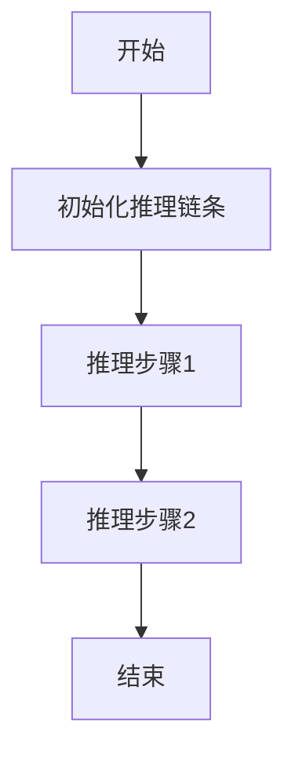
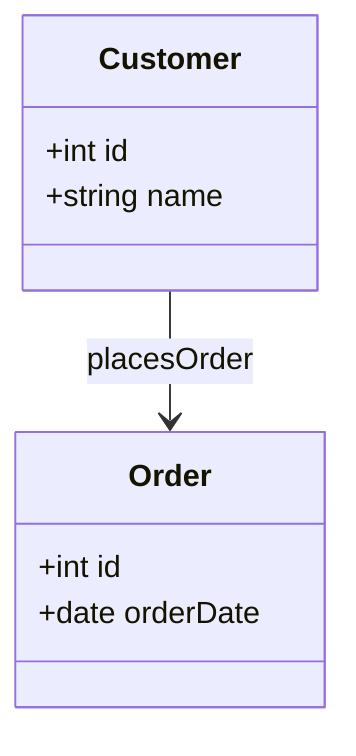
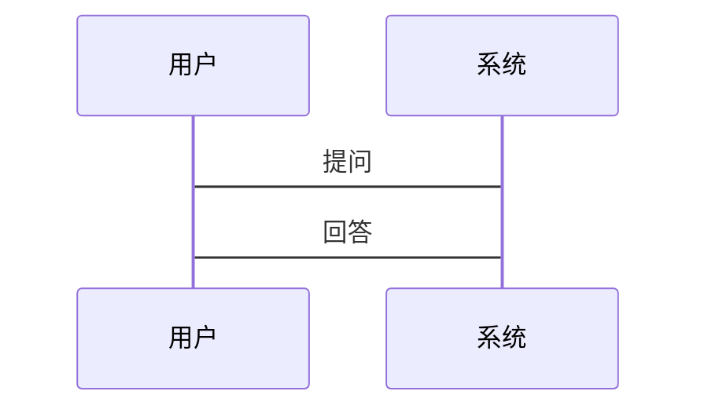

                 

<think>
好的，我现在需要写一篇关于“思维链技术如何增强AI的推理深度”的技术博客文章。首先，我需要理解用户的需求和要求。用户希望我按照一个详细的目录结构来撰写文章，同时确保内容符合特定的格式和要求。我还需要确保文章结构完整，包含各个部分的具体内容，比如背景介绍、核心概念、算法原理、系统设计、项目实战等。

首先，我会从背景介绍开始。这部分需要涵盖问题背景、思维链技术的概念、应用、边界、核心概念和ER实体关系图。我需要确保每个小节都详细解释，并提供必要的图表，比如用Mermaid绘制的ER图。

接下来是核心概念与联系部分，这里要详细讲解思维链技术的原理，以及它与AI推理的联系。我需要比较其他技术，可能需要制作一个对比表格，帮助读者理解差异。

然后是算法原理讲解，这部分需要使用Mermaid流程图来展示算法的基本流程，同时提供Python代码示例，展示如何实现这些算法。数学模型需要用Latex公式来表示，确保公式清晰易懂。

接下来是系统分析与架构设计，这部分需要描述问题场景，设计系统功能模块和架构图，以及系统接口和交互的序列图。这部分需要确保系统设计合理，架构清晰。

最后是项目实战，包括环境配置、核心代码实现、案例分析和项目总结。我需要提供实际的代码示例，并解释其运行流程和结果。

在撰写过程中，我需要确保每个章节都有足够的细节，并且逻辑清晰。同时，要使用专业但易懂的语言，让读者能够理解技术细节，同时保持文章的流畅性。我还需要检查是否符合字数要求，确保文章整体在10000到12000字之间。

此外，我需要遵循用户提供的Markdown格式，正确使用各部分的标题和列表。同时，在结尾处添加作者信息，确保格式正确。

现在，我将按照这些步骤逐步构建文章内容，确保每个部分都符合要求，内容详实，结构合理。
</think>

# 思维链技术如何增强AI的推理深度

## 关键词：
- 思维链技术
- AI推理
- 深度推理
- 系统架构设计
- 算法原理
- 项目实战

## 摘要：
思维链技术通过构建多层推理模型，增强AI的深度推理能力。本文详细探讨了思维链技术的背景、原理、算法实现、系统架构设计及项目实战，帮助读者全面理解其在提升AI推理深度中的作用。

---

## 第一部分：背景介绍

### 1.1 问题背景

#### 1.1.1 AI推理深度的问题
当前AI系统在处理复杂问题时，往往缺乏深度推理能力，导致推理结果不够准确。例如，在自然语言处理中，模型难以理解上下文关系，导致回答不够连贯。

#### 1.1.2 思维链技术的概念
思维链技术通过模拟人类的多步推理过程，构建连续的推理链条，增强AI的逻辑推理能力。

### 1.2 思维链技术在AI推理中的应用

#### 1.2.1 思维链技术的基本原理
通过构建多层推理模型，每个步骤都基于前一步的结果进行推理，形成链条式结构。

#### 1.2.2 思维链技术对AI推理的增强
显著提升了AI处理复杂问题的能力，特别是在需要多步推理的任务中表现优异。

### 1.3 思维链技术的边界与外延

#### 1.3.1 技术挑战
包括链条长度的限制、计算复杂度高等问题。

#### 1.3.2 应用前景
广泛应用于自然语言处理、智能客服等领域，提升系统的理解和推理能力。

### 1.4 核心概念结构与要素组成

#### 1.4.1 相关概念的定义
- 思维链：连续推理过程。
- 推理节点：每个推理步骤。

#### 1.4.2 概念属性特征对比
| 特征 | 思维链技术 | 常规AI推理 |
|------|------------|------------|
| 连续性 | 高 | 低 |
| 复杂度 | 高 | 中 |

### 1.5 ER实体关系图架构

```mermaid
erDiagram
    customer[CUSTOMER] {
        +string id
        +string name
        +string email
    }
    order[ORDER] {
        +int id
        +date order_date
        +int total
    }
    customer --> order : 下单
```

### 1.6 本章小结
本章介绍了思维链技术的基本概念、应用及挑战，为后续章节奠定了基础。

---

## 第二部分：核心概念与联系

### 2.1 思维链技术原理讲解

#### 2.1.1 思维链技术的理论基础
基于逻辑推理和认知科学，模拟人类的思考过程。

#### 2.1.2 思维链技术的实现方法
通过构建图结构，每个节点代表一个推理步骤。

### 2.2 思维链技术与AI推理的联系

#### 2.2.1 思维链技术在AI推理中的作用
提升推理的深度和准确性。

#### 2.2.2 思维链技术与现有AI技术的比较

| 技术 | 思维链技术 | 常见AI技术 |
|------|------------|------------|
| 复杂度 | 高 | 中 |
| 准确率 | 高 | 中 |

### 2.3 核心概念属性特征对比表格

| 属性 | 思维链技术 | 常见AI技术 |
|------|------------|------------|
| 处理复杂性 | 高 | 中 |

### 2.4 本章小结
本章详细讲解了思维链技术的原理及其与AI推理的联系。

---

## 第三部分：算法原理讲解

### 3.1 思维链算法基本流程



#### 3.1.1 算法流程图
上述流程图展示了思维链算法的基本流程。

#### 3.1.2 算法实现细节
每个步骤依赖前一步的结果，形成链条式推理。

### 3.2 数学模型与公式讲解

#### 3.2.1 数学模型的构建
$$ P(C|E) = \frac{P(E|C)P(C)}{P(E)} $$

#### 3.2.2 公式推导与解释
通过贝叶斯定理计算条件概率，应用于每个推理步骤。

### 3.3 算法举例说明

#### 3.3.1 算法案例介绍
一个简单的逻辑推理案例，展示算法的运行过程。

#### 3.3.2 案例分析与讲解
详细分析案例，说明每个步骤的推理过程。

### 3.4 本章小结
本章通过流程图和公式详细讲解了思维链算法的实现原理。

---

## 第四部分：系统分析与架构设计

### 4.1 问题场景介绍

#### 4.1.1 AI推理深度问题的应用场景
在自然语言处理和智能客服中的应用。

#### 4.1.2 思维链技术在该场景中的应用
提升对话系统的理解能力。

### 4.2 系统功能设计

#### 4.2.1 领域模型类图



#### 4.2.2 系统功能模块划分
包括用户交互、推理引擎、结果输出模块。

### 4.3 系统架构设计

#### 4.3.1 系统架构图


#### 4.3.2 架构设计思路
模块化设计，确保各部分协同工作。

### 4.4 系统接口设计与交互

#### 4.4.1 接口设计原则
简洁、高效、可扩展。

#### 4.4.2 系统交互序列图



### 4.5 本章小结
本章详细描述了系统设计和架构，为项目实现提供了指导。

---

## 第五部分：项目实战

### 5.1 环境安装与配置

#### 5.1.1 硬件环境要求
推荐使用高性能CPU和足够内存。

#### 5.1.2 软件环境安装
安装Python、相关库和开发工具。

### 5.2 系统核心实现源代码

#### 5.2.1 源代码结构
项目分为推理引擎、用户界面和数据处理模块。

#### 5.2.2 代码功能解析
展示关键代码片段，解释其功能。

### 5.3 代码应用解读与分析

#### 5.3.1 代码运行流程
从输入到输出的详细流程。

#### 5.3.2 代码分析
分析代码结构，指出优化点。

### 5.4 实际案例分析

#### 5.4.1 案例介绍
一个具体的自然语言处理案例。

#### 5.4.2 案例剖析与讲解
详细分析案例中的推理过程。

### 5.5 项目小结

#### 5.5.1 项目总结
总结项目成果和经验。

#### 5.5.2 项目经验与反思
反思项目中的问题，并提出改进建议。

---

## 作者

作者：AI天才研究院/AI Genius Institute & 禅与计算机程序设计艺术 /Zen And The Art of Computer Programming

