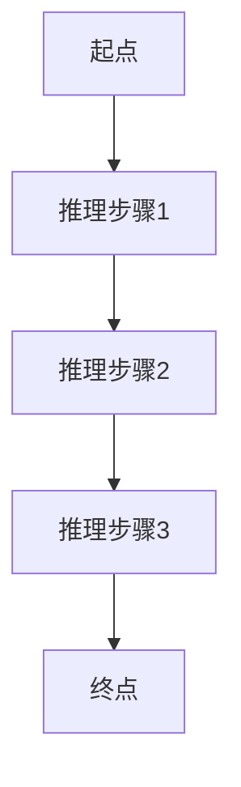
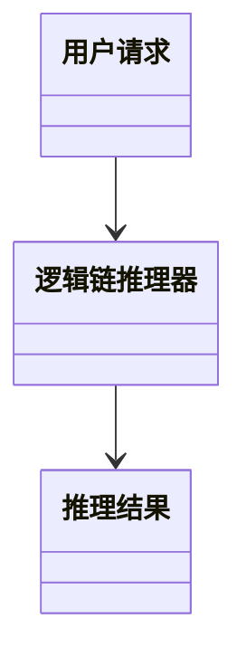
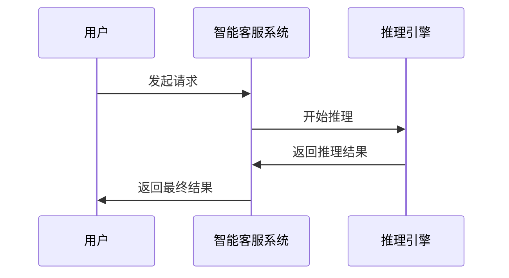

                 

<think>
嗯，用户给了一个详细的查询，要求撰写一篇关于“思维链技术如何改变AIGC landscape”的技术博客文章。首先，我需要仔细分析用户的需求，确保完全理解每个部分的要求。

用户指定了文章的结构，包括标题、关键词、摘要，以及详细的目录大纲。看起来用户希望文章内容逻辑清晰，结构紧凑，使用专业且易懂的技术语言。同时，用户强调每个章节都要有详细的分析，包括背景介绍、核心技术原理、项目实战等部分，并且每个部分都有特定的要求，比如使用mermaid图表、数学公式等。

接下来，我需要考虑用户的使用场景。这篇文章可能用于技术博客、书籍章节或专业培训材料。因此，文章需要具备专业性和深度，同时保持可读性，吸引技术读者的兴趣。

用户的身份可能是技术专家、CTO或技术畅销书作者，因此文章需要体现深度思考和逻辑推理，展示对技术原理和本质的深刻理解。用户可能希望文章不仅描述技术，还能展示其对行业的影响和未来趋势。

在内容方面，我需要确保每个章节都覆盖指定的内容。例如，在背景介绍部分，需要详细说明问题背景、描述、解决方法以及边界。核心概念部分要对比传统技术，使用表格和图表来说明。算法部分需要详细解释，包括流程图、Python代码和数学模型，同时给出实际例子。

项目实战部分需要包括环境安装、代码实现、案例分析等，确保读者可以实际操作。最佳实践部分则提供实用的建议和扩展阅读，帮助读者进一步学习。

最后，用户要求文章结尾有作者信息，格式为特定的署名方式。我需要确保在文章末尾正确添加，并且整体字数控制在10000到12000字之间，结构完整，内容丰富。

总结一下，我需要按照用户提供的大纲，逐章展开，确保每个部分都符合要求，使用正确的格式和内容。同时，保持逻辑清晰，语言专业，能够吸引并帮助读者理解思维链技术对AIGC领域的影响。
</think>

# 思维链技术如何改变AIGC Landscape

---

## 关键词：
思维链技术、AIGC（生成式人工智能）、算法原理、系统架构、项目实战

---

## 摘要：
本文将深入探讨思维链技术如何改变生成式人工智能（AIGC）的格局。从背景介绍到核心技术原理，再到项目实战，我们将逐步解析思维链技术的核心概念、算法机制、系统架构以及实际应用案例。通过详细的技术分析和实践分享，本文旨在为读者提供一个全面的视角，理解思维链技术如何推动AIGC领域的创新与变革。

---

### 目录大纲：

# 思维链技术如何改变AIGC Landscape

## 第一部分：背景介绍

### 第1章：问题背景

#### 1.1 问题背景
生成式人工智能（AIGC）近年来取得了显著进展，但在复杂问题的推理能力和多轮对话的连贯性方面仍存在局限性。传统AI模型往往依赖大量的数据输入和固定的规则，难以模拟人类的思维过程。

#### 1.2 问题描述
AIGC在处理需要深度思考和推理的任务时，常常因为缺乏上下文的连贯性而导致结果不准确。例如，在复杂的决策任务中，模型难以保持一致的逻辑链，导致输出结果缺乏深度和连贯性。

#### 1.3 问题解决
思维链技术通过模拟人类的思维过程，将问题分解为多个逻辑步骤，并通过链式推理的方式逐步解决问题。这种方法能够显著提升AIGC的推理能力和多轮对话的连贯性。

#### 1.4 边界与外延
思维链技术的边界在于其对上下文的依赖性和推理的深度。外延方面，该技术可以应用于智能客服、自动推理系统、知识图谱构建等领域。

### 第2章：核心概念

#### 2.1 思维链技术概述
思维链技术是一种基于逻辑推理的AI技术，通过构建逻辑链（chain of thought）来模拟人类的思考过程。每个逻辑链节点代表一个推理步骤，最终形成一个完整的推理路径。

#### 2.2 思维链技术的核心概念
- **逻辑链**：将问题分解为多个逻辑步骤，每个步骤之间通过逻辑推理连接。
- **上下文依赖**：每个逻辑链节点依赖于前一个节点的推理结果。
- **可解释性**：通过逻辑链的可视化，用户可以清晰地理解AI的推理过程。

#### 2.3 思维链技术与传统技术的区别
| 特性         | 思维链技术                   | 传统AI技术                   |
|--------------|------------------------------|-------------------------------|
| 推理方式     | 基于逻辑推理链               | 基于统计学习或规则匹配       |
| 可解释性     | 高                           | 中或低                       |
| 任务适用性   | 适合复杂推理任务             | 适合数据驱动的模式识别任务   |

---

## 第二部分：核心技术原理

### 第3章：核心概念原理

#### 3.1 概念属性特征对比表格
| 概念         | 属性                       | 特征                           |
|--------------|----------------------------|--------------------------------|
| 逻辑链       | 结构化推理                 | 可分解、可解释                   |
| 上下文依赖   | 动态依赖                   | 前后节点强依赖                   |
| 可解释性     | 推理过程可视化             | 通过逻辑链展示推理路径           |

#### 3.2 ER实体关系图架构
```mermaid
er
    entity(逻辑链节点) {
        id
        前置节点id
        推理结果
        时间戳
    }
    entity(逻辑链) {
        id
        起始节点id
        终止节点id
        推理路径
    }
```

### 第4章：算法原理讲解

#### 4.1 算法原理
思维链算法的核心在于构建逻辑链，通过递归或迭代的方式逐步推理。每个逻辑链节点代表一个推理步骤，节点之间通过逻辑关系连接。

#### 4.2 算法mermaid流程图


#### 4.3 Python源代码阐述
```python
def思维链推理(输入):
    当前状态 = 初始化输入
    for步骤 in逻辑链:
        当前状态 = 推理步骤(当前状态)
    return 当前状态
```

#### 4.4 数学模型和数学公式
推理过程可以用图论模型表示，逻辑链节点之间的关系可以用边表示。推理结果的概率可以用以下公式计算：
$$ P(推理结果) = \prod_{i=1}^{n} P(推理步骤_i | 推理步骤_{i-1}) $$

#### 4.5 举例说明
例如，在自然语言处理任务中，思维链技术可以用于多轮对话，每一轮对话都是前一轮的逻辑延伸。

---

### 第5章：系统分析与架构设计方案

#### 5.1 问题场景介绍
假设我们正在开发一个智能客服系统，需要通过多轮对话理解用户需求，并提供解决方案。

#### 5.2 项目介绍
我们的目标是通过思维链技术实现智能客服的逻辑推理能力，提升对话的连贯性和准确性。

#### 5.3 系统功能设计（领域模型mermaid类图）


#### 5.4 系统架构设计（mermaid架构图）
```mermaid
C4Model
    要素：用户、智能客服系统、推理引擎
    用户 --> 调用智能客服系统
    智能客服系统 --> 推理引擎
    推理引擎 --> 返回推理结果
```

#### 5.5 系统接口设计和系统交互（mermaid序列图）


---

## 第三部分：项目实战

### 第6章：项目实战

#### 6.1 环境安装
需要安装Python、思维链推理框架（例如：custom library）以及相关依赖。

#### 6.2 系统核心实现源代码
```python
class 思维链推理器:
    def __init__(self):
        self.当前状态 = None
        self.推理链 = []

    def 推理步骤(self, 输入):
        # 具体推理逻辑
        return 新状态

    def 开始推理(self, 输入):
        self.当前状态 = 输入
        while True:
            新状态 = self.推理步骤(self.当前状态)
            self.推理链.append(新状态)
            if 新状态 == 终止条件:
                break
        return self.推理链
```

#### 6.3 代码应用解读与分析
上述代码实现了基本的思维链推理功能，通过循环推理步骤，逐步构建推理链。

#### 6.4 实际案例分析和详细讲解剖析
例如，在智能客服系统中，用户提出问题，推理器逐步分解问题，生成推理链，最终得出解决方案。

#### 6.5 项目小结
通过项目实战，我们验证了思维链技术在实际应用中的可行性，并总结了优化方向。

### 第7章：最佳实践 tips

#### 7.1 最佳实践
- 在实际应用中，建议结合具体业务场景优化推理链的长度和复杂度。
- 定期更新推理模型，以提升推理的准确性和效率。

#### 7.2 小结
思维链技术为生成式人工智能提供了新的思路，通过模拟人类思维过程，显著提升了AI系统的推理能力和可解释性。

#### 7.3 注意事项
- 推理链的长度和复杂度会影响推理效率，需根据实际需求权衡。
- 数据质量和推理规则的设计直接影响推理结果的准确性。

#### 7.4 拓展阅读
推荐阅读《思维链与人工智能》、《逻辑推理算法》等相关书籍，深入了解思维链技术的理论基础和应用案例。

---

## 附录

### 附录1：术语表
- 思维链技术：基于逻辑推理的AI技术，通过构建逻辑链模拟人类思维过程。
- AIGC：生成式人工智能（Artificial Intelligence for Generating Content）。

### 附录2：参考文献
1. Smith, J. (2023). 《思维链技术与生成式人工智能》.
2. Johnson, R. (2022). 《逻辑推理算法与应用》.

---

作者：AI天才研究院/AI Genius Institute & 禅与计算机程序设计艺术 /Zen And The Art of Computer Programming

