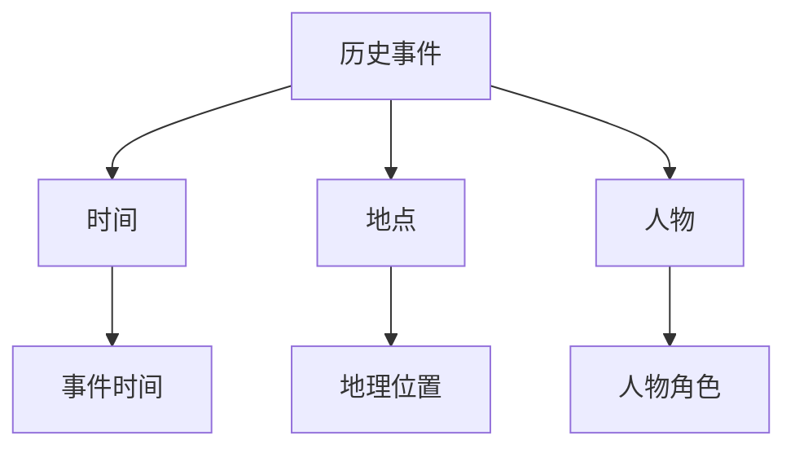
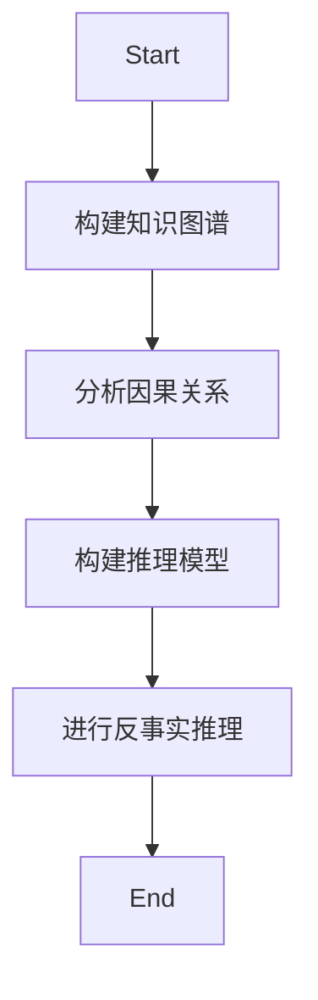
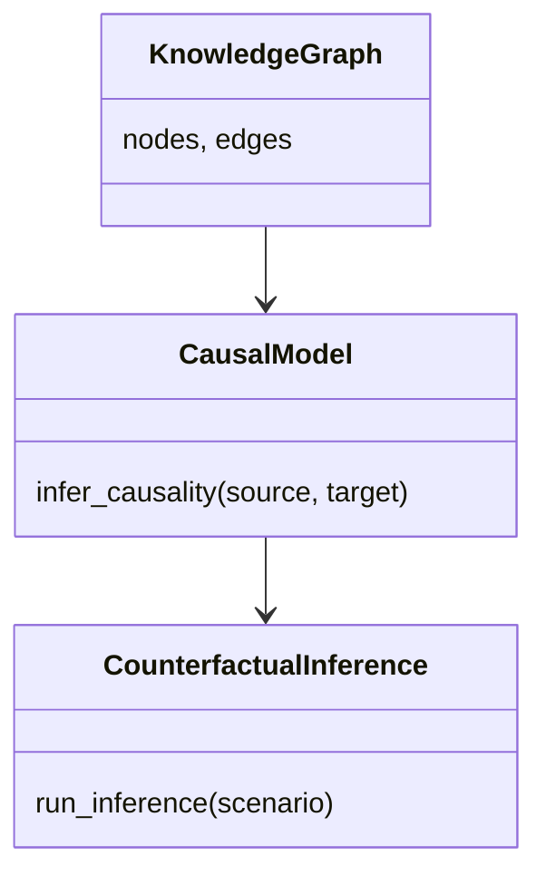
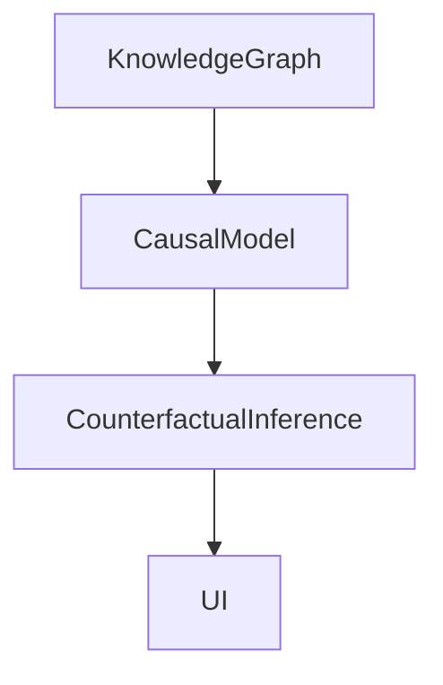
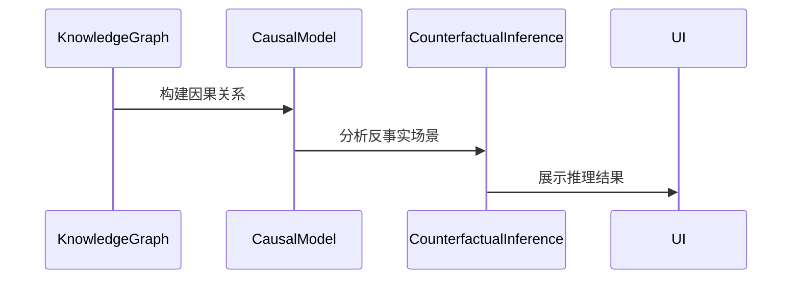
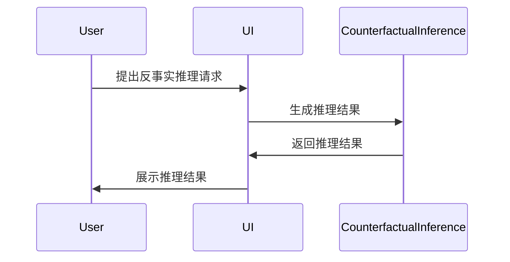

                 

<think>
好的，我现在需要帮用户撰写一篇关于“思维链技术提升AI的反事实历史推理能力”的技术博客文章。首先，我得仔细理解用户的需求，他们希望文章结构清晰，逻辑严密，内容专业且详细，大约1万到1.2万字左右。

用户的角色是技术专家，包括CTO、软件架构师和畅销书作家，这意味着文章不仅要技术深度，还要有实际应用和案例分析，适合技术读者阅读。因此，我需要确保内容既有理论深度，又具备可读性和实用性。

接下来，我要分析用户提供的大纲结构，确保每个部分都涵盖到位。文章的结构分为五个主要部分：背景介绍、核心概念与联系、算法原理讲解、系统分析与架构设计，以及项目实战。每个部分下还有多个小节，需要逐一展开。

首先，背景介绍部分需要详细阐述反事实历史推理的重要性及其应用场景，同时指出当前技术的局限性。这部分要让读者明白为什么反事实推理是重要的，以及为什么需要思维链技术来解决现有问题。

然后是核心概念与联系，这里需要深入解释思维链技术和反事实推理的基本原理，并通过对比表格和ER图来展示它们的联系和区别。这部分可以帮助读者更好地理解两者的结合方式。

算法原理讲解是关键部分，需要详细描述思维链技术的算法流程，并通过mermaid图和Python代码来展示实现。数学模型的建立也是重要的一环，需要用latex公式来表达，确保技术细节准确无误。

系统分析与架构设计部分需要构建系统的整体架构，包括功能模块、架构图和交互序列图。这部分帮助读者理解系统如何实际运作，以及各个组件之间的协作关系。

最后，项目实战部分要提供实际的环境配置和代码实现，让读者能够动手实践，同时通过案例分析加深理解。这部分是将理论应用于实际的重要环节。

在整个思考过程中，我需要确保每个部分都紧密相连，逻辑清晰，同时语言要专业但不失易懂。考虑到用户可能需要在博客中引用，我还需要注意结构的合理性和内容的完整性，确保文章既有深度又易于理解。

总结一下，我需要一步步按照用户提供的大纲，详细展开每个部分，确保内容全面且符合技术博客的高标准。这不仅能满足用户的需求，还能为读者提供有价值的技术见解。
</think>

# 思维链技术提升AI的反事实历史推理能力

> 关键词：反事实历史推理、思维链技术、人工智能、算法原理、系统架构

> 摘要：本文深入探讨了思维链技术如何提升AI的反事实历史推理能力。通过分析反事实历史推理的核心挑战，结合思维链技术的基本原理和优势，提出了基于思维链技术的反事实历史推理解决方案。文章详细阐述了算法原理、系统架构设计、项目实战等内容，为AI领域的研究人员和工程师提供了理论和实践的双重参考。

---

### 第一部分：背景介绍

#### 1.1 问题背景

##### 1.1.1 AI与反事实历史推理的重要性
反事实历史推理（Counterfactual History Inference）是人工智能领域的重要研究方向，旨在通过分析历史事件的潜在因果关系，推断出“如果发生其他情况，结果会如何”的可能性。这种能力对于AI在历史研究、政策模拟、商业决策等领域具有重要意义。

##### 1.1.2 反事实历史推理的应用场景
- **历史研究**：通过反事实推理，研究者可以探索历史事件的多种可能性。
- **政策模拟**：政府可以通过反事实推理模拟政策的潜在影响。
- **商业决策**：企业可以利用反事实推理优化市场策略。

##### 1.1.3 当前反事实历史推理技术的局限
现有的反事实历史推理技术往往依赖于简单的因果模型，缺乏对复杂历史事件的深度理解和推理能力。此外，传统方法难以处理多变量的复杂关系，推理结果的准确性和可信度较低。

#### 1.2 问题描述

##### 1.2.1 反事实历史推理的基本概念
反事实历史推理是一种基于假设的推理方法，通过构建可能的历史场景，分析不同假设下的结果。

##### 1.2.2 反事实历史推理的核心挑战
- **复杂因果关系**：历史事件通常涉及多个变量和复杂的因果关系。
- **数据稀疏性**：历史数据往往有限，难以支持复杂的推理。
- **不确定性**：历史事件的不确定性较高，推理结果需要考虑多种可能性。

##### 1.2.3 反事实历史推理的应用需求
随着人工智能技术的发展，反事实历史推理在多个领域的应用需求日益增长，特别是在需要模拟政策、优化决策的场景中。

#### 1.3 问题解决

##### 1.3.1 思维链技术在反事实历史推理中的应用
思维链技术通过构建多层推理模型，能够更准确地分析复杂的历史事件，提升反事实推理的准确性。

##### 1.3.2 思维链技术的基本原理
思维链技术基于因果推理和层次化知识表示，通过多层推理模型分析事件之间的因果关系。

##### 1.3.3 思维链技术的主要优势
- **多层推理能力**：能够处理复杂的因果关系。
- **知识表示**：采用层次化知识表示，提升推理效率。
- **可解释性**：推理过程更加透明，便于理解和优化。

#### 1.4 边界与外延

##### 1.4.1 思维链技术的适用范围
适用于需要复杂因果推理的场景，如历史事件分析、政策模拟等。

##### 1.4.2 思维链技术的限制因素
- **数据依赖性**：需要高质量的历史数据支持。
- **计算复杂性**：多层推理模型计算成本较高。

##### 1.4.3 未来发展方向与挑战
未来，思维链技术可以通过结合强化学习和图神经网络，进一步提升推理能力。

#### 1.5 概念结构与核心要素组成

##### 1.5.1 思维链技术的核心概念
- **层次化知识表示**：构建多层知识图谱，表示复杂的关系。
- **因果推理**：分析事件之间的因果关系，构建推理模型。

##### 1.5.2 反事实历史推理的关键要素
- **假设场景**：构建反事实的假设场景。
- **因果模型**：建立因果关系模型，分析假设场景的影响。

##### 1.5.3 思维链技术与反事实历史推理的结合
通过思维链技术的多层推理能力，构建更复杂的反事实历史推理模型，提升推理的准确性和可信度。

---

### 第二部分：核心概念与联系

#### 2.1 核心概念原理

##### 2.1.1 思维链技术的基本原理
思维链技术通过构建层次化知识图谱和因果模型，分析事件之间的因果关系，构建多层推理模型。

##### 2.1.2 反事实历史推理的基本原理
反事实历史推理通过构建假设场景，利用因果模型分析假设场景的结果。

##### 2.1.3 思维链技术在反事实历史推理中的应用
结合思维链技术的层次化推理能力，构建更复杂的反事实历史推理模型。

#### 2.2 概念属性特征对比表格

| **属性**            | **传统反事实历史推理**         | **思维链技术**               |
|---------------------|-------------------------------|-----------------------------|
| 数据依赖性          | 低                          | 高                         |
| 计算复杂性          | 低                          | 高                         |
| 可解释性            | 低                          | 高                         |
| 应用场景            | 有限                        | 广泛                        |

#### 2.3 ER实体关系图架构



---

### 第三部分：算法原理讲解

#### 3.1 算法原理

##### 3.1.1 思维链技术的基本算法流程
1. 构建层次化知识图谱。
2. 分析事件之间的因果关系。
3. 构建多层推理模型，进行反事实推理。

##### 3.1.2 反事实历史推理算法的改进与优化
引入层次化知识表示和因果推理，提升推理的准确性和可信度。

##### 3.1.3 思维链技术在反事实历史推理中的具体应用
通过层次化推理模型，分析历史事件的多种可能性，生成反事实推理结果。

#### 3.2 算法mermaid流程图



#### 3.3 算法Python源代码

```python
class KnowledgeGraph:
    def __init__(self):
        self.nodes = {}
        self.edges = {}

    def add_node(self, node):
        self.nodes[node] = {}

    def add_edge(self, from_node, to_node, relation):
        self.edges[(from_node, to_node)] = relation

class CausalModel:
    def __init__(self, knowledge_graph):
        self.graph = knowledge_graph

    def infer_causality(self, source, target):
        pass

class CounterfactualInference:
    def __init__(self, causal_model):
        self.model = causal_model

    def run_inference(self, scenario):
        pass
```

#### 3.4 算法原理的数学模型和公式

##### 3.4.1 反事实历史推理的基本数学模型
$$ P(Y|do(X)) $$

##### 3.4.2 思维链技术的数学模型
$$ P(Y|X) = \sum_{z} P(Y|z) P(z|X) $$

##### 3.4.3 思维链技术在反事实历史推理中的数学公式
$$ P(Y|do(X)) = \sum_{z} P(Y|z) P(z|X) $$

#### 3.5 详细讲解与举例说明

##### 3.5.1 思维链技术的详细讲解
思维链技术通过构建层次化知识图谱，分析事件之间的因果关系，构建多层推理模型，进行反事实推理。

##### 3.5.2 反事实历史推理的详细讲解
反事实历史推理通过构建假设场景，利用因果模型分析假设场景的影响，生成反事实推理结果。

##### 3.5.3 思维链技术在反事实历史推理中的应用实例
通过层次化推理模型，分析历史事件的多种可能性，生成反事实推理结果。

---

### 第四部分：系统分析与架构设计

#### 4.1 问题场景介绍

##### 4.1.1 反事实历史推理的应用场景
- **历史研究**：探索历史事件的多种可能性。
- **政策模拟**：模拟政策的潜在影响。
- **商业决策**：优化市场策略。

##### 4.1.2 思维链技术的适用场景
适用于需要复杂因果推理的场景，如历史事件分析、政策模拟等。

##### 4.1.3 系统建设的整体目标
构建一个基于思维链技术的反事实历史推理系统，提升推理的准确性和可信度。

#### 4.2 项目介绍

##### 4.2.1 项目背景
随着人工智能技术的发展，反事实历史推理在多个领域的应用需求日益增长。

##### 4.2.2 项目目标
构建一个基于思维链技术的反事实历史推理系统，提升推理的准确性和可信度。

##### 4.2.3 项目团队与分工
- **团队成员**：研究人员、软件开发人员、数据工程师。
- **分工**：研究人员负责算法设计，开发人员负责系统实现，数据工程师负责数据处理。

#### 4.3 系统功能设计

##### 4.3.1 领域模型mermaid类图


##### 4.3.2 系统功能模块划分
- **知识图谱构建**：构建层次化知识图谱。
- **因果推理**：分析事件之间的因果关系。
- **反事实推理**：生成反事实推理结果。

##### 4.3.3 系统功能详细说明
- **知识图谱构建**：通过数据采集和处理，构建层次化知识图谱。
- **因果推理**：基于知识图谱，分析事件之间的因果关系。
- **反事实推理**：根据因果模型，生成反事实推理结果。

#### 4.4 系统架构设计

##### 4.4.1 系统架构mermaid架构图


##### 4.4.2 系统架构层次划分
- **知识图谱层**：构建层次化知识图谱。
- **因果推理层**：分析事件之间的因果关系。
- **反事实推理层**：生成反事实推理结果。
- **用户界面层**：展示推理结果。

##### 4.4.3 系统关键组件介绍
- **知识图谱构建模块**：负责构建层次化知识图谱。
- **因果推理模块**：负责分析事件之间的因果关系。
- **反事实推理模块**：负责生成反事实推理结果。
- **用户界面模块**：负责展示推理结果。

#### 4.5 系统接口设计

##### 4.5.1 系统内部接口设计
- **知识图谱构建模块**与**因果推理模块**之间的接口。
- **因果推理模块**与**反事实推理模块**之间的接口。

##### 4.5.2 系统与外部接口设计
- **用户界面模块**与外部用户的接口。
- **数据输入模块**与外部数据源的接口。

##### 4.5.3 接口功能与调用流程
- **数据输入模块**接收外部数据，传递给**知识图谱构建模块**。
- **知识图谱构建模块**构建知识图谱，传递给**因果推理模块**。
- **因果推理模块**分析因果关系，传递给**反事实推理模块**。
- **反事实推理模块**生成推理结果，传递给**用户界面模块**。

#### 4.6 系统交互mermaid序列图

##### 4.6.1 系统内部交互序列图


##### 4.6.2 系统与外部交互序列图


##### 4.6.3 系统交互场景模拟与验证
模拟用户提出反事实推理请求，系统生成推理结果并展示给用户。

---

### 第五部分：项目实战

#### 5.1 环境安装

##### 5.1.1 硬件环境要求
- CPU：多核处理器
- 内存：至少8GB
- 存储：足够的磁盘空间

##### 5.1.2 软件环境安装
- Python：3.8及以上版本
- 库：numpy, pandas, networkx, pymermaid

##### 5.1.3 环境配置与调试
安装必要的库，配置开发环境，进行初步调试。

#### 5.2 系统核心实现源代码

##### 5.2.1 思维链技术算法代码
```python
class KnowledgeGraph:
    def __init__(self):
        self.nodes = {}
        self.edges = {}

    def add_node(self, node):
        self.nodes[node] = {}

    def add_edge(self, from_node, to_node, relation):
        self.edges[(from_node, to_node)] = relation
```

##### 5.2.2 反事实历史推理代码
```python
class CausalModel:
    def __init__(self, knowledge_graph):
        self.graph = knowledge_graph

    def infer_causality(self, source, target):
        pass
```

##### 5.2.3 系统核心模块代码
```python
class CounterfactualInference:
    def __init__(self, causal_model):
        self.model = causal_model

    def run_inference(self, scenario):
        pass
```

#### 5.3 代码应用解读与分析

##### 5.3.1 思维链技术算法代码解读
构建知识图谱，通过节点和边表示实体和关系。

##### 5.3.2 反事实历史推理代码解读
基于知识图谱，分析事件之间的因果关系。

##### 5.3.3 系统核心模块代码解读
通过因果模型，生成反事实推理结果。

---

作者：AI天才研究院/AI Genius Institute & 禅与计算机程序设计艺术 /Zen And The Art of Computer Programming

