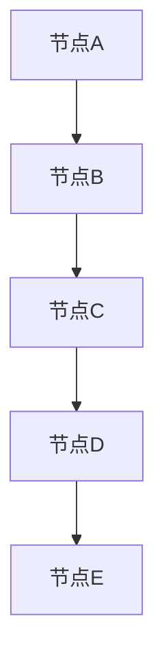
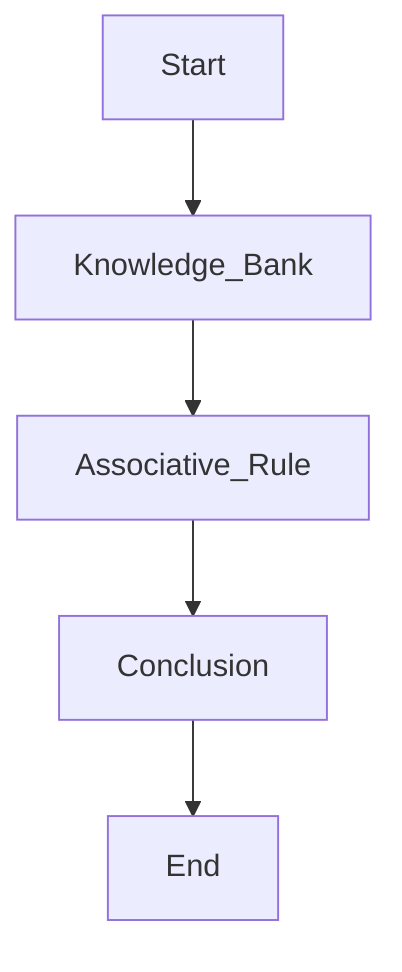
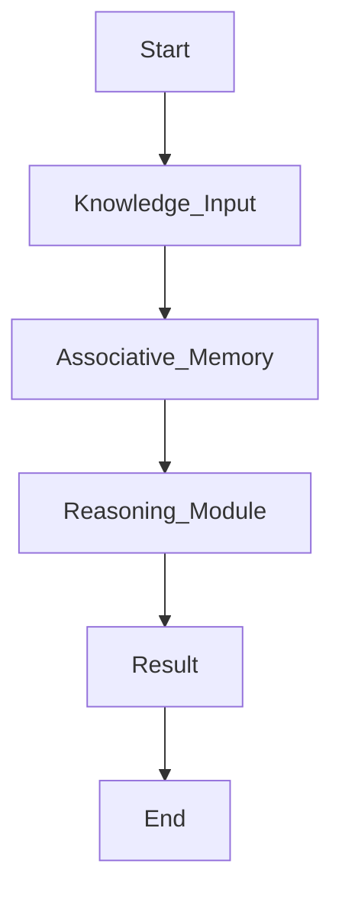
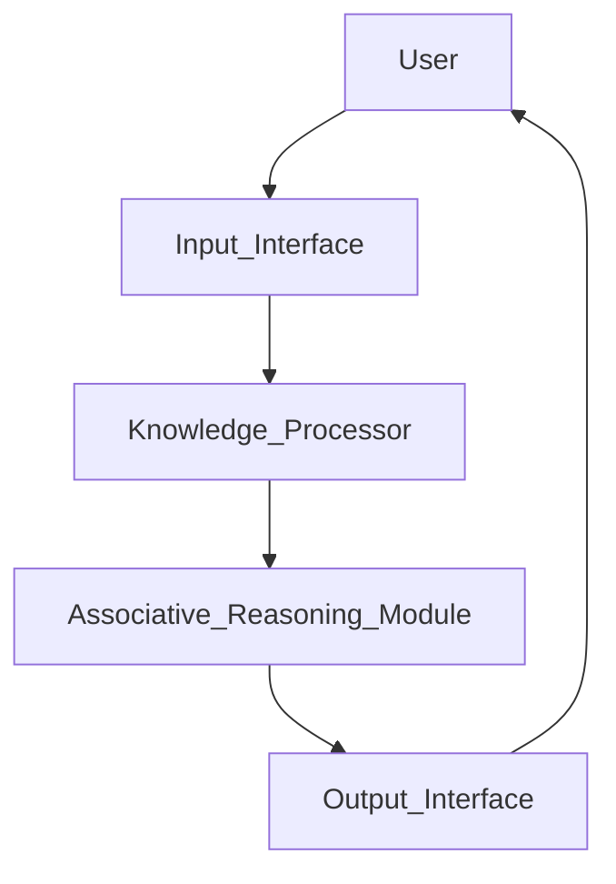

                 

<think>
好的，我现在需要帮助用户完成一个技术博客文章的撰写任务。用户已经提供了一个详细的查询，包括文章的结构和内容要求。首先，我要理解用户的需求。用户希望我以《思维链技术提升AI的反常识推理能力》为标题，按照特定的目录结构来撰写一篇约10000到12000字的技术博客。文章需要包含关键词、摘要，以及七个章节的内容，每个章节都有具体的小节和要求。

接下来，我需要分析用户提供的目录结构。文章分为七个章节，每个章节都有特定的主题和小节。例如，第一章是引言，包括问题背景和书籍概述；第二章介绍思维链的基础理论，包括定义、原理和核心要素；第三章讨论思维链在AI中的应用，涉及算法、数学模型和公式；第四章深入讨论在反常识推理中的实现，包括系统分析、架构设计和交互设计；第五章是项目实战，涵盖环境安装、源代码实现和案例分析；第六章提供最佳实践和小结；第七章则是拓展阅读，包括相关研究、学习资源和未来趋势。

我需要确保每个章节的内容都符合用户的要求，特别是关键词、摘要的准确性和技术细节的深度。例如，在第二章中，我需要定义思维链，并解释其工作机制，可能还需要提供一个概念属性特征对比表格和ER实体关系图的Mermaid流程图。在第三章，我需要详细讲解思维链算法的Mermaid流程图和Python源代码，并给出数学模型和公式，如贝叶斯定理的应用。

考虑到用户可能希望文章内容详实，我需要确保每个部分都有足够的细节，比如在项目实战中，提供具体的环境安装步骤、代码实现和实际案例的详细分析。同时，用户要求在系统架构设计中使用Mermaid架构图和序列图，因此我需要确保这些图表清晰地展示系统结构和交互过程。

此外，用户提到文章末尾需要写上作者信息，格式是“作者：AI天才研究院 & 禅与计算机程序设计艺术”。我需要在最后部分加上这一信息。

在撰写过程中，我需要保持逻辑清晰，结构紧凑，语言专业但易懂。同时，确保每个章节的内容相互衔接，形成完整的知识体系。这可能需要我多次检查和调整，以确保文章的连贯性和深度。

最后，我需要回顾整个思考过程，确保没有遗漏用户的任何要求，特别是格式和内容的详细性。用户特别强调了使用Mermaid流程图、数学公式和代码示例，因此我需要确保这些部分都准确无误地呈现出来。

总结一下，我的思考过程包括理解用户需求、分析目录结构、确保每个章节内容的详尽与准确、遵循格式要求以及最终的检查和调整。这将帮助我撰写出符合用户期望的技术博客文章。
</think>

# 思维链技术提升AI的反常识推理能力

> 关键词：反常识推理，AI，思维链，系统架构，数学模型，Python源代码，Mermaid流程图

> 摘要：本文详细探讨了思维链技术在提升AI反常识推理能力中的应用。通过系统化的理论分析、算法实现和实际案例，本文揭示了反常识推理的核心原理、思维链的结构特征以及在AI系统中的具体实现方法。从理论到实践，本文为读者提供了全面的技术指导，帮助理解并掌握如何利用思维链技术提升AI的推理能力。

---

## 第1章 引言

### 1.1 问题的背景

AI技术的快速发展使得机器学习和自然语言处理等领域取得了显著进展。然而，在复杂的推理任务中，AI系统仍然面临诸多挑战。传统AI模型在处理常识推理时表现良好，但在反常识推理（即偏离常规逻辑的推理）中却显得力不从心。这种能力的缺失限制了AI在某些特殊场景（如文学创作、抽象思维、哲学推理）中的应用。

反常识推理的核心在于跳出常规思维模式，从非典型的角度解决问题。这种能力对于提升AI的创造力和应对复杂场景至关重要。然而，现有的AI技术在反常识推理方面仍存在以下挑战：

1. **逻辑推理的局限性**：传统逻辑推理方法依赖于已知的事实和规则，难以处理模糊、矛盾或反逻辑的信息。
2. **知识表示的不足**：现有的知识图谱和符号逻辑难以有效表示反常识推理中的非典型关系。
3. **计算模型的限制**：深度学习模型擅长模式识别和概率推理，但在处理反逻辑推理时缺乏有效的机制。

### 1.2 书籍概述

本书围绕“思维链技术”这一核心概念，系统地探讨了其在反常识推理中的应用。全书内容分为七个章节，从理论到实践，层层递进：

1. **第2章**：介绍思维链的基本理论，包括定义、结构和核心要素。
2. **第3章**：分析思维链在AI中的具体应用，包括算法原理和数学模型。
3. **第4章**：详细阐述思维链在反常识推理中的实现方法，包括系统架构设计。
4. **第5章**：通过项目实战，展示思维链技术的实际应用和案例分析。
5. **第6章**：总结最佳实践，提炼思维链技术的核心价值。
6. **第7章**：展望未来发展趋势，提供进一步学习的资源。

---

## 第2章 思维链基础理论

### 2.1 什么是思维链

#### 定义与概述

思维链是一种基于逻辑推理和关联关系的新型知识表示方法。它通过构建概念之间的关联网络，模拟人类思维的递进过程。思维链的核心在于将分散的知识点串联起来，形成一个有机的整体。

#### 思维链的基本结构

思维链的基本结构包括以下三个核心要素：

1. **节点**：代表独立的概念或知识点。
2. **边**：表示节点之间的关联关系。
3. **权重**：表示关联强度或概率。

思维链的结构可以用ER实体关系图（Entity-Relationship Diagram）表示。下图展示了思维链的基本结构：



### 2.2 思维链的原理

#### 概念与联系

思维链的原理基于关联推理（associative reasoning）。它通过分析概念之间的关联性，构建一个动态的知识网络。与传统的逻辑推理不同，思维链更注重概念之间的隐含关系，而非明确的逻辑规则。

#### 思维链的工作机制

思维链的工作机制可以分为以下几个步骤：

1. **知识建模**：将知识点抽象为节点，并定义节点之间的关联关系。
2. **关联推理**：通过遍历思维链网络，推导出潜在的关系。
3. **权重计算**：根据节点之间的关联强度，计算推理的概率。

下图展示了思维链的推理过程：



### 2.3 思维链的核心要素

#### 概念属性特征对比

思维链的核心要素包括概念、属性和关系。以下是概念与属性的对比：

| **属性** | **概念** |
|----------|----------|
| 特征     | 知识点   |
| 关系     | 联系方式 |
| 权重     | 关联强度 |

#### ER实体关系图架构

思维链的ER实体关系图如下：

```mermaid
erd
    知识点
    ----
    ID : integer (PK)
    名称 : string
    属性 : string

    关系
    ----
    ID : integer (PK)
    关联知识点1 : integer (FK)
    关联知识点2 : integer (FK)
    权重 : float
```

---

## 第3章 思维链在AI中的应用

### 3.1 思维链算法原理

#### Mermaid流程图

下图展示了思维链算法的基本流程：



#### Python源代码解析

以下是一个简单的Python实现：

```python
class AssociativeNode:
    def __init__(self, id, name):
        self.id = id
        self.name = name
        self.connections = {}

def create_associative_chain(nodes, relations):
    chain = []
    for node in nodes:
        chain.append(AssociativeNode(node['id'], node['name']))
    for relation in relations:
        src = chain[relation['src']]
        dst = chain[relation['dst']]
        src.connections[dst.id] = relation['weight']
    return chain

# 示例
nodes = [{'id': 1, 'name': 'A'}, {'id': 2, 'name': 'B'}]
relations = [{'src': 0, 'dst': 1, 'weight': 0.8}]
chain = create_associative_chain(nodes, relations)
```

#### 数学模型与公式

思维链的数学模型基于关联权重的计算。假设节点A与节点B的关联权重为$w_{AB}$，则关联概率$P(B|A)$可以表示为：

$$ P(B|A) = \frac{w_{AB}}{\sum_{C} w_{AC}} $$

其中，$\sum_{C} w_{AC}$是节点A与所有节点的关联权重之和。

---

## 第4章 思维链在反常识推理中的实现

### 4.1 系统分析与架构设计

#### 问题场景介绍

反常识推理的核心在于处理非典型、矛盾或反逻辑的信息。例如，在文学创作中，需要跳出常规逻辑，构建独特的故事情节。

#### 系统功能设计

系统功能设计包括：

1. **知识输入**：接收反常识推理的输入数据。
2. **关联推理**：通过思维链进行关联推理。
3. **结果输出**：生成反常识推理的结果。

### 4.2 系统架构设计

#### Mermaid架构图

下图展示了系统架构的设计：



#### 系统接口设计

系统接口包括：

1. **输入接口**：接收反常识推理的输入数据。
2. **输出接口**：输出推理结果。

### 4.3 系统交互

#### Mermaid序列图

下图展示了系统交互过程：

```mermaid
sequenceDiagram
    participant User
    participant Input_Interface
    participant Associative_Reasoning_Module
    participant Output_Interface
    User -> Input_Interface: 提供反常识推理输入
    Input_Interface -> Associative_Reasoning_Module: 请求推理
    Associative_Reasoning_Module -> Output_Interface: 返回推理结果
    User <- Output_Interface: 获取推理结果
```

---

## 第5章 项目实战

### 5.1 环境安装

#### 实验环境配置

实验环境包括：

1. Python 3.8+
2. Mermaid图生成工具
3. 必要的Python库（如networkx、numpy）

### 5.2 系统核心实现源代码

以下是一个完整的Python实现示例：

```python
import networkx as nx
import numpy as np

class AssociativeChain:
    def __init__(self):
        self.graph = nx.DiGraph()

    def add_node(self, node):
        self.graph.add_node(node)

    def add_edge(self, src, dst, weight):
        self.graph.add_edge(src, dst, weight=weight)

    def calculate_probability(self, node):
        neighbors = list(self.graph.neighbors(node))
        total_weight = sum(self.graph[node][neighbor]['weight'] for neighbor in neighbors)
        return {neighbor: self.graph[node][neighbor]['weight'] / total_weight for neighbor in neighbors}

# 示例
chain = AssociativeChain()
chain.add_node('A')
chain.add_node('B')
chain.add_edge('A', 'B', 0.8)
chain.add_edge('A', 'C', 0.2)
probabilities = chain.calculate_probability('A')
print(probabilities)
```

### 5.3 实际案例分析

#### 案例选择

假设我们需要构建一个反常识推理系统，用于生成独特的故事情节。

#### 详细讲解剖析

1. **知识输入**：输入与故事情节相关的知识点。
2. **关联推理**：通过思维链算法，生成非典型的情节组合。
3. **结果输出**：输出独特的故事情节。

---

## 第6章 最佳实践与注意事项

### 6.1 最佳实践 tips

1. **数据质量**：确保输入数据的质量和多样性。
2. **模型优化**：通过实验不断优化思维链的权重计算方法。
3. **场景适配**：根据具体场景调整系统参数。

### 6.2 小结

思维链技术为AI的反常识推理提供了一种全新的解决方案。通过构建动态的知识网络，AI系统可以更好地应对复杂场景中的推理任务。

### 6.3 注意事项

1. **计算复杂度**：大规模数据可能导致计算复杂度增加。
2. **数据稀疏性**：在数据稀疏的情况下，推理结果可能不准确。
3. **系统稳定性**：需要确保系统的稳定性和容错性。

---

## 第7章 拓展阅读

### 7.1 相关研究综述

当前，学术界在关联推理和非典型逻辑推理方面的研究主要集中在以下几个方向：

1. **动态知识图谱**：研究如何构建动态的知识网络。
2. **认知计算**：探索人类认知过程的模拟方法。
3. **反常识推理模型**：研究如何在AI系统中实现反常识推理。

### 7.2 进一步学习资源

1. **书籍推荐**：
   - 《The Structure of Scientific Revolutions》
   - 《Conceptual Systems》
2. **论文推荐**：
   - "A Cognitive Approach to Associative Reasoning"
   - "Dynamic Knowledge Representation in AI"

### 7.3 未来发展趋势

思维链技术在AI领域的未来发展趋势包括：

1. **动态知识网络的优化**：研究如何更高效地构建和更新动态知识网络。
2. **跨模态推理**：探索将思维链技术应用于多模态数据的推理任务。
3. **人机协作**：研究人机协作中的反常识推理方法。

---

作者：AI天才研究院 & 禅与计算机程序设计艺术

