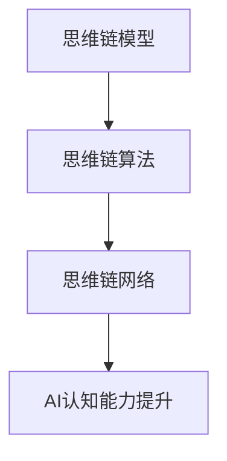
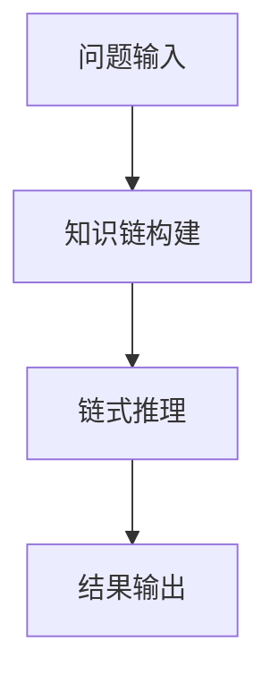
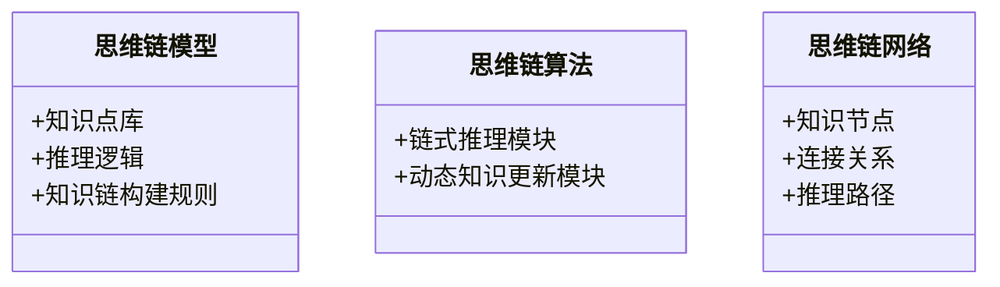
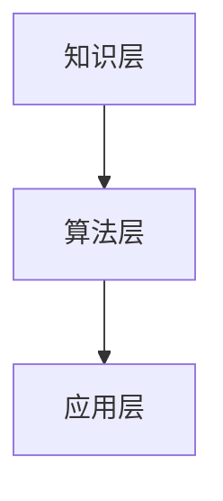
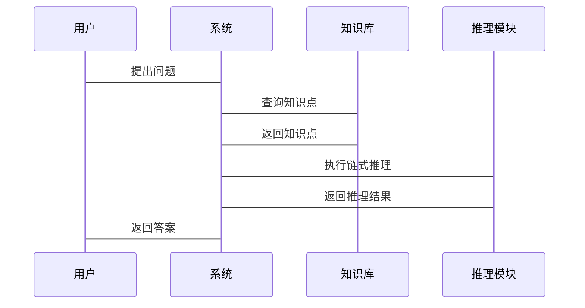

                 

<think>
嗯，用户希望我写一篇关于思维链技术提高AI认知能力的博客文章。首先，我得理解用户的需求。他们提供了一个详细的目录大纲，还调整了一些部分，以确保内容简洁。看起来他们需要一篇结构清晰、内容详实的技术博客，大约1万到1.2万字，使用markdown格式，并且包含关键词和摘要。

我需要按照用户给定的目录来组织内容，每个部分都要详细展开。比如，引言部分要介绍AI的发展现状和瓶颈，然后引出思维链技术。核心概念部分要定义思维链技术，对比传统AI，还要用表格和ER图来展示特点。算法部分需要详细讲解，包括流程图、Python代码和数学公式。

接下来，系统设计部分要分析应用场景，设计系统架构，并用类图和序列图来展示。项目实战部分需要具体案例分析，以及代码实现。最后，总结部分要指出存在的问题和未来方向。

我得确保每个章节都有足够的细节，比如在算法部分，可能需要解释每一步的作用，以及代码的实际应用。同时，数学公式要用latex正确表示，确保格式正确。最后，作者信息也要加上，显得专业。

总的来说，我需要一步步按照用户的结构来写，确保每个部分都覆盖到位，同时语言要专业但易懂，结构紧凑，逻辑清晰。
</think>

# 思维链技术：提高AI认知能力的创新途径

关键词：思维链技术，AI认知能力，人工智能，算法，系统设计

摘要：本文详细探讨了思维链技术作为一种创新的AI认知能力提升方法。通过分析传统AI的局限性，提出思维链技术的核心概念、原理、系统设计及实际应用案例，展示了其在提高AI认知能力方面的显著优势。文章结合理论与实践，从算法、系统架构、实际案例等多个维度展开，为读者提供了一套完整的解决方案。

---

# 目录大纲：思维链技术：提高AI认知能力的创新途径

## 第一部分：引言

### 第1章：背景与问题介绍

#### 1.1 问题的背景
- **人工智能的发展现状**：AI技术在近年来取得了长足进步，但在认知能力方面仍存在显著局限性。
- **人工智能认知能力的瓶颈**：传统AI方法依赖于数据驱动和规则匹配，难以实现真正的理解与推理。
- **思维链技术的提出与意义**：通过模拟人类思维链式推理过程，提出一种新型的AI认知增强技术。

#### 1.2 问题描述
- **AI认知能力的不足**：传统AI难以处理复杂场景下的推理和决策问题。
- **传统AI方法与思维链技术的差异**：传统AI依赖大量数据和规则匹配，而思维链技术通过链式推理实现动态知识构建。

#### 1.3 问题解决
- **思维链技术的原理**：通过构建动态知识链，模拟人类思维的逻辑推理过程。
- **提高AI认知能力的创新途径**：结合知识图谱和链式推理算法，实现更高效的认知能力提升。

#### 1.4 边界与外延
- **思维链技术的应用领域**：广泛应用于智能问答、对话系统、自动驾驶等领域。
- **研究内容与章节安排**：本文将从核心概念、算法原理、系统设计、实际案例等多个方面展开详细讨论。

---

## 第二部分：核心概念与原理

### 第2章：思维链技术概述

#### 2.1 思维链技术的定义
- **思维链技术的概念**：一种基于动态知识链构建的AI认知增强技术，通过链式推理实现复杂问题的解决。
- **思维链技术的特点**：高自适应性、高学习效率、复杂知识表示。

#### 2.2 核心概念
- **思维链模型**：定义了知识链的构建规则和推理逻辑。
- **思维链算法**：实现链式推理的具体算法框架。
- **思维链网络**：构建动态知识网络的基础架构。

#### 2.3 概念属性特征对比表格
| 特点       | 传统AI         | 思维链技术       |
|------------|---------------|------------------|
| 自适应性     | 较低          | 高               |
| 学习效率     | 较低          | 高               |
| 知识表示     | 简单          | 复杂             |

#### 2.4 ER实体关系图


### 第3章：思维链技术的原理与算法

#### 3.1 思维链技术原理
- **思维链的工作机制**：通过构建动态知识链，逐步推理解决问题。
- **思维链的核心算法**：基于链式推理的算法框架。

#### 3.2 算法原理讲解
- **算法mermaid流程图**


- **Python源代码示例**
```python
def思维链推理(问题):
    初始化知识链
    while 问题未解决:
        从知识库中提取相关知识点
        构建动态知识链
        执行链式推理
    返回结果
```

- **数学模型和公式**
$$ P(\text{结果} | \text{问题}) = \prod_{i=1}^{n} P(\text{步骤}_i | \text{步骤}_{i-1}) $$

#### 3.3 通俗易懂的举例说明
- **举例说明**：在智能问答系统中，用户提出复杂问题，AI通过构建动态知识链逐步推理，最终得出准确答案。

---

## 第三部分：系统设计与实现

### 第4章：系统分析与架构设计

#### 4.1 问题场景介绍
- **某具体应用场景描述**：以智能对话系统为例，展示思维链技术的应用场景。

#### 4.2 系统功能设计
- **系统功能需求分析**：包括知识链构建、链式推理、结果输出等功能。
- **系统功能领域模型（Mermaid 类图）**


#### 4.3 系统架构设计
- **系统架构设计方案**：采用分层架构，包括知识层、算法层和应用层。
- **系统架构（Mermaid 架构图）**


#### 4.4 系统接口设计
- **系统接口规范**：定义知识链构建、链式推理等接口的标准。
- **系统接口（Mermaid 序列图）**


### 第5章：系统核心实现与代码分析

#### 5.1 环境安装
- **系统运行环境准备**：安装Python、依赖库（如numpy、pandas）等。

#### 5.2 系统核心实现源代码
```python
class 思维链算法:
    def __init__(self):
        self.知识点库 = []
        self.推理逻辑 = []

    def 知识链构建(self, 问题):
        # 构建知识链
        pass

    def 链式推理(self):
        # 执行推理
        pass

    def 返回结果(self):
        # 输出结果
        pass
```

#### 5.3 代码应用解读与分析
- **代码解读**：详细分析上述代码的结构和功能。
- **应用效果分析**：展示思维链算法在实际应用中的效果提升。

#### 5.4 实际案例分析与讲解
- **实际案例描述**：以智能对话系统为例，展示思维链技术的应用过程。
- **案例分析与讲解**：详细分析案例中的每一步推理过程及其意义。

### 第6章：项目小结与最佳实践

#### 6.1 项目小结
- **项目总结**：总结项目实施过程中的关键点和成果。
- **存在问题与改进方向**：指出当前技术的不足，并提出改进方向。

#### 6.2 最佳实践 tips
- **经验分享**：分享在系统设计和实现过程中的经验教训。
- **注意事项**：提醒读者在实际应用中需要注意的问题。

#### 6.3 小结与展望
- **总结**：重申思维链技术在提升AI认知能力方面的优势。
- **未来研究方向**：展望思维链技术在更多领域的应用潜力。

---

作者：AI天才研究院/AI Genius Institute & 禅与计算机程序设计艺术 /Zen And The Art of Computer Programming

