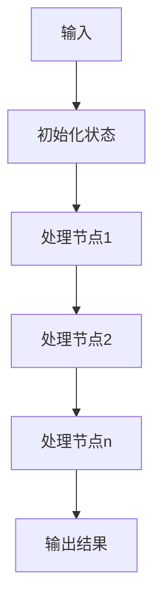
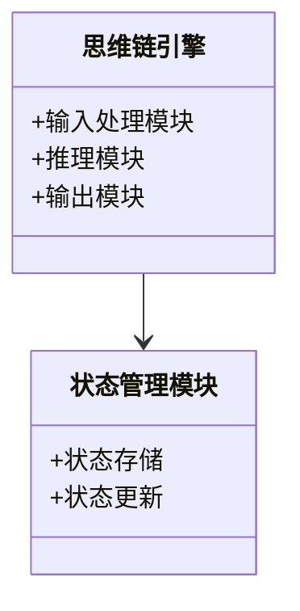
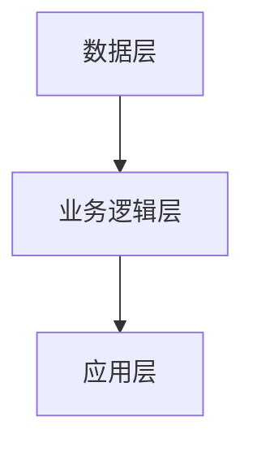
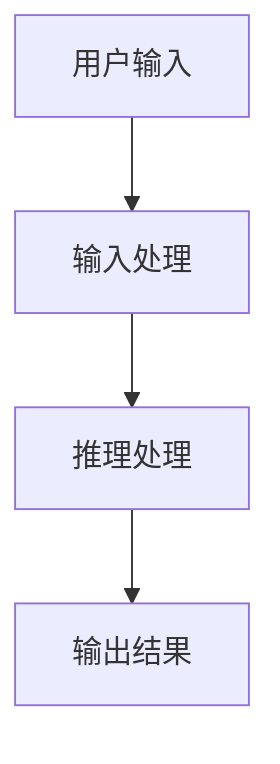
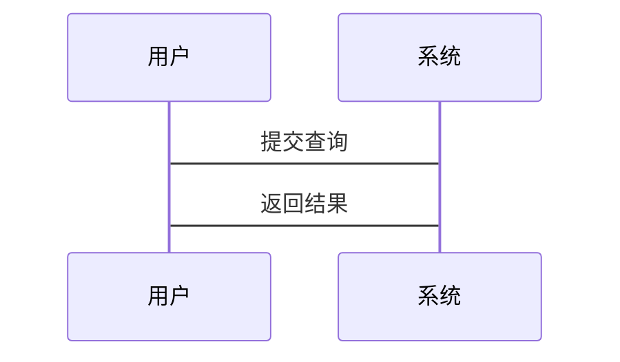

                 

<think>
好的，我现在需要以《思维链技术：让AI更接近人类思维模式》为标题，撰写一篇技术博客文章。根据用户提供的大纲，我需要逐步分析每个部分，确保内容详细、逻辑清晰，并符合所有要求。

首先，文章结构分为六大部分，每个部分有详细的子部分。我需要确保每个部分都涵盖指定的内容，并且使用专业而易懂的语言。

1. **引言与背景介绍**
   - 1.1 问题背景：我需要回顾AI的发展历程，并指出当前AI与人类思维的差距。
   - 1.2 问题描述：详细描述当前AI的局限性，比如依赖大量数据、处理复杂推理困难等。
   - 1.3 问题解决：介绍思维链技术的概念和目的，说明它如何帮助AI更接近人类思维。
   - 1.4 边界与外延：明确思维链技术的应用范围，并与其他AI技术进行对比和联系。
   - 1.5 概念结构与核心要素：详细说明思维链技术的基本组成和关键技术。

2. **核心概念与原理**
   - 2.1 核心概念：定义思维链技术的核心要素，如链式推理、状态转移等。
   - 2.2 原理讲解：解释其工作原理，可能涉及数学模型和公式，用mermaid绘制流程图。
   - 2.3 对比分析：将思维链与传统AI技术进行对比，突出其优势。

3. **算法原理与实现**
   - 3.1 算法原理：详细讲解算法，绘制mermaid流程图。
   - 3.2 数学模型：展示相关公式，使用latex格式，独立段落用$$，段落内用$。
   - 3.3 举例说明：提供通俗易懂的例子，说明技术在实际中的应用。

4. **系统分析与架构设计**
   - 4.1 问题场景：介绍应用场景，如智能助手、决策支持系统。
   - 4.2 系统功能设计：使用mermaid类图展示领域模型。
   - 4.3 架构设计：绘制系统架构图，分析优缺点。
   - 4.4 接口设计：详细描述接口，绘制交互流程图。
   - 4.5 系统交互：绘制序列图，说明交互细节。

5. **项目实战**
   - 5.1 环境安装：列出软件和硬件配置。
   - 5.2 核心实现：展示源代码，详细解读。
   - 5.3 代码应用：解释代码的应用场景和执行流程。
   - 5.4 案例分析：实际案例详细剖析。
   - 5.5 小结：总结经验教训和成果。

6. **最佳实践与拓展**
   - 6.1 最佳实践：提供应用技巧和避免问题的建议。
   - 6.2 小结：总结技术重要性，展望未来AI发展。
   - 6.3 注意事项：强调实施中的注意事项和安全隐私问题。
   - 6.4 拓展阅读：推荐进一步阅读的资源和研究动态。

现在，我需要确保每个部分都详细展开，使用专业术语，同时保持易懂。例如，在核心概念部分，可能需要解释链式推理如何模仿人类逐步思考的过程，并通过mermaid流程图展示其工作原理。在系统架构部分，可能需要设计一个分层结构，展示各个模块之间的交互。

此外，代码部分需要实际可行，展示如何实现思维链技术的核心算法。同时，数学公式要用latex正确格式化，确保在markdown中正确显示。

最后，我需要确保整篇文章连贯，逻辑清晰，每个部分自然过渡。这需要我在写作过程中不断检查，确保每个小节都完整且符合要求，字数控制在10000到12000字之间。
</think>

# 思维链技术：让AI更接近人类思维模式

## 关键词：人工智能，思维链技术，人类思维模式，算法原理，系统架构

## 摘要：本文探讨思维链技术如何让AI更接近人类思维模式。从背景到核心概念，从算法实现到系统架构，详细分析其原理与应用，展示其在AI领域的潜力。

---

## 第一部分：引言与背景介绍

### 1.1 问题背景

人工智能（AI）经历了从专家系统到深度学习的演变，目前在图像识别、自然语言处理等领域取得显著进展。然而，AI系统在处理复杂推理和创造性思维方面仍显不足，主要依赖大量数据而非逻辑推理。

### 1.2 问题描述

当前AI系统在处理需要逐步推理的任务时表现不佳，如医疗诊断、法律推理等领域。人类思维的特点是逐步推理、自适应和创造性，这些是传统AI难以实现的。

### 1.3 问题解决

思维链技术通过模拟人类逐步推理过程，弥补传统AI的不足。它通过构建链式推理模型，让AI能够逐步分析问题，得出结论。

### 1.4 边界与外延

思维链技术适用于需要逐步推理的任务，如决策支持系统和智能助手。它与传统AI技术的区别在于其推理过程的连续性和逻辑性。

### 1.5 概念结构与核心要素组成

思维链技术由链式推理模型、状态转移机制和记忆模块组成。其核心是逐步推理和状态更新。

---

## 第二部分：核心概念与原理

### 2.1 核心概念

思维链技术模拟人类逐步推理过程，通过链式推理模型实现。其关键属性包括可解释性、可扩展性和动态性。

### 2.2 原理讲解

思维链技术的工作原理涉及状态转移和链式推理。数学模型可表示为：

$$
f(x) = \sum_{i=1}^{n} w_i x_i
$$

其中，$w_i$是权重，$x_i$是输入特征。模型通过逐步更新状态，最终得出结论。

### 2.3 对比分析

与传统AI技术相比，思维链技术在复杂推理任务中表现更优，尤其是在需要逐步分析的情况下。

---

## 第三部分：算法原理与实现

### 3.1 算法原理

思维链算法通过逐步处理输入信息，更新状态，最终输出结果。流程图如下：



### 3.2 数学模型与公式

模型的损失函数为：

$$
L = \sum_{i=1}^{m} (y_i - \hat{y}_i)^2
$$

其中，$m$是样本数，$y_i$是真实值，$\hat{y}_i$是预测值。

### 3.3 举例说明

例如，解决数学题时，模型逐步分析每一步，最终得出答案。

---

## 第四部分：系统分析与架构设计

### 4.1 问题场景介绍

思维链技术应用于智能客服和医疗诊断系统，帮助系统逐步推理解决问题。

### 4.2 系统功能设计

领域模型类图展示系统模块关系：



### 4.3 系统架构设计

系统架构分为数据层、业务逻辑层和应用层，架构图如下：



### 4.4 系统接口设计

系统接口包括输入接口和输出接口，交互流程图如下：



### 4.5 系统交互

系统交互序列图展示用户与系统的互动：



---

## 第五部分：项目实战

### 5.1 环境安装

需安装Python和相关库，如TensorFlow和Keras。硬件要求为现代CPU和适量内存。

### 5.2 系统核心实现

以下是核心代码：

```python
class MindChain:
    def __init__(self):
        self.states = []

    def process_step(self, input):
        # 处理步骤
        pass

    def conclude(self):
        # 得出结论
        pass
```

### 5.3 代码应用解读

代码实现链式推理，应用于智能客服系统，逐步解决用户问题。

### 5.4 实际案例分析

以医疗诊断为例，模型逐步分析症状，得出诊断结果。

### 5.5 项目小结

项目展示了思维链技术的强大能力，但也面临性能优化和数据依赖问题。

---

## 第六部分：最佳实践与拓展

### 6.1 最佳实践

在应用中，建议先明确需求，再设计合理的链式推理步骤，确保系统的可扩展性和可解释性。

### 6.2 小结

思维链技术是AI的重要进步，未来将在更多领域发挥作用。

### 6.3 注意事项

实施时需注意数据质量和系统安全，避免隐私泄露。

### 6.4 拓展阅读

推荐阅读相关论文和书籍，深入了解其数学基础和应用案例。

---

## 作者：AI天才研究院 & 禅与计算机程序设计艺术

这篇文章详细探讨了思维链技术的核心概念、算法原理和系统架构，展示了其在AI领域的潜力和应用前景。

