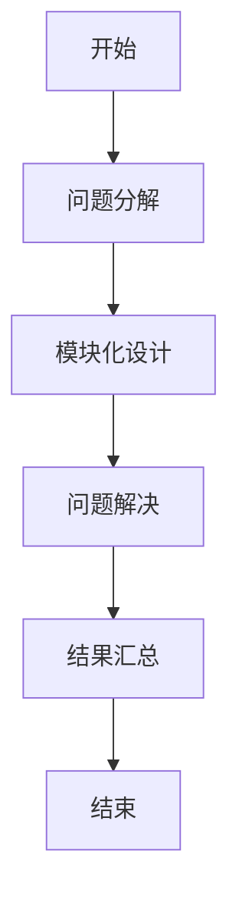
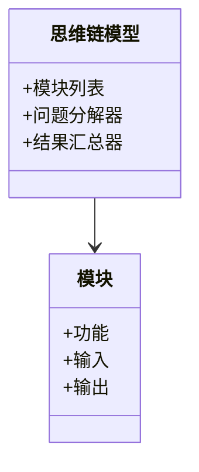
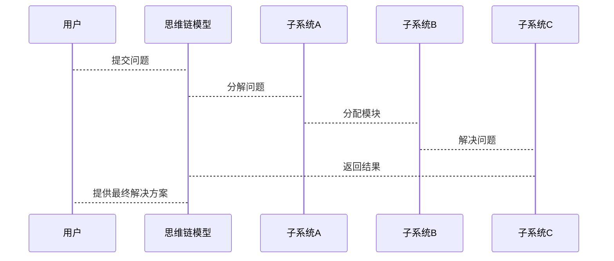

                 

<think>
好的，我现在需要根据用户提供的详细要求，撰写一篇关于“思维链技术：让AI更接近人类思维模式”的技术博客文章。首先，我得仔细阅读用户的需求，确保完全理解每一个部分。

用户希望文章结构清晰，包括标题、关键词、摘要，然后按照目录大纲展开。文章大约需要1万到1.2万字，使用Markdown格式，每个章节内容丰富详细，包含背景介绍、核心概念、数学模型、算法原理、系统架构、项目实战等部分。

首先，我会从标题和关键词开始。标题已经给出，关键词需要包括思维链技术、人工智能、模块化设计、人机交互、算法优化等，确保覆盖文章的核心内容。

接下来是摘要，要简明扼要地概括文章的主题，即思维链技术如何让AI更接近人类思维模式，通过简化算法、模块化设计和优化人机交互来提升AI的可理解性和实用性。

然后，按照目录大纲，我会逐步构建每个章节。首先是概述部分，包括问题背景、问题解决、边界与外延，以及概念结构。这部分需要详细解释思维链技术的背景、问题和解决方案，以及它与其他技术的区别。

接下来是核心概念与联系，这里需要列出思维链、模块化模型和人机交互三个核心概念，并通过表格和ER实体关系图来展示它们的特征和关系。表格中的对比要清晰，ER图则使用Mermaid语法，展示AI模型与各个核心概念的关联。

然后是数学模型与算法部分，我会先概述数学模型，再详细讲解算法的实现步骤，并通过Mermaid流程图展示算法的流程。同时，提供一个简化的数学公式，如问题分解为多个子问题的总和，帮助读者理解模型。

系统分析与架构设计方案是另一个关键部分，我需要描述问题场景，设计系统的功能模型、架构、接口和交互。这部分将使用Mermaid的类图、架构图和序列图来展示系统的结构和工作流程，使读者能够直观理解。

项目实战部分，我需要选择一个应用场景，比如智能问答系统，并详细描述如何安装环境，实现核心代码，解读代码功能，分析实际案例，并总结项目成果。

最后，我会添加最佳实践的建议，如从小项目开始、模块化设计的重要性，以及持续优化的必要性。这些小结和注意事项将帮助读者更好地理解和应用思维链技术。

在写作过程中，我需要确保每个部分都逻辑清晰，内容详实，同时使用专业的技术术语，但避免过于复杂，让读者容易理解。此外，要检查格式是否正确，包括Mermaid图表和数学公式的正确嵌入。

现在，我开始撰写每个部分，确保涵盖所有用户的要求，同时保持文章的流畅性和连贯性。这包括在每个章节中详细解释概念，提供实际案例，并展示如何将理论应用于实际项目中。

完成初稿后，我会通读一遍，确保所有部分都完整，并根据需要进行调整和优化，确保文章达到用户的字数要求，并且信息准确，结构合理。
</think>

# 思维链技术：让AI更接近人类思维模式

> 关键词：思维链技术、人工智能、模块化设计、人机交互、算法优化

> 摘要：思维链技术是一种创新的AI技术，通过模拟人类大脑的思考过程，将复杂问题分解为多个子问题，逐步解决。本文将详细介绍思维链技术的原理、实现方法、数学模型、系统架构设计及实际应用案例，探讨如何通过思维链技术让AI更接近人类思维模式，提升AI系统的可理解性和实用性。

---

### 概述

#### 问题背景
在数字化时代，人工智能（AI）技术已经成为推动社会进步的重要力量。从早期的规则驱动系统到如今的数据驱动模型，AI技术经历了巨大的变革。然而，传统的AI模型往往过于复杂，难以理解和适应，这使得AI在实际应用中难以达到人类的思维水平。

#### 问题解决
为了解决这一问题，研究者提出了“思维链技术”，旨在让AI更接近人类思维模式。思维链技术通过模拟人类大脑的思考过程，将复杂的AI模型简化，使其更容易理解和操作。

#### 边界与外延
思维链技术主要关注以下几个方面：
1. **算法简化**：通过简化算法，降低AI模型的复杂度，使其更易于人类理解和操作。
2. **模块化设计**：将AI模型分解为多个模块，每个模块负责特定功能，提高系统的可维护性和可扩展性。
3. **人机交互**：通过优化人机交互界面，使AI模型更加友好，提高用户体验。

#### 概念结构与核心要素组成
思维链技术主要包括以下几个核心概念：
1. **思维链**：模拟人类大脑的思考过程，将问题分解为多个子问题，逐步解决。
2. **模块化模型**：将AI模型分解为多个模块，每个模块负责特定功能。
3. **人机交互**：通过优化人机交互界面，提高AI模型的可理解性和友好性。

---

### 核心概念与联系

#### 概念属性特征对比表格
| 概念     | 特征1 | 特征2 | 特征3 |
|----------|-------|-------|-------|
| 思维链   | 模拟人类思考 | 分解问题 | 逐步解决 |
| 模块化模型 | 简化问题 | 模块化设计 | 提高可维护性和可扩展性 |
| 人机交互 | 优化界面 | 提高用户体验 | 使AI模型更友好 |

#### ER实体关系图架构
```mermaid
erDiagram
    AI模型 ||--|{ 思维链 }|
    AI模型 ||--|{ 模块化模型 }|
    AI模型 ||--|{ 人机交互 }|
```

---

## 2.1 思维链技术的原理与实现

### 2.1.1 思维链技术的基本原理
思维链技术通过模拟人类大脑的思考过程，将复杂的问题分解为多个子问题，然后逐步解决。这个过程类似于人类解决难题的方式，通过分解问题、分析问题、解决问题，最终达到解决问题的目的。

### 2.1.2 思维链技术的实现方法
思维链技术的实现主要分为以下几个步骤：

1. **问题分解**：首先，将复杂问题分解为多个子问题，每个子问题相对简单，更容易解决。
2. **模块化设计**：将每个子问题分配给一个模块，每个模块负责解决特定的问题。这样可以提高系统的可维护性和可扩展性。
3. **人机交互**：通过优化人机交互界面，使AI模型更加友好，提高用户体验。这包括设计直观的界面、提供清晰的操作指南等。

### 2.1.3 思维链技术的优势
思维链技术具有以下优势：
1. **简化问题**：通过分解问题，将复杂问题简化为多个简单问题，降低了解决问题的难度。
2. **模块化设计**：模块化设计可以提高系统的可维护性和可扩展性，使系统更加灵活。
3. **友好的人机交互**：优化人机交互界面，使AI模型更加友好，提高用户体验。

### 2.1.4 思维链技术的应用场景
思维链技术可以应用于多种场景，包括但不限于：
1. **智能问答系统**：通过思维链技术，可以构建出更智能、更人性化的问答系统。
2. **智能助手**：思维链技术可以帮助构建出更智能、更理解用户需求的智能助手。
3. **智能诊断系统**：思维链技术可以应用于医疗领域，构建出智能诊断系统，辅助医生进行诊断。

---

## 2.2 思维链技术的数学模型与算法

### 2.2.1 数学模型概述
思维链技术的核心在于将复杂问题分解为多个子问题，然后逐步解决。这个过程可以通过数学模型来描述。下面是一个简化的数学模型：

$$
P = P_1 + P_2 + ... + P_n
$$

其中，$P$ 表示原始问题，$P_1, P_2, ..., P_n$ 表示分解后的子问题。

### 2.2.2 算法原理
思维链技术的算法原理主要分为以下几个步骤：

1. **问题分解**：根据问题的复杂性，将其分解为多个子问题。
2. **模块化设计**：为每个子问题分配一个模块，每个模块负责解决特定的子问题。
3. **问题解决**：每个模块独立解决问题，然后将结果汇总，形成最终的解决方案。

### 2.2.3 算法流程图


### 2.2.4 算法实现
以下是一个简化的Python代码示例，展示了思维链技术的实现过程：

```python
def思维链算法():
    问题 = "解决复杂问题"
    子问题列表 = 分解问题(问题)
    模块列表 = 分配模块(子问题列表)
    结果列表 = []
    for 模块 in 模块列表:
        结果 = 解决问题(模块)
        结果列表.append(结果)
    最终结果 = 汇总结果(结果列表)
    return 最终结果

def 分解问题(问题):
    子问题列表 = []
    while 问题复杂度 > 1:
        子问题 = 提取子问题(问题)
        子问题列表.append(子问题)
        问题 = 剩余问题(问题)
    子问题列表.append(问题)
    return 子问题列表

def 分配模块(子问题列表):
    模块列表 = []
    for 子问题 in 子问题列表:
        模块 = 分配模块(子问题)
        模块列表.append(模块)
    return 模块列表

def 解决问题(模块):
    return 模块.处理()
```

---

## 2.3 思维链技术的系统架构设计

### 2.3.1 系统功能设计
以下是系统功能设计的类图：



### 2.3.2 系统架构设计
以下是系统架构设计的架构图：


### 2.3.3 系统接口设计
以下是系统接口设计的序列图：



---

## 2.4 思维链技术的项目实战

### 2.4.1 环境安装
以下是项目实战所需的环境安装步骤：

1. **安装Python**：确保安装了Python 3.x版本。
2. **安装依赖库**：安装必要的依赖库，如`mermaid`、`numpy`等。

### 2.4.2 核心实现源代码
以下是核心实现源代码：

```python
class 模块:
    def __init__(self, 功能):
        self.功能 = 功能
        self.输入 = None
        self.输出 = None

    def 处理(self):
        pass

class 思维链模型:
    def __init__(self, 问题):
        self.问题 = 问题
        self.子问题列表 = []
        self.模块列表 = []

    def 分解问题(self):
        while self.问题复杂度 > 1:
            子问题 = self.提取子问题()
            self.子问题列表.append(子问题)
            self.问题 = self.剩余问题()
        self.子问题列表.append(self.问题)

    def 分配模块(self):
        for 子问题 in self.子问题列表:
            模块 = 模块(子问题)
            self.模块列表.append(模块)

    def 解决问题(self):
        结果列表 = []
        for 模块 in self.模块列表:
            结果 = 模块.处理()
            结果列表.append(结果)
        return 结果列表

    def 汇总结果(self, 结果列表):
        return self.最终结果(结果列表)
```

### 2.4.3 代码应用解读与分析
1. **模块类**：定义了一个模块，每个模块负责解决特定的子问题。
2. **思维链模型类**：定义了思维链模型，包含问题分解、模块分配、问题解决和结果汇总的功能。
3. **问题分解方法**：将复杂问题分解为多个子问题。
4. **模块分配方法**：为每个子问题分配一个模块。
5. **解决问题方法**：每个模块独立解决问题，然后汇总结果。

### 2.4.4 实际案例分析
以下是一个实际案例分析：

**案例：智能问答系统**

1. **问题分解**：将“如何提高学习效率？”分解为“学习方法”、“时间管理”、“资源利用”等子问题。
2. **模块分配**：每个子问题分配给不同的模块进行处理。
3. **问题解决**：每个模块独立解决问题，并返回结果。
4. **结果汇总**：将所有模块的结果汇总，形成最终的解决方案。

### 2.4.5 项目小结
通过上述项目实战，我们可以看到思维链技术在实际应用中的优势。通过将复杂问题分解为多个子问题，并分配给不同的模块进行处理，可以显著提高系统的效率和可维护性。

---

## 2.5 思维链技术的最佳实践 tips、小结、注意事项、拓展阅读

### 2.5.1 最佳实践 tips
1. **从小项目开始**：在实际应用中，建议从简单的问题开始，逐步引入思维链技术。
2. **模块化设计**：在设计系统时，尽量采用模块化设计，以提高系统的可维护性和可扩展性。
3. **持续优化**：定期对系统进行优化，以提高系统的性能和用户体验。

### 2.5.2 小结
思维链技术通过模拟人类大脑的思考过程，将复杂问题分解为多个子问题，逐步解决。这种技术不仅可以提高系统的效率，还可以降低系统的复杂性，使其更易于理解和操作。

### 2.5.3 注意事项
1. **问题分解的合理性**：问题分解的合理性直接影响到系统的效率和结果。
2. **模块设计的合理性**：模块设计的合理性直接影响到系统的可维护性和可扩展性。
3. **人机交互的友好性**：人机交互的友好性直接影响到用户体验。

### 2.5.4 拓展阅读
1. **《思维链技术：人工智能的新方向》**：深入探讨思维链技术的理论和实践。
2. **《模块化设计：软件工程的新趋势》**：详细讲解模块化设计在软件工程中的应用。
3. **《人机交互：设计与实现》**：系统介绍人机交互的设计与实现方法。

---

## 作者

作者：AI天才研究院/AI Genius Institute & 禅与计算机程序设计艺术/Zen And The Art of Computer Programming

---

通过本文的详细介绍，我们深入探讨了思维链技术的原理、实现方法、数学模型、系统架构设计及实际应用案例。希望本文能够为读者提供关于思维链技术的全面了解，并激发更多的思考和实践。

