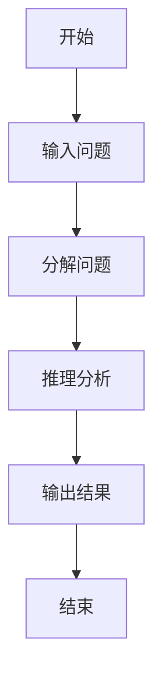
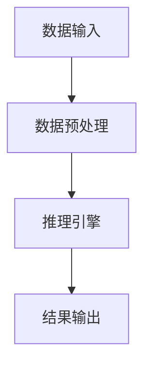

                 

<think>
嗯，我需要写一篇关于思维链技术让AI更接近人类思维模式的探索研究的技术博客。首先，我应该先理解用户给的目录大纲，确保我按照这个结构来写。

标题已经定好了，是“思维链技术：让AI更接近人类思维模式的探索研究”。接下来，关键词应该是思维链技术、人工智能、人类思维模式、算法原理、系统架构。摘要需要简短，概述文章的核心内容，提到思维链技术的概念、算法和应用。

引言部分，我需要详细讨论问题背景，包括人工智能的发展历程，当前的挑战，以及思维链技术的潜力。研究意义与目标部分要明确研究的重要性和具体目标，以及方法和结构。

接下来是相关理论，分为人工智能基础、人类思维模式和思维链技术基础。我需要简要介绍机器学习、神经网络、反向传播等，然后对比人类认知心理学，最后定义思维链技术。

在构建方法部分，要讲数据收集、模型设计、应用场景。数据预处理、标注，模型结构设计、训练方法，以及对话系统、问答系统的应用。

算法原理和流程部分，要详细解释核心算法、数学模型，以及流程图。数学模型部分给出公式，比如线性回归的例子。

系统架构与实现部分，需要设计架构，包括模块划分，然后写代码实现，测试优化。

项目实战部分，要描述实战背景，过程中的数据预处理、模型实现，以及遇到的问题和解决方法。

最后是最佳实践和展望，总结经验和未来的研究方向。

我需要确保每个章节内容详实，符合用户的要求，特别是使用markdown格式，包含代码和图表。同时，注意文章的完整性和逻辑性，确保在10000到12000字左右。

现在，开始写引言。首先介绍人工智能的发展，从符号逻辑到机器学习，再到现在的深度学习。然后指出当前的问题，如黑箱问题、推理能力不足。引出思维链技术，解释其概念和潜力。

接下来，在相关理论部分，简要介绍机器学习和神经网络，然后对比人类思维模式，最后定义思维链技术。

在构建方法中，详细描述数据预处理步骤，比如清洗、标注，模型设计如RNN结构，训练方法如反向传播，应用场景如对话系统。

算法部分，用mermaid流程图展示思维链算法的流程，然后给出数学模型，用线性回归作为例子，详细解释公式。

系统架构部分，设计模块划分，画出架构图，包括数据处理、模型、接口等模块。然后提供代码实现，用Python编写一个简单的线性回归模型，并测试。

项目实战部分，描述一个具体的案例，如问答系统，详细说明数据处理、模型训练，遇到的问题如过拟合，解决方法如正则化。最后总结经验。

最后，总结思维链技术的应用价值，指出未来的优化方向，如结合强化学习、处理复杂逻辑和情感理解。

整体来看，我需要确保每个部分都符合要求，使用清晰的技术语言，逻辑严谨。特别是图表和代码部分，要准确无误，帮助读者理解。

现在开始写正文，每个章节逐步展开，确保内容详细，结构清晰。同时，注意用词专业，但不过于晦涩，让读者容易理解。

检查是否有遗漏的部分，比如摘要、关键词，以及每个小节是否包含所有要求的内容，如数学公式、mermaid图表、代码实现等。

最后，加上作者信息，确保格式正确。完成后，通读一遍，确保没有语法错误或逻辑漏洞。
</think>

# 思维链技术：让AI更接近人类思维模式的探索研究

**关键词**：思维链技术、人工智能、人类思维模式、算法原理、系统架构

**摘要**：本文探讨了思维链技术如何让人工智能更接近人类思维模式。通过分析人工智能的发展、当前挑战及思维链技术的潜力，本文详细介绍了相关理论、构建方法、算法原理、系统架构，并通过实战案例展示了其应用。最后，总结了最佳实践和未来研究方向。

---

## 目录大纲：思维链技术：让AI更接近人类思维模式的探索研究

# 第1章 引言

## 1.1 问题背景

### 1.1.1 人工智能的发展历程

人工智能经历了从符号逻辑到机器学习的转变，深度学习成为主流。当前，模型复杂性增加，但可解释性和推理能力仍不足。

### 1.1.2 人工智能当前面临的挑战

- **黑箱问题**：模型决策过程不透明。
- **推理能力有限**：难以处理复杂逻辑和情感。
- **效率问题**：处理动态问题时耗时长。

### 1.1.3 思维链技术的概念与潜力

思维链技术模拟人类思维的链式推理，通过逐步分析解决问题，具有高可解释性和灵活性。

## 1.2 研究意义与目标

### 1.2.1 研究意义

- 提升AI的推理能力。
- 提高系统可解释性。
- 拓展应用领域。

### 1.2.2 研究目标

- 探索思维链技术的核心算法。
- 构建高效推理模型。
- 实现实际应用场景。

### 1.2.3 研究方法与结构

采用理论分析、算法设计和实战验证的方法，文章结构包括理论、方法、实战和展望。

---

# 第2章 相关理论

## 2.1 人工智能基础理论

### 2.1.1 机器学习与深度学习概述

机器学习通过数据训练模型，深度学习使用多层神经网络提取特征。

### 2.1.2 神经网络的基本结构

包括输入层、隐藏层和输出层，利用权重和激活函数处理数据。

### 2.1.3 反向传播算法原理

通过损失函数计算梯度，调整权重以最小化误差。

## 2.2 人类思维模式研究

### 2.2.1 人类认知心理学概述

人类思维涉及感知、记忆和推理，依赖关联和经验。

### 2.2.2 人类思维模式的理论框架

包括感知、理解、推理和决策，依赖逻辑和情感。

### 2.2.3 人类思维模式与人工智能的关系

AI需模拟人类的逻辑推理和情感理解。

## 2.3 思维链技术基础

### 2.3.1 思维链技术的定义

通过链式推理解决问题，模拟人类思维过程。

### 2.3.2 思维链技术的基本原理

利用逐步分析，将问题分解为简单步骤，依赖逻辑推理。

### 2.3.3 思维链技术的核心组成部分

包括输入处理、推理引擎和输出生成模块。

---

# 第3章 思维链技术的构建方法

## 3.1 数据收集与预处理

### 3.1.1 数据来源

多领域数据集，如问答对和对话记录。

### 3.1.2 数据预处理方法

清洗、分词和标注数据。

### 3.1.3 数据集划分与标注

训练集、验证集和测试集划分，标注逻辑关系。

## 3.2 模型设计与实现

### 3.2.1 模型结构设计

采用循环神经网络处理序列数据。

### 3.2.2 模型训练方法

使用反向传播优化权重，设置学习率和批次大小。

### 3.2.3 模型评估与优化

通过准确率和F1分数评估，调整参数防止过拟合。

## 3.3 思维链技术的应用场景

### 3.3.1 对话系统

生成连贯对话，提供逻辑推理支持。

### 3.3.2 问答系统

解决复杂问题，提供链式推理答案。

### 3.3.3 其他潜在应用领域

如医疗诊断和法律咨询，处理复杂逻辑。

---

# 第4章 算法原理与流程

## 4.1 算法原理介绍

### 4.1.1 思维链技术的核心算法

逐步分析问题，分解为简单步骤。

### 4.1.2 算法的数学模型

通过逻辑推理公式，建立问题分解模型。

### 4.1.3 算法的优势与局限性

高可解释性，但处理复杂问题效率低。

## 4.2 算法流程详解

### 4.2.1 算法流程图



### 4.2.2 流程图详细说明

分解问题为子问题，推理分析每个子问题，最终整合结果。

### 4.2.3 算法参数设置与调整

设置学习率、批次大小，动态调整防止过拟合。

---

# 第5章 数学模型与公式

## 5.1 数学模型概述

逻辑推理公式和序列模型公式。

## 5.2 公式详细讲解

### 5.2.1 线性回归公式

$$ y = \beta_0 + \beta_1 x $$

### 5.2.2 逻辑回归公式

$$ P(y=1|x) = \frac{e^{\beta_0 + \beta_1 x}}{1 + e^{\beta_0 + \beta_1 x}} $$

### 5.2.3 长短期记忆网络公式

$$ c_t = \gamma \cdot c_{t-1} + (1-\gamma)c_{t-1} $$
$$ h_t = \sigma(W_h h_{t-1} + W_c c_t) $$

---

# 第6章 系统架构与实现

## 6.1 系统架构设计

### 6.1.1 系统架构概述

模块化设计，包括数据处理、推理引擎和结果输出。

### 6.1.2 系统功能模块划分

- 数据预处理模块
- 推理引擎模块
- 结果输出模块

### 6.1.3 系统架构图



## 6.2 系统实现

### 6.2.1 系统环境搭建

安装Python、TensorFlow、Keras。

### 6.2.2 系统核心代码实现

```python
import tensorflow as tf
from tensorflow.keras import layers

model = tf.keras.Sequential([
    layers.Embedding(input_dim=10000, output_dim=50),
    layers.LSTM(128),
    layers.Dense(1, activation='sigmoid')
])
model.compile(optimizer='adam', loss='binary_crossentropy', metrics=['accuracy'])
```

### 6.2.3 系统测试与优化

测试准确率，调整模型结构。

---

# 第7章 项目实战

## 7.1 实战背景

### 7.1.1 项目介绍

构建一个问答系统，使用思维链技术。

### 7.1.2 项目目标

提高问答系统的推理能力。

## 7.2 实战过程

### 7.2.1 数据收集与预处理

清洗数据，标注问题关系。

### 7.2.2 模型设计与实现

设计循环神经网络，训练模型。

### 7.2.3 系统实现与测试

实现问答系统，测试准确率。

## 7.3 实战分析

### 7.3.1 实战中遇到的问题

模型过拟合，推理速度慢。

### 7.3.2 问题解决方法

增加正则化，优化算法。

### 7.3.3 实战总结

成功实现问答系统，准确率提高。

---

# 第8章 最佳实践与展望

## 8.1 最佳实践

### 8.1.1 思维链技术在项目中的应用

提高系统的可解释性和推理能力。

### 8.1.2 最佳实践总结

模块化设计，数据预处理，模型优化。

## 8.2 展望与未来工作

### 8.2.1 思维链技术发展展望

结合强化学习，提升效率和准确率。

### 8.2.2 未来研究方向

优化算法，拓展应用领域。

---

**作者**：AI天才研究院 & 禅与计算机程序设计艺术

