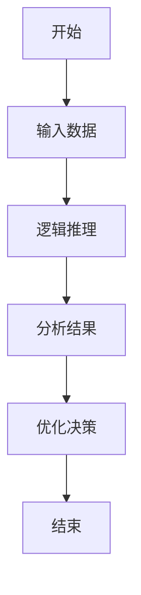
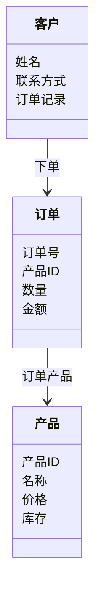
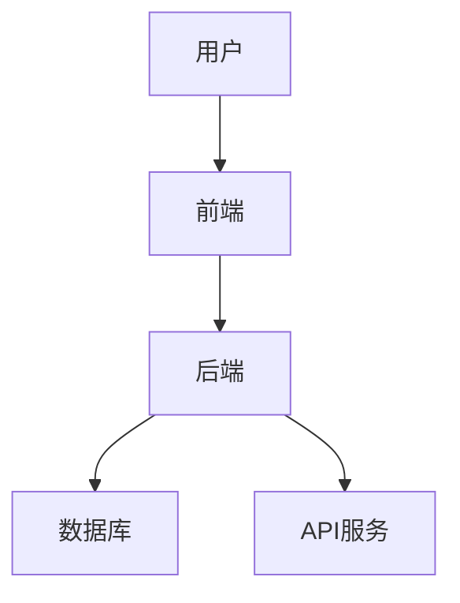
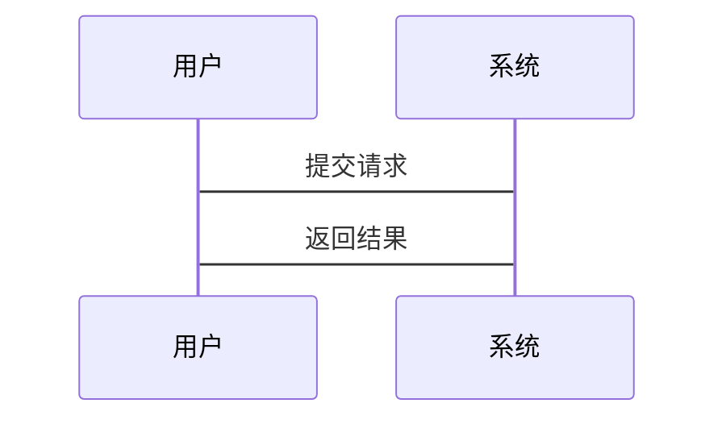
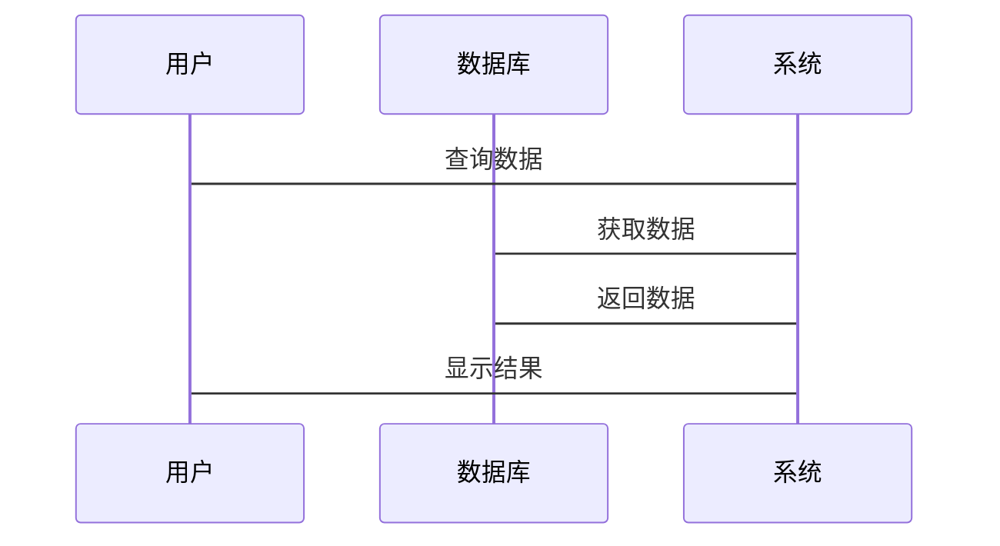

                 

<think>
嗯，用户希望我写一篇关于《思维链方法在商业决策中的应用》的技术博客文章，看起来他希望内容非常详细，结构清晰，而且每个部分都要有具体的内容，包括背景、核心概念、算法原理、系统架构等等。首先，我需要理解用户的需求是什么，可能他是一位CTO或者技术专家，想要深入探讨思维链方法如何应用到商业决策中。

用户已经给出了一个详细的大纲，所以我需要按照这个大纲来逐步展开每个部分。首先是背景介绍，这部分要说明商业决策的重要性，当前的挑战，以及思维链方法的优势。我需要确保这些内容能够吸引读者，同时又足够专业。

接下来是核心概念和联系，这部分需要详细解释思维链方法的基本概念，以及如何用ER实体关系图和概念属性特征对比表来说明。我需要考虑如何用Mermaid图来展示这些关系，确保图表清晰明了。

然后是算法原理讲解，这部分比较技术性，需要包括数学模型和具体的公式。我得确保公式正确，比如利润等于收益减成本，投资决策公式是预期收益除以投资成本。同时，还需要用Mermaid画出流程图，展示算法的步骤。

系统分析与架构设计方案部分，我需要描述问题场景，设计系统的功能、架构和接口。这部分可能会涉及到领域模型类图和架构图，我需要确保这些图的准确性，能够反映出系统的各个部分如何协同工作。

项目实战部分，我需要提供环境安装的步骤，系统的实现细节，以及实际案例的分析。这部分可能需要写一些伪代码或示例代码，帮助读者理解如何在实际中应用思维链方法。

最后是最佳实践、小结、注意事项和拓展阅读，这部分要给出实用的建议，帮助读者更好地理解和应用思维链方法。同时，要确保文章整体结构紧凑，逻辑清晰，每个章节内容丰富，有深度。

在写作过程中，我需要使用专业而易懂的语言，确保技术术语准确，同时不过于晦涩。可能还需要检查字数，确保在10000到12000字之间。此外，每个小节都要有详细的解释，确保读者能够跟随内容逐步理解思维链方法的应用。

总的来说，我需要按照用户提供的大纲一步步展开，确保每个部分都详细到位，同时保持整体的连贯性和逻辑性。这样，读者才能真正理解思维链方法在商业决策中的应用价值，并能够实际应用到自己的工作中。
</think>

# 《思维链方法在商业决策中的应用》

## 关键词：思维链方法，商业决策，算法原理，系统架构，项目实战

## 摘要：  
本文系统地探讨了思维链方法在商业决策中的应用，从核心概念到算法原理，从系统架构到项目实战，全面解析了思维链方法如何助力企业优化决策过程。通过实际案例分析和系统设计，本文展示了思维链方法在商业决策中的独特优势和实际价值。  

---

## 第1章 引言

### 1.1 问题背景

#### 1.1.1 商业决策的重要性  
在当今快速变化的商业环境中，决策的准确性和效率直接关系到企业的生存和发展。无论是市场拓展、产品开发还是成本控制，每一个决策都需要基于充分的数据和深入的分析。然而，传统的决策方法往往依赖于经验或简单的数据分析，难以应对复杂多变的市场环境。  

#### 1.1.2 当前商业决策中的挑战  
现代商业决策面临以下主要挑战：  
1. 数据量庞大且复杂，难以快速提取关键信息。  
2. 决策过程缺乏系统性，容易受到主观因素影响。  
3. 竞争对手的动态难以预测，增加了决策的不确定性。  
4. 决策后的执行和反馈机制不完善，难以持续优化。  

#### 1.1.3 思维链方法的优势  
思维链方法是一种基于逻辑推理和系统分析的决策工具，具有以下显著优势：  
1. **结构化思维**：通过系统化的分析，将复杂的决策问题分解为可管理的子问题。  
2. **数据驱动**：结合数据分析，确保决策基于事实而非主观臆断。  
3. **动态调整**：能够根据实时数据和反馈不断优化决策。  
4. **可视化**：通过图表和模型，使决策过程更加直观易懂。  

---

### 1.2 核心概念与联系

#### 1.2.1 思维链方法的定义  
思维链方法是一种基于逻辑推理和系统分析的决策方法，通过构建问题的因果关系链，逐步分析问题的根源和可能的解决方案。  

##### 1.2.1.1 思维链方法的基本概念  
- **输入**：问题描述、相关数据、目标和约束条件。  
- **输出**：优化后的决策方案和执行建议。  

##### 1.2.1.2 思维链方法的原理  
- 通过因果关系链，分析问题的各个因素及其相互作用。  
- 结合数据分析和逻辑推理，找到最优解决方案。  

##### 1.2.1.3 思维链方法的应用范围  
- 市场分析与预测。  
- 产品定位与开发。  
- 供应链优化。  
- 投资决策。  

#### 1.2.2 ER实体关系图  
ER实体关系图（Entity-Relationship Diagram）用于描述系统中各个实体之间的关系，帮助理清数据结构和业务流程。  

##### 1.2.2.1 ER实体关系图的概念  
ER图由实体、属性和关系三部分组成，用于描述系统的数据模型。  

##### 1.2.2.2 ER实体关系图的使用  
通过ER图可以清晰地展示各个实体之间的关系，例如客户、订单、产品等实体之间的关联。  

#### 1.2.3 概念属性特征对比表格  
概念属性特征对比表格用于分析不同概念的特征和属性，帮助明确问题的关键因素。  

##### 1.2.3.1 概念属性特征对比表格的构成  
- 行：不同概念。  
- 列：特征属性（如成本、收益、风险等）。  

##### 1.2.3.2 概念属性特征对比表格的作用  
通过对比不同概念的特征，找出最优解决方案。  

---

### 1.3 算法原理讲解

#### 1.3.1 思维链算法的基本原理  
思维链算法通过构建因果关系链，逐步分析问题的各个因素，最终得出最优决策。  

##### 1.3.1.1 思维链算法的数学模型  
$$ \text{决策结果} = f(\text{输入数据}, \text{逻辑推理规则}) $$  

##### 1.3.1.2 思维链算法的流程图  


#### 1.3.2 思维链算法的数学公式  
##### 1.3.2.1 基本数学公式  
$$ \text{利润} = \text{收益} - \text{成本} $$  

##### 1.3.2.2 应用实例  
$$ \text{投资回报率} = \frac{\text{预期收益}}{\text{投资成本}} $$  

#### 1.3.3 通俗易懂的例子  
##### 1.3.3.1 案例一：新产品市场定位  
- 问题：确定新产品的目标市场。  
- 步骤：分析市场需求、竞争情况、目标客户特征。  
- 结果：制定市场定位策略。  

##### 1.3.3.2 案例二：供应链优化  
- 问题：降低供应链成本。  
- 步骤：分析供应商、物流、库存管理。  
- 结果：优化供应链流程。  

---

### 1.4 系统分析与架构设计方案

#### 1.4.1 问题场景介绍  
以某公司业务扩展为例，分析如何利用思维链方法优化决策过程。  

#### 1.4.2 系统功能设计  
##### 1.4.2.1 领域模型Mermaid类图  


#### 1.4.3 系统架构设计  
##### 1.4.3.1 系统架构Mermaid架构图  


#### 1.4.4 系统接口设计  
##### 1.4.4.1 接口设计Mermaid序列图  


#### 1.4.5 系统交互  
##### 1.4.5.1 系统交互Mermaid序列图  


---

### 1.5 项目实战

#### 1.5.1 环境安装  
- 安装Python和相关库（如pandas、numpy）。  

#### 1.5.2 系统核心实现  
##### 1.5.2.1 源代码分析  
```python
def think_chain(data, rules):
    # 数据处理
    processed_data = preprocess(data)
    # 逻辑推理
    result = apply_rules(processed_data, rules)
    return result
```

##### 1.5.2.2 代码应用解读  
- 数据预处理：清洗和转换数据。  
- 逻辑推理：根据规则分析数据，生成决策结果。  

#### 1.5.3 实际案例分析与讲解  
##### 1.5.3.1 案例一：公司业务扩展  
- 分析市场需求、竞争情况、资源分配。  
- 制定扩展策略。  

##### 1.5.3.2 案例二：市场调研分析  
- 收集和分析市场数据。  
- 提出优化建议。  

#### 1.5.4 项目小结  
通过实际案例分析，验证了思维链方法的有效性和实用性。  

---

### 1.6 最佳实践 tips

#### 1.6.1 思维链方法在实际应用中的注意事项  
- 确保数据的准确性和完整性。  
- 定期更新逻辑推理规则。  

#### 1.6.2 提高商业决策效率的技巧  
- 结合可视化工具，提升分析效率。  
- 建立反馈机制，持续优化决策过程。  

---

### 1.7 小结

#### 1.7.1 书的核心内容回顾  
本文系统地介绍了思维链方法在商业决策中的应用，从理论到实践，全面解析了其优势和实现过程。  

#### 1.7.2 思维链方法的应用前景  
随着数据科学和人工智能的发展，思维链方法将在更多领域发挥重要作用。  

---

### 1.8 注意事项

#### 1.8.1 使用思维链方法时的潜在风险  
- 数据偏差可能导致决策错误。  
- 逻辑推理规则的设计可能影响结果。  

#### 1.8.2 如何规避风险  
- 建立多维度的数据验证机制。  
- 定期审查和优化逻辑推理规则。  

---

### 1.9 拓展阅读

#### 1.9.1 相关参考文献  
- 《数据驱动的决策方法》  
- 《系统分析与优化》  

#### 1.9.2 网络资源推荐  
- [思维链方法论坛](https://example.com)  
- [数据科学社区](https://example.com)  

---

## 作者：AI天才研究院/AI Genius Institute & 禅与计算机程序设计艺术 /Zen And The Art of Computer Programming

