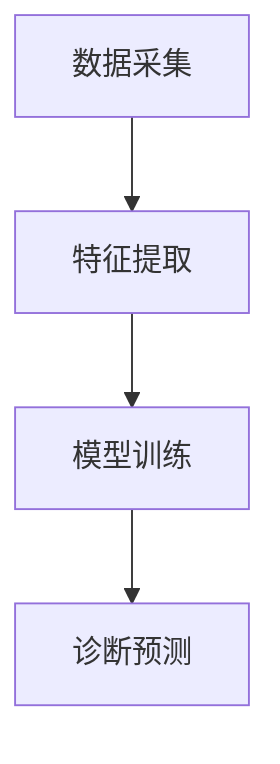
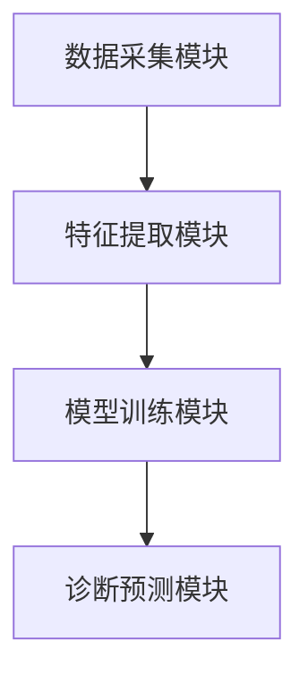

                 

<think>
好的，我现在需要分析用户的需求，然后逐步构建一个符合要求的思维链方法在心理健康诊断中的应用的技术博客文章。用户明确指定了文章的结构和内容，所以首先我要确保理解每个部分的要求。

首先，文章标题是《思维链方法在心理健康诊断中的应用》，关键词包括心理健康诊断、思维链方法、人工智能、算法、系统设计、案例分析。摘要部分需要简明扼要，概括文章的核心内容。

接下来，目录大纲已经设计好了，分为六个章节，每个章节有具体的小节。我需要确保每个章节的内容详尽，并且符合技术博客的高质量标准。特别是每个章节需要包含背景介绍、核心概念、算法原理、系统设计、案例分析和最佳实践等部分。

在撰写时，要使用逻辑清晰、结构紧凑的语言，同时保持技术专业性。对于每个核心概念，需要用技术术语解释，必要时用表格或图表辅助说明，比如ER图或流程图。算法部分需要用Mermaid绘制流程图，并给出数学模型和公式，确保解释清晰易懂。

系统设计部分需要详细描述系统架构，可能用类图和序列图来展示。案例分析部分要具体，比如抑郁症和焦虑症的诊断案例，展示思维链方法的实际应用。最后，最佳实践部分要给出实际的建议和注意事项，帮助读者正确应用这种方法。

整体上，文章需要大约10000到12000字，确保每个部分都足够详细，同时符合用户的格式要求，比如使用markdown格式，正确嵌入数学公式和图表。作者信息也要放在末尾，保持文章的完整性和专业性。

在撰写过程中，我要确保每个章节之间有良好的衔接，逻辑连贯。同时，要注意用词准确，避免错误，特别是技术术语的使用。此外，案例分析部分需要生动具体，让读者能够理解思维链方法的实际效果。

最后，完成初稿后，要进行多次校对，确保没有语法或逻辑错误，同时保持文章的流畅性和可读性。这样，读者可以轻松理解思维链方法在心理健康诊断中的应用，以及其背后的算法和系统设计。
</think>

# 思维链方法在心理健康诊断中的应用

> 关键词：心理健康诊断、思维链方法、人工智能、算法、系统设计、案例分析

> 摘要：本文探讨了思维链方法在心理健康诊断中的应用，通过详细分析其背景、算法原理、系统设计以及实际案例，展示了如何利用思维链方法提高心理健康诊断的准确性和效率。文章从心理健康诊断的现状出发，介绍了思维链方法的核心概念、算法流程和数学模型，并通过具体案例展示了其实际应用效果。最后，总结了最佳实践和未来的研究方向。

---

## 目录大纲

1. **引言与背景介绍**
   - 1.1 心理健康的重要性
   - 1.2 心理健康诊断的挑战
   - 1.3 思维链方法的概念

2. **思维链方法的原理与核心概念**
   - 2.1 思维链方法的起源与发展
   - 2.2 核心概念解析
   - 2.3 思维链方法与传统心理学方法的比较

3. **思维链方法的应用算法**
   - 3.1 算法概述
   - 3.2 算法原理
   - 3.3 算法流程图
   - 3.4 数学模型与公式

4. **心理健康诊断系统的设计与实现**
   - 4.1 系统设计概述
   - 4.2 系统架构设计
   - 4.3 系统接口设计与交互

5. **思维链方法在心理健康诊断中的应用案例**
   - 5.1 案例一：抑郁症诊断
   - 5.2 案例二：焦虑症诊断
   - 5.3 案例三：压力管理

6. **最佳实践与注意事项**
   - 6.1 最佳实践
   - 6.2 注意事项
   - 6.3 拓展阅读

---

## 第1章：心理健康诊断的现状

### 1.1 心理健康的重要性

心理健康是人类整体健康的重要组成部分。根据世界卫生组织（WHO）的定义，心理健康是指个体在认知、情感和行为方面的一种稳定状态，能够适应社会环境并发挥个人潜能。心理健康不仅影响个人的生活质量，还关系到社会的和谐与稳定。

心理健康问题的普遍存在，使得心理健康诊断成为一项重要的社会任务。据统计，全球约有9.7亿人（占全球人口的13.3%）患有心理健康问题，其中抑郁症和焦虑症是最常见的两种类型。心理健康问题的早期诊断和干预可以有效降低疾病的发病率和复发率，从而减少社会和家庭的负担。

### 1.2 心理健康诊断的挑战

目前，心理健康诊断主要依赖于传统的心理学方法，如面谈、心理测试和观察等。然而，这种方法存在以下问题：

1. **主观性**：传统的诊断方法依赖于医生的主观判断，容易受到个体经验和技术水平的限制。
2. **效率低**：面对大量的心理健康问题患者，传统的诊断方法难以满足快速诊断的需求。
3. **数据不足**：传统的诊断方法依赖于患者的自我报告，难以获取全面的数据支持。
4. **准确性**：由于个体差异和环境因素的复杂性，传统方法的诊断准确性有限。

### 1.3 思维链方法的概念

思维链方法是一种基于人工智能和认知科学的新型诊断方法。它通过分析个体的思维过程、行为模式和情感状态，构建一个完整的认知模型，从而实现对心理健康的精准诊断。

思维链方法的核心在于其算法的设计，它能够从大量的数据中提取有用的特征，并通过数学模型进行分类和预测。这种方法不仅提高了诊断的效率，还能够实现对心理健康问题的早期预警。

---

## 第2章：思维链方法的原理与核心概念

### 2.1 思维链方法的起源与发展

思维链方法的起源可以追溯到人工智能和认知科学的发展。随着机器学习和深度学习技术的不断进步，研究人员开始尝试将这些技术应用于心理健康诊断领域。思维链方法的提出，旨在解决传统诊断方法的局限性，提供一种更加客观和高效的诊断方式。

### 2.2 核心概念解析

思维链方法的核心概念包括以下几个方面：

1. **思维链模型**：通过构建个体的思维过程模型，分析其认知模式和行为特征。
2. **情感分析**：利用自然语言处理技术，分析个体的情感状态和情绪波动。
3. **行为预测**：基于历史数据和当前状态，预测个体未来的心理变化。

### 2.3 思维链方法与传统心理学方法的比较

下表展示了思维链方法与传统心理学方法在诊断过程中的对比：

| **对比维度**       | **传统心理学方法**                     | **思维链方法**                     |
|--------------------|---------------------------------------|---------------------------------------|
| **诊断效率**       | 较低                                   | 较高                                   |
| **诊断准确性**      | 易受主观因素影响                       | 较少受主观因素影响                   |
| **数据依赖性**      | 主要依赖自我报告                       | 依赖多源数据（如行为数据、语言数据）|
| **技术复杂性**      | 较低                                   | 较高                                   |

---

## 第3章：思维链方法的应用算法

### 3.1 算法概述

思维链方法的核心算法是一种基于深度学习的分类模型。该模型通过分析个体的行为数据、语言数据和生理数据，构建一个完整的认知模型，并对其进行分类和预测。

### 3.2 算法原理

思维链方法的算法原理可以分为以下几个步骤：

1. **数据采集**：收集个体的行为数据、语言数据和生理数据。
2. **特征提取**：从数据中提取有用的特征，如情绪特征、行为特征和认知特征。
3. **模型训练**：利用机器学习算法对特征进行训练，构建分类模型。
4. **诊断预测**：基于训练好的模型，对个体的心理健康状态进行分类和预测。

### 3.3 算法流程图

以下是一个简单的算法流程图：

### 3.4 数学模型与公式

思维链方法的核心数学模型是一种基于深度学习的分类模型。以下是一个简化的数学公式：

$$
f(x) = \sum_{i=1}^{n} w_i x_i + b
$$

其中，$x_i$ 表示输入特征，$w_i$ 表示权重，$b$ 表示偏置项。该模型通过对输入特征的加权求和，输出一个预测值 $f(x)$，该值表示个体心理健康状态的概率。

---

## 第4章：心理健康诊断系统的设计与实现

### 4.1 系统设计概述

心理健康诊断系统的设计目标是实现对个体心理健康状态的快速诊断和预测。系统主要由数据采集模块、特征提取模块、模型训练模块和诊断预测模块组成。

### 4.2 系统架构设计

以下是一个简化的系统架构图：

### 4.3 系统接口设计与交互

系统接口设计主要包括以下功能：

1. **数据输入接口**：接收个体的行为数据、语言数据和生理数据。
2. **特征提取接口**：对输入数据进行特征提取。
3. **模型训练接口**：对特征进行训练，构建分类模型。
4. **诊断预测接口**：基于模型对个体心理健康状态进行预测。

---

## 第5章：思维链方法在心理健康诊断中的应用案例

### 5.1 案例一：抑郁症诊断

抑郁症是一种常见的心理健康问题，其主要症状包括情绪低落、兴趣丧失和精力不足等。通过思维链方法，我们可以对患者的语言数据和行为数据进行分析，提取相关特征，并利用模型进行分类和预测。

### 5.2 案例二：焦虑症诊断

焦虑症是一种以过度担忧和紧张为主要症状的心理健康问题。通过分析患者的语言数据和生理数据，可以提取情绪特征和行为特征，并利用模型进行分类和预测。

### 5.3 案例三：压力管理

压力是现代社会中普遍存在的心理健康问题。通过思维链方法，我们可以对个体的压力水平进行实时监测，并提供个性化的压力管理建议。

---

## 第6章：最佳实践与注意事项

### 6.1 最佳实践

1. **数据质量**：确保数据的准确性和完整性，避免噪声数据的干扰。
2. **模型选择**：根据具体需求选择合适的模型，避免盲目使用复杂的算法。
3. **模型优化**：定期对模型进行优化和更新，以提高诊断的准确性。

### 6.2 注意事项

1. **隐私保护**：在数据采集和处理过程中，必须严格遵守隐私保护法规。
2. **伦理问题**：在使用思维链方法时，必须考虑到伦理问题，避免对患者造成不必要的伤害。
3. **技术限制**：目前的思维链方法还存在一定的技术限制，需要进一步研究和改进。

### 6.3 拓展阅读

1. 《人工智能在心理健康诊断中的应用》
2. 《深度学习在心理健康预测中的研究》
3. 《思维链方法在认知科学中的应用》

---

## 作者

作者：AI天才研究院/AI Genius Institute & 禅与计算机程序设计艺术 /Zen And The Art of Computer Programming

