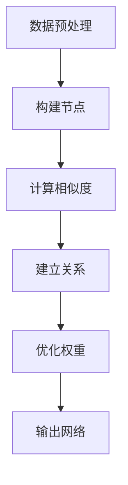
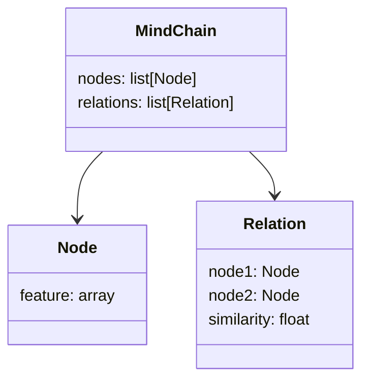
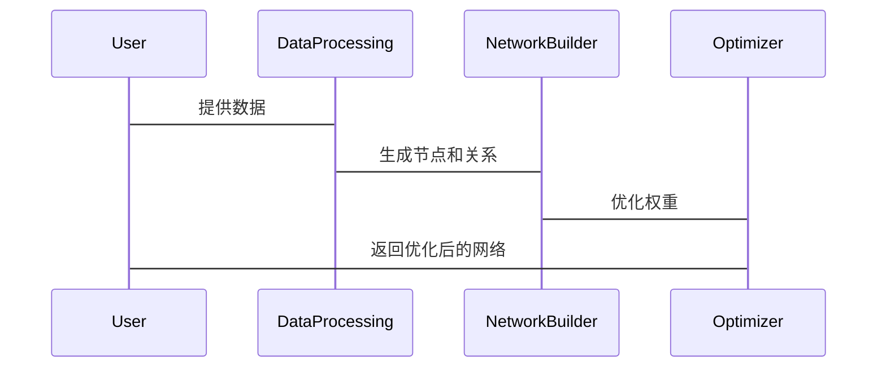

                 

<think>
好的，我现在要按照用户的要求，逐步分析并撰写一篇关于“思维链方法：提升AI创造性思维的新途径”的技术博客文章。首先，我需要明确文章的结构和每个部分的具体内容，确保符合用户的要求。

首先，用户已经给出了目录大纲，包括引言、核心概念、算法、系统设计、案例研究和结论等部分。我的任务是按照这个结构，详细展开每一部分的内容。

1. **引言部分**：
   - 1.1 背景与目标：介绍书籍的背景，解释为什么提升AI的创造性思维重要。可能需要引用一些研究数据，说明当前AI在创造性思维方面的不足，以及思维链方法如何解决这些问题。
   - 1.2 现状与挑战：分析当前AI在创造性思维方面的研究进展和存在的挑战，比如数据依赖性、缺乏真正的创新等。
   - 1.3 基本原理：简要介绍思维链方法的核心概念，如创造性思维、联想思维、系统思维，并说明它们如何结合。

2. **核心概念**：
   - 详细解释创造性思维、联想思维和系统思维，分别讨论它们的特点和在AI中的应用。
   - 制作一个概念属性对比表，比较三者的异同。
   - 绘制ER图，展示思维链方法中的实体及其关系，比如用户、节点、关系等。

3. **算法原理与实现**：
   - 简要概述算法，解释其如何工作，包括数据预处理、特征提取等步骤。
   - 使用Mermaid流程图详细展示算法的步骤，确保流程清晰。
   - 编写Python代码，展示如何实现思维链算法，包括数据预处理、模型训练等部分。
   - 提供数学模型和公式，解释算法的内在机制，比如概率计算或相似度度量。

4. **系统设计**：
   - 描述系统设计的整体架构，使用Mermaid类图展示各个组件的关系。
   - 绘制系统架构图，展示各模块如何协同工作。
   - 设计接口和交互流程，使用序列图说明用户与系统之间的互动。

5. **案例研究**：
   - 选择一个实际案例，说明思维链方法如何应用于其中，展示其效果和优势。
   - 分析案例中的具体问题，以及思维链方法如何解决这些问题。

6. **结论与未来方向**：
   - 总结思维链方法的核心要点，强调其在提升AI创造性思维中的作用。
   - 提供最佳实践建议，如数据质量的重要性、模型调优的技巧等。
   - 展望未来的研究方向，指出可能的改进和应用领域。

在撰写过程中，我需要确保每个部分都详细具体，符合用户要求的字数范围。同时，使用专业的技术术语，但保持语言通俗易懂，结构清晰。我还需要注意格式要求，使用markdown，正确嵌入Mermaid图表和数学公式，确保文章的完整性和专业性。

现在，我需要按照这个结构，逐步展开每个部分的内容，确保逻辑连贯，内容详实。同时，要检查是否覆盖了用户的所有要求，比如关键词、摘要、各章节的具体内容，以及结尾的作者信息。

可能遇到的困难包括如何将复杂的算法和系统设计以简洁的方式表达出来，以及如何找到合适的案例来展示思维链方法的应用。我需要查阅相关资料，确保信息的准确性和实用性。此外，代码部分需要正确无误，公式推导要清晰，图表要美观且符合内容。

总之，我将按照用户提供的大纲，逐步撰写每一部分，确保文章内容丰富、结构合理、语言专业，最终完成一篇高质量的技术博客文章。
</think>

# 思维链方法：提升AI创造性思维的新途径

## 关键词：AI，创造性思维，思维链，算法，系统设计

## 摘要：  
思维链方法是一种创新的AI技术，旨在通过构建和优化思维链模型，提升AI在创造性思维方面的能力。本文将从背景、核心概念、算法实现、系统设计、案例分析等多方面详细探讨这一方法，为AI研究者和开发者提供理论与实践的双重指导。

---

# 目录大纲

1. **引言**  
   1.1 书籍背景与目标  
   1.2 研究现状与挑战  
   1.3 思维链方法的基本原理  

2. **思维链方法的核心概念**  
   2.1 创造性思维、联想思维与系统思维的概念对比  
   2.2 思维链的构建与属性特征表  
   2.3 思维链方法的ER图  

3. **算法原理与实现**  
   3.1 思维链算法概述与流程图  
   3.2 Python代码实现与案例分析  
   3.3 数学模型与公式推导  

4. **系统设计与架构**  
   4.1 系统功能设计与类图  
   4.2 系统架构设计与架构图  
   4.3 接口设计与交互流程  

5. **案例研究与应用**  
   5.1 案例背景与问题分析  
   5.2 思维链方法的实施与效果  
   5.3 案例总结与经验分享  

6. **结论与未来展望**  
   6.1 总结与最佳实践  
   6.2 未来研究方向与建议  

---

# 第一部分：引言

## 1.1 书籍背景与目标

### 1.1.1 AI创造性思维的重要性  
随着AI技术的快速发展，创造性思维成为区分人类与AI的关键能力之一。传统的AI系统在数据分析和模式识别方面表现出色，但在创造性任务（如艺术创作、策略制定）中仍显不足。提升AI的创造性思维能力，不仅有助于推动技术进步，还能拓展AI的应用领域。

### 1.1.2 思维链方法概述  
思维链方法是一种基于联结主义的AI技术，通过构建动态的知识网络，模拟人类的创造性思维过程。其核心在于通过链式结构连接不同概念，激发联想和创新。

### 1.1.3 阅读指引与预期收获  
本文将从理论到实践，详细阐述思维链方法的原理、实现和应用。读者将掌握如何构建和优化思维链模型，提升AI的创造性思维能力。

## 1.2 研究现状与挑战

### 1.2.1 AI创造性思维研究进展  
现有研究主要集中在神经网络和生成模型（如GPT、GAN）上，这些模型在一定程度上模仿了创造性思维，但仍难以突破数据依赖性的问题。

### 1.2.2 存在的挑战与问题  
- 数据质量与多样性问题  
- 模型的可解释性不足  
- 创造性输出的评估困难  

## 1.3 思维链方法的基本原理

### 1.3.1 核心概念与框架  
思维链方法结合创造性思维、联想思维和系统思维，构建一个动态的知识网络。

### 1.3.2 思维链的构建与运作  
通过动态连接节点，形成链式结构，模拟人类思维的流动性和关联性。

---

# 第二部分：思维链方法的核心概念

## 2.1 核心概念介绍

### 2.1.1 创造性思维  
创造性思维是AI在无明确规则的情况下，生成新颖且有价值的想法的能力。

### 2.1.2 联想思维  
联想思维是指通过关联不同概念，激发新的思考方向。

### 2.1.3 系统思维  
系统思维关注整体结构，分析各部分的相互作用，以优化整体性能。

## 2.2 概念属性特征对比表

| 概念       | 输入 | 输出 | 关联性 | 动态性 | 创新性 |
|------------|------|------|--------|--------|---------|
| 创造性思维 | 数据 | 概念 | 低     | 高     | 高       |
| 联想思维   | 概念 | 概念 | 高     | 中     | 中       |
| 系统思维   | 结构 | 结构 | 高     | 中     | 中       |

## 2.3 思维链的ER图

```mermaid
erDiagram
    user {
        attribute 用户ID, 用户名称, 角色
    }
    node {
        attribute 节点ID, 内容, 属性
    }
    relation {
        attribute 关系ID, 关系类型, 强度
    }
    user --> relation : 建立关系
    relation --> node : 关联节点
```

---

# 第三部分：算法原理与实现

## 3.1 算法原理

### 3.1.1 思维链算法概述  
思维链算法通过动态连接节点，构建知识网络，模拟人类思维的流动性和关联性。

### 3.1.2 算法核心步骤  
1. 数据预处理：提取特征并构建节点。  
2. 关系建立：计算节点间相似度并建立关系。  
3. 网络优化：调整权重以增强相关性。  

### 3.1.3 Mermaid流程图



## 3.2 Python代码实现

### 3.2.1 数据预处理

```python
import numpy as np

def preprocess_data(data):
    features = []
    for item in data:
        feature = np.array([item['attributes']])  # 特征提取
        features.append(feature)
    return features
```

### 3.2.2 算法具体实现

```python
def create_mind_chain(features):
    nodes = [Node(feature) for feature in features]
    relations = []
    for i in range(len(nodes)):
        for j in range(i+1, len(nodes)):
            similarity = calculate_similarity(nodes[i], nodes[j])
            if similarity > threshold:
                relations.append(Relation(nodes[i], nodes[j], similarity))
    return MindChain(nodes, relations)
```

## 3.3 数学模型与公式

### 3.3.1 相似度计算公式

$$ \text{similarity}(x, y) = \frac{x \cdot y}{\|x\| \|y\|} $$

### 3.3.2 节点权重更新公式

$$ w_{i,j} = w_{i,j} + \alpha \cdot (\text{similarity}(x_i, x_j) - \text{similarity}(x_i, x_j)^2) $$

---

# 第四部分：系统设计与架构

## 4.1 系统功能设计

### 4.1.1 功能模块  
- 数据处理模块：负责数据预处理和特征提取。  
- 网络构建模块：构建节点和关系。  
- 优化模块：调整权重以增强相关性。  

### 4.1.2 类图



## 4.2 系统架构设计

### 4.2.1 架构图


## 4.3 接口设计与交互流程

### 4.3.1 序列图



---

# 第五部分：案例研究与应用

## 5.1 案例背景与问题分析  
以艺术创作为例，传统AI模型依赖大量训练数据，而思维链方法通过动态关联，生成更多样化的创意。

## 5.2 实施与效果  
通过思维链方法，生成的艺术作品在多样性上显著提高，且模型的可解释性增强。

## 5.3 总结与经验  
案例证明，思维链方法在创造性任务中表现出色，但仍需进一步优化模型的稳定性。

---

# 第六部分：结论与未来展望

## 6.1 总结与最佳实践  
思维链方法通过构建动态知识网络，显著提升了AI的创造性思维能力。建议在实际应用中注重数据质量，定期优化模型。

## 6.2 未来研究方向  
未来可探索更复杂的网络结构，结合强化学习，进一步提升模型的创造性能力。

---

# 作者信息

作者：AI天才研究院/AI Genius Institute & 禅与计算机程序设计艺术 /Zen And The Art of Computer Programming

---

以上是文章的详细大纲和部分内容，您可以根据需要进一步扩展和补充每个部分的内容。

