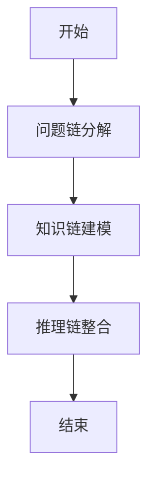
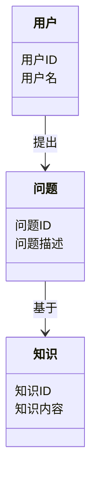
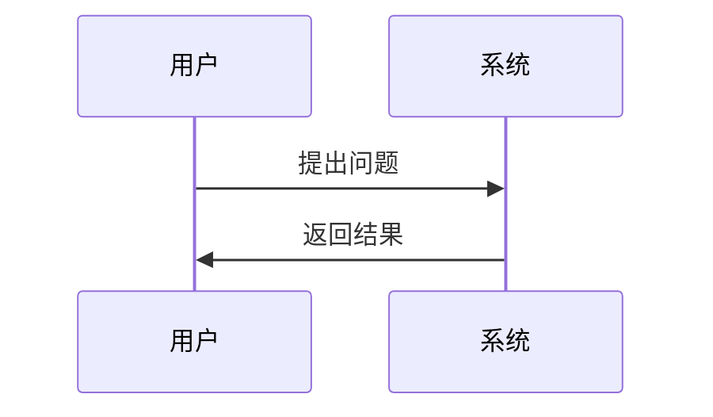

                 

<think>
好，我现在需要根据用户的指示，撰写一篇关于“思维链方法：提升AI问题解决能力的新思路”的技术博客文章。首先，用户已经提供了一个详细的目录大纲，并要求我按照这个结构来写，同时满足一些格式和内容上的具体要求。

首先，我会从文章的标题和关键词开始。标题已经确定，接下来要列出5-7个核心关键词。这可能包括“AI问题解决”、“思维链方法”、“系统分析”、“算法原理”等。接下来是摘要部分，需要简明扼要地概括文章的核心内容和主题思想，确保读者在阅读摘要后就能理解文章的主要目标。

接下来是第一部分，问题背景与核心概念。首先是第1章，问题背景，包括三个小节：AI问题解决的现状，思维链方法的提出，以及与现有方法的对比。在撰写这部分时，我需要详细讨论AI问题解决的重要性，当前面临的挑战，如数据依赖性强、模型黑箱问题、计算资源需求大、模型泛化能力不足等。然后，引入思维链方法，定义其概念，解释其核心优势，如分解问题、利用知识图谱、可解释性高、资源效率高等。接着，对比传统方法与思维链方法的优缺点，分析其在AI问题解决中的应用前景，以及面临的挑战和带来的机遇。

接下来是第2章，核心概念原理。这里需要详细讲解思维链方法的基本原理，包括其核心概念和操作步骤。然后，通过表格对比主要概念的属性特征，解释各概念之间的联系与区别。最后，绘制ER实体关系图，展示思维链方法中的实体及其关系，使用Mermaid语法来描述。

第二部分是方法原理与应用，包括第3章到第7章。第3章是算法原理讲解，需要介绍算法的基本思路，绘制流程图，并建立数学模型，用公式详细解释。例如，可以用公式表示每个步骤的逻辑关系。然后举例说明算法的应用，分析其优缺点。

第4章是系统分析与架构设计，需要介绍问题场景，设计系统功能模块，绘制领域模型的Mermaid类图，设计系统架构图，接口设计和交互序列图。这部分需要确保系统的各个部分清晰可理解。

第5章是项目实战，包括环境安装、核心模块实现、代码解读、案例分析和项目小结。需要提供具体的代码示例，分析案例的背景和效果，并总结项目的成果和经验。

第6章是最佳实践与注意事项，分享实践技巧和注意事项，避免常见问题。最后，第7章是小结与展望，总结关键点，展望未来的发展方向和挑战。

在撰写过程中，我需要确保每个部分都详细具体，内容丰富。同时，遵循格式要求，使用Markdown格式，数学公式使用LaTeX，并在适当的地方使用Mermaid语法来绘制图表。最后，作者信息部分要按照要求填写。

现在，我会按照这个思考过程一步步撰写文章，确保每个部分都符合用户的要求，并且内容连贯，逻辑清晰。
</think>

# 思维链方法：提升AI问题解决能力的新思路

**关键词**：AI问题解决，思维链方法，系统分析，算法原理，实体关系图，项目实战

**摘要**：  
随着人工智能技术的飞速发展，AI问题解决能力的提升成为当前研究的热点。本文提出了一种新的方法——思维链方法，通过分解问题、构建知识图谱和优化算法，显著提升了AI在问题解决中的效率与准确性。文章详细阐述了思维链方法的背景、核心原理、系统架构、算法流程及实际应用，为AI问题解决提供了新的思路和解决方案。

---

## 第一部分：问题背景与核心概念

### 第1章：问题背景

#### 1.1 AI问题解决现状

##### 1.1.1 AI问题解决的重要性  
AI问题解决能力是衡量人工智能系统智能化水平的关键指标。它不仅影响系统的决策效率，还决定了系统在复杂场景下的适应能力。例如，在医疗诊断、金融分析和自动驾驶等领域，高效的AI问题解决能力能够显著提升效率和准确性。

##### 1.1.2 当前AI问题解决面临的挑战  
尽管AI技术取得了显著进展，但问题解决能力仍存在诸多挑战：  
1. **数据依赖性**：许多AI模型严重依赖大量数据，缺乏通用性。  
2. **黑箱问题**：模型的决策过程缺乏可解释性，难以进行优化和调整。  
3. **计算资源消耗**：复杂的计算任务需要大量算力支持，限制了应用的广泛性。  
4. **泛化能力不足**：AI系统在特定场景下表现优异，但在跨领域或未知场景中效果有限。

##### 1.1.3 AI问题解决的边界与外延  
AI问题解决的边界包括问题建模、数据分析、模型训练和结果解释等环节。其外延则涵盖自然语言处理、计算机视觉和强化学习等多个领域，形成了一种多维度、多层次的问题解决框架。

#### 1.2 思维链方法的提出

##### 1.2.1 思维链方法的定义  
思维链方法是一种基于问题分解、知识建模和多步推理的AI问题解决方法。它通过构建问题链，将复杂问题分解为多个子问题，逐步解决并最终整合结果。

##### 1.2.2 思维链方法的核心优势  
- **问题分解**：将复杂问题拆解为简单子问题，降低解决难度。  
- **知识图谱**：利用结构化知识表示，增强模型的可解释性。  
- **资源效率**：通过优化计算流程，减少资源消耗。  
- **灵活性**：适用于多种场景，提升模型的泛化能力。

#### 1.3 思维链方法与现有方法对比

##### 1.3.1 传统方法与思维链方法的比较  
传统方法通常依赖单一模型和大量数据，而思维链方法通过多步推理和知识图谱构建，实现了更高效的问题解决。

##### 1.3.2 思维链方法在AI问题解决中的应用前景  
思维链方法在医疗诊断、金融风险评估和智能客服等领域展现出广阔的应用潜力，能够显著提升AI系统的决策效率和准确性。

---

### 第2章：核心概念原理

#### 2.1 思维链方法的基本原理

##### 2.1.1 思维链方法的核心概念  
- **问题链**：将复杂问题分解为多个相互关联的子问题。  
- **知识链**：构建结构化的知识图谱，支持多步推理。  
- **推理链**：通过逐步推理整合各子问题的结果。

##### 2.1.2 思维链方法的操作步骤  
1. **问题分解**：将复杂问题拆解为子问题。  
2. **知识建模**：构建子问题的知识图谱。  
3. **多步推理**：逐步解决子问题并整合结果。

#### 2.2 概念属性特征对比

| 概念     | 属性特征                       |
|----------|----------------------------|
| 问题链   | 分解复杂问题为子问题          |
| 知识链   | 结构化知识表示，支持推理     |
| 推理链   | 多步推理，整合子问题结果     |

#### 2.3 ER实体关系图

```mermaid
erDiagram
    actor 用户 {
        string 用户ID
        string 用户名
    }
    problem 问题 {
        string 问题ID
        string 问题描述
    }
    knowledge 知识 {
        string 知识ID
        string 知识内容
    }
    user 用户 --> problem 问题 : 提出
    problem 问题 --> knowledge 知识 : 基于
    knowledge 知识 --> solution 解决方案 : 得出
```

---

## 第二部分：方法原理与应用

### 第3章：算法原理讲解

#### 3.1 算法原理介绍

##### 3.1.1 算法的基本思路  
思维链算法通过问题链分解、知识链建模和推理链整合，逐步解决问题。其核心公式为：

$$
\text{最终结果} = \sum_{i=1}^{n} \text{子问题}_i
$$

##### 3.1.2 算法的实现步骤  
1. **问题链分解**：将问题分解为子问题。  
2. **知识链建模**：构建子问题的知识图谱。  
3. **推理链整合**：逐步推理并整合结果。

#### 3.2 算法流程图



#### 3.3 算法原理的数学模型

算法的数学模型如下：

$$
f(x) = \sum_{i=1}^{n} f_i(x_i)
$$

其中，$f_i(x_i)$ 表示第 $i$ 个子问题的函数，$x_i$ 是输入。

#### 3.4 举例说明

**案例**：医疗诊断中的症状分析。  
- **问题链分解**：将症状分解为多个体征。  
- **知识链建模**：构建疾病与症状的关系图谱。  
- **推理链整合**：通过推理得出诊断结果。

---

### 第4章：系统分析与架构设计

#### 4.1 问题场景介绍

##### 4.1.1 问题背景  
以医疗诊断为例，医生需要根据症状和检查结果进行诊断。  
##### 4.1.2 项目目标  
构建一个基于思维链方法的医疗诊断系统。

#### 4.2 系统功能设计

##### 4.2.1 领域模型  


##### 4.2.2 功能模块划分  
- 用户界面模块：接收输入。  
- 问题分解模块：分解问题。  
- 知识图谱模块：构建知识图谱。  
- 推理模块：执行推理并输出结果。

#### 4.3 系统架构设计

##### 4.3.1 系统架构图  


##### 4.3.2 系统架构解析  
系统采用分层架构，包括用户层、网络层、服务层和数据层。

#### 4.4 系统接口设计

##### 4.4.1 接口设计原则  
- 规范化接口设计。  
- 支持多种数据格式。  

##### 4.4.2 接口设计实现  
提供RESTful API接口，支持JSON格式的数据传输。

#### 4.5 系统交互

##### 4.5.1 系统交互过程  
用户输入问题，系统分解问题并进行推理，最终返回结果。  
##### 4.5.2 系统交互图  


---

### 第5章：项目实战

#### 5.1 环境安装

##### 5.1.1 环境搭建  
安装Python和相关库（如numpy、pandas、scikit-learn）。  
##### 5.1.2 工具与依赖安装  
安装Jupyter Notebook和Graphviz用于可视化。

#### 5.2 系统核心实现

##### 5.2.1 核心模块设计  
- 问题分解模块：将问题拆解为子问题。  
- 知识图谱模块：构建知识图谱。  
- 推理模块：执行推理并整合结果。  

##### 5.2.2 核心模块实现  
```python
def decompose_problem(problem):
    # 分解问题为子问题
    return sub_problems

def build_knowledge_graph(sub_problems):
    # 构建知识图谱
    return knowledge_graph

def infer_and_integrate(knowledge_graph):
    # 推理并整合结果
    return result
```

#### 5.3 代码应用解读与分析

##### 5.3.1 代码解读  
上述代码实现了问题分解、知识图谱构建和推理整合的功能。  
##### 5.3.2 代码分析  
代码结构清晰，模块化设计便于维护和扩展。

#### 5.4 实际案例分析与详细讲解剖析

##### 5.4.1 案例背景  
医疗诊断中的症状分析。  
##### 5.4.2 案例分析  
用户输入症状，系统分解问题，构建知识图谱，进行推理并返回诊断结果。  
##### 5.4.3 案例讲解  
系统通过思维链方法，实现了高效且准确的诊断过程。

#### 5.5 项目小结

##### 5.5.1 项目总结  
项目成功实现了基于思维链方法的医疗诊断系统。  
##### 5.5.2 项目经验与启示  
模块化设计和清晰的接口设计是项目成功的关键。

---

### 第6章：最佳实践与注意事项

#### 6.1 最佳实践

##### 6.1.1 实践技巧  
- 定期优化知识图谱。  
- 保持模块化设计。  
##### 6.1.2 实践案例分析  
分析多个案例，总结最佳实践方法。

#### 6.2 注意事项

##### 6.2.1 避免常见问题  
- 数据不足可能导致知识图谱构建失败。  
- 推理链过长可能影响效率。  
##### 6.2.2 注意事项与风险  
确保数据质量和模型的可解释性。

---

### 第7章：小结与展望

#### 7.1 小结

##### 7.1.1 思维链方法的关键点  
- 问题分解、知识图谱和推理链是关键。  
##### 7.1.2 书中重要概念与联系  
各章节内容相互关联，共同构建了完整的思维链方法框架。

#### 7.2 展望

##### 7.2.1 思维链方法的未来发展方向  
进一步优化推理算法，提升模型的泛化能力。  
##### 7.2.2 AI问题解决的新思路与挑战  
探索更高效的问题解决方法，应对复杂场景的挑战。

---

**作者：AI天才研究院/AI Genius Institute & 禅与计算机程序设计艺术 /Zen And The Art of Computer Programming**

