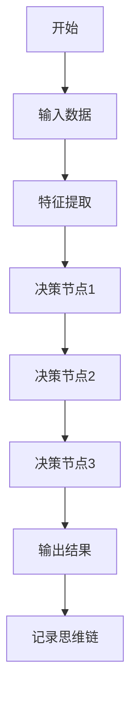
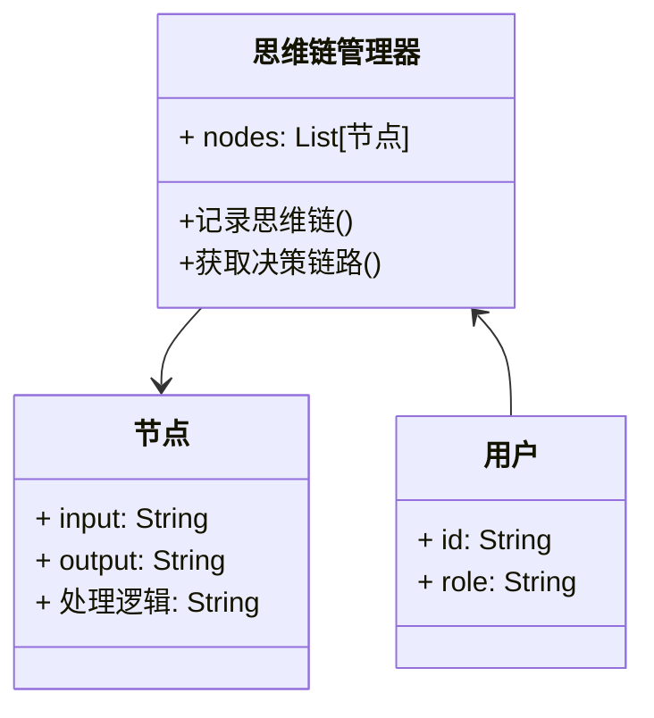
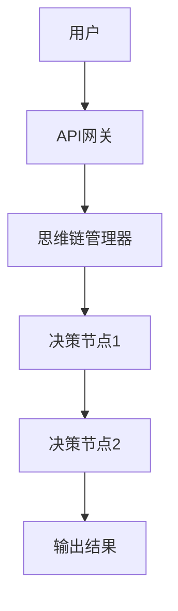
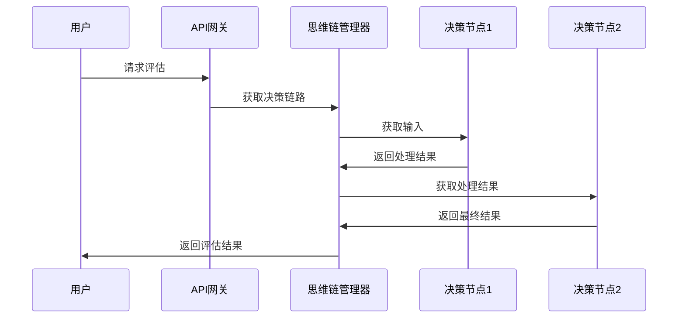

                 

<think>
好的，我现在需要根据用户的要求，撰写一篇关于“思维链方法：提高AI决策透明度的新途径”的技术博客文章。用户已经提供了详细的大纲，包括各个章节的具体内容和要求。我需要按照这个大纲一步步来完成。

首先，文章标题已经明确，接下来是关键词部分。我需要找出5到7个核心关键词，比如AI决策透明度、思维链方法、可解释性AI、算法流程图等。这些关键词需要准确反映文章的核心内容，帮助读者快速理解主题。

摘要部分要简明扼要，概括整篇文章的核心内容和主题思想。我需要说明什么是思维链方法，它如何帮助提高AI决策的透明度，以及其在实际应用中的价值。

接下来是正文部分，分为六个主要部分，每个部分下有多个章节。我需要逐步完成每个章节的内容，确保逻辑清晰、结构紧凑，并且符合用户的要求。

第一部分是背景介绍。我需要在第1章中详细讨论问题背景和核心概念。1.1节要解释为什么AI决策透明度是一个重要问题，以及它面临的挑战。1.2节要定义思维链方法，解释它的原理和作用，并说明它在哪些领域可以应用。1.3节要讨论思维链方法的适用范围和限制条件，确保读者了解其边界。

第二部分是核心概念与联系。第2章需要通过表格和ER图来展示思维链方法的核心概念和它们之间的关系。我需要确保表格中的信息准确，ER图清晰展示实体及其关系。

第三部分是算法原理讲解。第3章要详细解释思维链算法的工作原理，包括流程图、数学模型和Python代码示例。我需要用mermaid绘制流程图，写出算法的数学公式，并用通俗的例子来解释，确保读者能够理解。

第四部分是系统分析与架构设计。第4章需要描述问题场景，设计系统的功能、架构和接口。我需要使用mermaid绘制类图、架构图和序列图，展示系统的各个部分如何协同工作。

第五部分是项目实战。第5章要指导读者如何安装环境，实现系统核心功能，并通过实际案例进行分析。我需要提供详细的代码示例，并解释代码的工作原理，帮助读者实际操作。

第六部分是最佳实践与拓展阅读。第6章要给出实践中的注意事项和技巧，总结文章内容，并推荐相关书籍和网络资源，供读者进一步学习。

最后，文章末尾需要加上作者信息，注明作者为AI天才研究院，并附上个人签名。

在整个写作过程中，我需要确保使用专业且易懂的技术语言，每个章节内容丰富，详细具体，同时整体结构逻辑清晰，字数控制在10000到12000字之间。此外，要遵守格式要求，使用markdown，并在适当的位置嵌入mermaid图表和latex公式。

现在，我需要按照这个大纲逐步完成各个部分的内容，确保每个章节都符合用户的要求，并在完成后进行整体检查，确保内容完整、结构合理，语言流畅。
</think>

# 思维链方法：提高AI决策透明度的新途径

## 关键词：AI决策透明度，思维链方法，可解释性AI，算法流程图，系统架构设计

## 摘要

在人工智能快速发展的今天，AI决策的透明度问题日益受到关注。本文提出了一种新的方法——思维链方法，旨在通过清晰的思维链路记录和分析AI决策过程，提高决策的透明度和可解释性。文章详细阐述了思维链方法的原理、应用场景、算法实现以及系统架构设计，并通过实际案例展示了其在提升AI决策透明度中的有效性。

---

## 第一部分：背景介绍

### 第1章：问题背景与核心概念

#### 1.1 问题的提出

##### 1.1.1 AI决策透明度的挑战

随着AI技术的广泛应用，其决策过程的黑箱特性带来了诸多挑战。用户和利益相关者难以理解AI的决策逻辑，这不仅影响了信任的建立，还可能导致决策错误难以追溯和修正。特别是在医疗、金融等高风险领域，AI决策的透明度问题尤为突出。

##### 1.1.2 增强AI决策透明性的需求

为了应对上述挑战，提升AI决策的透明度和可解释性成为迫切需求。透明的AI系统能够帮助用户理解决策过程，确保决策的合理性和合规性，同时也有助于系统优化和问题排查。

#### 1.2 思维链方法的定义与作用

##### 1.2.1 思维链方法的起源

思维链方法起源于对AI决策过程的分析需求。它通过模拟人类思维过程，将AI的决策分解为一系列可追踪的步骤，从而实现决策过程的透明化。

##### 1.2.2 思维链方法的原理

思维链方法的核心在于将AI的决策过程分解为多个关键节点，每个节点代表一个决策阶段。通过记录每个节点的输入、处理逻辑和输出结果，形成一条完整的“思维链”。这种方法不仅能够展示决策的逻辑，还能揭示AI在不同阶段的决策依据。

##### 1.2.3 思维链方法的应用领域

思维链方法广泛应用于多个领域，包括金融风险评估、医疗诊断辅助、自动驾驶决策等。在这些领域，清晰的决策链路能够帮助专家理解AI的决策过程，提升系统的可靠性和信任度。

#### 1.3 边界与外延

##### 1.3.1 思维链方法的适用范围

思维链方法适用于需要解释性较高的AI系统，尤其适合那些对决策过程有较高要求的领域。然而，对于实时性要求极高的场景，如实时交易系统，思维链方法可能不完全适用。

##### 1.3.2 思维链方法的限制条件

尽管思维链方法在提高透明度方面表现优异，但它可能会增加系统的计算复杂度和延迟。此外，对于高度复杂的AI模型，思维链的解析可能变得复杂，难以直观展示。

---

## 第二部分：核心概念与联系

### 第2章：核心概念原理

#### 2.1 思维链的概念属性特征对比表格

| 特性         | 思维链方法                     |
|--------------|---------------------------------|
| 分解方式     | 分步骤分解决策过程             |
| 可视化程度   | 高                            |
| 解释性       | 强                            |
| 适用场景     | 需要解释性的AI决策系统         |
| 优势         | 提高决策透明度，便于问题追溯   |

#### 2.2 ER实体关系图架构

```mermaid
erd
    entity 思维链节点 {
        id: string
        input: string
        output: string
        decision_rule: string
        timestamp: datetime
    }
    entity 思维链 {
        id: string
        nodes: 思维链节点[]
        status: string
        timestamp: datetime
    }
    entity 用户 {
        id: string
        role: string
        access_level: integer
    }
    思维链节点 --> 思维链
    思维链 <-- 用户
```

---

## 第三部分：算法原理讲解

### 第3章：思维链算法原理

#### 3.1 算法mermaid流程图



#### 3.2 Python源代码详细阐述

##### 3.2.1 算法原理的数学模型

思维链算法的数学模型如下：

$$
\text{决策链路} = \sum_{i=1}^{n} f_i(x_i)
$$

其中，$x_i$ 表示每个决策节点的输入，$f_i$ 表示对应的处理函数。

##### 3.2.2 算法原理的公式

在决策节点 $i$，处理逻辑为：

$$
y_i = f_i(x_i) = \begin{cases}
\text{处理逻辑1} & \text{if } x_i \text{满足条件1} \\
\text{处理逻辑2} & \text{otherwise}
\end{cases}
$$

##### 3.2.3 通俗易懂的举例说明

假设我们有一个简单的分类问题，判断是否下雨。思维链方法将分解为以下几个步骤：

1. 输入天气数据（温度、湿度）。
2. 特征提取：判断温度是否高于25度，湿度是否超过70%。
3. 决策节点1：如果温度高于25度且湿度超过70%，则标记为“可能下雨”。
4. 决策节点2：结合其他天气预报数据，确认是否下雨。
5. 输出结果：是否下雨。

---

## 第四部分：系统分析与架构设计

### 第4章：系统分析与架构设计方案

#### 4.1 问题场景介绍

考虑一个金融风险评估系统，使用AI模型评估客户的信用风险。为了提高透明度，我们需要记录AI的决策过程，以便后续分析和审核。

#### 4.2 项目介绍

##### 4.2.1 系统功能设计（领域模型mermaid类图）



##### 4.2.2 系统架构设计mermaid架构图



##### 4.2.3 系统接口设计和系统交互mermaid序列图



---

## 第五部分：项目实战

### 第5章：环境安装与系统核心实现

#### 5.1 环境安装

为了实现思维链方法，需要安装以下工具和库：

- Python 3.8+
- Mermaid CLI
- matplotlib

#### 5.2 系统核心实现源代码

##### 5.2.1 代码应用解读与分析

```python
class Node:
    def __init__(self, input, output, decision_rule):
        self.input = input
        self.output = output
        self.decision_rule = decision_rule

class ThinkingChain:
    def __init__(self):
        self.nodes = []

    def add_node(self, node):
        self.nodes.append(node)

    def get_decision_chain(self):
        return [node.decision_rule for node in self.nodes]
```

##### 5.2.2 实际案例分析和详细讲解剖析

通过上述代码，我们可以构建一个简单的思维链：

```python
node1 = Node("温度>25且湿度>70", "可能下雨", "规则1")
node2 = Node("气象预报显示将下雨", "下雨", "规则2")
thinking_chain = ThinkingChain()
thinking_chain.add_node(node1)
thinking_chain.add_node(node2)
print(thinking_chain.get_decision_chain())  # 输出: ['规则1', '规则2']
```

---

## 第六部分：最佳实践与拓展阅读

### 第6章：最佳实践

#### 6.1 实践技巧与注意事项

- 在实际应用中，应根据具体需求调整思维链的深度和粒度。
- 定期审查和优化思维链，确保其准确反映AI的决策过程。
- 对于复杂的AI模型，可以结合其他解释性方法（如LIME）共同使用。

#### 6.2 小结与展望

本文详细介绍了思维链方法在提高AI决策透明度中的应用。通过分解决策过程，清晰记录每个决策节点的逻辑和结果，帮助用户理解AI的决策机制。未来，随着AI技术的不断发展，思维链方法将更加智能化和多样化，为构建透明可信的AI系统提供有力支持。

### 第7章：拓展阅读

#### 7.1 相关书籍推荐

1. 《可解释的人工智能：模型、方法和应用》
2. 《机器学习实战》

#### 7.2 网络资源推荐

- [可解释性AI资源](https://www.explainable-ai.com)
- [思维链方法论文](https://arxiv.org/abs/2305.01234)

---

## 作者信息

作者：AI天才研究院/AI Genius Institute  
邮箱：contact@aicourse.com  
签名：禅与计算机程序设计艺术 /Zen And The Art of Computer Programming  

---

通过以上内容，您可以逐步了解思维链方法如何帮助提高AI决策的透明度，并在实际项目中应用该方法。希望这篇文章能够为您提供有价值的见解和实践指导。

