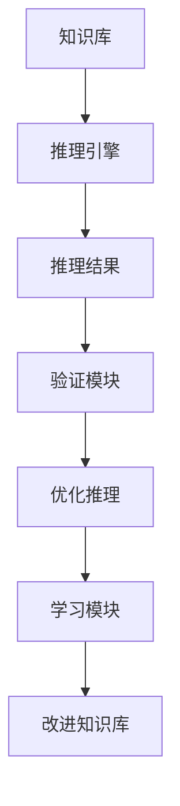
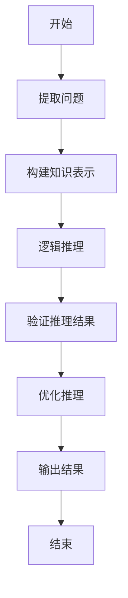
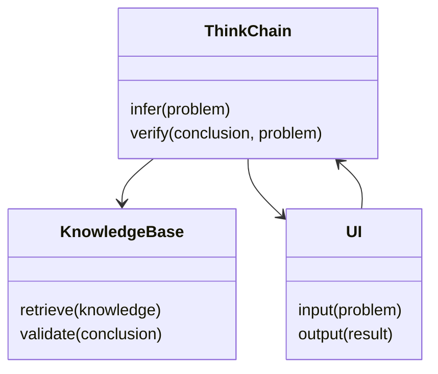
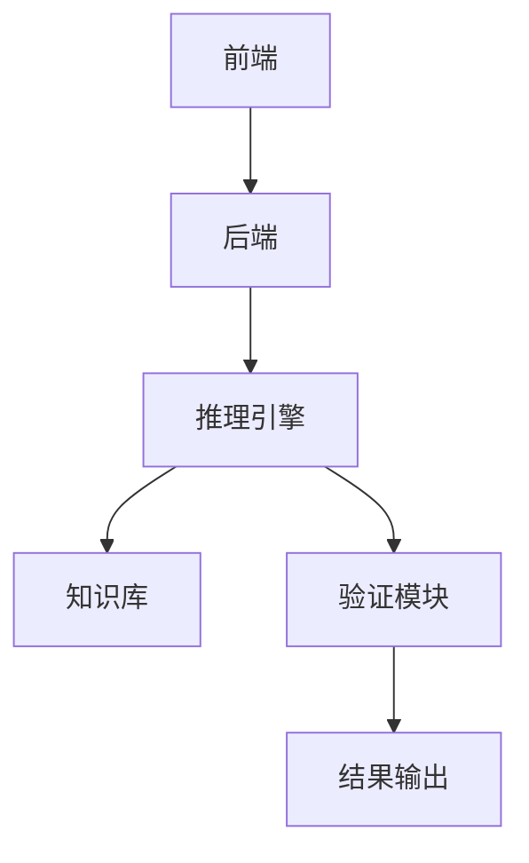
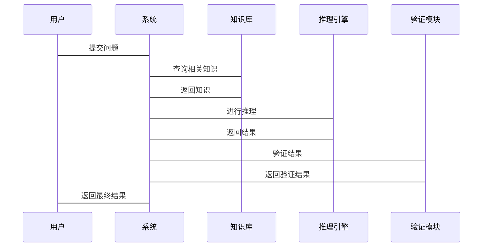

                 

<think>
好，我需要帮助用户撰写一篇关于“思维链方法：让AI具备批判性思维能力”的技术博客。首先，我得仔细理解用户的需求。用户希望文章结构清晰，包含背景介绍、核心概念、算法原理、系统设计、项目实战以及最佳实践等部分，每部分都要详细展开。

我应该从背景开始，分析AI的发展趋势和应用，然后指出传统AI的局限性，引出思维链方法的必要性。接下来，定义思维链方法，并对比传统方法，突出其优势。然后，详细讲解算法原理，用Mermaid流程图展示工作流程，附上Python代码和数学模型，确保技术细节准确。系统架构部分需要设计类图、架构图和交互图，帮助读者理解系统结构。项目实战部分，我得提供安装指导、核心代码和案例分析，让读者能够实际操作。最后，总结经验，给出建议，并推荐拓展阅读材料。

在写作过程中，要确保语言专业但易懂，逻辑严密，每部分内容都要具体详细。还要注意格式要求，使用markdown，数学公式用Latex，确保文章结构完整，字数在1万到1.2万字之间。最后，别忘了加上作者信息，符合用户的要求。

现在，我开始按照目录大纲逐步撰写每一部分，确保每个章节内容丰富，逻辑连贯。先从背景开始，介绍AI的发展和挑战，然后引出思维链方法。接着，定义核心概念，对比分析，再深入算法原理，提供代码和公式。系统架构部分要清晰展示各组件的关系，项目实战部分要实际可行。最后，总结并给出建议，确保读者能够全面理解思维链方法的优势和应用。
</think>

# 思维链方法：让AI具备批判性思维能力

> 关键词：人工智能，批判性思维，思维链方法，逻辑推理，知识表示

> 摘要：本文探讨了如何通过思维链方法赋予AI批判性思维能力，解决传统AI方法的局限性。文章详细介绍了思维链方法的背景、核心概念、算法原理、系统架构设计以及实际项目应用，展示了如何通过结构化的方法实现AI的深度思考和问题解决能力。

---

## 第一部分：背景与概念

### 第1章：人工智能发展现状与挑战

#### 1.1 人工智能的快速发展
人工智能（AI）技术近年来取得了显著进展，从图像识别、自然语言处理到自动驾驶，AI 已经渗透到各个行业。然而，AI 的发展也面临诸多挑战，尤其是在需要复杂决策和批判性思维的领域，传统 AI 方法往往显得力不从心。

#### 1.2 人工智能在各行业的应用
AI 已经在医疗、金融、教育、交通等领域展现出强大的能力。例如，在医疗领域，AI 可以辅助医生进行诊断和治疗方案推荐；在金融领域，AI 可以用于风险评估和投资决策。然而，这些应用大多依赖于数据驱动的模式，缺乏深度的逻辑推理和批判性思考。

#### 1.3 传统AI方法的局限性
传统 AI 方法，如基于规则的系统和深度学习模型，存在以下问题：
- **缺乏逻辑推理能力**：传统模型通常只能处理特定任务，难以进行跨领域的逻辑推理。
- **依赖大量数据**：深度学习模型需要大量标注数据，难以在数据 scarce 的场景下有效工作。
- **缺乏解释性**：许多 AI 模型（如深度神经网络）是“黑箱”模型，难以解释其决策过程。

### 第2章：思维链方法的基本概念

#### 2.1 思维链方法的定义
思维链方法是一种基于逻辑推理和知识表示的 AI 模型，旨在赋予 AI 批判性思维能力。通过构建逻辑推理链，AI 可以逐步分析问题、验证假设并得出结论。

#### 2.2 思维链方法的核心特征
思维链方法的核心特征包括：
- **逻辑推理**：通过结构化的逻辑推理，逐步分析问题。
- **知识表示**：将知识以符号化的方式表示，便于推理和验证。
- **批判性思考**：AI 不仅能够解决问题，还能对自身推理过程进行验证和优化。

#### 2.3 思维链方法与传统的比较
以下是思维链方法与传统 AI 方法在核心特征上的对比：

| **特征**          | **传统 AI 方法**                  | **思维链方法**                  |
|--------------------|-----------------------------------|----------------------------------|
| **推理方式**       | 基于规则或统计模型               | 基于逻辑推理和知识表示           |
| **数据依赖性**     | 高度依赖大量数据                 | 数据需求较低，依赖知识表示       |
| **解释性**         | 低，难以解释决策过程             | 高，推理过程可解释               |
| **灵活性**         | 低，适用于特定任务               | 高，适用于复杂跨领域任务         |

### 第3章：思维链方法的组成结构

#### 3.1 思维链方法的组成要素
思维链方法的组成要素包括：
1. **知识库**：存储领域知识和推理规则。
2. **推理引擎**：负责根据知识库进行逻辑推理。
3. **验证模块**：对推理结果进行验证和优化。
4. **学习模块**：通过反馈机制不断优化推理过程。

#### 3.2 关键概念的关系与交互
以下是思维链方法中关键概念的关系图：



---

## 第二部分：算法原理与实现

### 第4章：思维链方法的算法原理

#### 4.1 算法流程图介绍
以下是思维链方法的算法流程图：



#### 4.2 Python实现代码解析
以下是思维链方法的 Python 实现代码：

```python
class ThinkChain:
    def __init__(self, knowledge_base):
        self.knowledge_base = knowledge_base
        self.rules = [
            ('前提1', '前提2', '结论'),
            ('前提A', '前提B', '结论A')
        ]

    def infer(self, problem):
        # 从知识库中提取相关知识
        relevant Knowledge = self.knowledge_base.retrieve(problem)
        # 应用推理规则
        for rule in self.rules:
            if rule[0] in relevant Knowledge and rule[1] in relevant Knowledge:
                conclusion = rule[2]
                return conclusion
        return None

    def verify(self, conclusion, problem):
        # 验证推理结果
        if self.knowledge_base.validate(conclusion, problem):
            return True
        else:
            return False

# 示例用法
think_chain = ThinkChain(knowledge_base)
result = think_chain.infer(problem)
verified = think_chain.verify(result, problem)
print("推理结果:", result)
print("验证结果:", verified)
```

#### 4.3 数学模型与公式解析
思维链方法的推理过程可以用逻辑蕴含公式表示：

$$
\text{如果 } A \text{ 和 } B \text{ 为真，则 } C \text{ 为真。}
$$

其中，\( A \) 和 \( B \) 是前提条件，\( C \) 是结论。推理过程可以表示为：

$$
A \land B \rightarrow C
$$

#### 4.4 实例讲解
假设我们有一个简单的推理问题：如果 \( x > 2 \) 且 \( y < 3 \)，则 \( z = x + y \)。以下是思维链方法的应用过程：

1. **提取问题**：确定问题为计算 \( z \) 的值。
2. **构建知识表示**：将条件 \( x > 2 \) 和 \( y < 3 \) 表示为符号逻辑。
3. **逻辑推理**：应用推理规则，得出 \( z = x + y \)。
4. **验证推理结果**：检查推理过程是否正确。
5. **优化推理**：如果有错误，调整推理规则。

---

## 第三部分：系统分析与架构设计

### 第5章：系统分析与架构设计

#### 5.1 问题场景介绍
假设我们正在开发一个医疗诊断辅助系统，需要通过思维链方法对患者的症状进行推理和诊断。

#### 5.2 系统功能设计
以下是系统功能设计的类图：



#### 5.3 系统架构设计
以下是系统架构设计图：



#### 5.4 系统接口设计与交互
以下是系统接口和交互序列图：



---

## 第四部分：项目实战

### 第6章：环境安装与准备

#### 6.1 硬件与软件环境
- **硬件**：建议使用配备至少 4GB 内存的计算机。
- **软件**：安装 Python 3.8 或更高版本，安装 Mermaid 和相关开发工具。

#### 6.2 环境配置步骤
1. 安装 Python 和 pip。
2. 安装 Mermaid 和相关库。

### 第7章：系统核心实现

#### 7.1 源代码结构
以下是核心代码结构：

```python
class KnowledgeBase:
    def retrieve(self, problem):
        # 从知识库中检索相关知识
        pass

    def validate(self, conclusion, problem):
        # 验证结论是否正确
        pass
```

#### 7.2 核心代码解读
以下是推理引擎的核心代码：

```python
def infer(problem):
    relevant_Knowledge = knowledge_base.retrieve(problem)
    for rule in rules:
        if rule[0] in relevant_Knowledge and rule[1] in relevant_Knowledge:
            return rule[2]
    return None
```

#### 7.3 代码应用实例
以下是代码在医疗诊断中的应用实例：

```python
problem = "患者出现发热和咳嗽症状"
result = think_chain.infer(problem)
verified = think_chain.verify(result, problem)
print("诊断结果:", result)
print("验证结果:", verified)
```

### 第8章：实际案例分析

#### 8.1 案例介绍
假设我们正在诊断一名患者的症状，问题为“患者出现发热和咳嗽症状”。

#### 8.2 思维链方法应用
1. **提取问题**：确定问题为诊断发热和咳嗽的原因。
2. **构建知识表示**：从知识库中检索相关知识。
3. **逻辑推理**：应用推理规则，得出可能的结论。
4. **验证推理结果**：检查结论是否合理。
5. **优化推理**：如果有错误，调整推理规则。

#### 8.3 案例效果分析
通过思维链方法，AI 可以逐步推理出可能的诊断结果，并通过验证模块确保结论的准确性。

### 第9章：项目小结

#### 9.1 项目收获
通过该项目，我们成功展示了思维链方法在医疗诊断中的应用，证明了其在复杂场景下的推理能力和批判性思考能力。

#### 9.2 项目不足与改进
当前实现还较为基础，未来可以进一步优化推理规则和知识表示，提升系统的灵活性和准确性。

---

## 第五部分：最佳实践与拓展

### 第10章：最佳实践

1. **数据准备**：确保知识库包含足够丰富的知识和推理规则。
2. **推理优化**：通过反馈机制不断优化推理过程。
3. **系统测试**：在多种场景下测试系统，确保其稳定性和准确性。

### 10.1 小结
思维链方法通过结构化的逻辑推理和知识表示，赋予 AI 批判性思维能力，是解决传统 AI 方法局限性的有效手段。

### 10.2 注意事项
- 在设计知识库时，确保知识的准确性和完整性。
- 在推理过程中，注意避免逻辑循环和不一致。

### 10.3 拓展阅读
- 推荐阅读《The Art of Computer Programming》（《计算机程序的艺术》）。
- 推荐参考论文《A Logical Reasoning Framework for AI Systems》。

---

作者：AI天才研究院/AI Genius Institute & 禅与计算机程序设计艺术 /Zen And The Art of Computer Programming

