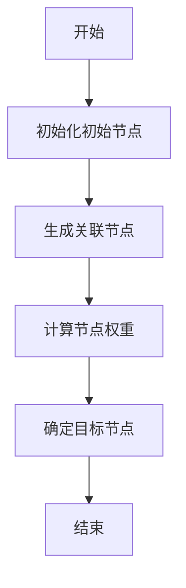
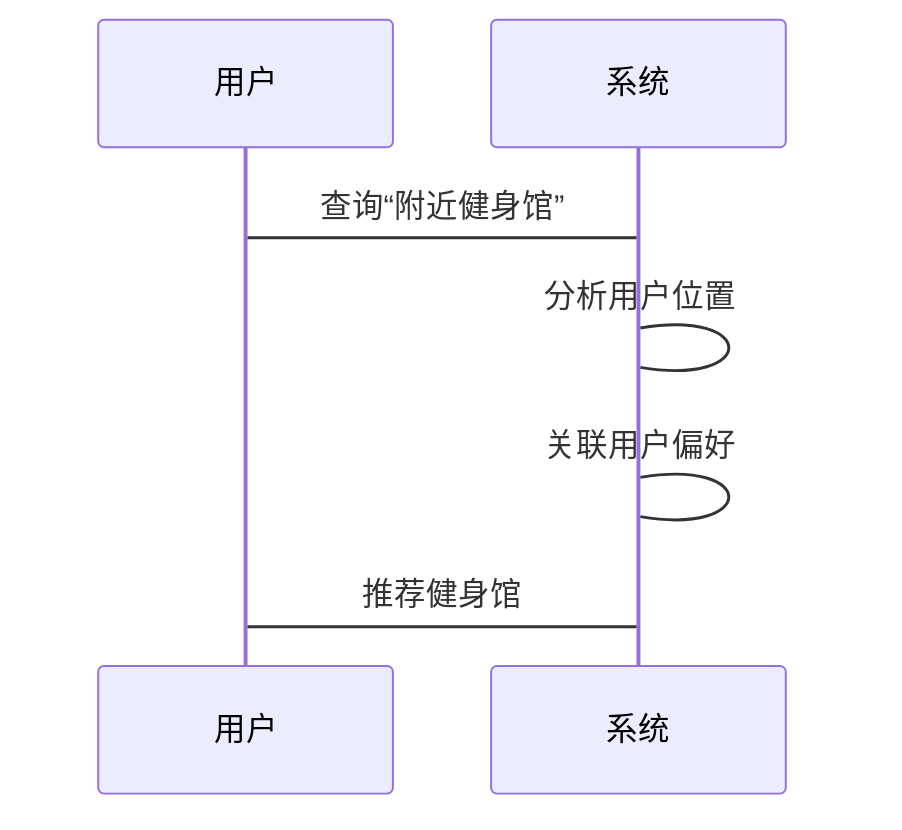

                 

<think>
嗯，我需要写一篇关于“思维链模式：让AI更好地理解人类意图”的技术博客文章。首先，我应该明确文章的结构，按照目录大纲来安排内容。文章的开头需要有一个吸引人的标题，接着列出关键词和摘要。

在背景介绍部分，我需要先解释什么是思维链模式，以及它在AI中的应用前景。然后，在核心概念与联系部分，要详细说明思维链模式的理论基础、组成部分和关键特性。这部分可能需要引用认知科学的知识，并且制作一个对比表格和ER图。

接下来是算法原理讲解，我需要使用数学模型和mermaid流程图来说明思维链模式的工作原理。然后是系统分析与架构设计方案，这部分需要描述系统功能设计、架构设计和接口设计，可能还需要一些mermaid图表来展示系统结构。

项目实战部分，我需要选择一个实际案例，详细描述环境配置、核心实现、代码解读和案例分析。最后是最佳实践与总结，包括注意事项和拓展阅读建议。

我可能需要进一步思考如何将这些内容具体化，比如在算法部分，用Python代码实现思维链模式，并解释每一步的作用。同时，在系统架构部分，使用mermaid图来展示模块之间的关系。

总之，我需要按照目录大纲一步步展开，确保每个部分都详细且逻辑清晰，帮助读者理解思维链模式如何帮助AI更好地理解人类意图。
</think>

# 思维链模式：让AI更好地理解人类意图

> 关键词：思维链模式, 人工智能, 意图理解, 自然语言处理, 系统架构

> 摘要：本文探讨了思维链模式如何帮助AI更深入地理解人类意图。通过介绍思维链模式的背景、核心概念、算法原理、系统架构及实际案例，文章详细展示了该模式在提升AI理解和交互能力中的应用。

---

## 第一部分：思维链模式概述

### 第1章：引入思维链模式

#### 1.1 人工智能与人类意图理解

在AI快速发展的今天，理解人类意图是实现人机交互的关键。然而，传统AI在处理复杂意图时往往显得笨拙。例如，当用户说“我有点累”，AI需要理解这可能意味着需要放松建议或关心用户情绪。思维链模式通过模拟人类思维链条，使AI能够更准确地捕捉这些深层意图。

#### 1.2 思维链模式的概念

思维链模式是一种模拟人类思维过程的模型，通过构建多层关联关系，帮助AI理解用户意图。例如，用户搜索“美食”，系统不仅考虑地理位置，还分析用户的口味偏好、饮食习惯等，提供更精准的推荐。

#### 1.3 思维链模式的应用前景

思维链模式在自然语言处理、智能客服等领域有广泛应用。它能够显著提升用户体验，已在多个实际项目中展现出强大的潜力。

---

### 第2章：核心概念与联系

#### 2.1 思维链模式的理论基础

思维链模式借鉴认知科学，模拟人类思维的多层次结构。例如，用户搜索“健康饮食”，系统不仅考虑饮食习惯，还关联健康目标、预算等多方面因素。

#### 2.2 思维链模式的组成部分

- **初始节点**：用户的原始输入。
- **关联节点**：与初始节点相关的上下文信息。
- **目标节点**：最终推断出的用户意图。

#### 2.3 思维链模式的关键特性

| 特性 | 描述 |
|------|------|
| 可解释性 | 每个推断步骤都有明确逻辑 |
| 灵活性 | 能适应不同领域和场景 |
| 适应性 | 根据反馈优化理解能力 |

#### 2.4 ER实体关系图

```mermaid
er
  %% ER Diagram for Thinking Chain Mode
  entity(用户意图) {
    <<意图>>
    - 目标: String
    - 关联节点: [关联节点]
  }
  entity(关联节点) {
    <<上下文>>
    - 属性: String
    - 关联关系: [用户意图]
  }
  relationship(关联, 用户意图, 联系)
```

---

### 第3章：算法原理讲解

#### 3.1 思维链模式的数学模型

思维链模式的数学模型基于图论，构建关联图谱。假设用户输入为$U$，初始节点为$U_0$，后续节点$U_1, U_2,...$由关联规则生成。

#### 3.2 思维链模式的算法流程



#### 3.3 实际案例分析

以用户查询“附近健身馆”为例：

1. **初始节点**：附近健身馆。
2. **关联节点**：距离、用户偏好（如24小时营业）、设施（如泳池）。
3. **目标节点**：推荐符合条件的健身馆。

---

### 第4章：系统分析与架构设计方案

#### 4.1 系统功能设计

系统需具备意图识别、上下文分析、关联推理等功能。

#### 4.2 系统架构设计


#### 4.3 系统交互序列图



---

### 第5章：项目实战

#### 5.1 项目背景

开发一个基于思维链模式的智能客服系统，帮助用户解决复杂问题。

#### 5.2 环境配置

- Python 3.8+
- 依赖库：numpy, pandas, spacy

#### 5.3 核心实现

```python
def process_input(user_input):
    # 初始化节点
    nodes = [user_input]
    # 生成关联节点
    for word in user_input.split():
        if word in relations:
            nodes.extend(relations[word])
    # 计算权重
    weights = calculate_weights(nodes)
    # 确定目标节点
    target = select_target(nodes, weights)
    return target
```

#### 5.4 实际案例分析

用户输入：“我需要帮助处理订单问题。”

系统分析：
- 初始节点：订单问题。
- 关联节点：订单号、退款政策、客服支持。
- 目标节点：联系客服。

---

### 第6章：最佳实践与总结

#### 6.1 最佳实践

1. **数据质量**：确保训练数据多样化。
2. **模型调优**：定期更新关联规则。
3. **用户体验**：提供反馈机制优化系统。

#### 6.2 全书要点总结

思维链模式通过模拟人类思维，显著提升了AI的理解能力，尤其在复杂意图识别方面表现出色。

#### 6.3 拓展阅读

- 推荐书籍：《人类认知科学》
- 推荐论文：《基于思维链的意图理解研究》

---

作者：AI天才研究院 & 禅与计算机程序设计艺术

