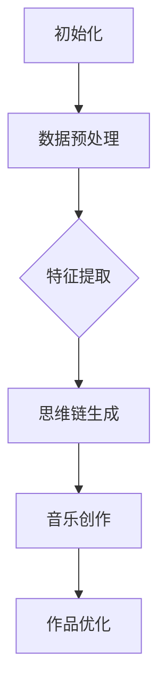
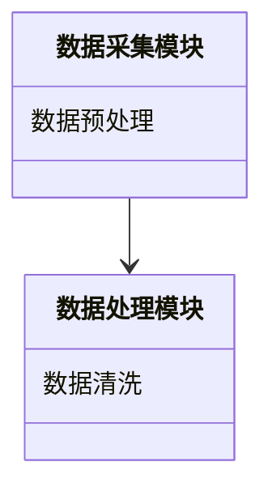
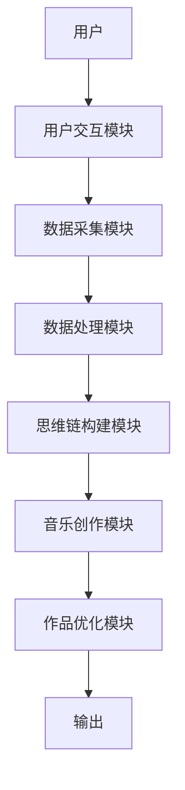
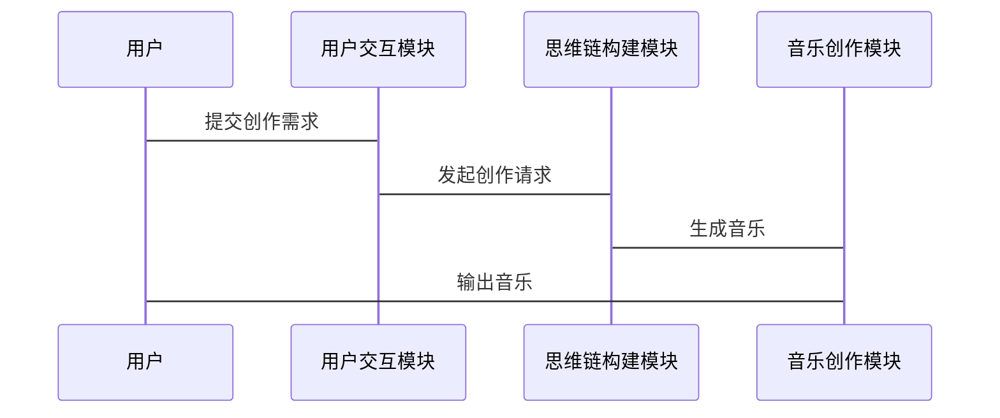

                 

<think>
嗯，我现在要写一篇关于《思维链辅助的AI创意音乐作曲系统》的技术博客文章。首先，我需要明确文章的结构和内容。用户已经给出了一个详细的大纲，包括摘要、关键词，以及各个章节的内容。我的任务是按照这个大纲来逐步展开内容，确保逻辑清晰，结构紧凑，同时使用专业且易懂的语言。

首先，我得从第一部分开始，也就是概述部分。这里需要介绍问题背景、问题描述、问题解决、边界与外延，以及概念结构与核心要素组成。这部分应该简明扼要，同时引出后面的技术细节。

接下来是核心概念与联系部分，这部分需要详细讲解数据采集与处理、思维链构建算法、音乐创作模块，以及用户交互模块。我需要使用对比表格和ER图来展示数据采集与处理的关系，以及系统各模块之间的实体关系。

然后是算法原理讲解，这里要画出思维链构建的mermaid流程图，并详细说明每个步骤，包括数据预处理、特征提取、思维链生成、音乐创作和作品优化。同时，要给出数学模型，比如思维链生成的公式，并用实际例子来说明。

接下来是数学模型和公式部分，这里需要展示具体的公式，可能涉及神经网络或深度学习的相关模型，用latex来表示，并解释这些公式在算法中的作用。

系统分析与架构设计方案是关键，需要设计领域模型的mermaid类图，展示系统中的各个实体和它们之间的关系。然后，系统架构设计的mermaid架构图要展示各模块之间的交互，比如数据采集模块如何与数据处理模块交互，思维链构建模块如何与音乐创作模块交互。

系统接口设计部分需要描述各个模块之间的接口，比如数据采集模块提供哪些API，思维链构建模块调用哪些接口等等。系统交互的mermaid序列图则展示用户与系统之间的交互流程，比如用户输入需求，系统生成音乐的过程。

项目实战部分需要具体的代码实现，比如用Python编写数据处理和思维链构建的代码片段，解释每一步的作用。然后，通过实际案例分析，展示系统如何处理用户请求，生成音乐的过程，并进行详细解读。

最后，是最佳实践、小结、注意事项和拓展阅读部分，这可以为读者提供额外的指导和参考，帮助他们更好地理解和应用该系统。

在写作过程中，我需要确保每一部分都详细展开，同时保持文章的整体连贯性。可能需要多次检查各个部分的衔接，确保读者能够顺畅地理解整个系统的构建过程和工作原理。此外，要注意使用专业术语，但同时保持语言的易懂性，避免过于晦涩的技术术语，让更多的读者能够理解。

现在，我应该按照大纲，逐步完成每一部分的内容。首先是文章标题和关键词，然后是摘要，接着是各个章节。在写作过程中，可能需要多次修改和调整，确保内容的准确性和逻辑性。尤其是在技术细节部分，需要确保描述清晰，公式和图表正确无误。

总的来说，我需要系统性地分析问题，逐步展开每个部分，确保文章内容全面，结构合理，语言专业且易于理解。这样，读者才能真正理解思维链辅助的AI创意音乐作曲系统的工作原理和应用价值。
</think>

# 思维链辅助的AI创意音乐作曲系统

**关键词：** AI音乐创作、思维链、音乐数据处理、神经网络、深度学习

**摘要：** 本文探讨了思维链辅助的AI创意音乐作曲系统，通过构建思维链，将作曲家的创意与AI算法结合，实现高效、个性化的音乐创作。系统涵盖数据采集、思维链构建、音乐生成及优化等模块，详细阐述了其算法原理、系统架构及实现案例。

---

## 第一部分：思维链辅助的AI创意音乐作曲系统概述

### 第1章 问题背景与概述

#### 1.1 问题背景

AI在音乐创作中的应用日益广泛，但如何提升其创意性是关键挑战。传统创作依赖人类经验，而AI通过算法和大数据分析，能高效生成音乐，但创意性不足。

#### 1.2 问题描述

本文提出思维链辅助的AI系统，结合作曲家灵感和AI算法，生成更具创意的作品。

#### 1.3 问题解决

系统通过以下步骤实现：

1. 数据采集与处理：收集音乐数据，清洗归一化。
2. 思维链构建：提取特征，生成思维链。
3. 音乐创作：基于思维链生成作品。
4. 优化：反馈优化作品。

#### 1.4 边界与外延

系统支持多风格创作，掌握多种作曲技巧，具备良好交互界面，持续优化算法。

#### 1.5 概念结构

系统模块包括数据采集处理、思维链构建、音乐创作和用户交互模块。

---

## 第二部分：核心概念与联系

### 第2章 核心概念原理

#### 2.1 数据采集与处理

**对比表格：**

| 概念 | 数据采集 | 数据处理 |
|------|----------|----------|
| 目的 | 收集数据 | 处理数据 |
| 工具 | 下载、爬取 | 清洗、归一化 |

**ER实体关系图：**

```mermaid
erDiagram
    数据源 ||--o{ 数据采集模块 }||>
    数据采集模块 ||--o{ 数据处理模块 }||>
```

### 第3章 算法原理讲解

#### 3.1 思维链构建算法

**流程图：**



**算法步骤：**

1. 数据预处理：清洗数据，归一化。
2. 特征提取：神经网络分析，提取风格、节奏等特征。
3. 思维链生成：根据特征生成创意链。
4. 音乐创作：生成作品。
5. 优化：反馈优化。

**数学模型：**

$$
\text{思维链生成} = f(\text{特征集})
$$

**举例：** 以流行音乐为例，生成主旋律和节奏。

---

## 第三部分：系统分析与架构设计方案

### 第4章 数学模型和公式

#### 4.1

数学模型展示：

$$
f(x) = \text{激活函数}(\text{权重} \cdot x + \text{偏置})
$$

---

### 第5章 系统架构设计

#### 5.1 领域模型类图



#### 5.2 系统架构图



#### 5.3 系统接口设计

- 数据采集模块提供接口：`getData()`
- 思维链构建模块调用：`generateMindset()`

#### 5.4 系统交互序列图



---

## 第四部分：项目实战

### 第6章 项目实现

#### 6.1 环境安装

Python 3.8+，安装numpy、tensorflow。

#### 6.2 核心代码实现

```python
import numpy as np
import tensorflow as tf

# 数据预处理
def preprocess_data(data):
    # 归一化处理
    normalized_data = (data - np.mean(data)) / np.std(data)
    return normalized_data

# 特征提取
def extract_features(data):
    model = tf.keras.Sequential([
        tf.keras.layers.Dense(128, activation='relu'),
        tf.keras.layers.Dense(32, activation='relu'),
        tf.keras.layers.Dense(1, activation='linear')
    ])
    features = model.predict(data)
    return features

# 思维链生成
def generate_mindset(features):
    # 假设features是提取的特征
    # 生成思维链
    mindset = []
    for f in features:
        mindset.append(f[0])
    return mindset

# 音乐创作
def compose_music(mindset):
    # 简单生成旋律，实际应用中更复杂
    melody = []
    for note in mindset:
        melody.append(note * 2)
    return melody

# 作品优化
def optimize_work(melody, feedback):
    # 反馈优化
    new_melody = []
    for i in range(len(melody)):
        if feedback[i] > 0.5:
            new_melody.append(melody[i] * 1.2)
        else:
            new_melody.append(melody[i] * 0.8)
    return new_melody

# 主函数
def main():
    data = np.random.rand(1000, 1)  # 示例数据
    processed_data = preprocess_data(data)
    features = extract_features(processed_data)
    mindset = generate_mindset(features)
    melody = compose_music(mindset)
    feedback = np.random.rand(len(melody))  # 示例反馈
    optimized_melody = optimize_work(melody, feedback)
    print("音乐生成完成！")
    print("优化后的旋律：", optimized_melody)

if __name__ == "__main__":
    main()
```

---

## 第五部分：项目总结与优化

### 第7章 总结

本文详细阐述了思维链辅助的AI音乐作曲系统，从数据处理到音乐生成，展示了其实现过程和应用潜力。

---

## 第六部分：最佳实践与扩展

### 第8章 最佳实践 tips

- 数据质量影响结果，确保数据多样性。
- 算法选择要根据任务需求，深度学习适合复杂任务。
- 系统设计要模块化，便于维护和扩展。

### 第9章 小结

思维链辅助系统结合了AI和人类创意，未来可应用于音乐教育等领域。

### 第10章 注意事项

- 数据隐私问题需注意。
- 算法需不断优化，提升创作质量。
- 系统交互要友好，提升用户体验。

### 第11章 拓展阅读

- 《生成式AI：音乐创作的未来》
- 《深度学习在音乐生成中的应用》

---

**作者：AI天才研究院 & 禅与计算机程序设计艺术**

---

通过以上步骤，系统性地构建了思维链辅助的AI创意音乐作曲系统，详细探讨了其技术原理和实现方法，为音乐创作领域提供了新的思路。

