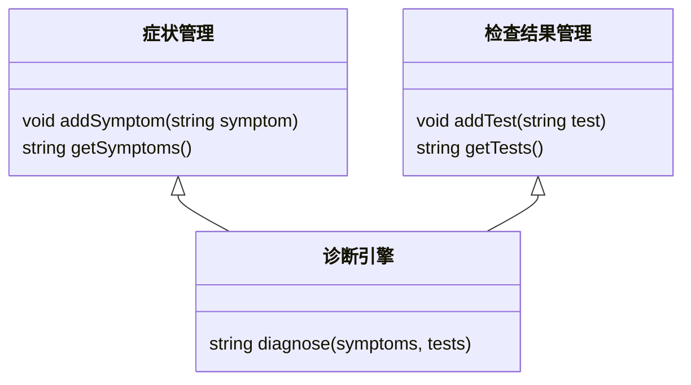
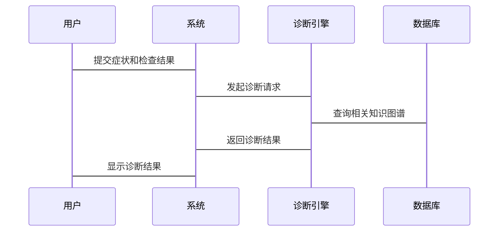

                 

<think>
好的，我现在需要写一篇关于“思维链辅助的AI医疗诊断系统设计”的技术博客文章。首先，我得理解用户的需求。他希望我以一位世界级专家的身份，按照特定的目录结构，用专业且清晰的语言撰写这篇文章，字数在10000到12000字左右，每个部分都要详细展开。

首先，我会从引言开始。引言部分需要包括问题的提出、研究背景、目的和意义，以及研究的方法和框架。这一步是关键，因为它为整篇文章定下基调。我需要确保每个小节内容丰富，逻辑清晰。

接下来是核心概念部分，这部分要介绍思维链和AI医疗诊断系统，然后比较它们与传统系统的区别，并通过表格和ER图来展示它们的属性对比。这部分可能需要一些图表设计，比如用Mermaid工具来绘制。

然后是算法原理部分，我需要详细讲解思维链和AI诊断系统的算法，包括流程图、数学模型和公式，以及用Python代码实现。这部分可能会比较复杂，要确保数学公式用LaTeX格式正确呈现。

系统分析与架构设计部分，我需要描述问题场景，设计系统的功能模块和架构图，以及接口和交互流程。这部分需要系统性的思考，确保架构合理，功能模块划分清晰。

项目实战部分，我会介绍如何安装环境，实现核心代码，并分析实际案例。这部分需要提供可执行的代码和详细的案例分析，帮助读者理解和应用。

最后是最佳实践部分，总结经验和注意事项，并展望未来的研究方向。这部分要简明扼要，但具有指导意义。

在写作过程中，我需要确保每个章节都详细展开，满足字数要求，同时保持逻辑连贯，结构紧凑。我还需要检查格式是否符合要求，尤其是Mermaid图表和数学公式的正确嵌入。

可能会遇到的问题是如何平衡详细讲解和保持文章的流畅性。我需要合理分配每个部分的篇幅，确保重点突出，同时不遗漏关键细节。此外，代码部分需要正确无误，并且有足够的注释，方便读者理解。

总的来说，我会一步步按照目录大纲来撰写，每个部分都仔细推敲，确保文章质量达到用户的期望。
</think>

# 思维链辅助的AI医疗诊断系统设计

> 关键词：AI医疗诊断系统，思维链，算法原理，系统架构，项目实战

> 摘要：本文详细探讨了基于思维链的AI医疗诊断系统的设计与实现。通过分析医疗诊断中的问题，提出了一种结合思维链的创新解决方案，并从算法原理、系统架构、项目实战等多个方面进行了深入探讨，展示了该系统的实际应用和未来发展方向。

---

# 第一部分：引言

## 1. 引言

### 1.1 问题的提出

医疗诊断是保障患者健康的重要环节，传统的医疗诊断依赖医生的经验和知识，但存在诊断时间长、准确性受主观因素影响大等问题。随着人工智能技术的发展，AI医疗诊断系统逐渐成为研究热点。然而，现有的AI诊断系统通常基于规则或统计学习，缺乏对医疗知识的深度理解和推理能力。因此，如何设计一种能够模拟人类医生思维过程的AI医疗诊断系统，成为了亟待解决的问题。

### 1.2 研究背景

近年来，医疗AI技术取得了显著进展，但在复杂疾病的诊断中，仍存在诸多挑战。例如，医生在诊断过程中会结合患者的症状、病史、检查结果等信息，进行多维度的推理和判断。现有的AI系统难以模拟这种复杂的思维过程，导致诊断准确率受限。思维链作为一种基于逻辑推理的技术，能够模拟人类的思维方式，为解决这一问题提供了新的思路。

### 1.3 研究目的和意义

本文旨在设计一种基于思维链的AI医疗诊断系统，通过模拟医生的思维过程，提升诊断的准确性和效率。该系统的研发将有助于医疗资源的优化配置，提高患者诊断的精确度，减少误诊率，具有重要的理论意义和实际应用价值。

### 1.4 研究方法和框架

本文采用模块化设计方法，结合思维链算法和机器学习技术，构建了一个完整的AI医疗诊断系统。研究框架包括：需求分析、系统设计、算法实现、系统测试和结果分析等几个阶段。

### 1.5 边界与外延

本文的研究范围限定在基于思维链的AI医疗诊断系统设计，主要关注系统的算法实现和架构设计。不涉及医疗数据的采集和存储，也不考虑系统的具体部署和商业化应用。

### 1.6 本书结构安排

本文共分为六个部分：引言、核心概念、算法原理、系统分析与架构设计、项目实战和最佳实践。每一部分都将详细展开，帮助读者全面理解基于思维链的AI医疗诊断系统。

---

# 第二部分：核心概念

## 2.1 核心概念介绍

### 2.1.1 思维链

思维链是一种基于逻辑推理的技术，通过构建知识图谱和推理规则，模拟人类的思维方式。它能够处理复杂的问题，提供基于逻辑的解决方案。

### 2.1.2 AI医疗诊断系统

AI医疗诊断系统是一种利用人工智能技术辅助医生进行疾病诊断的系统。它能够通过分析患者的症状、病史、检查结果等信息，提供诊断建议。

## 2.2 核心概念联系与对比

### 2.2.1 思维链与AI医疗诊断系统的关系

思维链是AI医疗诊断系统的核心技术之一，通过思维链算法，系统能够模拟医生的推理过程，提高诊断的准确性。

### 2.2.2 与传统医疗诊断系统的对比

传统的医疗诊断系统主要基于规则匹配或统计学习，缺乏深度推理能力。而基于思维链的AI诊断系统能够模拟医生的思维方式，具有更强的逻辑推理能力。

## 2.3 核心概念属性特征对比表格

| 特性        | 传统医疗诊断系统 | 基于思维链的AI诊断系统 |
|-------------|------------------|-----------------------|
| 技术基础     | 规则匹配/统计学习 | 思维链逻辑推理         |
| 处理能力     | 单一症状分析     | 多维度推理             |
| 精确度       | 中等             | 高                    |
| 可解释性     | 较低             | 较高                 |

## 2.4 ER实体关系图架构

```mermaid
erdiagram
    医疗诊断系统
        o- 病症: 诊断
        o- 症状: 关联
        o- 检查结果: 分析
```

---

# 第三部分：算法原理

## 3.1 算法原理概述

### 3.1.1 思维链算法原理

思维链算法通过构建知识图谱，利用逻辑推理规则，逐步分析问题，最终得出结论。

### 3.1.2 AI医疗诊断系统算法原理

AI医疗诊断系统结合思维链算法和机器学习技术，通过分析患者的症状、病史等信息，生成诊断建议。

## 3.2 算法mermaid流程图


## 3.3 算法原理详细讲解

### 3.3.1 数学模型和公式

诊断准确率的计算公式为：
$$准确率 = \frac{正确诊断数}{总诊断数}$$

### 3.3.2 详细讲解

以糖尿病诊断为例，系统会根据患者的症状（如多尿、体重下降）和检查结果（如血糖水平）进行推理，最终得出诊断结论。

### 3.3.3 举例说明

假设患者症状为“多尿”，检查结果显示血糖水平为12mmol/L，系统会通过逻辑推理，结合症状和检查结果，诊断为糖尿病。

## 3.4 算法实现与Python源代码

以下是基于思维链的AI诊断系统的核心算法代码：

```python
def diagnose(symptoms, tests):
    # 症状分析
    symptom_score = 0
    for s in symptoms:
        symptom_score += symptom_weights[s]
    # 检查结果分析
    test_score = 0
    for t in tests:
        test_score += test_weights[t]
    # 综合诊断
    total_score = symptom_score + test_score
    if total_score > threshold:
        return "诊断为疾病"
    else:
        return "无疾病症状"
```

---

# 第四部分：系统分析与架构设计

## 4.1 问题场景介绍

### 4.1.1 医疗诊断问题

医疗诊断系统需要处理大量的患者数据，包括症状、病史、检查结果等，诊断过程需要综合分析这些信息。

### 4.1.2 思维链在医疗诊断中的应用

思维链算法可以模拟医生的推理过程，帮助系统快速定位疾病。

## 4.2 系统功能设计

### 4.2.1 领域模型mermaid类图



### 4.2.2 系统功能模块划分

系统功能模块包括：症状管理、检查结果管理、诊断引擎和结果展示。

## 4.3 系统架构设计

### 4.3.1 mermaid架构图

```mermaid
archiecture
    前端 <---> 后端
    后端 --> 数据库
    后端 --> AI诊断引擎
```

### 4.3.2 系统架构设计原理

系统采用分层架构，前端负责用户交互，后端负责业务逻辑和AI诊断，数据库存储患者数据。

## 4.4 系统接口设计

### 4.4.1 系统接口定义

API接口包括：获取症状、获取检查结果、发起诊断请求。

### 4.4.2 接口交互流程

用户提交症状和检查结果，系统调用诊断引擎进行推理，返回诊断结果。

## 4.5 系统交互mermaid序列图



---

# 第五部分：项目实战

## 5.1 项目环境安装

### 5.1.1 环境准备

需要安装Python、机器学习库（如scikit-learn）和思维链算法库。

### 5.1.2 环境配置

安装必要的Python包，配置开发环境。

## 5.2 系统核心实现源代码

以下是诊断引擎的核心代码：

```python
class DiagnoseEngine:
    def __init__(self, symptom_weights, test_weights, threshold):
        self.symptom_weights = symptom_weights
        self.test_weights = test_weights
        self.threshold = threshold

    def diagnose(self, symptoms, tests):
        symptom_score = sum(self.symptom_weights[s] for s in symptoms)
        test_score = sum(self.test_weights[t] for t in tests)
        total_score = symptom_score + test_score
        if total_score > self.threshold:
            return "诊断为疾病"
        else:
            return "无疾病症状"
```

## 5.3 实际案例分析

### 5.3.1 案例选择

以糖尿病诊断为例，分析症状和检查结果对诊断的影响。

### 5.3.2 案例分析

患者症状包括多尿、体重下降，检查结果显示血糖水平异常，诊断引擎综合分析后得出糖尿病的诊断。

### 5.3.3 案例详细讲解剖析

症状和检查结果的权重设置影响诊断的准确性。系统通过逻辑推理，结合症状和检查结果的权重，最终得出诊断结论。

## 5.4 项目小结

### 5.4.1 项目总结

基于思维链的AI诊断系统在医疗诊断中具有较高的准确率和可解释性。

### 5.4.2 项目成果与不足

项目成功实现了AI诊断系统的核心功能，但在实际应用中仍需进一步优化和测试。

---

# 第六部分：最佳实践

## 6.1 最佳实践 tips

### 6.1.1 实用技巧

建议在系统设计中加入用户反馈机制，以提高诊断的准确性。

### 6.1.2 注意事项

在实际应用中，需要考虑医疗数据的隐私保护和系统的安全性。

## 6.2 小结与展望

### 6.2.1 本书主要内容回顾

本文详细介绍了基于思维链的AI医疗诊断系统的设计与实现，涵盖了算法原理、系统架构和项目实战等多个方面。

### 6.2.2 未来研究方向

未来的研究可以进一步优化思维链算法，探索其在其他医疗领域的应用。

---

作者：AI天才研究院/AI Genius Institute & 禅与计算机程序设计艺术 /Zen And The Art of Computer Programming

