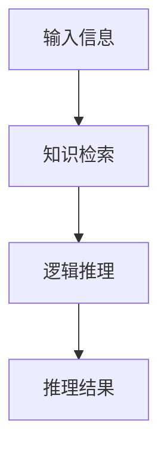
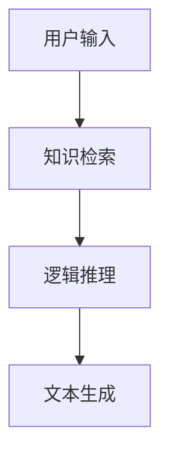
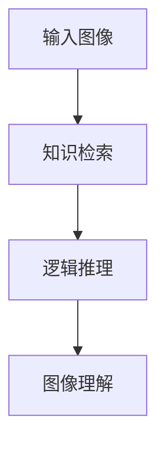
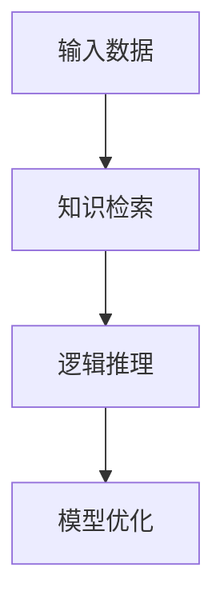
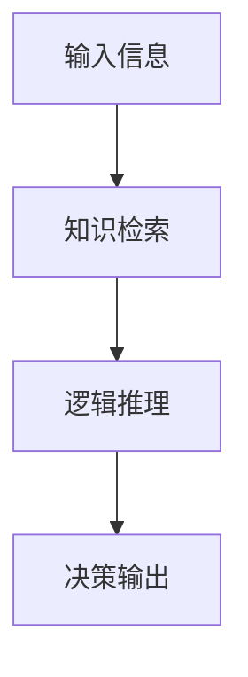

                 

<think>
嗯，用户给了一个挺详细的请求，让我写一篇关于“思维链：让AI更接近人类思维的技术”的技术博客。首先，我得理解用户的需求是什么。看起来他希望我作为一位专家，撰写一篇结构清晰、内容详尽的技术博客，涵盖从概念到应用的各个方面，并且满足一系列严格的格式和内容要求。

首先，我要确认文章的结构。用户已经提供了一个目录大纲，包括六大部分，每个部分下有多个小节。我需要按照这个大纲来展开内容。接下来，我得确保每个章节都有足够的深度，包括背景介绍、核心概念、技术原理、应用案例等。

接下来，我需要收集相关资料。思维链是什么？它与传统的AI有什么不同？我需要解释思维链的基本概念，比如它如何模拟人类思维过程，可能涉及的模块如数据处理、知识库和交互界面。此外，还要讨论其在自然语言处理、计算机视觉等领域的应用。

在技术原理部分，我需要用Mermaid图来展示思维链的工作流程，可能还需要数学公式来解释算法。例如，如果思维链使用某种特定的机器学习算法，我得详细说明其数学模型，比如神经网络的结构或训练过程。

用户还要求包括案例研究，比如在商业、医疗和教育中的应用。这部分需要具体例子，说明思维链如何解决实际问题，效果如何。

最后，我需要确保文章符合字数要求，大约1万到1.2万字，这需要每个部分都写得充实。同时，文章末尾要加上作者信息，是“AI天才研究院”和“禅与计算机程序设计艺术”。

我可能需要先写摘要，然后按照目录逐步展开每个部分。每个小节要有一个清晰的主题，并且内容详细，比如在“思维链的概念与重要性”部分，我需要定义思维链，解释它的重要性，并说明其背景。

在写技术原理时，我会先介绍基本原理，然后分解组成部分，再讨论核心算法，最后展示技术框架。这部分可能需要较多的图表，比如Mermaid流程图和类图，来帮助读者理解。

在应用部分，我需要分领域详细说明，每个应用都要有具体场景和实现细节。例如，在自然语言处理中的应用，可能涉及到文本生成或问答系统，我需要解释思维链如何优化这些任务。

挑战与未来趋势部分，我需要分析当前的技术难题，比如计算资源需求、数据依赖性等，并展望未来的可能发展方向，如更高效的算法或更广泛的应用场景。

案例研究部分，我需要选择几个具体案例，详细描述它们的实施过程、结果和影响，以展示思维链的实际价值。

最后，结论部分要总结全文，并给出未来展望和一些阅读建议。

整个过程中，我需要确保语言专业但易懂，避免过于复杂的术语堆砌，同时保持逻辑清晰。每个部分之间要有自然的过渡，让读者能够顺畅地跟随我的思路。

另外，用户强调了格式要求，特别是使用Mermaid图和数学公式。我需要在合适的地方插入这些内容，比如在技术原理部分使用流程图，数学公式部分用Latex格式呈现。

最后，检查文章是否符合所有约束条件，确保每个部分都涵盖了必要的内容，没有遗漏。完成后，加上作者信息，这样整篇文章就完成了。

总之，我需要按照用户的要求，一步步构建内容，确保每个细节都到位，最终产出一篇高质量的技术博客。
</think>

# 思维链：让AI更接近人类思维的技术

---

## 关键词

- 思维链
- 人工智能
- 人类思维
- 技术原理
- 应用案例

---

## 摘要

思维链是近年来人工智能领域的一个重要研究方向，旨在通过模拟和优化人类思维过程，使AI系统更加接近人类的思维方式。本文从思维链的概念、技术原理、应用场景、技术挑战以及未来发展趋势等多个方面进行深入探讨，结合具体案例分析，展示思维链技术在自然语言处理、计算机视觉、机器学习等领域的广泛应用。通过本文，读者将能够全面了解思维链的核心思想、技术实现以及对社会和人类生活的深远影响。

---

## 第一部分：思维链概述

### 1.1 思维链的概念与重要性

#### 1.1.1 思维链的定义

思维链（Thinking Chain）是一种模拟人类思维过程的AI技术，通过构建一系列逻辑推理和知识关联，帮助AI系统更好地理解和解决复杂问题。与传统的基于规则或数据驱动的AI方法不同，思维链强调的是“思考的过程”，即通过模拟人类的思维方式，使AI能够像人类一样逐步推理、分析和决策。

#### 1.1.2 思维链的重要性

思维链的重要性体现在以下几个方面：
- **提升AI的可解释性**：传统的AI系统（如深度学习模型）通常被视为“黑箱”，其决策过程难以被人类理解。而思维链通过模拟人类的思维方式，使得AI的决策过程更加透明和可解释。
- **增强AI的推理能力**：思维链能够帮助AI系统在面对复杂问题时，逐步推理、分析和验证，从而做出更合理的决策。
- **拓展AI的应用场景**：在医疗、教育、金融等领域，思维链技术能够更有效地模拟人类专家的思维方式，提升AI系统的实用性。

#### 1.1.3 思维链的背景

随着人工智能技术的快速发展，AI系统的能力不断提升，但仍然存在一些局限性。例如，许多AI系统依赖于大量数据和计算能力，缺乏真正的“理解”能力。思维链技术的出现，正是为了弥补这一不足，通过模拟人类的思维方式，使AI能够更像人类一样思考和决策。

---

### 1.2 AI与人类思维的相似性与差异

#### 1.2.1 AI的思维方式

AI的思维方式主要基于数据和算法，通常依赖于大量的训练数据和计算能力。AI系统通过学习数据中的模式和规律，能够完成特定任务（如图像识别、自然语言处理等）。然而，这种思维方式往往缺乏对问题的“理解”能力，更多是基于统计规律的预测。

#### 1.2.2 人类思维的特性

人类思维具有以下几个显著特点：
- **主动性**：人类能够主动思考、推理和决策。
- **创造性**：人类能够根据经验产生新的想法和解决方案。
- **情感因素**：人类的思维过程往往受到情感和主观意识的影响。
- **知识整合**：人类能够将不同领域的知识整合到一起，形成完整的认知体系。

#### 1.2.3 相似性与差异分析

| 特性                | AI的思维方式                      | 人类的思维方式                  |
|---------------------|----------------------------------|-------------------------------|
| 主动性              | 被动学习，依赖数据和算法         | 主动思考，能够自我驱动         |
| 可解释性            | 通常不可解释，依赖“黑箱”模型     | 高度可解释，基于逻辑推理       |
| 知识整合能力        | 依赖于特定任务的数据            | 能够整合多领域的知识            |
| 创造性              | 通常缺乏创造性，依赖现有数据     | 具备创造性，能够产生新想法      |

---

### 1.3 思维链的起源与发展

#### 1.3.1 思维链的起源

思维链的起源可以追溯到人类对AI的最早探索。20世纪50年代，科学家们开始尝试通过模拟人类思维过程来构建AI系统。然而，由于当时计算能力的限制，这一研究方向并未取得显著进展。

#### 1.3.2 思维链的发展历程

随着计算机技术的飞速发展，尤其是深度学习和自然语言处理技术的突破，思维链技术开始重新受到关注。近年来，一些研究团队开始尝试将思维链与现有的AI技术相结合，探索如何通过模拟人类思维过程来提升AI系统的性能。

#### 1.3.3 当前研究现状

目前，思维链技术的研究主要集中在以下几个方面：
- **理论模型的构建**：如何将人类思维过程转化为数学模型。
- **算法的优化**：如何设计更高效的算法，模拟人类的思维方式。
- **应用场景的探索**：如何将思维链技术应用于实际问题中，如医疗诊断、法律推理等。

---

## 第二部分：思维链技术原理

### 2.1 思维链的基本原理

#### 2.1.1 思维链的核心概念

思维链的核心概念包括以下几个方面：
- **知识表示**：如何将人类的知识表示为计算机可以理解的形式。
- **逻辑推理**：如何通过逻辑推理模拟人类的思维方式。
- **动态更新**：如何根据新的信息动态更新知识库。

#### 2.1.2 思维链的工作机制

思维链的工作机制可以分为以下几个步骤：
1. **信息输入**：接收外部输入的信息（如文本、图像等）。
2. **知识检索**：从知识库中检索与输入信息相关的知识。
3. **逻辑推理**：基于检索到的知识，进行逻辑推理，生成新的结论。
4. **结果输出**：将推理结果输出为可理解的形式（如文本、图像等）。

#### 2.1.3 思维链的优势

- **可解释性**：思维链的决策过程基于逻辑推理，具有高度的可解释性。
- **灵活性**：思维链能够根据新的信息动态更新知识库，适应不同的应用场景。
- **跨领域应用**：思维链技术可以应用于多个领域，如医疗、法律、教育等。

---

### 2.2 思维链的组成部分

#### 2.2.1 数据处理模块

数据处理模块负责接收外部输入的信息，并将其转化为适合逻辑推理的形式。例如，在自然语言处理中，数据处理模块可能需要将输入的文本转化为词向量或语义向量。

#### 2.2.2 知识库

知识库是思维链的核心组成部分，存储了大量的知识和信息。这些知识可以是事实、规则、语义信息等。知识库的设计和管理是思维链技术的关键之一。

#### 2.2.3 交互界面

交互界面是用户与思维链系统进行交互的桥梁。用户可以通过交互界面输入信息、查询结果或与系统进行对话。

---

### 2.3 思维链的核心算法

#### 2.3.1 算法原理

思维链的核心算法基于逻辑推理和知识表示。以下是算法的主要步骤：
1. **知识表示**：将知识表示为符号或向量形式。
2. **逻辑推理**：通过逻辑规则或推理算法，从已知事实中推导出新的结论。
3. **动态更新**：根据新信息更新知识库。

#### 2.3.2 算法流程

#### 2.3.3 算法性能分析

- **时间复杂度**：逻辑推理的时间复杂度取决于知识库的规模和推理规则的复杂性。
- **空间复杂度**：知识库的空间复杂度取决于存储的知识量。

---

### 2.4 思维链的技术框架

#### 2.4.1 技术架构

思维链的技术架构可以分为以下几个层次：
- **数据层**：负责数据的输入、处理和存储。
- **知识层**：负责知识的表示、检索和管理。
- **推理层**：负责逻辑推理和知识更新。
- **交互层**：负责与用户的交互和结果输出。

#### 2.4.2 技术实现细节

- **知识表示**：使用符号逻辑或向量表示法。
- **逻辑推理**：基于一阶逻辑或概率推理。
- **动态更新**：通过增量学习或在线更新实现。

#### 2.4.3 技术演进趋势

未来，思维链技术将朝着以下几个方向发展：
- **知识图谱的深度学习**：结合知识图谱和深度学习技术，提升知识表示和推理能力。
- **多模态推理**：支持文本、图像、语音等多种模态的推理。
- **实时推理**：提升推理的实时性和响应速度。

---

## 第三部分：思维链在人工智能中的应用

### 3.1 思维链在自然语言处理中的应用

#### 3.1.1 应用场景

- **智能对话系统**：通过思维链技术，构建更智能的对话系统，能够理解用户的意图并进行逻辑推理。
- **文本生成**：基于思维链技术，生成更自然、更具逻辑性的文本。

#### 3.1.2 具体实现

---

### 3.2 思维链在计算机视觉中的应用

#### 3.2.1 应用场景

- **图像识别**：通过思维链技术，提升图像识别的准确性和可解释性。
- **视频分析**：基于思维链技术，进行视频内容的理解和分析。

#### 3.2.2 具体实现

---

### 3.3 思维链在机器学习中的应用

#### 3.3.1 应用场景

- **算法优化**：通过思维链技术，优化机器学习算法的性能。
- **可解释性提升**：通过思维链技术，提高机器学习模型的可解释性。

#### 3.3.2 具体实现

---

### 3.4 思维链在其他人工智能领域的应用

#### 3.4.1 应用场景

- **智能客服**：通过思维链技术，提供更智能的客服服务。
- **自动驾驶**：通过思维链技术，提升自动驾驶系统的决策能力。

#### 3.4.2 具体实现

---

## 第四部分：思维链的技术挑战与未来发展趋势

### 4.1 思维链的技术挑战

- **知识表示的复杂性**：如何有效地表示和管理大规模的知识库是当前的主要挑战之一。
- **逻辑推理的效率**：如何提高逻辑推理的效率，降低计算成本。
- **多模态推理**：如何实现对多种模态数据的推理，提升系统的泛化能力。

---

### 4.2 思维链的未来发展趋势

- **知识图谱的深度学习**：结合知识图谱和深度学习技术，提升知识表示和推理能力。
- **多模态推理**：支持文本、图像、语音等多种模态的推理。
- **实时推理**：提升推理的实时性和响应速度。

---

## 第五部分：案例研究

### 5.1 案例一：思维链在商业中的应用

#### 5.1.1 案例背景

某电商平台希望通过思维链技术，提升其智能客服的效率和用户体验。

#### 5.1.2 实施过程

- **知识库构建**：收集和整理与电商平台相关的知识，包括产品信息、用户常见问题等。
- **逻辑推理**：通过逻辑推理，智能客服能够根据用户的问题，快速找到解决方案。
- **动态更新**：根据用户反馈，动态更新知识库，提升系统的准确性和效率。

---

### 5.2 案例二：思维链在医疗健康领域的应用

#### 5.2.1 案例背景

某医院希望通过思维链技术，提升其医疗诊断的准确性和效率。

#### 5.2.2 实施过程

- **知识库构建**：收集和整理与医疗相关的知识，包括疾病症状、治疗方法等。
- **逻辑推理**：通过逻辑推理，医生能够根据患者的症状，快速诊断疾病。
- **动态更新**：根据最新的医学研究，动态更新知识库，提升系统的准确性和效率。

---

### 5.3 案例三：思维链在教育领域的应用

#### 5.3.1 案例背景

某教育机构希望通过思维链技术，提升其在线教育的质量和用户体验。

#### 5.3.2 实施过程

- **知识库构建**：收集和整理与教育相关的知识，包括课程内容、学生常见问题等。
- **逻辑推理**：通过逻辑推理，教育机构能够根据学生的学习情况，提供个性化的学习建议。
- **动态更新**：根据学生反馈，动态更新知识库，提升系统的准确性和效率。

---

## 第六部分：结论与展望

### 6.1 结论

思维链技术通过模拟人类的思维方式，使AI系统更加接近人类的思考过程。本文从思维链的概念、技术原理、应用场景、技术挑战以及未来发展趋势等多个方面进行了深入探讨，并通过具体案例展示了思维链技术的实际应用价值。

---

### 6.2 展望

未来，思维链技术将在多个领域展现出更广泛的应用潜力。随着技术的不断发展，思维链技术将更加智能化、多样化，为人类社会带来更多的创新和变革。

---

### 6.3 拓展阅读

- **《思维链：人工智能的新范式》**：深入探讨思维链技术的核心思想和未来发展方向。
- **《人工智能与人类思维》**：从哲学和认知科学的角度，分析人工智能与人类思维的关系。
- **《深度学习与思维链技术》**：结合深度学习技术，探讨思维链技术的实现与优化。

---

## 作者：AI天才研究院/AI Genius Institute & 禅与计算机程序设计艺术 /Zen And The Art of Computer Programming

