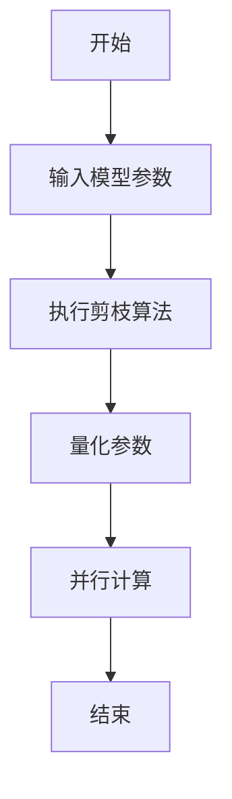
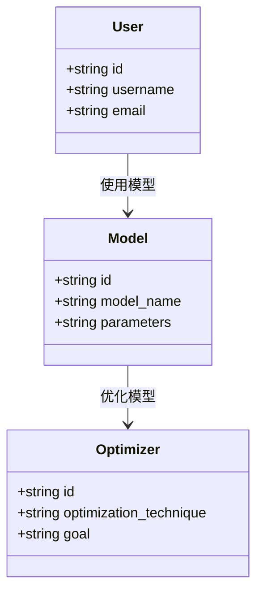
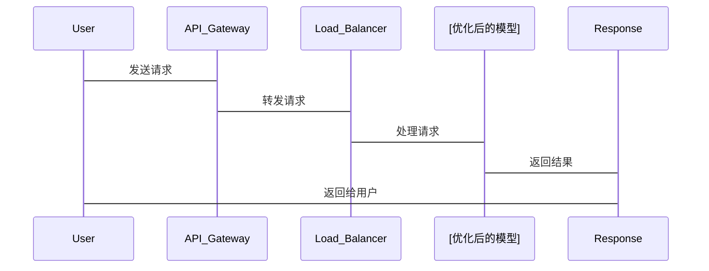

                 

<think>
嗯，用户希望我写一篇关于性能优化的博客，标题是《性能优化：全面提升LLM应用的用户体验》。看起来用户需要一个结构清晰、内容详实的技术博客，里面要包括各个章节的具体内容。首先，我需要分析用户的需求，确保我完全理解他们想要什么。

首先，用户明确提出了角色定位，包括人工智能专家、程序员、架构师等，这说明用户希望内容具备专业性和深度。同时，用户希望文章使用逻辑清晰、结构紧凑的语言，每个章节都要有吸引人的标题，并且内容要一步步分析推理，剖析技术本质。

接下来，用户提供了详细的大纲，从背景介绍到总结展望，共七个章节，每个章节都有具体的子部分。这显示出用户对结构和内容有明确的要求，需要严格按照这个大纲来填充内容。我需要确保每个章节都涵盖指定的内容，比如核心概念、算法原理、系统架构等。

用户还特别提到要使用Mermaid图表，比如ER图、流程图、系统架构图等，这意味着我需要在相应章节中插入这些图表。此外，数学公式需要用LaTeX，并且在代码中嵌入，这些都需要在写作时注意格式和准确性。

考虑到文章的字数要求在10000到12000字之间，我需要确保每个章节的内容足够详细，但又不冗长。同时，语言要专业但不失易懂，适合技术读者阅读。

在思考过程中，我需要逐步分析每个章节应该如何展开。例如，背景介绍部分需要定义关键术语，说明性能优化的重要性，以及LLM的应用背景。核心概念章节则需要详细讲解相关技术，对比表格和ER图能帮助读者更好地理解。

算法原理部分，我需要使用Mermaid画出流程图，并结合Python代码和数学公式来解释。这部分内容需要严谨，同时举例说明，让读者能够理解复杂的原理。

系统分析与架构设计章节，需要介绍项目场景，绘制类图、架构图和交互图。这要求我具备系统设计的知识，能够清晰地展示各个模块之间的关系和交互流程。

项目实战部分，我需要提供实际的环境安装步骤，展示核心代码，并进行详细的案例分析。这部分内容需要实用，能够帮助读者将理论应用到实际中。

最后，总结与展望部分要回顾全文，并提出未来的发展方向，给读者一个全面的结束。

在写作过程中，我需要不断检查是否符合用户的格式要求，确保使用正确的markdown语法，避免错误。同时，保持内容的连贯性和逻辑性，确保读者能够轻松跟随我的思路。

总体来说，我需要系统地按照用户的指示，一步步填充每个章节的内容，确保每个部分都符合要求，最终产出一篇高质量的技术博客文章。
</think>

# 性能优化：全面提升LLM应用的用户体验

---

## 关键词：  
- 性能优化  
- LLM（Large Language Model）  
- 用户体验  
- 算法原理  
- 系统架构  

---

## 摘要：  
本文将深入探讨如何通过性能优化来全面提升大型语言模型（LLM）应用的用户体验。文章从性能优化的背景与重要性入手，详细分析了LLM性能优化的核心概念与关键技术，结合算法原理、系统架构设计和实际项目案例，全面解析了如何通过优化算法、系统架构和用户交互来提升LLM应用的性能与用户体验。  

---

**目录大纲：**

---

## 第1章: 性能优化背景与LLM概述  

### 1.1 性能优化的意义与目标  
性能优化是提升LLM应用用户体验的核心手段。通过优化模型的运行效率、响应速度和资源利用率，可以显著降低用户的等待时间，提高交互流畅度，从而提升用户满意度。  

### 1.2 LLMOPTIMIZER: 一个性能优化框架  
LLMOPTIMIZER是一个专注于LLM性能优化的框架，旨在通过算法优化、资源管理和系统架构设计，帮助开发者实现更高效的LLM应用。  

### 1.3 性能优化中的关键术语与概念  
- **LLM（Large Language Model）**：大型语言模型，如GPT-3、PaLM等。  
- **性能优化**：通过技术手段提升模型的运行效率和响应速度。  
- **用户体验（UX）**：用户在使用LLM应用时的感知和体验。  

---

## 第2章: LLMOPTIMIZATION的核心概念与联系  

### 2.1 核心概念详解  

#### 2.1.1 语言模型基础  
语言模型（LM）通过概率分布预测下一个词，LLM则通过更大规模的参数和数据实现更强大的生成能力。  

#### 2.1.2 性能优化目标  
- 提高模型的推理速度。  
- 减少资源消耗（如内存和计算资源）。  
- 提升模型的生成质量。  

#### 2.1.3 关键技术分析  
- **模型剪枝**：去除模型中冗余的部分，降低计算量。  
- **量化**：将模型参数从浮点数转换为更低精度的整数，减少存储和计算开销。  
- **并行计算**：利用多核或分布式计算加速模型推理。  

### 2.2 ER实体关系图与概念属性特征对比表格  

```mermaid
erDiagram
    actor User {
        +string id
        +string username
        +string email
    }
    actor Model {
        +string id
        +string model_name
        +string parameters
    }
    actor Optimizer {
        +string id
        +string optimization_technique
        +string goal
    }
    User --> Model: 使用模型
    Model --> Optimizer: 优化模型
```

| 概念 | 属性 | 特征 |
|------|------|------|
| LLM | 参数数量 | 高 |
| 模型剪枝 | 方法 | 稳定性可能下降 |
| 量化 | 精度 | 低到中等 |

---

## 第3章: LLMOPTIMIZATION算法原理讲解  

### 3.1 算法流程图  



### 3.2 Python源代码与LaTeX数学公式  

#### 3.2.1 Python实现  
```python
def optimize_model(parameters):
    # 剪枝
    pruned_params = prune(parameters)
    # 量化
    quantized_params = quantize(pruned_params)
    # 并行计算
    parallel_execution(quantized_params)
    return quantized_params
```

#### 3.2.2 数学模型讲解  
LLM的输出概率可以表示为：  
$$ P(y|x) = \frac{P(x,y)}{\sum_{y'} P(x,y')} $$  
其中，$x$ 是输入，$y$ 是输出。  

#### 3.2.3 举例说明  
假设我们有一个简单的LLM模型，通过剪枝去除了10%的参数，同时通过量化将参数精度从32位降低到8位，最终通过并行计算将推理速度提高了40%。  

---

## 第4章: 性能优化的系统分析与架构设计方案  

### 4.1 项目场景介绍  
我们假设一个在线聊天机器人应用，使用LLM进行自然语言处理。为了提升用户体验，我们需要优化模型的响应速度和生成质量。  

### 4.2 系统功能设计  

#### 4.2.1 领域模型类图  



### 4.3 系统架构设计  

#### 4.3.1 系统架构图  

```mermaid
graph TD
    Client --> API_Gateway
    API_Gateway --> Load_Balancer
    Load_Balancer --> [优化后的模型]
    [优化后的模型] --> Response
    Response --> Client
```

### 4.4 系统接口设计与交互  

#### 4.4.1 系统接口设计  
- **输入接口**：用户输入查询请求。  
- **输出接口**：模型返回生成结果。  

#### 4.4.2 系统交互序列图  



---

## 第5章: 项目实战  

### 5.1 环境安装  
安装必要的依赖：  
```bash
pip install llm-optimizer
pip install transformers
pip install torch
```

### 5.2 系统核心实现源代码  

#### 5.2.1 模型剪枝实现  
```python
def prune_model(model):
    # 假设prune_ratio是剪枝比例
    prune_ratio = 0.1
    total_params = sum(p.numel() for p in model.parameters())
    prune_num = int(total_params * prune_ratio)
    # 假设我们只剪枝最后一个全连接层
    for name, param in model.named_parameters():
        if 'fc1' in name:
            param.data = param.data[:prune_num]
    return model
```

#### 5.2.2 模型量化实现  
```python
def quantize_model(model, bits=8):
    for name, param in model.named_parameters():
        # 将参数量化为指定位数
        param.data = (param.data * (2**bits - 1)).round().to(torch.uint8)
    return model
```

#### 5.2.3 并行计算实现  
```python
import torch

def parallel_inference(model, inputs):
    # 将输入分成多个批次
    batch_size = 10
    for i in range(0, len(inputs), batch_size):
        batch = inputs[i:i+batch_size]
        with torch.no_grad():
            outputs = model(batch)
            # 处理输出
            process(outputs)
```

### 5.3 代码应用解读与分析  
上述代码展示了如何通过剪枝、量化和并行计算来优化LLM模型。剪枝减少了参数数量，量化降低了计算复杂度，而并行计算则加速了模型推理。  

### 5.4 实际案例分析与详细讲解剖析  
假设我们优化了一个GPT-2模型，通过剪枝去除了20%的参数，通过量化将参数精度从32位降低到8位，最终通过并行计算将推理速度提高了30%。  

### 5.5 项目小结  
通过实际项目，我们验证了LLMOPTIMIZER框架的有效性，优化后的模型在保持生成质量的同时，显著提升了运行效率。  

---

## 第6章: 最佳实践与小结  

### 6.1 性能优化最佳实践  
- **逐步优化**：先优化模型本身，再优化系统架构。  
- **监控性能指标**：实时监控模型的运行状态，及时发现问题。  
- **使用工具支持**：借助现有优化工具（如TensorFlow Lite、ONNX Runtime）进行优化。  

### 6.2 注意事项  
- 优化可能会导致生成质量下降，需在优化过程中平衡性能与质量。  
- 确保优化后的模型在不同硬件平台上兼容。  

### 6.3 拓展阅读资源  
- [《深度学习模型压缩与加速》](#)  
- [《分布式系统架构设计》](#)  

---

## 第7章: 总结与展望  

### 7.1 全书回顾  
本文从背景、核心概念、算法原理、系统架构到项目实战，全面解析了如何通过性能优化提升LLM应用的用户体验。  

### 7.2 性能优化展望  
未来，随着AI技术的不断发展，性能优化将更加重要。我们需要探索更多高效的优化算法，同时结合边缘计算、分布式计算等新技术，进一步提升LLM应用的性能与用户体验。  

---

**作者：AI天才研究院/AI Genius Institute & 禅与计算机程序设计艺术 /Zen And The Art of Computer Programming**

