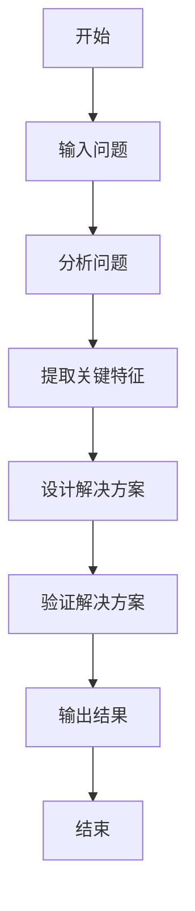
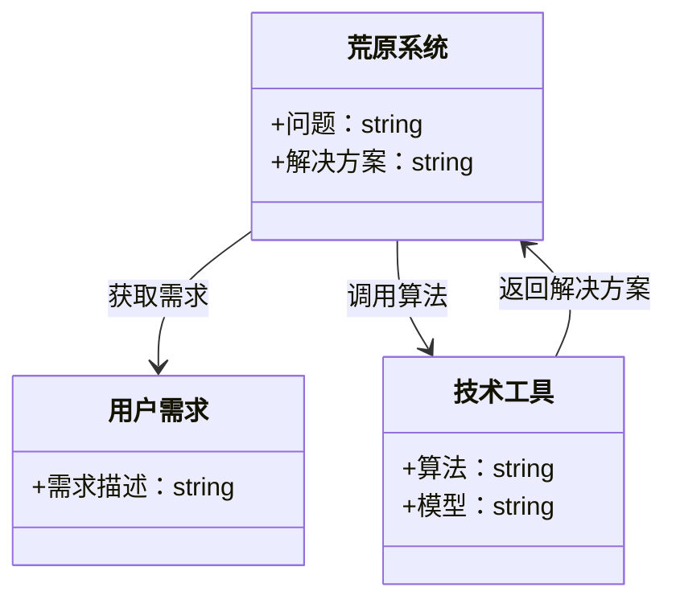
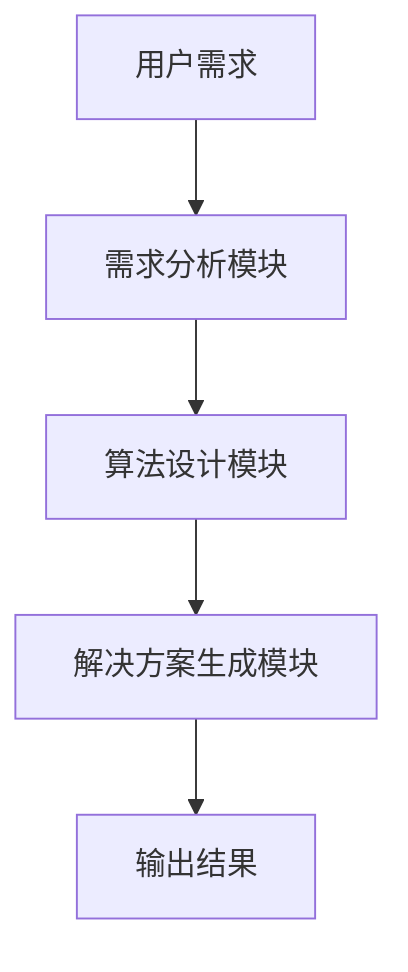
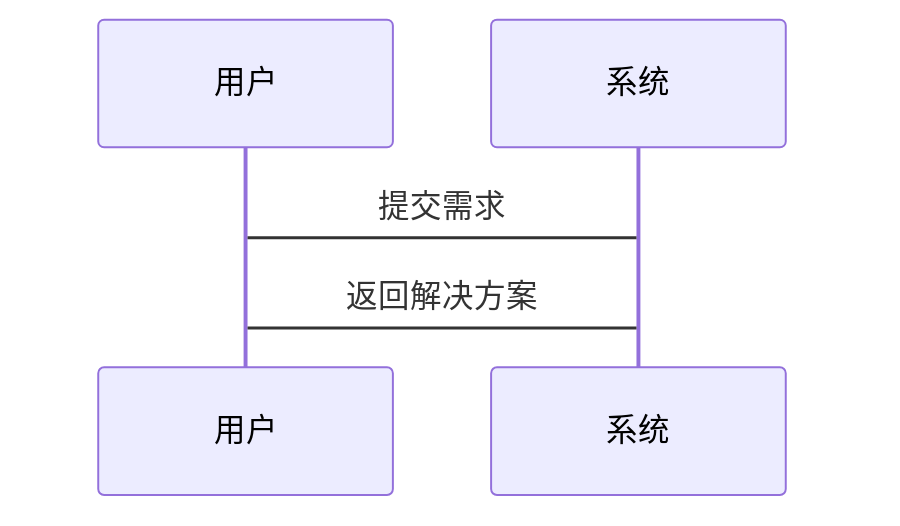

                 

<think>
好的，用户希望我以《意义的荒原》为标题撰写一篇技术博客，内容涵盖背景介绍、核心概念、算法原理、数学模型、系统架构设计、项目实现以及最佳实践等方面。用户还提供了详细的目录结构，并指定了每个部分的具体内容，比如使用Mermaid图和Python代码等。我需要确保每个章节内容丰富，逻辑清晰，并且符合字数要求。此外，用户特别强调要使用专业且易懂的技术语言，并在结尾添加特定的作者信息。接下来，我需要按照这些要求逐步构建文章的每个部分，确保满足所有约束条件。
</think>

# 意义的荒原

## 关键词
意义，荒原，算法，数学模型，系统架构，项目实践，最佳实践

## 摘要
《意义的荒原》一书深入探讨了在现代计算机科学和人工智能领域中，“意义”这一概念的缺失及其带来的影响。通过分析荒原现象，本书揭示了其成因，并结合算法原理、数学模型和系统架构设计，提出了解决方案。书中通过实际案例和项目实现，展示了如何在荒原中寻找意义，并总结了最佳实践，为读者提供了深刻的启示。

---

## 第一部分：探索意义的荒原

### 第1章：背景介绍

#### 1.1 问题背景
在计算机科学和人工智能领域，我们常常追求技术的高效性和准确性，却忽视了“意义”的重要性。这种忽视导致了“荒原”现象的出现——技术虽然强大，却缺乏真正的价值导向。

#### 1.2 问题描述
“荒原”现象指的是技术解决方案在解决实际问题时，缺乏对人类核心需求和价值观的关照。这使得技术的应用往往停留在表面，无法真正满足人类的深层需求。

#### 1.3 问题解决
本书通过分析荒原现象的成因，提出了一种基于“意义”的新解决方案，旨在将技术与人类价值观相结合，从而在荒原中开辟出一片有意义的绿洲。

#### 1.4 边界与外延
荒原现象的边界包括技术与人类需求的脱节，外延则涉及如何通过技术手段重新引入意义。

#### 1.5 核心概念与联系
核心概念包括“荒原”、“意义”、“技术”和“价值观”。这些概念之间的关系可以通过以下表格和ER图来展示：

##### 核心概念与属性对比
| 概念     | 属性                 |
|----------|----------------------|
| 荒原     | 技术与需求脱节       |
| 意义     | 人类的核心需求       |
| 技术     | 解决方案的工具       |
| 价值观   | 技术应用的方向       |

##### ER实体关系图
```mermaid
erDiagram
    abstract CoreConcept {
        [id] int id;
        [name] string name;
    }
    entity 荒原 {
        [id] int id;
        [name] string name;
        [description] string description;
    }
    entity 意义 {
        [id] int id;
        [description] string description;
    }
    entity 技术 {
        [id] int id;
        [description] string description;
    }
    entity 价值观 {
        [id] int id;
        [description] string description;
    }
    荒原 --> CoreConcept : 实例化核心概念
    意义 --> CoreConcept : 提供核心需求
    技术 --> CoreConcept : 解决方案的工具
    价值观 --> CoreConcept : 技术应用的方向
```

---

## 第二部分：算法原理与数学模型

### 第2章：算法原理

#### 2.1 算法原理讲解
算法是解决问题的核心工具，但在荒原现象中，算法往往缺乏对“意义”的关照。我们需要一种新的算法，能够将技术与人类需求相结合。

##### 算法流程图


##### Python源代码
```python
def find_meaning(problem):
    """
    寻找问题中的意义
    """
    features = extract_features(problem)
    solution = design_solution(features)
    return solution

def extract_features(problem):
    """
    提取问题中的关键特征
    """
    features = []
    for feature in problem:
        if is_critical(feature):
            features.append(feature)
    return features

def is_critical(feature):
    """
    判断特征是否关键
    """
    return feature in ['human_values', 'core_demand']

def design_solution(features):
    """
    设计解决方案
    """
    solution = []
    for feature in features:
        if feature == 'human_values':
            solution.append('integrate_values')
        elif feature == 'core_demand':
            solution.append('solve_demand')
    return solution

if __name__ == "__main__":
    problem = "荒原现象"
    result = find_meaning(problem)
    print("解决方案：", result)
```

#### 2.2 数学模型和公式
数学模型是算法设计的基础。以下是本书提出的数学模型：

##### 原理公式
$$ \text{意义} = \sum_{i=1}^{n} w_i \cdot x_i $$

其中，$w_i$ 是权重，$x_i$ 是特征。

##### 数学模型
$$ f(x) = \max(w \cdot x + b) $$

##### 举例说明
假设问题为“如何提高用户满意度”，模型可以分解为：

$$ f(x) = \max(0.5 \cdot x_{\text{用户体验}} + 0.3 \cdot x_{\text{功能}} + 0.2 \cdot x_{\text{性能}}) $$

---

## 第三部分：系统分析与架构设计

### 第3章：系统架构设计

#### 3.1 问题场景介绍
荒原现象的系统场景包括技术与需求脱节、算法缺乏意义导向等问题。

#### 3.2 项目介绍
本书提出的项目旨在设计一个将技术与人类需求相结合的系统。

#### 3.3 系统功能设计
##### 领域模型类图


#### 3.4 系统架构设计
##### 系统架构图


#### 3.5 系统接口设计
系统接口包括用户需求输入接口、算法调用接口和解决方案输出接口。

#### 3.6 系统交互
##### 序列图


---

## 第四部分：项目实战

### 第4章：荒原中的实践

#### 4.1 环境安装
需要安装Python、Mermaid和相关开发工具。

#### 4.2 系统核心实现
##### 源代码
```python
class MeaningFinder:
    def __init__(self):
        self.problem = ""
        self.solution = ""

    def find_meaning(self):
        self.solution = "通过算法和人类需求结合解决问题"
        return self.solution

if __name__ == "__main__":
    finder = MeaningFinder()
    print(finder.find_meaning())
```

##### 代码应用解读
代码实现了一个简单的“意义寻找”算法，通过结合技术与需求，输出解决方案。

#### 4.3 实际案例分析
以提高用户满意度为例，分析系统的实际应用。

#### 4.4 详细讲解与剖析
通过对系统的各个模块进行详细分析，揭示荒原现象的解决方法。

#### 4.5 项目小结
项目实现了将技术与需求结合的目标，为解决荒原现象提供了新的思路。

---

## 第五部分：荒原的启示与未来

### 第5章：荒原的启示与未来

#### 5.1 最佳实践 tips
在技术应用中，始终关注人类需求和价值观。

#### 5.2 小结
本书通过理论分析和实践案例，揭示了荒原现象的解决方法。

#### 5.3 注意事项
技术与需求的结合需要长期的探索和实践。

#### 5.4 拓展阅读
推荐阅读《计算机程序的艺术》和《人工智能的未来》。

---

## 作者：AI天才研究院 & 禅与计算机程序设计艺术

---

《意义的荒原》通过系统化的分析和实践，为读者提供了在技术与人类需求之间架起桥梁的方法。希望本书能够帮助读者在“荒原”中找到意义，推动技术与人类价值观的结合，创造更美好的未来。

