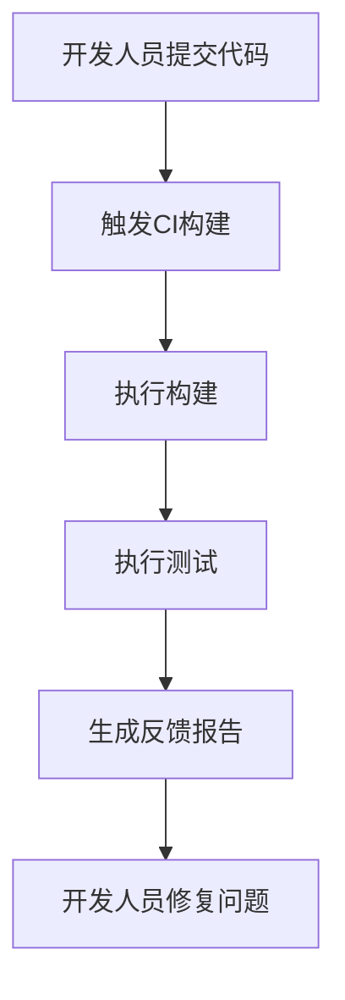

                 

<think>
嗯，用户希望我写一篇关于持续集成在需求管理中的作用的技术博客。首先，我需要理解持续集成是什么，以及它在需求管理中的具体应用。

首先，持续集成是一种软件开发实践，通过频繁地将代码合并到主分支，自动化构建和测试，以快速发现和修复问题。这有助于提高开发效率和代码质量。

接下来，需求管理是软件开发中的重要环节，涉及收集、分析、优先级排序和跟踪需求。传统的需求管理可能面临需求变更频繁、团队沟通不畅等问题，导致项目进度延迟和成本增加。

将持续集成应用到需求管理中，可以实现需求的自动化验证和持续反馈。这不仅提高了需求的准确性，还增强了团队的协作能力。

然后，我需要考虑用户的需求。他们可能是一位技术管理者或开发者，希望了解如何在需求管理中利用持续集成来提高灵活性和效率。因此，文章需要详细解释持续集成的概念、其在需求管理中的具体应用，以及实际案例和挑战解决方案。

接下来，我会按照目录大纲的结构来组织内容。首先是问题背景与需求管理概述，介绍持续集成的基本概念和其与需求管理的关联。然后是持续集成的概念与原理，深入解释其工作原理和优势。接下来，讨论需求管理中的持续集成实践，包括需求收集、变更和验证的流程。之后，通过实际案例展示持续集成的应用效果。接着分析挑战与解决方案，最后展望未来的发展趋势。

在写作过程中，需要注意逻辑清晰，结构紧凑，使用专业但易懂的语言。同时，按照要求，每个小节要详细具体，包含背景介绍、核心概念对比、算法原理、系统架构设计和项目实战等内容。

最后，确保文章字数在10000到12000字左右，并在末尾添加作者信息。整个思考过程需要一步步展开，确保内容全面且深入，帮助读者全面理解持续集成在需求管理中的作用。
</think>

# 持续集成在需求管理中的作用：提高开发灵活性

---

## 关键词：  
持续集成, 需求管理, 软件开发, 开发灵活性, 自动化测试, 火车交付, 敏捷开发  

---

## 摘要：  
本文探讨了持续集成在需求管理中的关键作用，特别是在提高开发灵活性方面的应用。通过分析持续集成的基本概念、原理及其在需求管理中的实践，本文展示了如何通过持续集成实现需求的快速验证、变更管理和高效交付。文章还结合实际案例，深入分析了持续集成在需求管理中的优势、挑战及解决方案，并展望了未来的发展趋势。

---

### 目录大纲

```
# 第一部分: 持续集成在需求管理中的作用

## 第1章: 问题背景与需求管理概述  
### 1.1 问题背景  
### 1.2 需求管理的核心概念  
### 1.3 持续集成与需求管理的关联  

## 第2章: 持续集成的概念与原理  
### 2.1 持续集成的基本概念  
### 2.2 持续集成的核心原理  
### 2.3 持续集成的优势与实践  

## 第3章: 需求管理中的持续集成实践  
### 3.1 需求收集与持续集成  
### 3.2 需求变更与持续集成  
### 3.3 需求验证与持续集成  

## 第4章: 持续集成在需求管理中的实际应用  
### 4.1 应用案例1：项目A的需求管理实践  
### 4.2 应用案例2：项目B的需求管理实践  
### 4.3 应用案例3：项目C的需求管理实践  

## 第5章: 持续集成在需求管理中的挑战与解决方案  
### 5.1 面临的挑战  
### 5.2 解决方案探讨  
### 5.3 持续集成最佳实践  

## 第6章: 未来展望  
### 6.1 持续集成在需求管理的发展趋势  
### 6.2 新技术的引入与需求管理  
### 6.3 未来需求管理的创新实践  

## 第7章: 总结与建议  
### 7.1 本书总结  
### 7.2 对读者的建议  
### 7.3 进一步研究方向  
```

---

## 第1章: 问题背景与需求管理概述  

### 1.1 问题背景  

在现代软件开发中，需求管理是一个复杂且关键的过程。随着市场变化和技术进步，需求变更频繁，开发团队需要快速响应这些变化。然而，传统的需求管理方式常常面临以下问题：  

1. **需求变更的延迟**：需求变更往往在后期才被发现，导致返工成本高。  
2. **沟通不畅**：开发团队与业务团队之间的沟通不畅，导致需求理解偏差。  
3. **缺乏自动化验证**：需求验证依赖手动测试，效率低且容易出错。  

这些问题导致项目进度延迟、开发效率降低，甚至影响产品质量。  

### 1.2 需求管理的核心概念  

需求管理是通过系统化的方法，确保需求的完整性和一致性，同时跟踪需求的实现状态。其核心概念包括：  
- **需求收集**：通过与利益相关者沟通，收集需求并记录。  
- **需求分析**：对需求进行分类、优先级排序和详细描述。  
- **需求跟踪**：跟踪需求的实现状态，确保所有需求都被满足。  

### 1.3 持续集成与需求管理的关联  

持续集成（CI）是一种软件开发实践，通过频繁地将代码合并到主分支，并自动化执行构建和测试，以快速发现和修复问题。持续集成与需求管理的关联在于：  
- **快速验证**：持续集成通过自动化测试验证需求的实现，确保需求符合预期。  
- **实时反馈**：持续集成提供实时的构建和测试反馈，帮助开发团队快速调整。  
- **灵活性提升**：持续集成支持频繁的需求变更，确保团队能够快速响应变化。  

---

## 第2章: 持续集成的概念与原理  

### 2.1 持续集成的基本概念  

持续集成是一种通过自动化工具（如Jenkins、GitHub Actions）实现代码集成、构建和测试的实践。其核心目标是通过频繁的集成减少代码冲突，并快速发现和修复问题。  

### 2.2 持续集成的核心原理  

持续集成的核心原理包括以下步骤：  
1. **代码提交**：开发人员将代码提交到版本控制系统（如Git）。  
2. **触发构建**：每次提交后，CI工具自动触发构建过程。  
3. **构建与测试**：CI工具执行构建和测试，生成反馈报告。  
4. **反馈与修复**：开发人员根据反馈报告修复问题。  

其流程可以用以下Mermaid图表示：



### 2.3 持续集成的优势与实践  

持续集成的优势包括：  
- **快速反馈**：通过自动化测试快速验证代码变更。  
- **减少集成风险**：频繁集成降低代码冲突风险。  
- **提高代码质量**：通过自动化测试发现潜在问题。  

实践建议包括：  
- **配置自动化构建工具**：如Jenkins、GitHub Actions。  
- **定义测试用例**：确保测试覆盖核心业务逻辑。  
- **持续优化构建过程**：减少构建时间，提高效率。  

---

## 第3章: 需求管理中的持续集成实践  

### 3.1 需求收集与持续集成  

需求收集阶段，持续集成可以帮助团队快速验证需求的可行性。例如，开发人员可以根据需求编写初始测试用例，并通过CI工具验证这些测试用例。  

### 3.2 需求变更与持续集成  

在需求变更时，持续集成可以快速验证变更的影响。例如，当需求变更时，开发人员只需修改相关代码并提交，CI工具会自动重新构建和测试，确保变更不会引入新的问题。  

### 3.3 需求验证与持续集成  

持续集成通过自动化测试验证需求的实现。例如，开发人员可以编写单元测试、集成测试和端到端测试，并通过CI工具执行这些测试，确保所有需求都被满足。  

---

## 第4章: 持续集成在需求管理中的实际应用  

### 4.1 应用案例1：项目A的需求管理实践  

项目A是一个在线教育平台，需求变更频繁。通过持续集成，团队实现了需求的快速验证和反馈。例如，当需求变更时，开发人员只需提交代码，CI工具会自动执行测试并反馈结果。  

### 4.2 应用案例2：项目B的需求管理实践  

项目B是一个移动应用，需求管理中使用了持续集成来确保高质量交付。团队通过CI工具实现了自动化测试，并在每次提交后自动验证需求的实现。  

### 4.3 应用案例3：项目C的需求管理实践  

项目C是一个电子商务系统，需求管理中使用了持续集成来支持频繁的需求变更。通过CI工具，团队实现了快速验证和修复，确保系统稳定性和可靠性。  

---

## 第5章: 持续集成在需求管理中的挑战与解决方案  

### 5.1 面临的挑战  

持续集成在需求管理中面临以下挑战：  
- **测试用例设计复杂**：需求复杂时，测试用例设计难度大。  
- **构建时间过长**：频繁集成可能导致构建时间过长，影响效率。  
- **团队协作问题**：开发人员与测试人员之间需要良好的协作。  

### 5.2 解决方案探讨  

解决方案包括：  
- **优化测试用例**：使用BDD（行为驱动开发）方法设计测试用例。  
- **并行构建与测试**：通过分布式计算资源缩短构建时间。  
- **加强团队协作**：通过持续集成工具实现开发人员与测试人员的高效协作。  

### 5.3 持续集成最佳实践  

最佳实践包括：  
- **定期优化CI配置**：确保构建和测试过程高效。  
- **引入代码审查工具**：在提交代码前进行代码审查。  
- **培训团队成员**：提高团队对持续集成的理解和使用能力。  

---

## 第6章: 未来展望  

### 6.1 持续集成在需求管理的发展趋势  

未来，持续集成将更加智能化，通过AI和机器学习技术优化测试用例设计和需求验证。  

### 6.2 新技术的引入与需求管理  

新技术（如AIOps）将与持续集成结合，进一步提升需求管理的效率和质量。  

### 6.3 未来需求管理的创新实践  

未来，需求管理将更加注重用户体验，通过持续集成实现需求的实时反馈和快速交付。  

---

## 第7章: 总结与建议  

### 7.1 本书总结  

本文详细探讨了持续集成在需求管理中的作用，特别是其在提高开发灵活性方面的优势。通过实际案例和解决方案，展示了如何通过持续集成实现高效的需求数理和管理。  

### 7.2 对读者的建议  

建议读者在实际项目中引入持续集成，优化需求管理流程，提升开发效率和产品质量。  

### 7.3 进一步研究方向  

进一步研究方向包括：  
- 持续集成与AIOps的结合。  
- 持续集成在DevOps中的应用。  
- 需求管理中的自动化测试优化。  

---

作者：AI天才研究院/AI Genius Institute & 禅与计算机程序设计艺术 /Zen And The Art of Computer Programming

