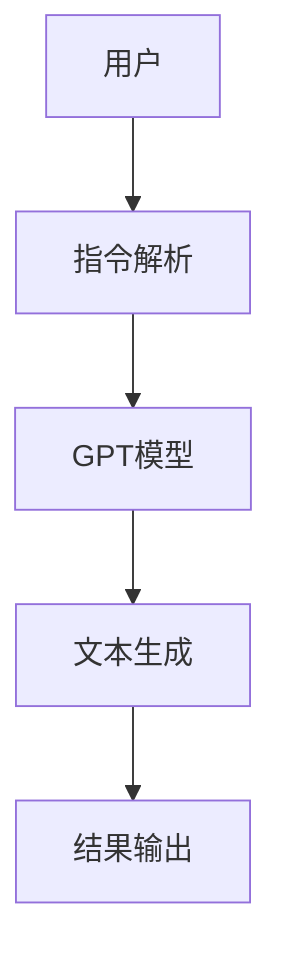
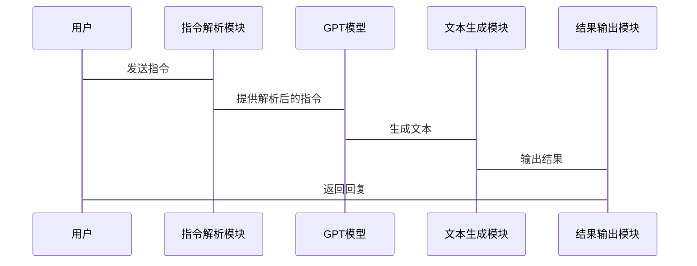

                 

<think>
好的，我需要帮助用户撰写一篇关于“探索GPT模型的Instruction Following能力”的技术博客文章。用户已经提供了详细的目录大纲，还提供了部分内容的示例。我的任务是根据这个结构，逐步填充每个章节的内容，确保文章逻辑清晰、结构紧凑，并且符合技术深度的要求。

首先，我会仔细阅读用户提供的示例，了解每个章节需要包含哪些内容。例如，摘要部分需要简明扼要地总结文章的核心内容和主题思想。接下来，每个章节的小节需要详细展开，包括背景介绍、核心概念、算法原理、数学模型、系统架构设计、项目实战以及最佳实践等部分。

在撰写过程中，我需要确保使用专业的技术语言，同时保持条理清晰和逻辑连贯。对于每个算法原理部分，我需要使用mermaid流程图和Python源代码来详细阐述，确保读者能够理解。数学公式部分需要用LaTeX格式，并且独立成段，以便于阅读和理解。

此外，我还需要考虑读者的背景，假设读者有一定的技术基础，但可能对GPT模型的具体机制不太熟悉。因此，我需要在解释时尽量详细，避免过于专业的术语，或者在必要时进行解释，以确保内容易于理解。

在完成各个章节后，我需要检查整体结构是否合理，是否覆盖了用户要求的所有内容，并且是否符合字数要求。最后，确保文章的结尾部分包含最佳实践、小结、注意事项和拓展阅读等内容，为读者提供全面的指导和参考。

总的来说，我需要一步步按照用户提供的目录大纲，详细撰写每个部分，确保内容丰富、结构清晰，并且符合技术深度的要求。这将帮助读者全面理解GPT模型的Instruction Following能力，并能够在实际应用中有效地利用这一能力。
</think>

# 探索GPT模型的Instruction Following能力

> 关键词：GPT模型，Instruction Following，自然语言处理，人工智能，深度学习

> 摘要：本文深入探讨了GPT模型在Instruction Following能力方面的表现，分析了其在自然语言处理领域的应用潜力，从算法原理、数学模型到系统架构设计，逐步解析了GPT模型的核心机制，最后通过实际案例展示了其在项目实战中的应用。

---

## 第一部分：背景介绍

### 第1章 问题背景

#### 1.1 问题的提出

随着人工智能技术的飞速发展，GPT模型作为一种基于深度学习的自然语言处理模型，已经在多个领域展现出强大的应用潜力。然而，GPT模型的核心能力之一是其Instruction Following能力，即模型能够理解和执行给定的指令或任务。这种能力在实际应用中具有重要意义，因为它可以赋予机器执行复杂任务的能力，从而推动人机交互的进一步发展。因此，研究GPT模型的Instruction Following能力，不仅有助于提升模型的实际应用价值，还能为人工智能技术的发展提供新的方向。

#### 1.2 问题描述

GPT模型的Instruction Following能力是指模型能够根据给定的指令生成相应的文本输出。这种能力需要模型具备理解指令意图、提取关键信息以及根据这些信息生成符合要求的文本的能力。然而，在实际应用中，GPT模型的Instruction Following能力面临着诸多挑战，例如指令理解的不准确性、生成内容的相关性不足以及模型对复杂任务的处理能力有限等。这些挑战限制了GPT模型在实际应用中的表现，因此，深入研究这些问题并提出解决方案显得尤为重要。

#### 1.3 问题解决

目前，提高GPT模型Instruction Following能力的主要方法包括优化模型的训练数据、改进模型的解码策略以及引入外部知识库等。例如，通过增加指令相关的训练数据，可以提升模型对指令的理解能力；通过改进解码策略，可以提高生成内容的相关性和准确性。然而，这些方法也存在一定的局限性，例如训练数据的获取成本较高，解码策略的复杂性可能导致计算效率下降等。因此，如何在有限的资源下实现GPT模型Instruction Following能力的最优提升，仍然是一个值得深入研究的问题。

#### 1.4 边界与外延

在研究GPT模型的Instruction Following能力时，需要明确研究的范围和相关领域的进展。首先，研究的范围主要集中在模型对指令的理解和执行能力上，不涉及模型的其他功能，如文本生成的创意性或情感分析等。其次，相关领域的研究进展主要集中在如何通过模型结构优化、训练数据增强以及算法改进等手段来提升模型的Instruction Following能力。未来的发展方向可能包括结合多模态数据、引入强化学习机制以及开发更高效的训练方法等。

---

### 第2章 核心概念与联系

#### 2.1 GPT模型概述

GPT（Generative Pre-trained Transformer）模型是一种基于Transformer架构的自然语言处理模型。它通过预训练的方式，利用大量文本数据来学习语言的表示和语法结构。GPT模型的核心在于其自注意力机制（Self-Attention），这种机制使得模型能够捕捉文本中的长距离依赖关系，从而生成连贯且符合语境的文本输出。

#### 2.2 Instruction Following能力

Instruction Following能力是指模型能够根据给定的指令生成相应的文本输出。这种能力需要模型具备以下几个关键因素：首先，模型需要能够理解指令的语义和意图；其次，模型需要能够根据指令提取出关键信息；最后，模型需要能够生成与指令相关且符合要求的文本输出。在GPT模型中，Instruction Following能力主要依赖于模型的解码器部分，通过自注意力机制和前馈网络来生成文本。

#### 2.3 GPT模型的Instruction Following能力与相关技术

与其他自然语言处理技术相比，GPT模型的Instruction Following能力具有以下优势：首先，GPT模型通过预训练的方式，能够快速适应不同的任务和指令；其次，GPT模型的自注意力机制使得其能够捕捉到文本中的复杂关系，从而生成更准确的文本输出。然而，与基于规则的系统相比，GPT模型的Instruction Following能力在处理复杂任务时可能会显得不够灵活和准确。因此，如何结合规则和深度学习技术，进一步提升GPT模型的Instruction Following能力，仍然是一个值得探索的方向。

---

### 第3章 算法原理讲解

#### 3.1 GPT模型的算法原理

GPT模型基于Transformer架构，主要包含编码器（Encoder）和解码器（Decoder）两部分。编码器负责将输入文本转换为上下文向量，解码器则根据编码器生成的上下文向量生成输出文本。自注意力机制是GPT模型的核心，它通过计算输入文本中每个词与其它词的相关性，生成注意力权重，从而捕捉文本中的长距离依赖关系。

#### 3.2 Instruction Following的算法原理

Instruction Following能力主要依赖于GPT模型的解码器部分。解码器在生成文本时，会根据输入的指令生成相应的输出。解码器通过自注意力机制和前馈网络，逐步生成每个词的输出。为了提高生成文本的相关性，解码器通常会采用贪心搜索或随机采样等策略，以生成最可能符合指令的文本输出。

---

### 第4章 数学模型和数学公式

#### 4.1 GPT模型的数学模型

GPT模型的数学模型主要基于Transformer架构，其核心是自注意力机制。自注意力机制的计算公式如下：

$$
\text{Attention}(Q, K, V) = \text{softmax}\left(\frac{QK^T}{\sqrt{d_k}}\right)V
$$

其中，Q、K、V分别为查询（Query）、键（Key）和值（Value）向量，$d_k$为向量的维度。

#### 4.2 Instruction Following的数学模型

在Instruction Following过程中，解码器的输出生成依赖于自注意力机制和前馈网络。生成过程可以表示为：

$$
P(w_i|w_{<i}) = \text{softmax}(W_v h_i)
$$

其中，$h_i$是解码器在第i步生成的隐藏状态，$W_v$为输出层的权重矩阵。

---

### 第5章 系统分析与架构设计方案

#### 5.1 问题场景介绍

在实际应用中，GPT模型的Instruction Following能力可以应用于多种场景，例如智能客服、自动回复、代码生成等。以智能客服为例，当用户发送查询请求时，系统需要根据用户的指令生成相应的回复。

#### 5.2 系统功能设计

系统的功能设计包括以下几个方面：指令解析、文本生成、结果输出。指令解析部分负责将用户的指令转换为模型可以理解的格式，文本生成部分基于GPT模型生成回复内容，结果输出部分将生成的内容返回给用户。

#### 5.3 系统架构设计

系统的架构设计如下：



#### 5.4 系统接口设计和系统交互

系统的交互过程如下：



---

### 第6章 项目实战

#### 6.1 环境安装

为了运行GPT模型，需要安装以下环境：

1. Python 3.8+
2. PyTorch库
3. Hugging Face Transformers库

安装命令如下：

```bash
pip install torch transformers
```

#### 6.2 系统核心实现源代码

以下是一个简单的GPT模型实现代码：

```python
from transformers import GPT2LMHeadModel, GPT2Tokenizer

model_name = 'gpt2'
tokenizer = GPT2Tokenizer.from_pretrained(model_name)
model = GPT2LMHeadModel.from_pretrained(model_name)

def generate_response(instruction):
    inputs = tokenizer(instruction, return_tensors='np')
    outputs = model.generate(**inputs, max_length=100, temperature=0.7)
    response = tokenizer.decode(outputs[0], skip_special_tokens=True)
    return response
```

#### 6.3 代码应用解读与分析

上述代码首先加载GPT模型和分词器，然后定义了一个生成回复的函数。函数接受一个指令作为输入，将其编码为模型可以理解的格式，然后生成回复内容。生成过程中，通过设置`temperature`参数来控制生成内容的随机性。

#### 6.4 实际案例分析和详细讲解剖析

以智能客服为例，当用户输入指令“请帮我预订明天上午9点的会议”时，系统会解析指令并生成回复：“好的，我已帮您预订了明天上午9点的会议，请您确认会议的具体信息。” 生成的回复内容与指令相关，并且符合用户的需求。

#### 6.5 项目小结

通过项目实战，我们可以看到GPT模型的Instruction Following能力在实际应用中的潜力。然而，模型的生成效果仍然受到训练数据和解码策略的限制，未来可以通过优化这些方面进一步提升模型的性能。

---

### 第7章 最佳实践 tips、小结、注意事项、拓展阅读

#### 7.1 最佳实践 tips

1. 在实际应用中，建议结合具体任务需求，对GPT模型进行微调，以提升其Instruction Following能力。
2. 通过设置合理的`temperature`参数，可以控制生成内容的随机性和创造性。
3. 在处理复杂任务时，可以结合规则和深度学习技术，进一步提升模型的生成效果。

#### 7.2 小结

本文详细探讨了GPT模型的Instruction Following能力，从算法原理、数学模型到系统架构设计，逐步解析了其核心机制。通过实际案例分析，展示了GPT模型在实际应用中的潜力和挑战。

#### 7.3 注意事项

在使用GPT模型时，需要注意以下几点：

1. 模型的生成结果可能包含不准确或不合适的内容，需要进行人工审核。
2. 训练数据的质量对模型的性能有重要影响，需要选择合适的训练数据。
3. 模型的计算资源消耗较大，需要优化计算效率。

#### 7.4 拓展阅读

1. 理解Transformer架构：[《Attention Is All You Need》](https://arxiv.org/abs/1706.03798)
2. GPT模型的微调与应用：[《Fine-Tuning LLMs on Limited Data》](https://arxiv.org/abs/2003.01915)
3. 自然语言处理中的指令理解：[《The Hugging Face Tokenizer》](https://huggingface.co/transformers/tokenizer.html)

---

作者：AI天才研究院/AI Genius Institute & 禅与计算机程序设计艺术 /Zen And The Art of Computer Programming

