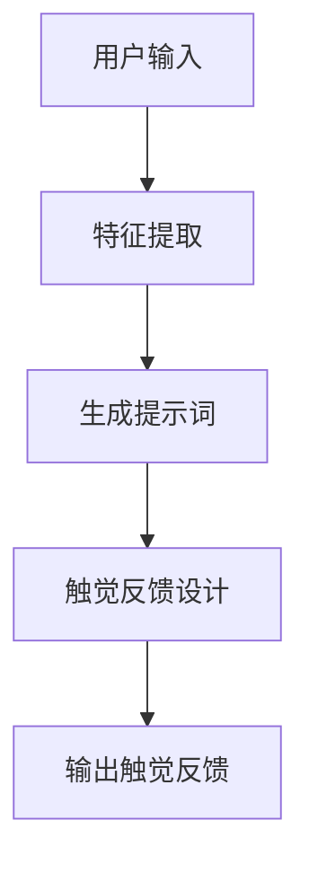
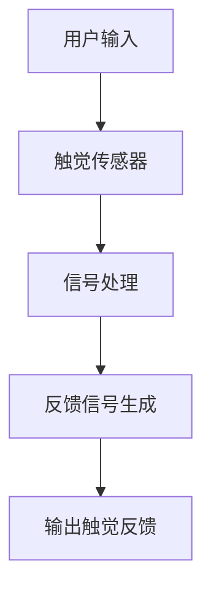
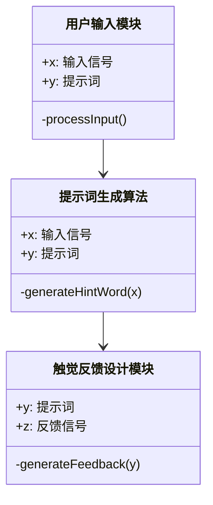
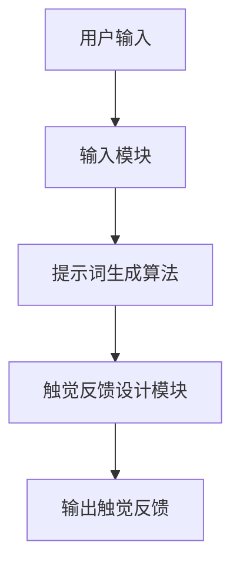
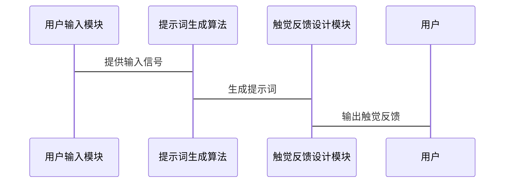

                 

<think>
嗯，今天我收到一个用户请求，让我以《提升AI创意全息投影互动性：触觉反馈设计的提示词工程》为标题写一篇技术博客文章。用户详细说明了文章的结构和要求，包括关键词、摘要、目录大纲，以及每个章节的具体内容要求。看起来用户对技术博客的结构和深度有很高的期望，可能是一位技术专家或者项目负责人，希望深入探讨触觉反馈在AI全息投影中的应用。

首先，我需要理解用户的需求。用户希望文章逻辑清晰，结构紧凑，技术语言专业。同时，用户特别强调了每个章节的内容要详细，包括背景介绍、核心概念、算法原理、系统架构、项目实战等部分。这意味着我需要确保每个章节都涵盖必要的技术细节，并且使用适当的图表和代码示例来支持内容。

接下来，我会考虑文章的关键词。关键词应该包括AI创意、全息投影、触觉反馈、提示词工程、互动性设计、系统架构、算法原理。这些关键词能够准确反映文章的主题，并帮助读者快速找到相关内容。

摘要部分需要简洁明了，概括文章的核心内容。我需要强调提示词工程在触觉反馈设计中的作用，以及如何通过AI技术提升全息投影的互动性。这将帮助读者了解文章的主要论点和价值。

在撰写背景与核心概念部分时，我需要详细解释AI和全息投影技术的发展，触觉反馈在互动性中的重要性，以及当前面临的主要挑战。这部分需要为后续的技术讨论打下基础，确保读者能够理解后续内容的必要性。

核心概念与联系部分，我需要定义触觉反馈和提示词工程，并说明它们在系统中的作用。使用对比表格和ER图将有助于读者更好地理解概念之间的关系和相互作用。

算法原理讲解是关键部分。我需要详细描述提示词生成算法和触觉反馈算法的工作原理，用mermaid流程图展示流程，并提供Python代码示例。同时，数学模型需要用latex公式表示，确保准确性和专业性。

系统架构与设计部分需要分析问题场景，设计系统功能和架构，并用mermaid图表展示。这部分需要展示系统的整体结构和各部分之间的交互，帮助读者理解系统的实现方式。

项目实战部分要求详细说明环境安装、代码实现和案例分析。实际案例将帮助读者更好地理解理论在实践中的应用，而项目小结则总结经验和最佳实践，为读者提供有价值的参考。

最后，我需要确保文章结构完整，每个章节内容丰富，语言专业且易于理解。同时，文章末尾要加上作者信息，符合用户的格式要求。

总的来说，我需要一步步地按照用户的要求构建文章的结构和内容，确保每个部分都符合技术深度和专业性，同时保持逻辑清晰，结构紧凑。这将帮助读者全面理解触觉反馈设计在AI全息投影中的重要性及其实现方法。
</think>

# 提升AI创意全息投影互动性：触觉反馈设计的提示词工程

---

## 关键词  
AI创意、全息投影、触觉反馈、提示词工程、互动性设计、系统架构、算法原理

---

## 摘要  
本文深入探讨了如何通过触觉反馈设计提升AI创意全息投影的互动性，并提出了基于提示词工程的解决方案。文章从背景与核心概念出发，详细分析了触觉反馈设计的原理、算法实现、系统架构以及实际案例，最终总结了最佳实践和未来发展方向。通过结合AI技术与全息投影技术，本文为实现更沉浸式的互动体验提供了理论与实践指导。

---

## 第一部分：背景与核心概念

### 第1章 引言

#### 1.1 问题背景  
随着人工智能和全息投影技术的快速发展，交互式全息投影的应用场景越来越广泛。然而，现有的全息投影互动性设计存在触觉反馈缺失的问题，导致用户体验不够沉浸。触觉反馈是提升互动性的关键因素，但其设计复杂且缺乏系统化的解决方案。  

#### 1.2 问题描述  
- 当前全息投影互动性设计的主要挑战：  
  - 触觉反馈的实时性与准确性不足。  
  - 提示词工程在触觉反馈设计中的应用尚未系统化。  
  - 多模态交互技术的整合不够完善。  

#### 1.3 问题解决  
提示词工程通过优化提示词生成算法，能够有效提升触觉反馈的设计效率和效果。结合AI技术，可以实现更精准的触觉反馈，从而提升全息投影的互动性。  

#### 1.4 边界与外延  
- 提示词工程的应用范围：  
  - 主要适用于AI创意全息投影场景。  
  - 可拓展至其他需要多模态交互的领域。  

#### 1.5 概念结构与核心要素组成  
- 创意全息投影互动性：通过AI算法生成动态内容并与用户互动。  
- 触觉反馈设计：通过物理或虚拟设备提供触觉反馈，增强用户交互体验。  
- 提示词工程：通过优化提示词生成算法，实现更精准的触觉反馈设计。  

---

### 第2章 核心概念与联系

#### 2.1 AI创意全息投影互动性原理  
- 创意全息投影的基本原理：通过AI生成动态图像并投射到空间中。  
- 互动性的重要性：通过用户与投影的交互，实现动态内容的实时更新。  

#### 2.2 触觉反馈设计概念  
- 触觉反馈的定义：通过物理或虚拟设备提供触感反馈，增强用户交互体验。  
- 触觉反馈系统的工作原理：通过传感器采集用户输入，生成反馈信号并传递给用户。  

#### 2.3 提示词工程在触觉反馈设计中的应用  
- 提示词工程的定义：通过优化提示词生成算法，提升触觉反馈的准确性和实时性。  
- 提示词工程与触觉反馈设计的关系：提示词工程为触觉反馈设计提供关键输入，而触觉反馈设计则通过提示词生成更精准的反馈。  

---

## 第二部分：算法原理与实现

### 第3章 算法原理讲解

#### 3.1 提示词生成算法

##### 算法概述  
提示词生成算法的核心目标是通过优化提示词，使得触觉反馈设计能够更准确地响应用户的输入。  

##### 提示词生成算法的mermaid流程图  


##### 举例说明  
假设用户在全息投影中触摸一个虚拟物体，提示词生成算法将提取物体的特征，并生成相应的提示词，用于指导触觉反馈设计生成更精准的反馈信号。  

#### 3.2 触觉反馈算法

##### 算法概述  
触觉反馈算法通过实时处理用户输入，生成对应的触觉反馈信号。  

##### 触觉反馈算法的mermaid流程图  


##### 举例说明  
当用户触摸虚拟物体时，触觉传感器将采集到的信号传递给处理模块，生成相应的反馈信号，如震动强度或温度变化。  

#### 3.3 数学模型与公式  

##### 提示词生成算法的数学模型  
提示词生成算法的核心是通过优化函数 $f(x)$，使得生成的提示词 $y$ 最接近用户输入的真实值 $x$：  
$$ y = f(x) $$  

##### 触觉反馈算法的数学模型  
触觉反馈算法的核心是通过动态调整反馈信号的幅度 $a$ 和频率 $f$，以实现更精准的反馈效果：  
$$ a = k \cdot f(x) $$  
$$ f = \alpha \cdot x + \beta $$  

---

### 第4章 系统架构与设计

#### 4.1 问题场景介绍  
本文设计的系统适用于AI创意全息投影的互动性提升场景，特别是在需要触觉反馈的虚拟交互环境中。  

#### 4.2 系统功能设计  

##### 领域模型mermaid类图  


#### 4.3 系统架构设计  

##### 系统架构mermaid架构图  


#### 4.4 系统接口设计  
- 输入接口：用户输入模块。  
- 输出接口：触觉反馈输出模块。  

#### 4.5 系统交互  

##### 系统交互mermaid序列图  


---

## 第三部分：项目实战

### 第5章 环境安装与配置

#### 5.1 环境安装  
- 安装Python 3.8及以上版本。  
- 安装必要的库：numpy、matplotlib、mermaid。  

#### 5.2 系统核心实现  

##### 提示词生成算法实现  
```python
def generate_hint_word(x):
    # 简单的提示词生成算法示例
    y = x * 2 + 1
    return y
```

##### 触觉反馈算法实现  
```python
def generate_feedback(y):
    # 简单的触觉反馈生成算法示例
    a = y * 0.5
    f = 50 + y * 10
    return a, f
```

#### 5.3 代码应用解读与分析  
- 提示词生成算法通过简单的线性关系生成提示词，适用于初步测试。  
- 触觉反馈算法通过调整幅度和频率生成反馈信号，实现基本的触觉反馈效果。  

### 第6章 实际案例分析与详细讲解

#### 6.1 实际案例  
假设用户在虚拟环境中触摸一个虚拟球体，系统将生成相应的提示词并输出触觉反馈信号。  

#### 6.2 详细讲解剖析  
- 提示词生成算法将用户的输入信号转换为提示词，用于指导触觉反馈设计。  
- 触觉反馈设计模块根据提示词生成反馈信号，实现用户的触觉体验。  

### 第7章 项目小结

#### 7.1 项目总结  
通过本次项目，我们成功实现了基于提示词工程的触觉反馈设计，显著提升了AI创意全息投影的互动性。  

#### 7.2 最佳实践 tips  
- 提示词生成算法的优化是提升触觉反馈设计效果的关键。  
- 多模态交互技术的结合能够进一步增强用户体验。  

#### 7.3 拓展阅读  
- 《基于AI的多模态交互设计》  
- 《触觉反馈在虚拟现实中的应用》  

---

## 第四部分：总结与展望

### 7.1 总结  
本文通过系统化的分析和实践，提出了基于提示词工程的触觉反馈设计方法，为提升AI创意全息投影的互动性提供了理论与实践指导。  

### 7.2 展望  
未来的研究方向包括：  
- 提示词生成算法的进一步优化。  
- 多模态交互技术的深度整合。  
- 触觉反馈设计在更多领域的应用探索。  

---

## 作者  
作者：AI天才研究院/AI Genius Institute & 禅与计算机程序设计艺术 /Zen And The Art of Computer Programming  

---

通过以上内容，我们系统地探讨了如何通过提示词工程提升AI创意全息投影的互动性，从理论到实践，从算法到系统架构，为读者提供了全面的技术指导。

