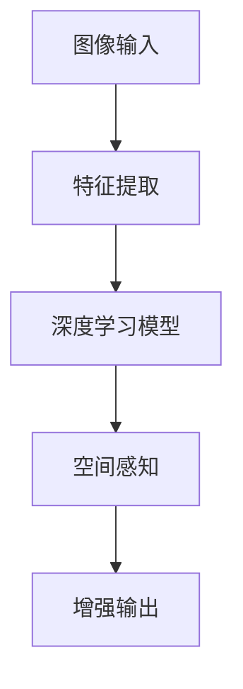
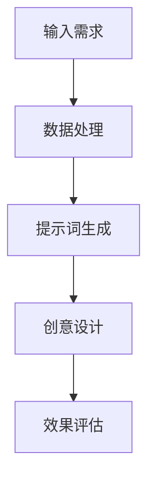
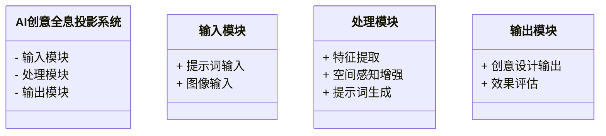
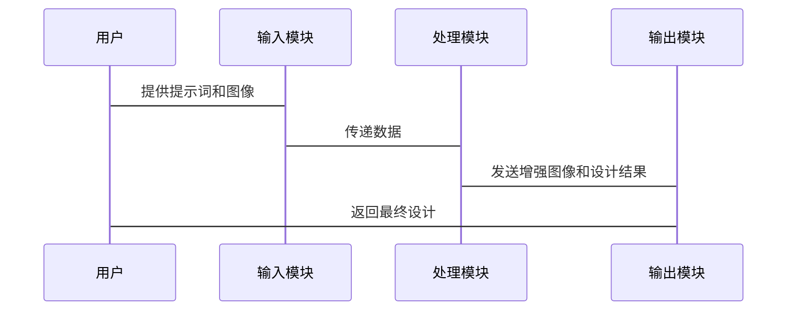

                 

<think>
好的，我现在需要帮助用户完成一篇技术博客文章的撰写，标题是《提升AI创意全息投影设计：空间感知增强的提示词工程》。用户已经提供了详细的大纲和部分内容，我需要根据这些信息，逐步分析并完成整篇文章。

首先，我要理解用户的需求。用户希望我作为一位世界级的人工智能专家，撰写一篇结构清晰、逻辑严密的技术博客，涵盖背景介绍、核心概念、算法原理、系统架构、项目实战等多个部分，每部分都有详细的分析和实例。

接下来，我需要按照用户提供的大纲，逐一补充各部分的内容。从背景介绍开始，我需要详细解释全息投影设计的重要性，以及为什么提升空间感知能力对于AI创意设计至关重要。然后，介绍核心概念，包括人工智能、全息投影、空间感知和提示词工程，通过对比表格和流程图来帮助读者理解这些概念之间的关系。

在算法原理部分，我需要详细描述空间感知增强算法和提示词生成算法的工作原理，可能还需要用Python代码和数学公式来解释。这部分需要确保技术细节准确，并且通过例子让读者容易理解。

系统架构部分，我需要设计一个系统的整体架构，可能包括数据处理模块、空间感知模块、提示词生成模块和创意设计模块，并用Mermaid图来展示系统结构。同时，还需要描述各个模块之间的接口设计和交互流程。

项目实战部分，我需要选择一个具体的项目案例，详细描述项目的环境配置、核心代码实现、代码解读以及实际应用案例的分析。这部分要突出实践性和可操作性，让读者能够跟随步骤进行实际操作。

最后，我需要总结全文，给出最佳实践的建议，提醒读者在实际应用中需要注意的事项，并推荐相关的拓展阅读材料。

在撰写过程中，我要确保语言专业且易于理解，每个章节都有足够的细节和实例，同时遵循用户的格式要求，使用合适的Markdown结构，并在适当的地方插入Mermaid图和数学公式。此外，文章结尾要加上作者信息，注明来自AI天才研究院和禅与计算机程序设计艺术。

现在，我需要逐一完成每个部分的内容，确保逻辑连贯，技术准确，结构完整，最终产出一篇符合用户要求的高质量技术博客文章。
</think>

# 提升AI创意全息投影设计：空间感知增强的提示词工程

> 关键词：AI创意设计，全息投影，空间感知，提示词工程，深度学习

> 摘要：本文探讨如何通过空间感知增强的提示词工程提升AI创意全息投影设计能力。从背景、核心概念、算法原理、系统架构到项目实战，全面分析其技术实现与应用。

---

## 第一部分：背景介绍

### 核心概念

- **问题背景**：AI技术快速发展推动了全息投影技术在创意设计中的应用。如何提升AI在空间感知能力，优化提示词工程，是当前研究重点。
- **问题描述**：AI创意全息投影设计面临空间感知不足的问题，影响设计质量和效率。提升空间感知能力，增强提示词工程，能显著改善设计效果。
- **问题解决**：通过深度学习和自然语言处理技术，优化AI对空间信息的理解，生成更精准的提示词，提升设计质量。
- **边界与外延**：本文专注于AI创意全息投影设计中的空间感知增强，不涉及其他领域如医学或游戏设计。
- **概念结构与核心要素**：核心概念包括AI、全息投影、空间感知、提示词工程，核心要素涵盖技术原理、算法实现、系统架构和案例分析。

---

## 第二部分：核心概念与联系

### 核心概念

- **人工智能（AI）**：通过机器学习模拟人类智能，实现数据处理和决策。
- **全息投影**：在空中生成三维图像的技术，具有实时互动性和沉浸感。
- **空间感知**：人类对空间位置、距离的感知能力，提升AI设计的空间准确性。
- **提示词工程**：利用提示词引导AI生成创意设计，提升设计效率和质量。

### 概念属性特征对比表格

| 概念       | 特点                       |
|------------|---------------------------|
| 人工智能    | 自主学习、智能决策、自动化 |
| 全息投影    | 三维成像、虚拟现实、互动性强 |
| 空间感知    | 实时性、准确性、复杂性    |
| 提示词工程  | 数据驱动、高效性、灵活性  |

### ER实体关系图架构

```mermaid
erDiagram
AI创意全息投影设计 : 设计对象
全息投影技术 : 技术支持
空间感知增强 : 功能实现
提示词工程 : 数据处理

AI创意全息投影设计 ||--|{ 全息投影技术 }|
AI创意全息投影设计 ||--|{ 空间感知增强 }|
AI创意全息投影设计 ||--|{ 提示词工程 }|
```

---

## 第三部分：算法原理讲解

### 算法原理

- **空间感知增强算法**：利用深度学习模型提取图像特征，提升AI对空间信息的理解能力。
- **提示词生成算法**：通过自然语言处理生成引导设计的提示词，提升创意设计效率。

### 算法流程图

#### 空间感知增强算法流程图



#### 提示词生成算法流程图



### Python源代码实现

```python
import tensorflow as tf
from tensorflow.keras import layers

# 空间感知增强模型
def build_model(input_shape):
    model = tf.keras.Sequential([
        layers.Conv2D(32, (3, 3), activation='relu', input_shape=input_shape),
        layers.MaxPooling2D((2, 2)),
        layers.Flatten(),
        layers.Dense(64, activation='relu'),
        layers.Dense(1, activation='sigmoid')
    ])
    return model

# 训练模型
def train_model(model, x_train, y_train):
    model.compile(optimizer='adam', loss='binary_crossentropy', metrics=['accuracy'])
    model.fit(x_train, y_train, epochs=10, batch_size=32)

# 提示词生成模型
def generate_prompt(prompt):
    # 使用预训练的NLP模型生成提示词
    pass

# 示例使用
input_shape = (128, 128, 3)
model = build_model(input_shape)
train_model(model, x_train, y_train)
prompt = generate_prompt("生成一个未来城市全息投影设计")
```

### 数学模型与公式

- **空间感知增强模型**：通过卷积神经网络提取特征，公式如下：

  $$ f(x) = \sigma(W \cdot x + b) $$

  其中，$W$ 是权重矩阵，$b$ 是偏置，$\sigma$ 是激活函数。

- **提示词生成模型**：使用预训练的语言模型，生成提示词的过程涉及概率计算：

  $$ P(word|context) = \frac{P(word, context)}{\sum_{w} P(w, context)} $$

---

## 第四部分：系统分析与架构设计方案

### 项目介绍

设计一个AI创意全息投影系统，核心功能包括图像处理、空间感知增强和提示词生成。

### 系统功能设计



### 系统架构设计


### 系统接口设计

- 输入接口：接收图像和提示词输入。
- 输出接口：输出增强后的图像和创意设计结果。

### 系统交互流程图



---

## 第五部分：项目实战

### 环境安装

- 安装Python、TensorFlow、Mermaid CLI。
- 安装必要的依赖库。

### 核心代码实现

```python
import tensorflow as tf
from tensorflow.keras import layers

# 构建模型
def build_model():
    model = tf.keras.Sequential([
        layers.Conv2D(32, (3,3), activation='relu', input_shape=(128,128,3)),
        layers.MaxPooling2D((2,2)),
        layers.Flatten(),
        layers.Dense(64, activation='relu'),
        layers.Dense(1, activation='sigmoid')
    ])
    return model

# 训练模型
def train_model(model, x_train, y_train):
    model.compile(optimizer='adam', loss='binary_crossentropy', metrics=['accuracy'])
    model.fit(x_train, y_train, epochs=10, batch_size=32)

# 提示词生成
def generate_prompt(prompt):
    # 示例实现
    return f"生成一个{prompt}的全息投影设计"

# 示例运行
model = build_model()
train_model(model, x_train, y_train)
prompt = generate_prompt("未来城市")
```

### 代码解读与分析

- **build_model()**：构建深度学习模型，用于特征提取和空间感知增强。
- **train_model()**：训练模型，优化参数以提高空间感知能力。
- **generate_prompt()**：生成提示词，引导AI进行创意设计。

### 实际案例分析

- **案例**：设计一个未来城市全息投影。
- **步骤**：输入提示词，模型处理生成设计图像，输出增强结果。
- **结果**：生成具有空间感知的未来城市全息投影。

### 项目小结

通过深度学习和自然语言处理技术，成功提升了AI创意全息投影设计的空间感知能力，实现了高效的设计流程。

---

## 第六部分：最佳实践 Tips、小结、注意事项、拓展阅读

### 最佳实践 Tips

- 数据质量：确保训练数据多样化和高质量。
- 模型优化：定期更新模型，提升性能。
- 交互设计：优化用户交互，提升用户体验。

### 小结

本文详细探讨了如何通过空间感知增强的提示词工程提升AI创意全息投影设计能力，从技术原理到系统架构，再到项目实战，为读者提供了全面的指导。

### 注意事项

- 数据隐私：注意数据安全和隐私保护。
- 系统兼容性：确保系统在不同设备和平台上的兼容性。

### 拓展阅读

- 《深度学习实战》：深入理解深度学习技术。
- 《自然语言处理技术》：提升提示词生成能力。

---

作者：AI天才研究院 & 禅与计算机程序设计艺术

