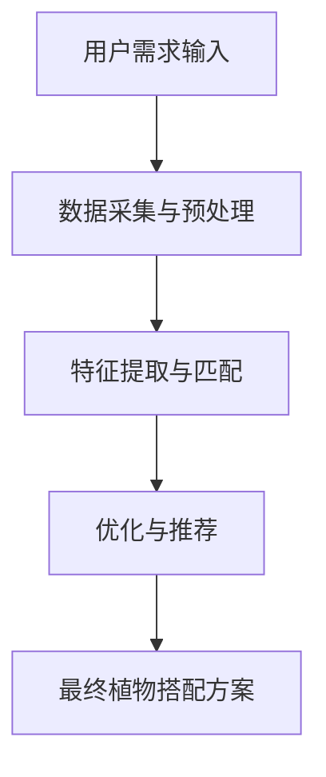

                 

<think>
好的，我现在需要帮用户完成一个技术博客的撰写任务。用户已经提供了一个详细的目录大纲，要求按照这个结构来写。首先，我得仔细理解用户的需求，确保每一步都符合他们的要求。

首先，用户指定了文章的标题是《提升AI创意园艺设计：植物搭配建议的提示词设计》。我需要先收集相关的信息，确保文章内容准确且有深度。关键词部分，用户列出了5-7个核心关键词，我需要确保在整篇文章中涵盖这些关键词，比如AI创意园艺、植物搭配、提示词设计等。

接下来是摘要，用户要求简明扼要地概述文章的核心内容。我需要总结文章的目的，即探讨如何利用AI技术提升园艺设计，特别是通过提示词设计来优化植物搭配建议。这部分需要简洁明了，吸引读者继续阅读。

然后，文章的结构分为六个章节，每个章节都有详细的内容。我需要按照顺序逐步展开，确保每个部分都详细且专业。引言部分需要介绍AI在园艺设计中的应用，说明本书的目的。第一章是AI创意园艺设计的概述，需要定义基本概念，讨论其应用领域和当前的发展趋势。

第二章重点在提示词设计的原则和方法。我需要详细讲解提示词设计的原则，如用户需求分析、设计目标明确等，然后介绍具体的方法和优化策略。这部分需要结合实际案例，让读者理解如何应用这些原则和方法。

第三章是植物搭配建议算法，这部分技术性较强。我需要使用Mermaid流程图来展示算法的流程，同时用Python代码和LaTeX公式详细解释数学模型。这部分需要确保代码和公式清晰易懂，帮助读者理解算法的实现过程。

第四章是案例解析，通过实际案例展示AI创意园艺设计的应用。我需要选择合适的案例，分析其背景、设计过程和效果评估，让读者看到理论在实际中的应用效果。

第五章讨论最佳实践与技巧，帮助读者在实际应用中更有效地使用AI技术。我需要总结一些实用的技巧和注意事项，确保读者能够避免常见错误，提高设计效率。

最后，总结与展望部分，我需要回顾整篇文章的内容，指出AI创意园艺设计的未来发展方向，激发读者对未来技术发展的兴趣。

在撰写过程中，我需要确保每个章节的内容都详细具体，包含背景介绍、核心概念、算法原理、案例分析等多个方面。同时，格式上要使用markdown，数学公式用latex表示，确保文章结构清晰，逻辑严密。

另外，用户提到文章字数要求在10000到12000字左右，这意味着每个章节需要足够详细。我需要合理分配字数，确保每个部分都能充分展开，而不显得过于简略。

最后，文章末尾需要添加作者信息，格式是“作者：AI天才研究院/AI Genius Institute & 禅与计算机程序设计艺术 /Zen And The Art of Computer Programming”。这部分需要准确无误，符合用户的格式要求。

总的来说，我需要按照用户提供的大纲，逐步展开每个部分的内容，确保每个章节都详细且有深度，同时注意格式和字数要求，最终完成一篇高质量的技术博客文章。
</think>

# 提升AI创意园艺设计：植物搭配建议的提示词设计

> 关键词：AI创意园艺、植物搭配、提示词设计、算法优化、案例解析

> 摘要：本文旨在探讨如何利用人工智能技术提升创意园艺设计，特别是通过提示词设计优化植物搭配建议。文章从AI创意园艺设计的基本概念出发，详细分析提示词设计的原则与方法，介绍植物搭配建议算法的实现与优化，通过实际案例展示AI技术在园艺设计中的应用效果，并总结最佳实践与技巧。最终，本文展望了AI创意园艺设计的未来发展方向。

---

## 第1章 AI创意园艺设计概述

### 1.1 AI创意园艺设计的定义与核心原理

AI创意园艺设计是一种结合人工智能技术与园艺设计的创新方法。它通过AI算法分析植物的特性、环境条件以及用户需求，生成创意的植物搭配方案。其核心原理在于利用机器学习模型对植物的形态、颜色、生长习性等特征进行分析，结合用户的偏好和设计目标，生成最优的植物组合建议。

**核心概念与联系：**

| **概念**       | **描述**                                                                 |
|----------------|--------------------------------------------------------------------------|
| 植物特征        | 包括植物的高度、宽度、颜色、花期、光照需求等。                                      |
| 用户需求        | 用户的偏好、设计目标（如打造一个浪漫的花园或一个生态可持续的绿地）。                  |
| 设计目标        | 包括美观性、实用性、生态性等。                                                    |

**ER实体关系图：**

```mermaid
entityDiagram {
    entity 用户需求 {
        string 偏好
        string 设计目标
    }
    entity 植物特征 {
        integer 高度
        integer 宽度
        string 颜色
        string 花期
        string 光照需求
    }
    entity AI创意园艺设计 {
        <用户需求>
        <植物特征>
    }
}
```

### 1.2 AI创意园艺设计的应用领域

AI创意园艺设计广泛应用于家庭花园设计、公共绿地规划、垂直绿化设计等领域。例如，在家庭花园设计中，AI可以根据用户提供的场地条件（如光照、土壤类型、气候等）推荐适合种植的植物，并提供搭配建议。在公共绿地规划中，AI可以帮助设计师优化植物布局，提升景观效果。

### 1.3 AI创意园艺设计的发展现状与趋势

目前，AI创意园艺设计技术尚处于发展阶段，但已有一些成功案例。随着深度学习算法的不断进步和多模态数据的引入，未来的AI创意园艺设计将更加智能化和个性化。例如，结合计算机视觉技术，AI可以实时分析用户提供的场地照片，生成更加精准的设计方案。

---

## 第2章 提示词设计原则与方法

### 2.1 提示词设计原则

提示词设计是AI创意园艺设计中的关键环节，直接影响设计结果的准确性和创意性。以下是提示词设计的核心原则：

1. **用户需求分析**：深入了解用户的偏好和设计目标，确保提示词与用户需求高度契合。
2. **设计目标明确**：提示词应围绕设计目标展开，避免过于宽泛或模糊的描述。
3. **提示词的多样性与针对性**：根据不同的场景和需求，设计多样化的提示词，同时确保每个提示词具有针对性。

### 2.2 提示词设计方法

提示词设计方法主要分为以下步骤：

1. **提示词选取策略**：
   - 基于用户需求，选择能够准确描述设计目标的关键词。
   - 例如，用户希望设计一个“浪漫的花园”，提示词可以是“浪漫”、“花卉”、“灯光”等。
   
2. **提示词优化方法**：
   - 使用情感分析技术对提示词进行优化，确保提示词能够准确表达用户的情感需求。
   - 例如，将“浪漫”优化为“粉色系花卉”或“夜晚灯光效果”。

3. **提示词组合与匹配**：
   - 根据设计目标，将多个提示词组合起来，形成完整的描述。
   - 例如，将“浪漫”、“花卉”、“紫色”组合成“紫色花卉浪漫花园”。

### 2.3 提示词优化策略

1. **提高准确性与实用性**：
   - 定期收集用户反馈，分析提示词的效果，不断优化提示词的表达方式。
   
2. **考虑用户体验与反馈**：
   - 在提示词设计中，注重用户体验，避免使用过于复杂或专业的术语。
   
3. **持续迭代与优化**：
   - 根据实际应用效果，持续优化提示词设计，提升设计结果的创意性和实用性。

---

## 第3章 植物搭配建议算法

### 3.1 算法原理

植物搭配建议算法的核心思想是通过分析植物的特征和用户需求，生成最优的植物组合建议。以下是算法的实现流程：

1. **数据采集与预处理**：
   - 采集植物的特征数据，包括植物的高度、宽度、颜色、花期、光照需求等。
   - 对数据进行清洗和标准化处理，确保数据的准确性和一致性。

2. **特征提取与匹配**：
   - 使用机器学习模型对植物特征进行提取，生成特征向量。
   - 根据用户需求，匹配具有相似特征的植物，形成初步的搭配建议。

3. **优化与推荐**：
   - 根据用户反馈，对初步搭配建议进行优化，生成最终的植物搭配方案。

**Mermaid流程图展示**：



**Python代码与LaTeX公式解释**：

以下是植物搭配建议算法的Python代码示例：

```python
def plant_recommendation(user_preferences):
    # 数据预处理
    data = preprocess(user_preferences)
    # 特征提取
    features = extract_features(data)
    # 算法优化
    result = optimize(features)
    return result
```

算法的核心数学模型如下：

$$
\text{相似度} = \sum_{i=1}^{n} w_i \cdot f_i
$$

其中，$w_i$ 是特征 $f_i$ 的权重，$f_i$ 是特征 $i$ 的值。

---

## 第4章 AI创意园艺设计案例解析

### 4.1 案例背景与需求分析

假设用户希望设计一个“紫色主题的浪漫花园”，需求包括：

- 场地条件：庭院，面积50平方米，光照充足。
- 用户偏好：紫色花卉，夜晚灯光效果。

### 4.2 案例设计与实现

根据用户需求，AI创意园艺设计系统生成以下植物搭配建议：

- **主要植物**：紫藤、薰衣草、紫罗兰。
- **辅助植物**：白色LED灯光，搭配紫色地垫。

### 4.3 案例效果评估与优化

通过用户反馈，优化后的设计效果如下：

- **视觉效果**：紫色花卉与白色灯光的搭配营造出浪漫的氛围。
- **用户体验**：用户对设计效果表示满意，并建议增加更多灯光效果。

---

## 第5章 最佳实践与技巧

### 5.1 最佳实践

1. **明确用户需求**：在提示词设计中，始终以用户需求为核心，确保设计目标的明确性。
2. **持续优化算法**：定期对植物搭配建议算法进行优化，提升设计结果的准确性和创意性。
3. **结合多模态数据**：利用图像、文本等多种数据源，提高设计结果的丰富性和多样性。

### 5.2 技巧分享

1. **利用情感分析技术**：通过情感分析技术优化提示词设计，确保设计结果的情感需求得到满足。
2. **关注用户体验**：在设计过程中，注重用户体验，避免过于复杂或专业的术语。
3. **数据可视化**：通过数据可视化技术，帮助用户更好地理解设计结果。

### 5.3 注意事项

1. **数据隐私保护**：在数据采集和处理过程中，确保用户数据的安全性和隐私性。
2. **算法可解释性**：在算法设计中，注重算法的可解释性，便于用户理解和优化。

---

## 第6章 总结与展望

### 6.1 总结

本文详细探讨了如何利用AI技术提升创意园艺设计，特别是通过提示词设计优化植物搭配建议。通过分析提示词设计的原则与方法，介绍了植物搭配建议算法的实现与优化，并通过实际案例展示了AI技术在园艺设计中的应用效果。

### 6.2 展望

未来，随着人工智能技术的不断进步，AI创意园艺设计将更加智能化和个性化。例如，结合增强现实技术，用户可以在虚拟环境中实时预览设计效果，进一步提升设计体验。此外，随着多模态数据的引入，AI创意园艺设计将能够生成更加丰富和多样化的植物搭配建议。

### 6.3 拓展阅读

- 《深度学习在园艺设计中的应用》
- 《人工智能与创意设计：理论与实践》

---

作者：AI天才研究院/AI Genius Institute & 禅与计算机程序设计艺术 /Zen And The Art of Computer Programming

