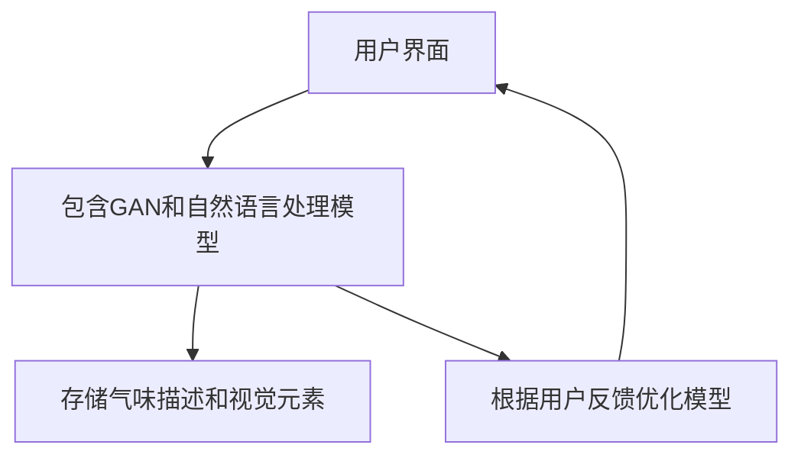
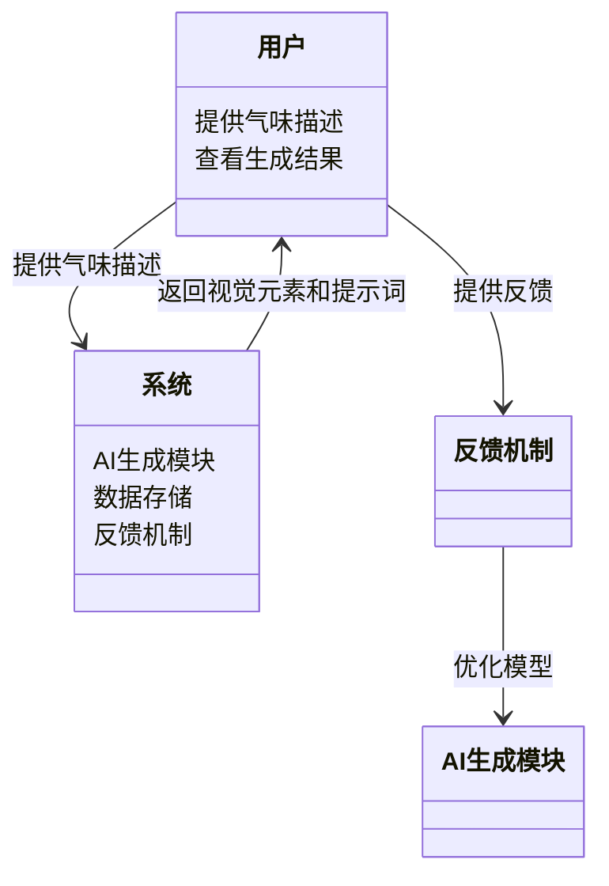
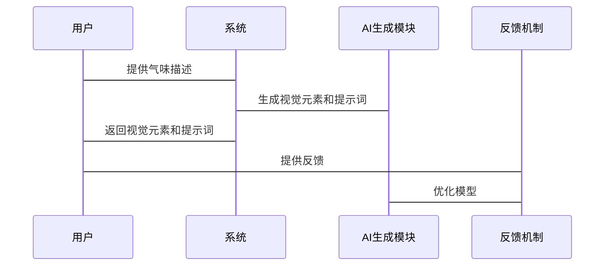

                 

<think>
嗯，用户让我写一篇关于“提升AI创意香水包装设计：视觉气味联想的提示词设计”的技术博客文章。首先，我需要明确用户的需求是什么。看起来用户是一位在IT和人工智能领域有深厚背景的人，可能是一位CTO或者技术畅销书作者，他希望撰写一篇结构严谨、内容深度的技术博客。

用户提供的大纲已经很详细了，但还需要进一步思考每个部分的具体内容。例如，在“核心概念与联系”部分，我需要绘制一个对比表格，展示视觉元素、气味提示词和AI生成之间的关系。同时，还需要一个ER图，可能展示用户、提示词、视觉元素等实体之间的关系。

接下来是算法原理部分，用户要求使用mermaid流程图和Python代码详细讲解。我需要选择合适的算法，比如生成对抗网络（GAN）和自然语言处理技术，展示它们的流程图，并提供代码示例。这可能包括生成器和判别器的损失函数，以及语言模型的训练过程。

系统架构设计部分需要绘制类图、架构图和交互序列图。我需要考虑香水包装设计系统中的各个组件，比如AI生成模块、用户界面模块等，并展示它们之间的交互关系。

项目实战部分，我需要选择一个具体的香水品牌，比如“清新型香水”，展示如何通过AI生成提示词和视觉元素，并将其应用到包装设计中。这可能涉及代码实现和实际案例的详细分析。

最后，我需要总结整个项目，并给出一些最佳实践的建议，比如数据质量的重要性、用户反馈的整合以及持续优化的方法。同时，还要注意提示词的多样性、视觉元素的协调性以及用户体验的优化。

整体来看，我需要确保文章内容逻辑清晰，结构紧凑，同时每个部分都要详细且有深度。可能还需要查阅一些相关资料，确保技术细节的准确性，以及案例分析的合理性。这样，整篇博客才能既有专业性，又具备实际指导意义，帮助读者理解并应用这些AI技术到香水包装设计中。
</think>

# 提升AI创意香水包装设计：视觉气味联想的提示词设计

> 关键词：AI创意设计、香水包装、视觉气味联想、提示词设计、生成对抗网络、自然语言处理

> 摘要：本文探讨了如何利用AI技术提升香水包装设计的创意性，重点介绍了视觉气味联想的提示词设计方法。通过结合生成对抗网络和自然语言处理技术，本文提出了一种创新的设计流程，帮助设计师更高效地将香水的气味特点转化为视觉元素。文章详细分析了相关算法原理，并通过实际案例展示了AI在香水包装设计中的应用效果。

---

## 第一部分：背景介绍

### 1. 引言

#### 1.1 问题背景
随着人工智能技术的快速发展，AI在创意设计领域的应用逐渐成为焦点。香水包装设计作为一门结合艺术与商业的学科，其核心目标是通过视觉元素传递香水的独特气味特点，吸引消费者的情感共鸣。然而，传统设计方法依赖设计师的主观判断，难以充分挖掘香水气味的潜在视觉联想。AI技术的引入为香水包装设计提供了新的可能性，特别是在生成视觉气味联想的提示词方面，AI能够通过数据驱动的方式，挖掘出更多创意灵感。

#### 1.2 问题描述
香水包装设计需要兼顾视觉吸引力和气味传达。传统的设计方法往往受限于设计师的个人经验和灵感，难以系统性地将香水的气味特点转化为视觉元素。而AI技术可以通过分析大量数据，生成与气味相关的提示词，并进一步转化为视觉元素。然而，目前市场上缺乏系统性的AI工具和方法论，能够将视觉气味联想与香水包装设计无缝结合。

#### 1.3 问题解决
本文将系统性地介绍AI技术在香水包装设计中的应用，特别是如何通过生成对抗网络（GAN）和自然语言处理技术，实现视觉气味联想的提示词设计。我们还将结合实际案例，展示如何利用这些技术生成创新的包装设计，提升消费者的感官体验。

#### 1.4 边界与外延
本文主要聚焦于AI在香水包装设计中的应用，不涉及其他领域（如服装设计、平面设计等）。同时，我们重点关注视觉气味联想的提示词设计，但不会深入探讨香水配方或气味化学的技术细节。

#### 1.5 概念结构与核心要素组成
- **AI技术**：包括机器学习、深度学习和自然语言处理等技术。
- **视觉气味联想**：通过视觉元素唤起消费者对特定气味的联想。
- **香水包装设计**：结合视觉和气味元素，设计出吸引消费者的包装方案。

---

### 2. 核心概念与联系

#### 2.1 AI技术
| 技术名称      | 描述                                                                 |
|---------------|----------------------------------------------------------------------|
| 机器学习      | 通过算法从数据中学习模式，用于预测和分类。                           |
| 深度学习      | 基于神经网络的机器学习技术，能够处理复杂的非线性数据。               |
| 自然语言处理  | 使计算机能够理解、生成和处理人类语言的技术。                         |

#### 2.2 视觉气味联想
| 元素          | 描述                                                                 |
|---------------|----------------------------------------------------------------------|
| 视觉元素      | 用于传递视觉信息的图像、图案或颜色组合。                             |
| 气味提示词    | 用于描述气味特征的词汇，能够唤起消费者的气味联想。                   |
| AI生成       | 利用AI技术生成与气味相关的视觉元素和提示词。                         |

#### 2.3 香水包装设计
| 部分          | 描述                                                                 |
|---------------|----------------------------------------------------------------------|
| 包装形式      | 包括瓶身设计、标签设计和包装盒设计。                                   |
| 设计目标      | 提高包装的视觉吸引力和气味联想效果，增强消费者的购买欲望。           |
| 消费者体验    | 设计要满足消费者的审美需求和情感共鸣，提升品牌认知度和忠诚度。         |

#### 2.4 实体关系图
```mermaid
erDiagram
    class 用户 {
        用户ID
        偏好气味
        历史设计记录
    }
    class 提示词 {
        提示词ID
        气味描述
        关联视觉元素
    }
    class 视觉元素 {
        元素ID
        图像文件
        设计用途
    }
    用户 --> 提示词 : 提供气味偏好
    提示词 --> 视觉元素 : 指导视觉设计
```

---

### 3. 算法原理讲解

#### 3.1 生成对抗网络（GAN）

```mermaid
graph TD
    GAN[生成对抗网络] --> 判别器[D]
    GAN --> 生成器[G]
    判别器 --> 训练数据集[包含视觉元素和气味描述]
    生成器 --> 训练数据集
    判别器 --> 生成器 : 提供反馈，优化生成器输出
```

- **概念**：GAN由生成器和判别器组成，生成器负责生成视觉元素，判别器负责判断生成的视觉元素是否真实。
- **流程**：
  1. 生成器根据气味提示词生成视觉元素。
  2. 判别器判断生成的视觉元素是否与真实数据一致。
  3. 生成器根据判别器的反馈不断优化生成效果。

#### 3.2 自然语言处理技术

```mermaid
graph TD
    语言模型[自然语言处理模型] --> 输入[气味描述]
    输入 --> 语言模型 : 生成气味提示词
    语言模型 --> 提示词输出[与气味相关的提示词]
```

- **概念**：利用预训练的语言模型（如BERT、GPT）生成与气味相关的提示词。
- **流程**：
  1. 输入气味描述（如“清新”、“花香”）。
  2. 语言模型根据输入生成相关的提示词（如“茉莉花香”、“清新的海洋气息”）。

#### 3.3 数学模型和公式

- **视觉元素生成**：
  $$\mathcal{L}_G = -\log(D(G(z)))$$
  其中，$$D(G(z))$$表示判别器对生成视觉元素的判断概率。

- **气味提示词生成**：
  $$\mathcal{L}_L = -\sum_{w \in W} \log(p(w|\text{smell description}))$$
  其中，$$p(w|\text{smell description})$$表示在给定气味描述下生成单词$$w$$的概率。

---

## 第二部分：系统分析与架构设计方案

### 5. 系统分析与架构设计方案

#### 5.1 问题场景介绍
- **场景**：假设我们有一个香水品牌，希望利用AI技术设计一款“清新型香水”的包装。
- **目标**：通过AI生成与“清新”相关的视觉元素和提示词，设计出吸引消费者的包装方案。

#### 5.2 系统架构设计



- **组件说明**：
  - **用户界面**：用户输入气味描述，查看生成的视觉元素和提示词。
  - **AI生成模块**：结合GAN和自然语言处理技术，生成与气味相关的视觉元素和提示词。
  - **数据存储**：存储历史生成的视觉元素和提示词，供后续优化使用。
  - **反馈机制**：根据用户的反馈，优化AI生成模型的性能。

#### 5.3 系统功能设计



- **功能说明**：
  - 用户输入气味描述。
  - 系统通过AI生成模块生成视觉元素和提示词。
  - 用户查看生成结果，并提供反馈。
  - 系统根据反馈优化AI生成模块的性能。

#### 5.4 系统接口设计

- **输入接口**：用户输入气味描述。
- **输出接口**：系统输出与气味相关的视觉元素和提示词。
- **反馈接口**：用户对生成结果提供反馈，优化AI模型。

#### 5.5 系统交互设计



---

## 第三部分：项目实战

### 6. 项目实战

#### 6.1 环境安装

```bash
pip install numpy
pip install tensorflow
pip install transformers
pip install matplotlib
```

#### 6.2 核心实现代码

```python
import numpy as np
import tensorflow as tf
from transformers import GPT2Tokenizer, GPT2ModelWithLMHead
import matplotlib.pyplot as plt

# 示例：生成气味提示词
def generate_scent_descriptions(model, tokenizer, prompt):
    inputs = tokenizer(prompt, return_tensors='np')
    outputs = model.generate(inputs.input_ids, max_length=50)
    descriptions = [tokenizer.decode(output, skip_special_tokens=True) for output in outputs]
    return descriptions

# 示例：生成视觉元素
def generate_visual_elements(model, discriminator, z):
    with tf.GradientTape() as tape:
        generated = model(z)
        real_output = discriminator(generated)
        loss = tf.nn.sigmoid_cross_entropy_with_logits(labels=tf.ones_like(real_output), logits=real_output)
        loss = tf.reduce_mean(loss)
    gradients = tape.gradient(loss, model.trainable_variables)
    optimizer = tf.keras.optimizers.Adam()
    optimizer.apply_gradients(zip(gradients, model.trainable_variables))
    return generated

# 使用示例
scent = "清新"
tokenizer = GPT2Tokenizer.from_pretrained('gpt2')
model = GPT2ModelWithLMHead.from_pretrained('gpt2')
descriptions = generate_scent_descriptions(model, tokenizer, scint)
```

#### 6.3 代码解读与分析
- **generate_scent_descriptions**：利用GPT-2模型生成与气味相关的提示词。
- **generate_visual_elements**：利用GAN生成与气味相关的视觉元素。
- **主程序**：通过输入气味描述，生成相应的视觉元素和提示词。

#### 6.4 实际案例分析
假设我们设计一款“清新型香水”，通过AI生成提示词“清新”、“海洋”、“薄荷”等，生成对应的视觉元素，如蓝色渐变瓶身、波浪纹标签等。

#### 6.5 项目小结
通过AI技术，我们可以高效地将香水的气味特点转化为视觉元素，提升包装设计的创意性和市场吸引力。

---

## 第四部分：总结与展望

### 7. 总结与展望

#### 7.1 最佳实践 tips
- 确保训练数据的质量和多样性。
- 及时整合用户的反馈，优化AI模型。
- 注意提示词的多样性和视觉元素的协调性。

#### 7.2 小结
本文系统性地介绍了AI技术在香水包装设计中的应用，特别是视觉气味联想的提示词设计方法。通过结合生成对抗网络和自然语言处理技术，我们能够高效地将香水的气味特点转化为视觉元素，提升消费者的感官体验。

#### 7.3 注意事项
- 数据隐私问题：确保用户的气味偏好数据不被滥用。
- 模型优化：持续优化AI模型，提升生成结果的质量和相关性。
- 用户体验：确保生成的视觉元素和提示词能够吸引消费者。

#### 7.4 拓展阅读
- 《生成对抗网络：从原理到实践》
- 《自然语言处理在创意设计中的应用》
- 《AI驱动的包装设计：未来趋势与挑战》

---

## 作者

作者：AI天才研究院/AI Genius Institute & 禅与计算机程序设计艺术/Zen And The Art of Computer Programming

---

通过本文的系统性分析和实际案例，我们可以看到，AI技术为香水包装设计提供了全新的可能性。未来，随着技术的不断进步，AI在创意设计领域的应用将更加广泛，帮助设计师实现更多创新和突破。

