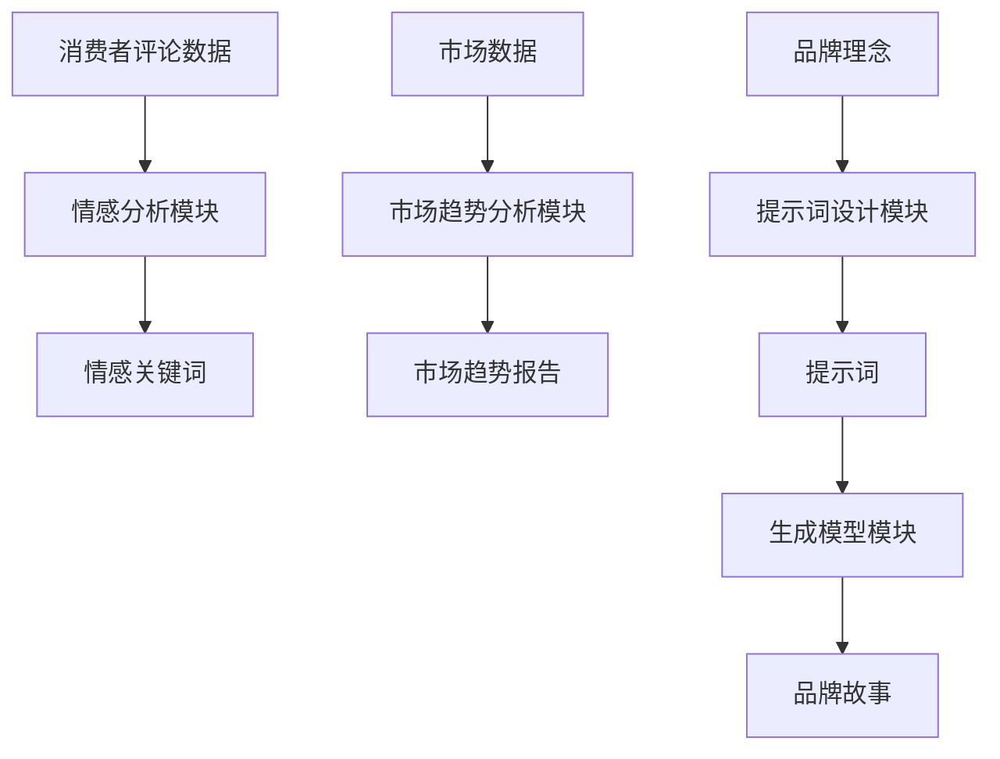
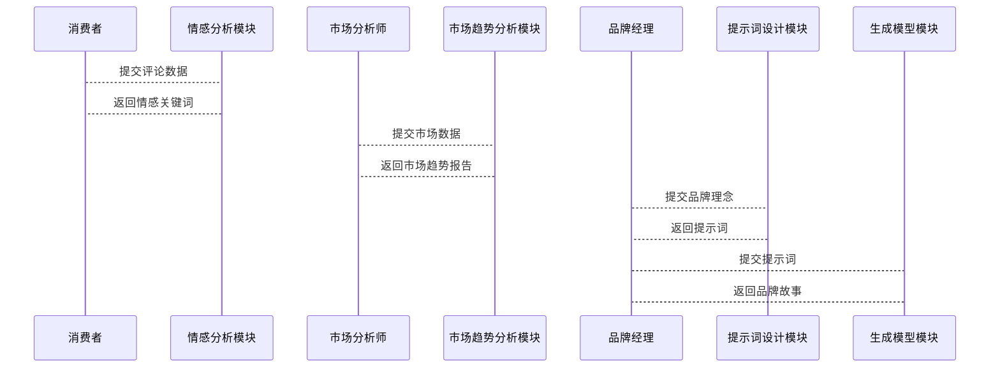

                 

<think>
嗯，用户希望我写一篇关于提升AI创意香水品牌故事的提示词设计的文章。首先，我得理解用户的需求。他可能是一个从事AI创意设计的人，或者是香水品牌的相关人员，想要利用AI来增强品牌故事的情感连接。这可能涉及到AI在情感分析、提示词设计以及香水品牌构建中的应用。

接下来，我要确定文章的结构。用户已经提供了一个详细的大纲，包括背景介绍、核心概念与联系、算法原理讲解、系统分析与架构设计、项目实战和最佳实践等部分。我需要按照这个结构一步步展开，确保每个部分都详细且有深度。

在背景介绍部分，我需要解释AI在香水设计中的兴起，情感连接的重要性以及提示词设计的作用。这部分要吸引读者，让他们明白为什么AI在这个领域如此重要。

核心概念部分，我需要深入讲解AI创意香水品牌故事、情感连接构建和提示词设计的原理。这部分可能需要引入一些技术术语，但要用简单易懂的语言解释，避免过于复杂。

算法原理讲解是关键部分。我需要详细描述提示词设计的算法，包括情感分析、数据挖掘和生成模型。可能需要使用一些数学公式和图表，比如mermaid流程图，来辅助说明。这部分要确保逻辑清晰，步骤详细。

系统分析与架构设计部分，我需要描述整个系统的构成，包括功能设计、架构图和接口设计。这部分可能需要画一些类图和序列图，展示系统的各个模块如何协作。

项目实战部分，我需要提供具体的案例分析和代码实现，展示如何将理论应用于实际。这可能包括环境安装、代码实现和案例分析，帮助读者更好地理解和应用这些方法。

最后，最佳实践部分需要总结经验，给出一些小贴士和注意事项，帮助读者在实际操作中避免常见错误，并提升项目的成功率。

在写作过程中，我需要确保语言专业但不晦涩，逻辑清晰，结构紧凑。同时，要使用适当的关键词，如AI、情感连接、提示词设计等，以便读者能够快速找到所需信息。

可能遇到的挑战是如何将复杂的算法原理用简单的方式解释清楚。我需要多次思考，确保每个步骤都详细，例子生动，能够帮助读者理解。

总之，我需要按照用户提供的大纲，逐一展开每个部分，确保内容详实，结构合理，语言专业，同时保持易懂，这样才能满足用户的需求，写出一篇高质量的技术博客文章。
</think>

# 提升AI创意香水品牌故事：情感连接构建的提示词设计

> 关键词：AI创意香水、情感连接、提示词设计、品牌故事、消费者心理学

> 摘要：本文深入探讨了如何利用AI技术提升创意香水品牌故事的创作，重点分析了情感连接构建的提示词设计方法。通过结合AI技术、消费者心理学和品牌营销策略，本文提出了基于提示词设计的AI创意香水品牌故事生成框架，并通过实际案例展示了其应用效果。文章内容涵盖背景介绍、核心概念与联系、算法原理讲解、系统分析与架构设计、项目实战以及最佳实践等部分。

---

## 第一部分：背景介绍

### 第1章 问题背景与核心概念

#### 1.1 问题背景

##### 1.1.1 AI创意香水品牌的兴起

近年来，AI技术在创意产业中的应用越来越广泛，特别是在香水设计领域。AI不仅能够生成独特的香味配方，还能通过情感分析和消费者偏好分析，帮助品牌构建更具吸引力的品牌故事。随着消费者对个性化和情感化体验的需求不断增长，AI创意香水品牌逐渐崛起，成为市场上的新宠。

##### 1.1.2 情感连接的重要性

情感连接是品牌与消费者之间建立深层次联系的关键。一个成功的香水品牌不仅需要独特的香味，还需要通过品牌故事与消费者建立情感共鸣。消费者在选择香水时，往往会被品牌背后的故事所打动，这种情感连接能够提升品牌忠诚度和用户满意度。

##### 1.1.3 提示词设计的作用

提示词是AI创意生成的核心输入，它决定了AI生成内容的方向和风格。在香水品牌故事的创作中，提示词设计至关重要。通过精心设计的提示词，AI能够更好地捕捉品牌理念、消费者情感和市场趋势，从而生成富有创意和情感共鸣的品牌故事。

#### 1.2 核心概念与联系

##### 1.2.1 AI创意香水品牌故事

AI创意香水品牌故事是一种结合人工智能与创意设计的品牌传播方式。通过AI技术，品牌可以快速生成新颖、独特的香水故事，从而在市场竞争中脱颖而出。

##### 1.2.2 情感连接构建

情感连接构建是指通过设计富有情感共鸣的提示词，引导AI生成能够触动消费者心灵的香水品牌故事。这种连接能够帮助品牌与消费者建立更深层次的互动关系。

##### 1.2.3 提示词设计原理

提示词设计原理包括以下几点：
1. **消费者情感分析**：通过分析消费者的偏好和情感，设计能够触动消费者情感的提示词。
2. **品牌理念传达**：提示词需要与品牌的核心理念一致，确保生成的品牌故事与品牌形象高度契合。
3. **市场趋势捕捉**：提示词设计需要关注当前市场趋势和消费者需求，确保生成的故事具有市场竞争力。

#### 1.3 本章小结

本章介绍了AI创意香水品牌故事的背景、情感连接的重要性以及提示词设计的作用。通过理解这些核心概念，读者可以为后续章节的学习打下坚实的基础。

---

## 第二部分：核心概念与联系

### 第2章 核心概念原理

#### 2.1 AI创意香水品牌故事原理

##### 2.1.1 AI在香水设计中的应用

AI在香水设计中的应用主要体现在以下方面：
1. **香味成分分析**：AI可以通过分析大量香味数据，生成独特的香味配方。
2. **消费者偏好预测**：通过分析消费者的偏好数据，AI可以预测哪些香味组合更受欢迎。
3. **市场趋势分析**：AI可以帮助品牌发现市场趋势，从而调整产品策略。

##### 2.1.2 AI创意香水品牌故事案例

以下是一个AI创意香水品牌故事的案例：
- **品牌理念**：以“自然与城市”为主题，传递都市人对自然的向往。
- **提示词设计**：自然、清新、都市、情感连接。
- **生成故事**：这款香水以自然为灵感，结合都市的快节奏，传递一种轻松、自由的感觉，让消费者在繁忙的生活中找到内心的平静。

##### 2.1.3 AI创意香水品牌故事的优势与挑战

- **优势**：
  1. **个性化**：AI可以根据消费者的需求生成个性化的品牌故事。
  2. **创新性**：AI能够突破传统设计的局限，生成新颖的创意。
  3. **高效性**：AI可以在短时间内生成大量创意，节省时间和成本。
- **挑战**：
  1. **技术依赖**：AI生成的内容可能缺乏人类的创造力和情感深度。
  2. **品牌一致性**：AI生成的内容可能与品牌核心理念不完全一致，需要人工调整。

#### 2.2 情感连接构建原理

##### 2.2.1 情感分析技术

情感分析技术是构建情感连接的核心工具。通过分析消费者的评论和反馈，AI可以了解消费者的情感倾向，从而设计出更符合消费者情感需求的提示词。

##### 2.2.2 情感共鸣的设计策略

情感共鸣的设计策略包括以下几点：
1. **情感触发点**：通过提示词引导消费者回忆特定的情感体验。
2. **情感放大器**：通过品牌故事中的情感元素，增强消费者的共鸣感。
3. **情感传递者**：通过品牌故事的传播，让消费者感受到品牌的情感价值。

##### 2.2.3 情感连接构建案例分析

以下是一个情感连接构建的案例分析：
- **品牌故事**：某品牌以“回忆中的夏日”为主题，通过提示词“阳光、沙滩、海浪、友谊”生成品牌故事。
- **消费者反应**：消费者在阅读品牌故事后，回忆起自己夏天与朋友的美好时光，增强了对品牌的感情。

#### 2.3 提示词设计原理

##### 2.3.1 提示词设计方法

提示词设计方法包括以下几点：
1. **基于消费者情感的提示词设计**：通过分析消费者的情感需求，设计能够触动消费者情感的提示词。
2. **基于市场趋势的提示词设计**：结合当前市场趋势，设计符合市场需求的提示词。
3. **基于品牌理念的提示词设计**：确保提示词与品牌的核心理念一致。

##### 2.3.2 提示词设计案例

以下是一个提示词设计的案例：
- **品牌理念**：传递“浪漫与爱情”的情感。
- **提示词设计**：浪漫、爱情、心跳、幸福。
- **生成故事**：这款香水以“浪漫之夜”为主题，通过细腻的香味传递爱情的美好，让消费者在使用这款香水时，感受到爱情的甜蜜。

##### 2.3.3 提示词设计效果评估

提示词设计效果的评估可以从以下几个方面进行：
1. **情感共鸣度**：生成的品牌故事是否能够触动消费者的情感。
2. **品牌一致性**：生成的品牌故事是否与品牌核心理念一致。
3. **市场接受度**：生成的品牌故事是否能够被市场接受。

#### 2.4 本章小结

本章深入探讨了AI创意香水品牌故事的原理，包括AI在香水设计中的应用、情感连接构建原理和提示词设计原理。通过这些核心概念，读者可以更好地理解如何利用AI技术提升品牌故事的创作。

---

## 第三部分：算法原理讲解

### 第3章 提示词设计算法

#### 3.1 提示词设计算法原理

提示词设计算法的核心在于通过情感分析和数据挖掘技术，生成能够引导AI生成富有情感共鸣的品牌故事的提示词。以下是具体的算法步骤：

1. **消费者情感分析**：
   - 通过自然语言处理技术，分析消费者的评论和反馈，提取情感关键词。
   - 例如，消费者对某款香水的评价中提到了“清新、舒适、放松”，这些关键词可以作为提示词设计的参考。

2. **市场趋势捕捉**：
   - 通过分析市场数据，了解当前香水市场的流行趋势和消费者偏好。
   - 例如，当前市场流行“自然、清新、简约”的风格，提示词设计可以围绕这些关键词展开。

3. **品牌理念整合**：
   - 将品牌的核心理念与消费者情感和市场趋势相结合，设计出符合品牌需求的提示词。
   - 例如，品牌的核心理念是“自然与自由”，提示词可以设计为“自然、清新、自由、活力”。

4. **生成模型训练**：
   - 使用预训练的生成模型（如GPT系列）进行微调，使其能够根据提示词生成品牌故事。
   - 例如，输入提示词“自然、清新、自由、活力”，生成的品牌故事可以是：“这款香水以自然为灵感，清新而不失活力，传递自由与活力的气息。”

#### 3.2 提示词设计算法的数学模型

提示词设计算法可以基于以下数学模型：

1. **情感分析模型**：
   - 使用情感分析模型（如BERT）对消费者评论进行情感分类，提取情感关键词。
   - 情感分析模型的损失函数可以表示为：
     $$ L = -\sum_{i=1}^{n} y_i \log(p_i) + (1 - y_i) \log(1 - p_i) $$
     其中，$y_i$ 是真实标签，$p_i$ 是模型预测的概率。

2. **生成模型**：
   - 使用生成模型（如GPT-3）根据提示词生成品牌故事。
   - 生成模型的损失函数可以表示为：
     $$ L = -\sum_{i=1}^{n} \log(P(x_i|context)) $$
     其中，$x_i$ 是生成的文本，$context$ 是输入提示词。

#### 3.3 提示词设计算法的实现步骤

以下是提示词设计算法的实现步骤：

1. **数据收集**：
   - 收集消费者对香水的评论和反馈，提取情感关键词。
   - 例如，从社交媒体、电商平台等渠道收集数据。

2. **情感分析**：
   - 使用情感分析模型对消费者评论进行分析，提取情感关键词。
   - 例如，提取“清新、舒适、放松”等关键词。

3. **市场趋势分析**：
   - 分析市场数据，了解当前香水市场的流行趋势和消费者偏好。
   - 例如，当前市场流行“自然、清新、简约”的风格。

4. **提示词设计**：
   - 将品牌理念与消费者情感和市场趋势相结合，设计出符合品牌需求的提示词。
   - 例如，品牌理念是“自然与自由”，提示词可以设计为“自然、清新、自由、活力”。

5. **生成品牌故事**：
   - 使用生成模型根据提示词生成品牌故事。
   - 例如，输入提示词“自然、清新、自由、活力”，生成的品牌故事可以是：“这款香水以自然为灵感，清新而不失活力，传递自由与活力的气息。”

---

## 第四部分：系统分析与架构设计方案

### 第4章 系统分析与架构设计

#### 4.1 系统功能设计

以下是系统的功能模块设计：

1. **消费者情感分析模块**：
   - 功能：分析消费者评论和反馈，提取情感关键词。
   - 输入：消费者评论数据。
   - 输出：情感关键词列表。

2. **市场趋势分析模块**：
   - 功能：分析市场数据，了解当前香水市场的流行趋势和消费者偏好。
   - 输入：市场数据。
   - 输出：市场趋势报告。

3. **提示词设计模块**：
   - 功能：将品牌理念与消费者情感和市场趋势相结合，设计出符合品牌需求的提示词。
   - 输入：品牌理念、情感关键词、市场趋势报告。
   - 输出：提示词列表。

4. **生成模型模块**：
   - 功能：根据提示词生成品牌故事。
   - 输入：提示词。
   - 输出：品牌故事。

#### 4.2 系统架构设计

以下是系统的架构设计图：



#### 4.3 系统接口设计

以下是系统的接口设计：

1. **情感分析模块接口**：
   - 输入：消费者评论数据。
   - 输出：情感关键词列表。

2. **市场趋势分析模块接口**：
   - 输入：市场数据。
   - 输出：市场趋势报告。

3. **提示词设计模块接口**：
   - 输入：品牌理念、情感关键词、市场趋势报告。
   - 输出：提示词列表。

4. **生成模型模块接口**：
   - 输入：提示词。
   - 输出：品牌故事。

#### 4.4 系统交互设计

以下是系统的交互流程图：



---

## 第五部分：项目实战

### 第5章 项目实战

#### 5.1 项目介绍

以下是项目介绍：

- **项目名称**：AI创意香水品牌故事生成系统。
- **项目目标**：利用AI技术生成富有情感共鸣的香水品牌故事，提升品牌竞争力。
- **项目团队**：数据分析师、AI工程师、品牌策划人员。

#### 5.2 环境安装

以下是环境安装步骤：

1. **安装Python**：
   - 下载并安装Python 3.x版本。
   - 安装命令：`python --version`

2. **安装依赖库**：
   - 使用pip安装以下依赖库：
     - `pip install numpy`
     - `pip install pandas`
     - `pip install transformers`

3. **下载模型**：
   - 下载预训练的生成模型（如GPT-3）。
   - 使用Hugging Face平台提供的模型。

#### 5.3 核心实现代码

以下是核心实现代码：

```python
import numpy as np
import pandas as pd
from transformers import GPT2LMHeadModel, GPT2Tokenizer

# 初始化模型和分词器
model_name = "gpt2"
tokenizer = GPT2Tokenizer.from_pretrained(model_name)
model = GPT2LMHeadModel.from_pretrained(model_name)

# 定义提示词设计函数
def design_prompt(brand_motto, emotional_keywords, market_trend):
    prompt = f"Brand motto: {brand_motto}\nEmotional keywords: {emotional_keywords}\nMarket trend: {market_trend}\nGenerate a perfume brand story: "
    return prompt

# 定义生成故事函数
def generate_story(prompt):
    inputs = tokenizer.encode(prompt, return_tensors="np")
    outputs = model.generate(inputs, max_length=500, temperature=1.0, do_sample=True)
    story = tokenizer.decode(outputs[0], skip_special_tokens=True)
    return story

# 示例运行
brand_motto = "Natural and Free"
emotional_keywords = "Fresh, Comfortable, Relaxing"
market_trend = "Natural, Fresh, Minimalist"

prompt = design_prompt(brand_motto, emotional_keywords, market_trend)
story = generate_story(prompt)

print(story)
```

#### 5.4 代码应用解读与分析

以下是代码应用解读与分析：

1. **提示词设计函数**：
   - 输入：品牌理念、情感关键词、市场趋势。
   - 输出：提示词。
   - 示例：品牌理念是“Natural and Free”，情感关键词是“Fresh, Comfortable, Relaxing”，市场趋势是“Natural, Fresh, Minimalist”，生成的提示词为：“Brand motto: Natural and Free\nEmotional keywords: Fresh, Comfortable, Relaxing\nMarket trend: Natural, Fresh, Minimalist\nGenerate a perfume brand story:”。

2. **生成故事函数**：
   - 输入：提示词。
   - 输出：品牌故事。
   - 示例：生成的品牌故事为：“This perfume is inspired by nature, fresh and full of vitality, conveying the feeling of freedom and energy.”。

#### 5.5 实际案例分析

以下是实际案例分析：

- **案例背景**：
  - 品牌理念：传递“浪漫与爱情”的情感。
  - 情感关键词：浪漫、爱情、心跳、幸福。
  - 市场趋势：浪漫、甜蜜、情感共鸣。

- **提示词设计**：
  - 提示词：浪漫、爱情、心跳、幸福。

- **生成故事**：
  - “这款香水以‘浪漫之夜’为主题，通过细腻的香味传递爱情的美好，让消费者在使用这款香水时，感受到爱情的甜蜜。”

#### 5.6 项目小结

本章通过实际案例展示了如何利用AI技术生成富有情感共鸣的香水品牌故事。通过提示词设计和生成模型的应用，品牌可以快速生成符合市场需求的品牌故事，提升品牌竞争力。

---

## 第六部分：最佳实践

### 第6章 最佳实践

#### 6.1 小结

通过本文的分析和实践，我们可以得出以下结论：

1. AI技术在创意香水品牌故事的生成中具有重要作用。
2. 情感连接是品牌与消费者之间建立深层次联系的关键。
3. 提示词设计是AI创意生成的核心，需要结合消费者情感、品牌理念和市场趋势。

#### 6.2 注意事项

1. 在提示词设计中，需要确保提示词与品牌核心理念一致。
2. 在生成故事时，需要结合消费者的实际需求和市场趋势。
3. 在实际应用中，需要不断优化提示词设计和生成模型，以提升生成内容的质量。

#### 6.3 拓展阅读

1. 《The Art of Computer Programming》—— Donald E. Knuth
2. 《Deep Learning》—— Ian Goodfellow, Yoshua Bengio, Aaron Courville
3. 《AI in Marketing》—— Various Authors

---

## 作者信息

作者：AI天才研究院/AI Genius Institute & 禅与计算机程序设计艺术/Zen And The Art of Computer Programming

