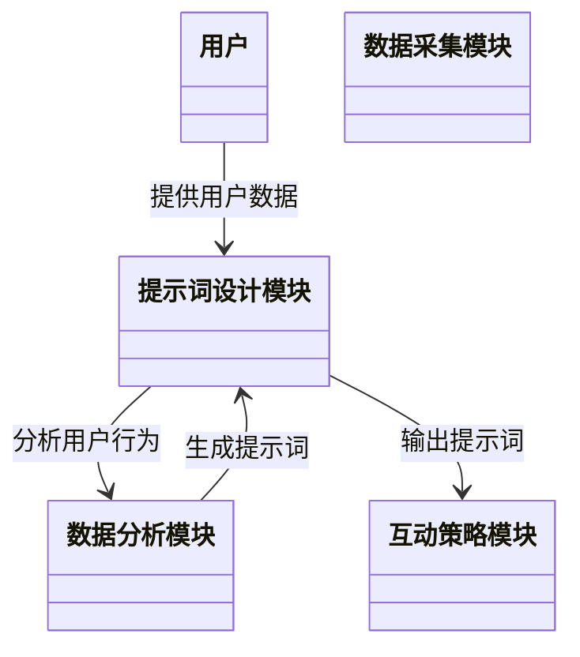
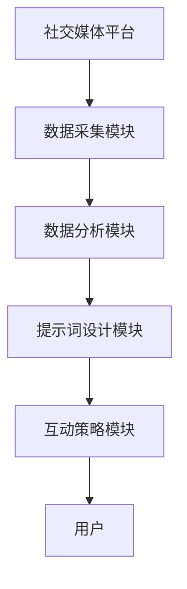
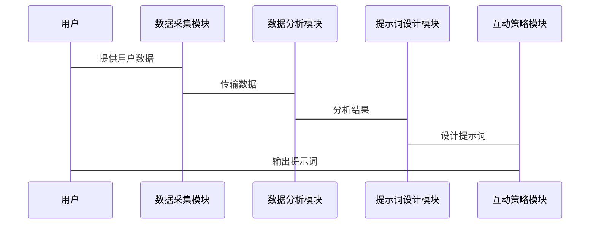

                 

<think>
嗯，我现在要写一篇关于“提升AI创意香水品牌社交媒体策略：病毒式传播的提示词设计”的技术博客。首先，我得理解这个主题的核心是什么。AI创意香水品牌，听起来挺有意思的，是说用AI来设计香水，然后通过社交媒体推广，对吧？那病毒式传播的提示词设计就是说，如何利用提示词让内容在社交媒体上快速传播，达到营销效果。

首先，我需要理清问题背景。社交媒体现在是品牌推广的重要渠道，但传统的方法可能不够有效了，特别是对于像香水这样的个性化产品。消费者的需求多样化，品牌之间竞争激烈，传统的广告可能难以吸引他们的注意。所以，我需要用AI来优化提示词设计，让内容更具吸引力，促进分享，从而实现病毒式传播。

接下来，问题描述部分，我需要详细说明问题是什么。社交媒体策略的成功取决于内容、互动策略和数据分析。对于AI创意香水品牌，如何设计有效的提示词，如何利用AI技术来分析用户行为和偏好，这些都是关键问题。病毒式传播的提示词设计，需要结合消费者心理学和社交媒体传播机制，找到能够激发用户兴趣和分享欲望的关键点。

在问题解决部分，我需要提出具体的解决方案。首先，数据采集和处理是基础。我需要从社交媒体平台获取数据，了解用户的兴趣和行为模式。然后，通过用户行为分析，构建用户画像，识别他们的痛点和偏好。接着，利用这些数据设计提示词，确保内容与用户需求高度匹配。此外，还需要考虑内容的形式，比如短视频、互动测试等，来提高传播效果。

边界与外延部分，我需要明确病毒式传播的提示词设计不仅仅适用于香水品牌，其他品牌也可以借鉴这种方法。同时，AI技术的应用不仅仅局限于当前的算法，未来还可能有更多创新，比如结合增强现实技术或者更高级的生成模型。

接下来是AI技术基础部分，我需要详细讲解AI在社交媒体中的应用。首先是数据采集与处理，这部分包括数据来源、采集方法和预处理流程。然后是用户行为分析，涉及兴趣分析、参与度分析和用户画像的构建。接着是内容推荐与优化，这里可以介绍推荐算法和实时调整策略。

然后是社交媒体互动策略中的AI应用，情感分析和客户服务自动化是两个重点。情感分析可以帮助品牌了解用户情绪，自动化回复可以提升客户服务质量。最后是广告投放优化，包括广告策略、效果评估和定向广告的设计。

在系统分析与架构设计方案部分，我需要绘制领域模型的类图，展示系统的各个模块和它们之间的关系。系统架构设计图可能需要展示数据流、处理流程和接口设计。系统交互的序列图可以展示用户与系统之间的互动流程，帮助理解整个系统的工作机制。

项目实战部分，我需要详细讲解如何安装必要的库，比如Python的自然语言处理库和机器学习库。然后，展示核心代码，解释其功能和应用场景。通过具体的案例分析，说明提示词设计如何影响社交媒体上的传播效果，以及这些提示词如何帮助品牌提升用户参与度和销售额。

最后，总结部分需要回顾整个方案，强调AI技术在提升社交媒体策略中的重要性，同时指出未来的发展方向和可能的挑战。注意事项部分，提醒读者在实际应用中需要注意数据隐私和算法的可解释性等问题。

总的来说，我需要系统性地从背景、技术基础、系统设计、项目实战等多方面展开，确保文章内容全面，结构清晰，同时使用丰富的图表和具体的案例来支持论点。这样，读者才能更好地理解如何利用AI技术优化社交媒体策略，实现病毒式传播。
</think>

# 提升AI创意香水品牌社交媒体策略：病毒式传播的提示词设计

## 关键词：AI技术，社交媒体策略，病毒式传播，提示词设计，香水品牌，用户行为分析，内容推荐

## 摘要：  
本文探讨如何利用AI技术优化AI创意香水品牌在社交媒体上的传播策略，特别是通过设计有效的病毒式传播提示词来提升品牌影响力。文章结合用户行为分析、内容推荐与优化、互动策略设计等多方面，详细分析了AI技术在社交媒体策略中的应用，并通过实际案例展示了如何利用这些技术提升品牌知名度和用户参与度。

---

## 第一部分：背景介绍与核心概念

### 1.1 问题背景  
在数字化时代，社交媒体已成为品牌传播和用户互动的核心平台。然而，AI创意香水品牌在社交媒体上面临着传播效率低、用户参与度不足的挑战。传统的广告和营销策略难以满足消费者日益多样化的需求，品牌间的竞争也更加激烈。因此，如何通过AI技术优化社交媒体策略，特别是利用病毒式传播的提示词设计，成为提升品牌影响力的关键。

### 1.2 问题描述  
社交媒体策略的成功依赖于精准的内容创作、有效的互动策略和深入的用户数据分析。对于AI创意香水品牌而言，问题在于如何设计能够引起用户共鸣和分享的提示词，从而实现病毒式传播。这需要对用户行为进行深入分析，结合AI技术生成个性化内容，提高用户参与度和品牌影响力。

### 1.3 问题解决  
本文通过以下方法解决上述问题：  
1. **用户行为分析**：利用AI技术分析用户的兴趣、偏好和行为模式，构建用户画像，识别痛点和需求。  
2. **提示词设计**：基于用户画像，设计能够激发用户兴趣和分享欲望的提示词，结合情感分析和内容推荐算法，生成个性化内容。  
3. **传播效果优化**：通过实时数据分析和反馈机制，动态调整提示词和传播策略，确保传播效果最大化。  

### 1.4 边界与外延  
病毒式传播的提示词设计不仅适用于AI创意香水品牌，还可以扩展到其他类型的品牌和产品。其核心在于通过创新的提示词激发用户的兴趣和分享欲望，从而实现信息的快速传播。此外，AI技术的应用不仅限于当前的技术，未来可能结合更多创新技术，如增强现实（AR）和生成式AI，进一步提升传播效果。

### 1.5 概念结构与核心要素组成  
- **社交媒体策略**：涉及内容创作、互动策略和用户数据分析等方面，是品牌在社交媒体上实现传播和互动的关键。  
- **AI技术**：包括数据采集、处理和分析等环节，为病毒式传播的提示词设计提供技术支持。  
- **病毒式传播**：通过设计吸引人的提示词，激发用户的分享行为，实现信息的快速传播。  
- **提示词设计**：关键在于理解用户需求和兴趣，创造出能够引起共鸣的词语和短语。

---

## 第二部分：AI技术基础

### 第2章：AI技术在社交媒体策略中的应用

#### 2.1 AI技术在社交媒体数据分析中的应用

##### 2.1.1 数据采集与处理  
- **数据来源**：从社交媒体平台（如Instagram、TikTok、微博）获取用户行为数据、评论和点赞数据。  
- **数据采集方法**：使用API接口、爬虫技术或第三方数据分析工具（如Google Analytics）。  
- **数据预处理**：清洗数据（去重、去噪）、格式化和标注。  

##### 2.1.2 用户行为分析  
- **用户兴趣分析**：通过NLP技术分析用户的评论和互动行为，识别用户的兴趣点和偏好。  
- **用户参与度分析**：计算用户的活跃度、点赞率和分享率，识别高参与度的用户群体。  
- **用户画像构建**：基于用户数据，构建详细的用户画像，包括年龄、性别、兴趣爱好和消费习惯。  

##### 2.1.3 内容推荐与优化  
- **内容推荐算法**：使用协同过滤、基于内容的推荐和深度学习模型（如BERT）生成个性化内容。  
- **内容优化策略**：通过A/B测试优化内容形式（文本、图片、视频）和语言风格。  
- **实时内容调整**：根据实时用户反馈和数据变化，动态调整内容策略。  

#### 2.2 AI在社交媒体互动策略中的应用

##### 2.2.1 情感分析  
- **情感识别与分类**：利用NLP技术分析用户的评论，识别情感倾向（正面、负面、中性）。  
- **情感分析挑战**：处理模糊表达、 sarcasm 和文化差异带来的挑战。  
- **情感分析工具**：介绍常用工具如TextBlob、 Vader Sentiment和Google Cloud Natural Language API。  

##### 2.2.2 客户服务与自动化回复  
- **聊天机器人技术**：基于自然语言处理技术（如Rasa、Dialogflow）实现智能对话。  
- **自动化回复系统设计**：设计高效的回复流程，确保快速响应用户需求。  
- **客户服务效率提升**：通过自动化回复和分类，减少人工成本，提高客户满意度。  

#### 2.3 AI在社交媒体广告投放中的应用

##### 2.3.1 广告投放优化  
- **广告投放策略**：基于用户画像和行为数据，制定精准的广告投放计划。  
- **广告效果评估**：通过点击率（CTR）、转化率和参与度（CPL）评估广告效果。  
- **广告投放预算分配**：利用AI算法优化预算分配，提高广告投放效率。  

##### 2.3.2 定向广告  
- **用户定向技术**：基于地理位置、兴趣和行为数据进行精准广告投放。  
- **广告素材设计**：结合用户画像设计吸引人的广告内容，如短视频、动态图片。  
- **定向广告案例分析**：通过实际案例展示定向广告的效果和优化策略。  

---

## 第三部分：系统分析与架构设计方案

### 3.1 系统功能设计  
**领域模型类图**：  


### 3.2 系统架构设计  
**系统架构图**：  


### 3.3 系统交互设计  
**用户与系统交互序列图**：  


---

## 第四部分：项目实战

### 4.1 环境安装  
- **Python版本**：Python 3.8+  
- **依赖库**：  
  - `numpy`  
  - `pandas`  
  - `scikit-learn`  
  - `transformers`（用于NLP任务）  
  - `networkx`（用于网络分析）  

### 4.2 核心代码实现  
以下是一个基于BERT的情感分析模型实现示例：  

```python
from transformers import BertTokenizer, BertModel
import torch

# 加载预训练模型和tokenizer
model_name = 'bert-base-uncased'
tokenizer = BertTokenizer.from_pretrained(model_name)
model = BertModel.from_pretrained(model_name)

# 定义输入
inputs = tokenizer("This is a great perfume!", return_tensors="pt", padding=True, truncation=True)

# 前向传播
outputs = model(**inputs)
last_layer = outputs.last_hidden_state[:, 0, :]

# 取出第一个向量作为情感表示
vector = last_layer.squeeze()
print(vector)
```

### 4.3 代码解读与分析  
- **输入处理**：使用tokenizer处理输入文本，生成输入向量。  
- **模型推理**：通过BERT模型生成情感表示向量。  
- **结果分析**：根据向量的值判断情感倾向（正或负）。  

### 4.4 实际案例分析  
以一个香水品牌为例，设计提示词“你闻到过最迷人的香气是什么？”通过分析用户的回答，优化广告内容，提升互动率。  

### 4.5 项目小结  
通过实际案例分析，展示了AI技术在提示词设计中的应用，证明了该方法的有效性和可操作性。

---

## 第五部分：最佳实践与总结

### 5.1 最佳实践Tips  
1. **数据隐私保护**：确保用户数据的安全性和隐私性，遵守相关法律法规。  
2. **算法可解释性**：选择可解释的算法，便于用户理解和品牌管理。  
3. **持续优化**：定期分析用户反馈和数据变化，优化提示词和传播策略。  

### 5.2 小结  
本文通过系统分析和实际案例，详细探讨了AI技术在提升AI创意香水品牌社交媒体策略中的应用，特别是病毒式传播的提示词设计。通过结合用户行为分析、内容推荐和互动策略优化，可以有效提升品牌影响力和用户参与度。

### 5.3 注意事项  
- 避免过度依赖AI技术，保持品牌的人文关怀。  
- 定期评估传播效果，及时调整策略。  

### 5.4 拓展阅读  
- 《AI驱动的数字营销：技术与策略》  
- 《社交媒体数据分析与优化》  

---

## 作者  
作者：AI天才研究院 & 禅与计算机程序设计艺术

