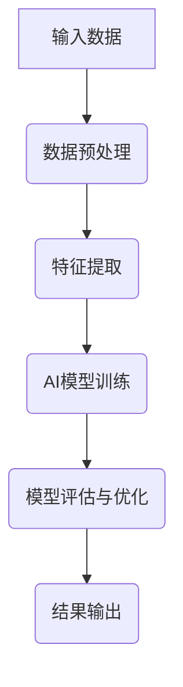
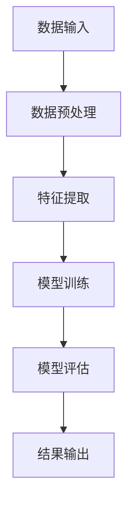
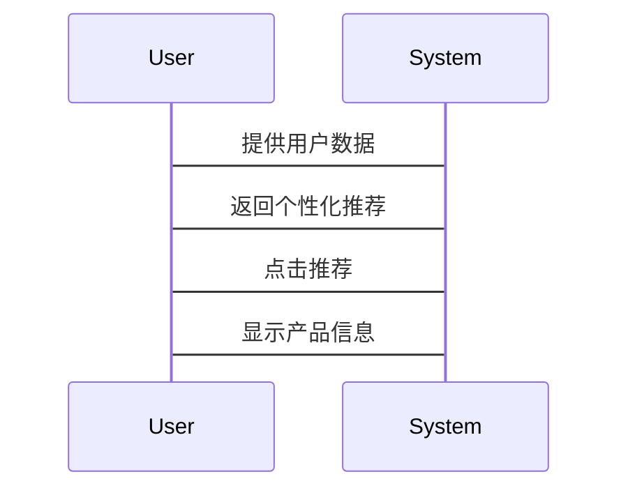

                 

<think>
嗯，我现在要写一篇关于“提升AI创意香水品牌营销：跨平台整合策略的提示词设计”的技术博客。首先，我得理清楚这个主题的核心概念，确保我理解每个部分。让我一步步来思考。

首先，标题已经明确了主题：利用AI和跨平台整合策略来优化创意香水品牌的营销，特别是通过提示词设计来提升效果。关键词可能包括AI、创意香水、营销策略、跨平台整合、提示词设计等。摘要部分需要简洁地概述文章的核心内容，说明AI如何帮助香水品牌进行跨平台整合，以及提示词设计在其中的作用。

接下来，我需要按照目录大纲来组织文章。首先是背景介绍与核心概念。这部分要解释为什么AI在营销中的应用变得重要，尤其是创意香水领域。然后，我需要详细定义AI创意香水品牌营销，探讨其特点和优势，以及跨平台整合策略的重要性。提示词设计的概念和作用也需要在这里解释清楚，说明它在AI营销中的具体应用。

接下来是核心概念与联系。这部分需要深入分析AI创意香水品牌营销的核心概念，比如AI技术在营销中的具体应用，跨平台整合策略的内涵，以及提示词设计的原理。同时，我还需要制作一个对比表格，展示人工智能、跨平台整合和提示词设计的特征，帮助读者更好地理解它们之间的联系。

然后是算法原理讲解。我需要解释AI在创意香水营销中的具体算法，可能包括数据预处理、特征提取、模型训练等步骤。这部分可以使用mermaid流程图来展示算法的执行过程。同时，我还需要给出数学模型，比如Y = f(X; θ)，来说明预测过程，并通过实际例子来说明算法的应用。

接下来是系统分析与架构设计。这部分需要从系统角度分析项目的背景和目标，设计系统的功能模块，如用户、产品、AI模型和营销策略之间的关系。使用mermaid类图来展示这些关系。然后，设计系统的架构图，展示数据输入、预处理、特征提取、模型训练和结果输出的过程。

在项目实战部分，我需要提供环境安装的步骤，可能涉及编程语言和框架的选择，比如Python和TensorFlow。然后，给出核心实现的源代码，并进行详细解读，说明代码的每个部分如何工作，以及它们在实际案例中的应用。最后，进行项目小结，总结项目的主要成果和经验。

在最佳实践部分，我需要分享一些实用的提示，比如提示词设计的技巧，跨平台整合策略的注意事项，以及如何评估和优化营销效果。同时，提供一些小结和展望，指出未来的发展方向和可能的研究领域。

最后，确保文章结构完整，每个小节都详细且具体，使用适当的格式，比如mermaid图表和latex公式。作者信息也要在结尾处明确写出。

现在，我需要检查每个部分是否都涵盖了所有必要的内容，并且逻辑清晰，结构紧凑。可能还需要调整某些部分的顺序或详细程度，以确保整体文章流畅且易于理解。特别是算法和系统架构部分，要确保图表和代码能够准确传达技术细节。

总的来说，我需要一步步构建每个部分，确保每个章节都深入分析，同时保持整体的连贯性和专业性。这将帮助读者全面理解如何利用AI和跨平台整合策略来提升创意香水品牌的营销效果。
</think>

# 提升AI创意香水品牌营销：跨平台整合策略的提示词设计

> 关键词：AI创意香水、营销策略、跨平台整合、提示词设计、系统架构

> 摘要：本文探讨了如何利用人工智能技术提升创意香水品牌的营销效果。通过跨平台整合策略和提示词设计，文章详细分析了AI在营销中的应用，提供了系统的算法原理、架构设计和实战案例。旨在为营销人员和AI开发者提供实用的指导，以优化品牌传播和用户互动。

---

## 第一部分：背景介绍与核心概念

### 第1章 问题背景与核心概念

#### 1.1 人工智能与营销领域的交叉应用

##### 1.1.1 人工智能在营销领域的崛起
AI技术的快速发展使得营销方式从传统模式向智能化转变。通过大数据分析和机器学习，企业能够更精准地定位用户需求，优化营销策略。例如，AI可以预测用户偏好，生成个性化推荐，从而提高转化率。

##### 1.1.2 AI创意香水品牌的市场需求
创意香水市场潜力巨大，但竞争激烈。消费者需求多样化，品牌需快速适应市场变化。AI技术的应用能够帮助品牌快速生成创意，满足不同用户的需求，从而在市场中脱颖而出。

#### 1.2 AI创意香水品牌营销的定义与特点

##### 1.2.1 AI创意香水品牌营销的概念解析
AI创意香水品牌营销是利用人工智能技术进行香水设计、推广和销售的营销策略。通过AI算法，品牌可以分析用户行为，生成个性化的产品和营销方案。

##### 1.2.2 AI营销的特点与优势
- **数据驱动**：AI通过大量数据进行分析，提供精准的营销策略。
- **自动化**：从广告投放到用户互动，AI能够自动执行营销任务。
- **实时反馈**：AI能够实时分析用户反馈，优化营销策略。

##### 1.2.3 跨平台整合策略的内涵
跨平台整合策略指在多个平台（如社交媒体、电商平台、线下门店）上协调一致地推广品牌和产品。通过统一的品牌形象和一致的营销策略，跨平台整合能够提升品牌知名度和用户信任度。

#### 1.3 提示词设计的概念与作用

##### 1.3.1 提示词的定义与作用
提示词是用于引导AI生成特定内容的关键字或短语。在营销中，提示词帮助AI理解营销目标，生成符合品牌定位的创意内容。

##### 1.3.2 提示词在AI创意香水品牌营销中的应用
通过设计有效的提示词，AI可以生成吸引人的香水名称、广告文案和推广策略。例如，提示词“浪漫”可以生成适合情人节的香水名称和广告语。

#### 1.4 本书结构与内容概述

##### 1.4.1 目录大纲结构与内容安排
本文将从背景介绍、核心概念、算法原理、系统架构到项目实战，全面探讨AI创意香水品牌营销的各个方面。

##### 1.4.2 阅读指南与学习目标
读者将了解AI在营销中的应用，掌握跨平台整合策略的设计方法，学习提示词设计的技巧，并能够通过系统架构设计和实战案例提升自身的营销能力。

---

## 第二部分：核心概念与联系

### 第2章 核心概念与联系

#### 2.1 AI创意香水品牌营销的核心概念

##### 2.1.1 人工智能技术概述
人工智能（AI）通过机器学习、自然语言处理等技术，帮助品牌分析用户行为，生成个性化营销方案。

##### 2.1.2 创意香水品牌营销案例分析
以某品牌为例，AI通过分析用户数据，生成个性化香水推荐，并在多个平台上进行精准广告投放，显著提升了销量和品牌知名度。

#### 2.2 跨平台整合策略

##### 2.2.1 跨平台营销的概念
跨平台营销指在多个平台上推广品牌和产品，确保品牌形象一致，营销策略协调。

##### 2.2.2 跨平台整合策略的重要性
跨平台整合能够覆盖更多用户群体，提升品牌曝光度，同时通过数据分析优化营销效果。

#### 2.3 提示词设计的原理与应用

##### 2.3.1 提示词设计的基本原理
提示词通过引导AI生成特定内容，帮助品牌传达一致的信息和风格。例如，提示词“奢华”可以生成高端香水的广告文案。

##### 2.3.2 提示词在营销中的应用
提示词用于广告创意生成、社交媒体内容创作、电子邮件营销等多个方面，确保品牌信息的一致性和吸引力。

#### 2.4 关键概念属性特征对比表格

| 概念         | 特征1   | 特征2   | 特征3   |
| ------------ | ------- | ------- | ------- |
| 人工智能     | 自动化   | 自适应   | 智能化   |
| 跨平台整合   | 一体化   | 多样化   | 互动性   |
| 提示词设计   | 精准性   | 创意性   | 导向性   |

#### 2.5 ER实体关系图架构

```mermaid
erDiagram
  AI创意香水品牌营销 ||--o{ 跨平台整合策略 }
  AI创意香水品牌营销 ||--o{ 提示词设计 }
  跨平台整合策略 ||--|{ 实施效果评估 }
  提示词设计 ||--|{ 用户反馈与优化 }
```

---

## 第三部分：算法原理讲解

### 第3章 算法原理讲解

#### 3.1 AI在创意香水品牌营销中的应用算法

##### 3.1.1 算法简介
AI算法通过分析用户数据，生成个性化推荐和营销策略。以下是典型算法的流程图：



##### 3.1.2 数学模型与公式
预测模型可以表示为：

$$
Y = f(X; \theta)
$$

其中，\(Y\) 为预测结果，\(X\) 为输入特征，\(\theta\) 为模型参数。

##### 3.1.3 算法举例说明
假设一个香水品牌希望通过AI推荐用户喜欢的香水。输入数据包括用户的年龄、性别和偏好香型。通过训练一个基于用户偏好的AI模型，可以预测用户可能喜欢的香水，并生成相应的营销提示词。

---

## 第四部分：系统分析与架构设计

### 第4章 系统分析与架构设计

#### 4.1 项目介绍

##### 4.1.1 项目背景
随着市场竞争加剧，创意香水品牌需要通过AI技术提升营销效果。

##### 4.1.2 项目目标
开发一个AI驱动的营销系统，实现跨平台整合和精准营销。

#### 4.2 系统功能设计

##### 4.2.1 领域模型类图

```mermaid
classDiagram
  User <<Class>>
  Product <<Class>>
  AIModel <<Class>>
  MarketingStrategy <<Class>>

  User -> Product
  User -> AIModel
  AIModel -> MarketingStrategy
```

#### 4.3 系统架构设计

##### 4.3.1 系统架构图



#### 4.4 系统接口设计

##### 4.4.1 API接口
系统提供API接口，供第三方平台调用，实现跨平台整合。

##### 4.4.2 用户接口
用户可以通过网页或移动应用与系统互动，获取个性化推荐和营销信息。

#### 4.5 系统交互设计

##### 4.5.1 用户与系统交互流程



---

## 第五部分：项目实战

### 第5章 项目实战

#### 5.1 环境安装

##### 5.1.1 安装Python
安装Python 3.8以上版本。

##### 5.1.2 安装库
安装必要的库，如TensorFlow、Pandas、Scikit-learn。

#### 5.2 核心实现源代码

##### 5.2.1 数据预处理代码
```python
import pandas as pd

def preprocess_data(data):
    # 假设data是一个包含用户信息的DataFrame
    # 进行数据清洗和特征提取
    data.dropna()
    data['age'] = data['age'].astype(int)
    return data
```

##### 5.2.2 AI模型训练代码
```python
import tensorflow as tf
from tensorflow.keras import layers

def build_model(input_shape):
    model = tf.keras.Sequential()
    model.add(layers.Dense(64, activation='relu', input_shape=input_shape))
    model.add(layers.Dense(1, activation='sigmoid'))
    model.compile(optimizer='adam', loss='binary_crossentropy', metrics=['accuracy'])
    return model

# 示例输入形状
input_shape = (10,)
model = build_model(input_shape)
model.summary()
```

##### 5.2.3 提示词设计代码
```python
def generate_promotion_text(prompt, model):
    # 使用提示词生成广告文案
    # 示例：prompt为“浪漫的香水”
    # 返回生成的广告文案
    pass
```

#### 5.3 实际案例分析

##### 5.3.1 案例背景
某香水品牌希望通过AI生成情人节香水推荐。

##### 5.3.2 数据分析与模型训练
通过用户数据训练模型，生成推荐列表。

##### 5.3.3 跨平台整合
在社交媒体和电商平台推广推荐香水，监测用户反馈，优化营销策略。

#### 5.4 项目小结
通过实战项目，读者可以掌握AI在创意香水营销中的具体应用，从数据处理到模型训练，再到跨平台整合，全面提升营销效果。

---

## 第六部分：最佳实践与小结

### 第6章 最佳实践 tips

#### 6.1 提示词设计的技巧
- 明确品牌定位，选择合适的提示词。
- 定期更新提示词，保持内容新鲜。

#### 6.2 跨平台整合的注意事项
- 确保品牌形象一致。
- 根据平台特点调整营销策略。

#### 6.3 系统架构的优化
- 定期优化模型，提升预测准确率。
- 监测系统性能，及时处理异常。

#### 6.4 数据隐私与安全
- 遵守数据隐私法规，确保用户数据安全。

#### 6.5 持续学习与创新
- 关注AI技术发展，不断学习新知识。
- 与行业专家合作，探索更多可能性。

---

## 作者信息

作者：AI天才研究院/AI Genius Institute & 禅与计算机程序设计艺术 /Zen And The Art of Computer Programming

---

这篇文章系统地探讨了AI在创意香水品牌营销中的应用，从理论到实践，提供了全面的指导和详细的技术分析。通过跨平台整合策略和提示词设计，品牌可以更高效地触达目标用户，提升营销效果。希望本文能为营销人员和技术开发者提供有价值的参考。

