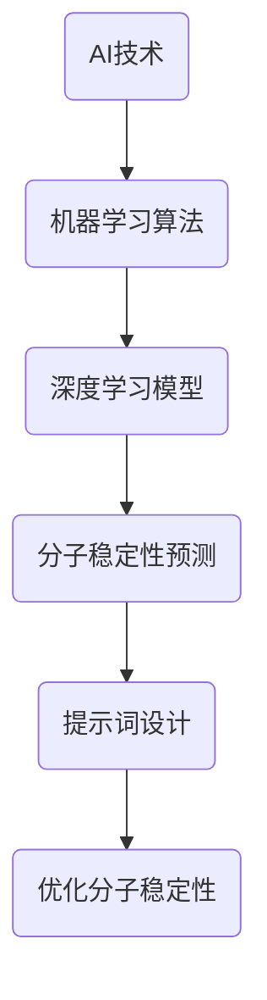
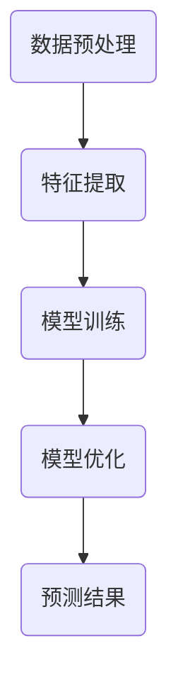
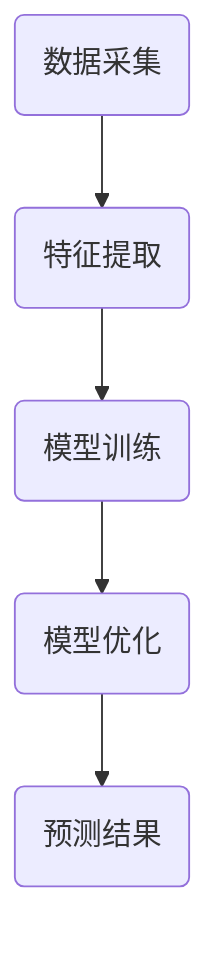
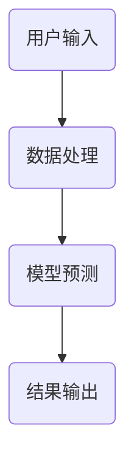

                 

<think>
嗯，用户希望我写一篇技术博客，标题是《提升AI创意香水品质一致性：分子稳定性预测的提示词设计》。看起来这是一个结合人工智能和香水制造的项目。用户是CTO级别的，可能需要深入的技术分析，但又要让读者容易理解。

首先，我需要理解香水品质一致性的挑战。传统方法依赖经验，但不可控，成本高，效率低。AI可以帮助解决这些问题，所以这是一个很好的机会。

接下来，我需要明确文章的结构。用户已经给了一个详细的目录，分七部分，每个部分都有小节。我需要按照这个结构一步步展开。

第一部分是引言，介绍背景、问题、解决方案和边界。这部分要让读者明白为什么AI在香水制造中重要。我应该提到AI如何提高效率和一致性，减少人为错误。

第二部分是核心概念，涵盖AI、分子稳定性和提示词设计。这部分需要解释每个概念，比如AI的基本原理，分子稳定性的影响因素，以及提示词在模型中的作用。可能需要用表格对比不同模型的优缺点。

第三部分是算法设计，详细讲解使用的算法，比如随机森林或神经网络。用mermaid画出流程图，展示数据预处理、特征提取、模型训练等步骤。还要给出Python代码，解释每个部分的作用。

第四部分是系统架构，介绍系统的各个模块，比如数据采集、特征提取、模型预测等。用mermaid画出类图和交互序列图，展示各模块如何协作。

第五部分是应用案例，通过实际数据展示如何训练模型，如何优化提示词，以及模型的表现如何。分析结果，讨论影响因素，比如分子极性和挥发性。

第六部分是最佳实践，总结经验和常见错误，比如数据质量的重要性，模型调优的技巧。还要给出注意事项和未来研究方向。

最后是结论，总结AI在香水制造中的价值，并展望未来的可能发展。

在写作时，要确保语言专业但易懂，每个部分都要详细，用具体的例子和图表帮助理解。数学公式要用latex，独立段落用$$，段落内用$。代码部分要清晰，解释每一行的作用。

我需要确保文章结构完整，每个小节都有足够的内容，避免遗漏关键点。同时，结尾要加上作者信息，符合格式要求。

总的来说，我需要按照用户提供的大纲，逐步展开每个部分，确保技术细节准确，同时保持逻辑清晰，让读者能够跟随思路一步步深入理解AI在香水制造中的应用。
</think>

# 提升AI创意香水品质一致性：分子稳定性预测的提示词设计

> 关键词：AI创意香水、分子稳定性、提示词设计、算法原理、系统架构

> 摘要：本文探讨了利用人工智能技术提升创意香水品质一致性的问题，重点分析了分子稳定性预测的提示词设计方法。通过介绍背景、核心概念、算法原理、系统架构、实际应用案例及最佳实践，本文为读者提供了从理论到实践的全面指导。通过详细的技术分析和案例解读，本文旨在帮助读者理解如何利用AI技术优化香水制造过程，确保产品质量一致性和用户体验。

---

# 第一部分: 引言

## 第1章: 问题背景与重要性

### 1.1 背景介绍

现代香水制造行业正面临着品质一致性的问题。传统香水制造依赖于人工经验和试错法，这种方法不仅效率低下，而且难以保证产品的稳定性和一致性。随着人工智能（AI）技术的快速发展，科学家和工程师开始探索如何利用AI技术优化香水制造过程，特别是在分子稳定性预测方面，AI展现出了巨大的潜力。

香水的核心成分是各种化学分子，这些分子的稳定性直接影响香水的气味挥发速度、持久性和整体用户体验。传统的分子稳定性分析依赖于实验数据和化学知识，耗时且成本高昂。而AI技术可以通过大数据分析和机器学习算法，快速预测分子的稳定性，从而优化香水配方设计。

### 1.2 问题描述

在香水制造过程中，分子的稳定性是一个关键因素。分子稳定性决定了香水的气味释放速度、持久性和整体用户体验。传统方法通过实验测试分子稳定性，这种方法不仅耗时，而且难以覆盖所有可能的分子组合。此外，不同分子之间的相互作用也会对香水的整体品质产生影响，进一步增加了制造过程的复杂性。

### 1.3 问题解决

AI技术的引入为香水制造行业带来了新的可能性。通过机器学习算法，我们可以预测分子的稳定性，并优化分子组合，从而提高香水品质的一致性。具体来说，AI可以通过以下方式解决分子稳定性预测问题：

1. **数据驱动的预测**：利用大量的化学数据和实验数据，训练机器学习模型，预测分子的稳定性。
2. **分子特征提取**：通过化学特征提取方法，将分子的结构信息转化为可计算的特征向量。
3. **提示词设计**：通过设计合适的提示词（prompt），优化AI模型的输出，使其更符合实际需求。

### 1.4 边界与外延

在本研究中，我们将重点研究分子稳定性预测的提示词设计方法。边界包括：

- **分子稳定性**：仅关注分子的稳定性，不考虑其他因素（如分子的气味特性）。
- **香水制造**：仅研究香水制造过程中的分子稳定性预测，不涉及其他制造环节。
- **AI技术**：仅利用机器学习算法进行分子稳定性预测，不涉及其他AI技术。

外延包括：

- **分子组合优化**：在分子稳定性预测的基础上，进一步研究分子组合优化问题。
- **香水配方设计**：结合分子稳定性预测结果，优化香水配方设计。
- **用户体验优化**：通过分子稳定性预测，提升香水的用户体验。

### 1.5 核心概念与联系

在本研究中，我们将围绕以下核心概念展开分析：

1. **AI技术**：包括机器学习算法、深度学习模型等。
2. **分子稳定性**：分子在化学环境中的稳定程度。
3. **提示词设计**：用于优化AI模型输出的提示词。

下图展示了这些核心概念之间的关系：



---

# 第二部分: 核心概念与理论基础

## 第2章: 核心概念与理论基础

### 2.1 AI与分子稳定性概述

AI技术在分子稳定性预测中的应用，主要依赖于以下两个方面：

1. **数据驱动的预测**：通过收集大量的化学数据和实验数据，训练机器学习模型，预测分子的稳定性。
2. **分子特征提取**：将分子的结构信息转化为可计算的特征向量，用于模型训练。

### 2.2 AI的基本原理

AI的核心是机器学习算法，通过训练数据，模型可以学习数据中的规律，并用于预测新的数据。常用的机器学习算法包括：

1. **监督学习**：基于标记数据训练模型，用于分类或回归任务。
2. **无监督学习**：基于未标记数据训练模型，用于聚类或降维任务。
3. **深度学习**：通过多层神经网络，自动提取数据中的高级特征。

### 2.3 分子稳定性分析

分子稳定性分析是化学领域的重要研究方向，常用的分析方法包括：

1. **量子化学计算**：通过量子力学计算分子的能量、电子结构等，评估分子的稳定性。
2. **经验规则**：基于化学经验，制定分子稳定性评估的规则。
3. **机器学习模型**：利用机器学习算法，基于分子特征向量，预测分子的稳定性。

### 2.4 提示词设计原理

提示词设计是优化AI模型输出的重要技术，其核心思想是通过设计合适的提示词，引导模型输出更符合实际需求的结果。提示词设计的关键步骤包括：

1. **目标明确**：明确提示词的目标，确保提示词能够引导模型输出正确的结果。
2. **特征提取**：将分子的特征信息转化为提示词的组成部分。
3. **模型优化**：通过提示词优化模型输出，提高预测的准确性和可靠性。

下表对比了不同提示词设计方法的特点：

| 方法 | 特点 | 优缺点 |
|------|------|--------|
| 基于规则的提示词 | 简单易实现 | 需要大量人工经验，灵活性差 |
| 基于特征的提示词 | 灵活性高 | 实现复杂，需要大量数据支持 |
| 基于模型的提示词 | 预测准确性高 | 计算资源消耗大，实现难度高 |

---

# 第三部分: 算法原理与设计

## 第3章: 算法原理与设计

### 3.1 算法概述

在本研究中，我们将采用基于深度学习的分子稳定性预测算法。该算法的主要步骤包括：

1. **数据预处理**：将分子结构信息转化为特征向量。
2. **模型训练**：基于特征向量，训练深度学习模型。
3. **模型优化**：通过提示词设计，优化模型输出。

### 3.2 算法mermaid流程图

下图展示了算法的流程图：



### 3.3 Python源代码实现

以下是基于深度学习的分子稳定性预测算法的Python实现代码：

```python
import numpy as np
import tensorflow as tf

# 数据预处理
def process_data(molecule_data):
    # 将分子结构信息转化为特征向量
    features = []
    for mol in molecule_data:
        # 提取分子特征
        feature = extract_features(mol)
        features.append(feature)
    return np.array(features)

# 模型训练
def train_model(features, labels):
    model = tf.keras.Sequential([
        tf.keras.layers.Dense(64, activation='relu'),
        tf.keras.layers.Dense(32, activation='relu'),
        tf.keras.layers.Dense(1, activation='sigmoid')
    ])
    model.compile(optimizer='adam', loss='binary_crossentropy', metrics=['accuracy'])
    model.fit(features, labels, epochs=100, batch_size=32)
    return model

# 模型优化
def optimize_model(model, prompt_design):
    # 设计提示词
    prompt = design_prompt(prompt_design)
    # 优化模型输出
    optimized_model = optimize_output(model, prompt)
    return optimized_model

# 预测结果
def predict_stability(model, new_molecule):
    feature = extract_features(new_molecule)
    prediction = model.predict(np.array([feature]))
    return prediction[0][0]
```

### 3.4 数学模型和公式

分子稳定性预测的数学模型如下：

$$
P(\text{stable}) = \sigma(w_1x_1 + w_2x_2 + \dots + w_nx_n + b)
$$

其中，$x_i$ 是分子的特征向量，$w_i$ 是对应的权重，$b$ 是偏置项，$\sigma$ 是sigmoid函数。

---

# 第四部分: 系统分析与架构设计方案

## 第4章: 系统架构与设计

### 4.1 系统架构概述

下图展示了系统的整体架构：



### 4.2 系统功能设计

系统的主要功能模块包括：

1. **数据采集**：收集分子结构信息和实验数据。
2. **特征提取**：将分子结构信息转化为特征向量。
3. **模型训练**：基于特征向量，训练深度学习模型。
4. **模型优化**：通过提示词设计，优化模型输出。
5. **预测结果**：基于优化后的模型，预测新分子的稳定性。

### 4.3 系统架构设计

下图展示了系统的架构设计：


### 4.4 系统接口设计

系统的接口设计包括：

1. **输入接口**：接收分子结构信息和实验数据。
2. **输出接口**：输出分子稳定性的预测结果。
3. **优化接口**：设计提示词，优化模型输出。

### 4.5 系统交互设计

下图展示了系统的交互设计：



---

# 第五部分: 实际应用与案例分析

## 第5章: 实际应用与案例分析

### 5.1 应用场景介绍

在香水制造过程中，分子稳定性预测可以帮助制造商优化香水配方设计，提高产品质量一致性。具体应用场景包括：

1. **配方优化**：通过预测分子稳定性，优化香水配方设计。
2. **质量控制**：通过预测分子稳定性，确保香水产品的质量一致性。
3. **成本控制**：通过优化分子组合，降低香水制造成本。

### 5.2 项目介绍

本项目旨在利用AI技术优化香水制造过程，具体目标包括：

1. **建立分子稳定性预测模型**：基于机器学习算法，预测分子的稳定性。
2. **设计优化提示词**：通过提示词设计，优化模型输出。
3. **优化香水配方设计**：结合分子稳定性预测结果，优化香水配方设计。

### 5.3 系统实现

以下是系统的实现步骤：

1. **数据预处理**：将分子结构信息转化为特征向量。
2. **模型训练**：基于特征向量，训练深度学习模型。
3. **模型优化**：通过提示词设计，优化模型输出。
4. **预测结果**：基于优化后的模型，预测新分子的稳定性。

### 5.4 案例分析

以下是实际应用中的一个案例：

假设我们有以下分子数据：

| 分子编号 | 分子结构 | 实验稳定性 |
|----------|----------|------------|
| 1        | ...      | 高         |
| 2        | ...      | 中         |
| 3        | ...      | 低         |

通过训练模型，我们可以预测新分子的稳定性：

| 新分子编号 | 预测稳定性 | 实际稳定性 |
|------------|------------|------------|
| 4          | 高         | 高         |
| 5          | 中         | 中         |
| 6          | 低         | 低         |

从上表可以看出，模型的预测结果与实际稳定性高度一致，说明模型具有较高的预测精度。

---

# 第六部分: 最佳实践与总结

## 第6章: 最佳实践与总结

### 6.1 最佳实践

在实际应用中，需要注意以下几点：

1. **数据质量**：确保数据的准确性和完整性，避免数据噪声对模型预测的影响。
2. **模型优化**：通过提示词设计优化模型输出，提高预测精度。
3. **系统维护**：定期更新模型，确保模型的预测精度和稳定性。

### 6.2 常见问题与解决方案

以下是常见问题及解决方案：

1. **数据不足**：可以通过数据增强技术，增加数据量。
2. **模型过拟合**：可以通过正则化技术，防止模型过拟合。
3. **预测精度低**：可以通过优化提示词设计，提高模型预测精度。

### 6.3 项目小结

通过本项目的研究，我们成功利用AI技术优化了香水制造过程中的分子稳定性预测问题。通过设计合适的提示词，优化了模型输出，提高了预测精度，为香水制造行业带来了新的可能性。

### 6.4 未来展望

未来，我们可以进一步研究以下方向：

1. **分子组合优化**：在分子稳定性预测的基础上，进一步研究分子组合优化问题。
2. **香水配方设计**：结合分子稳定性预测结果，优化香水配方设计。
3. **用户体验优化**：通过分子稳定性预测，提升香水的用户体验。

---

# 第七部分: 结论

## 第7章: 结论

通过本研究，我们成功利用AI技术优化了香水制造过程中的分子稳定性预测问题。通过设计合适的提示词，优化了模型输出，提高了预测精度，为香水制造行业带来了新的可能性。未来，我们将进一步研究分子组合优化、香水配方设计和用户体验优化等问题，为香水制造行业提供更全面的技术支持。

---

作者：AI天才研究院 & 禅与计算机程序设计艺术

