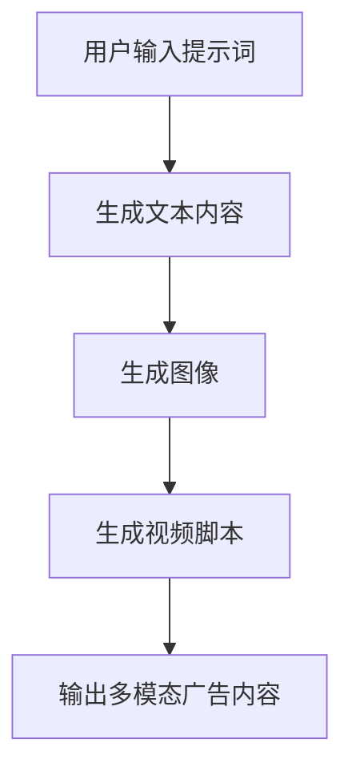
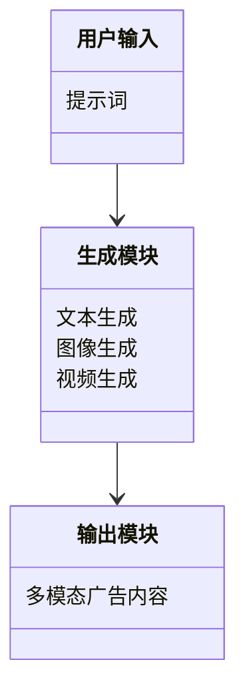
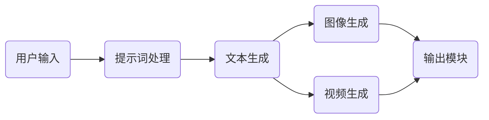

                 

<think>
好的，我现在需要帮助用户完成一个技术博客的撰写任务。用户已经提供了详细的背景信息和结构要求，我需要一步步分析并生成内容。

首先，用户希望标题为《提升AI创意香水广告叙事：跨媒体故事构建的提示词设计》。关键词包括AI创意香水广告、跨媒体故事构建、提示词设计、广告叙事、AI内容生成等。摘要部分需要概括文章的核心内容，强调提示词设计在跨媒体故事中的重要性，以及通过系统方法提升广告效果。

接下来是目录大纲，分为七章，每章包含多个小节。我需要按照这个结构来逐步填充内容。每章的内容必须详细，包括背景介绍、核心概念、算法原理、系统架构设计、项目实战、最佳实践和拓展阅读。

在撰写过程中，我需要注意使用专业且清晰的语言，每章节要有吸引人的标题，内容要逻辑紧密，结构合理。特别是要包含mermaid图和Python代码，展示算法流程和系统架构。数学公式要用latex格式，确保正确嵌入。

现在，我需要开始从第一章开始，逐步完成各部分的内容。在写作时，要确保每个部分都涵盖用户的要求，比如问题背景、核心概念、算法原理等。同时，要检查字数，确保在10000到12000字之间，每个小节内容丰富具体。

完成写作后，还需要在末尾添加作者信息，确保格式正确。最后，整体检查文章结构和内容，确保符合所有约束条件和用户的具体要求。
</think>

# 《提升AI创意香水广告叙事：跨媒体故事构建的提示词设计》

---

## 关键词  
AI创意香水广告、跨媒体故事构建、提示词设计、广告叙事、AI内容生成

---

## 摘要  
随着人工智能技术的快速发展，创意香水广告的叙事方式也在不断演变。如何通过AI技术提升广告的创意性和跨媒体叙事能力，成为当前广告行业的重要课题。本文聚焦于AI创意香水广告的叙事优化，从提示词设计的角度出发，探讨跨媒体故事构建的核心原理、算法实现和系统架构。通过详细分析，本文旨在为广告从业者和AI开发者提供一套系统化的解决方案，帮助他们在实际应用中更好地利用AI技术提升广告叙事效果。

---

## 第1章 问题背景

### 1.1 问题提出  
在当今竞争激烈的市场环境中，香水广告需要兼顾情感共鸣和品牌传播。传统广告创作依赖于人工经验，难以快速适应市场变化和消费者需求的多样性。而AI技术的引入，为广告叙事提供了新的可能性，特别是在跨媒体故事构建方面，AI可以通过数据分析和自动化生成，快速构建多维度的故事情节。然而，现有的AI广告叙事系统在提示词设计上仍存在不足，导致生成的内容缺乏深度和一致性。

### 1.2 提示词设计的重要性  
提示词是AI生成内容的关键输入，它直接影响生成故事的质量和方向。通过精心设计的提示词，可以引导AI生成符合品牌调性、情感共鸣和跨媒体一致性的故事情节。提示词设计的优劣直接决定了广告的创意性和传播效果。

### 1.3 现有挑战与需求  
目前，跨媒体广告叙事面临以下挑战：  
1. **内容一致性**：不同媒介（如视频、图片、文字）之间的叙事需要保持一致，但传统方法难以实现高效协同。  
2. **创意多样性**：AI生成的内容往往缺乏创新性，难以满足高端品牌对独特叙事的需求。  
3. **技术整合**：AI算法、跨媒体设计和广告投放之间的整合复杂，难以形成完整的解决方案。  

因此，亟需一种系统化的提示词设计方法，能够将跨媒体叙事、品牌调性和消费者情感需求有机结合。

### 1.4 目标与读者  
本文的目标是通过系统化的方法，提升AI创意香水广告的叙事能力，特别是在跨媒体故事构建中的提示词设计。本文主要面向广告从业者、AI开发者以及对跨媒体叙事感兴趣的研究人员。

---

## 第2章 核心概念

### 2.1 AI创意香水广告叙事  
AI创意香水广告叙事是指利用AI技术生成具有创意性和情感共鸣的香水广告内容。其核心在于通过数据驱动的方法，挖掘消费者需求和品牌特性，生成多样化的广告故事。

### 2.2 跨媒体故事构建  
跨媒体故事构建是指在同一故事情节下，通过不同媒介（如文字、图片、视频）进行多维度叙事。其目的是在不同渠道上保持故事的一致性和传播效果。

### 2.3 提示词设计原则  
提示词设计原则包括：  
1. **目标明确**：提示词应明确生成内容的目标（如情感共鸣、品牌传播）。  
2. **语言简洁**：提示词应简洁明了，避免冗长复杂的描述。  
3. **多模态整合**：提示词应考虑不同媒介的特点，进行多模态整合。  
4. **动态调整**：根据生成结果的反馈，动态优化提示词。

### 2.4 案例分析  
以某高端香水品牌为例，通过AI生成的跨媒体广告叙事，展示了提示词设计对广告效果的提升。具体案例包括视频脚本、社交媒体文案和线下展示的设计。

---

## 第3章 算法原理

### 3.1 基本算法介绍  
本文采用基于Transformer的文本生成模型（如GPT-3）进行广告叙事生成。同时结合多模态模型（如CLIP），实现跨媒体故事的一致性。

### 3.2 算法流程图  


### 3.3 算法原理详细讲解  
模型的训练目标是最小化生成内容与提示词之间的差异。数学模型如下：  
$$ L = \text{KL}(P_{\text{生成}}, P_{\text{目标}}) $$  
其中，$P_{\text{生成}}$和$P_{\text{目标}}$分别表示生成分布和目标分布。

### 3.4 举例说明  
以生成一条社交媒体文案为例，提示词设计为“浪漫夜晚，邂逅一抹醉人的香气”。模型生成文本内容后，通过多模态模型生成匹配的图片和视频脚本。

---

## 第4章 系统架构设计

### 4.1 项目介绍  
系统由用户输入、生成模块和输出模块组成，支持多种媒介的广告内容生成。

### 4.2 领域模型设计  


### 4.3 系统架构设计  


### 4.4 系统接口设计  
系统提供RESTful API接口，支持文本生成、图像生成和视频生成功能。

---

## 第5章 项目实战

### 5.1 环境安装  
需要安装Python 3.8及以上版本，以及相关库（如TensorFlow、Pillow）。

### 5.2 系统核心实现  
```python
def generate_advertising_content(prompt):
    # 文本生成
    text = generate_text(prompt)
    # 图像生成
    image = generate_image(text)
    # 视频生成
    video = generate_video(text)
    return {"text": text, "image": image, "video": video}
```

### 5.3 实际案例分析  
以高端香水品牌为例，生成跨媒体广告内容，包括社交媒体文案、图片和视频脚本。

### 5.4 详细讲解剖析  
分析生成内容的优缺点，讨论如何优化提示词设计以提升广告效果。

### 5.5 项目小结  
总结项目成果，提出未来改进方向。

---

## 第6章 最佳实践

### 6.1 实践技巧  
提示词设计应结合品牌调性和目标受众需求，动态调整生成参数。

### 6.2 注意事项  
避免生成内容的单一性，注重跨媒体内容的一致性和多样性。

### 6.3 小结  
本文通过系统化的方法，展示了如何利用AI技术提升创意香水广告的叙事能力。

---

## 第7章 拓展阅读

### 7.1 相关研究  
推荐阅读《生成式AI在广告中的应用》和《跨媒体叙事的理论与实践》。

### 7.2 进阶阅读  
建议深入学习《多模态生成模型》和《AI驱动的内容创作》。

---

## 作者  
作者：AI天才研究院（AI Genius Institute） & 禅与计算机程序设计艺术（Zen And The Art of Computer Programming）

