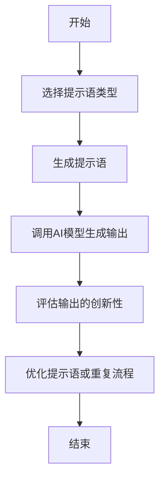
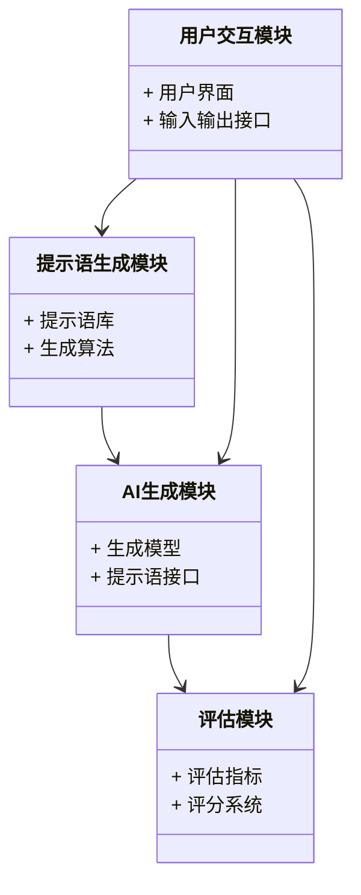
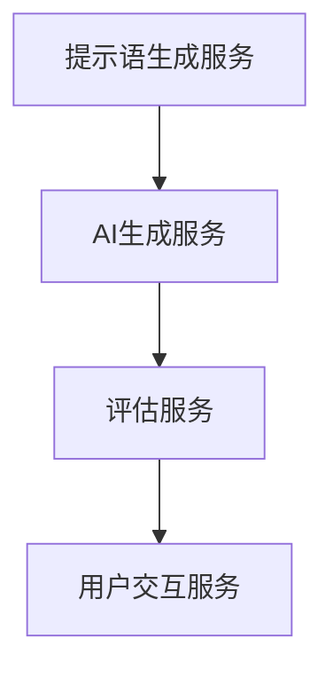
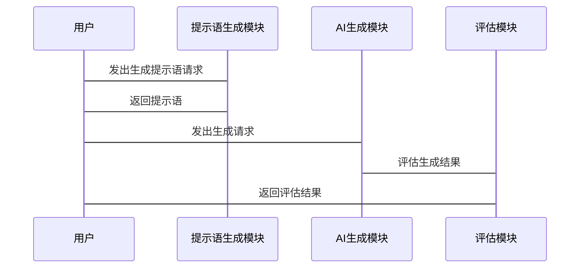

                 

<think>
好，我现在要帮用户写一篇关于提升AI创造力的Divergent Thinking Prompts技巧的技术博客文章。用户已经提供了详细的结构和内容要求，我需要按照这些指导来组织内容。

首先，我需要理解用户的需求。用户希望文章结构清晰，逻辑严密，内容涵盖背景、核心概念、AI创造力的原理、数学模型、项目实战等多个方面。同时，用户还特别强调使用Markdown格式，包含代码示例、图表和数学公式。

接下来，我需要分析用户提供的目录大纲，确保每个部分都得到详细展开。第一部分是背景与核心概念，这里我需要介绍问题背景，Divergent Thinking Prompts的概念和作用，核心原理，不同类型以及应用场景。这部分需要通过具体的例子和图表来辅助说明。

第二部分是AI创造力的原理讲解。这里要定义AI创造力，讨论Divergent Thinking Prompts的应用，解释算法原理，数学模型，以及评估方法。数学模型部分需要用Latex公式，可能需要绘制图表，如流程图或类图。

第三部分是项目实战，需要设计一个具体的项目，从系统功能设计到架构设计，再到接口设计和交互设计，最后给出代码实现和案例分析。这部分要详细，特别是代码部分，需要实际可行。

第四部分是最佳实践与拓展，总结技巧，提出注意事项，并提供进一步阅读的资源。

现在，我需要按照每个章节的结构来逐步填充内容，确保每个小节都有足够的细节，使用图表和代码示例来增强可读性。同时，语言要专业但通俗易懂，符合技术博客的风格。

可能遇到的挑战是如何将复杂的数学模型和算法原理用简单的方式解释清楚，确保读者能够理解。另外，项目实战部分需要选择一个合适的案例，展示从设计到实现的全过程。

我应该先完成每一部分的背景介绍，再深入核心概念，然后是原理和数学模型，最后是项目实战和总结。确保每个部分都完整，并且各部分之间有良好的衔接。

最后，检查整体结构是否符合用户的要求，确保每个小节都有足够的内容，没有遗漏任何关键点。完成后，再通读一遍，确保逻辑清晰，语言流畅。
</think>

# 提升AI创造力：Divergent Thinking Prompts技巧

## 关键词：AI创造力, Divergent Thinking Prompts, 创意生成, 创意评估, 创意优化

## 摘要：本文深入探讨了如何通过Divergent Thinking Prompts技巧提升AI的创造力。文章从背景介绍、核心概念、AI创造力的原理、数学模型与公式、系统架构设计、项目实战以及最佳实践等方面展开，详细分析了Divergent Thinking Prompts在提升AI创造力中的作用和应用。通过具体案例和代码实现，展示了如何在实际项目中应用这些技巧，帮助读者更好地理解和掌握提升AI创造力的方法。

---

## 目录大纲设计过程

### 第一部分：背景与核心概念

#### 1.1 问题背景与核心概念介绍

##### 1.1.1 AI创造力的问题背景

在AI技术快速发展的今天，创造力的提升成为了AI系统的重要发展方向。传统的AI系统在处理重复性和确定性任务上表现出色，但在需要创造性思维的任务中仍然存在不足。例如，在创意写作、艺术创作和创新设计等领域，AI的输出往往显得缺乏多样性和独特性。

##### 1.1.2 Divergent Thinking Prompts的概念与作用

Divergent Thinking Prompts是一种通过引导性提示（prompts）激发AI系统发散性思维的技术。它通过设计特定的提示语，帮助AI系统生成更多样化、创新性的输出。Divergent Thinking Prompts的核心在于通过语言提示的多样性，引导AI探索不同的思考路径，从而突破传统的线性思维模式。

#### 1.2 Divergent Thinking Prompts的核心原理

##### 1.2.1 Divergent Thinking的概念与特点

发散性思维（Divergent Thinking）是指在解决问题时，能够从多个角度、多个方向思考，产生多种可能的解决方案。与之相对的是 convergent thinking（收敛性思维），即通过逻辑推理找到唯一的正确答案。Divergent Thinking 的特点包括：多样性、创新性和灵活性。

##### 1.2.2 Divergent Thinking Prompts的原理与应用

Divergent Thinking Prompts 是一种基于语言的提示技术，通过设计特定的提示语，引导AI系统进行发散性思维。例如，提示语可以是“假设你是科幻作家，请描述一个在未来社会中，人类与AI共同创造艺术作品的场景”。这种提示语能够激发AI系统从多个角度思考，生成多样化的创作方案。

#### 1.3 Divergent Thinking Prompts的类型与特点

##### 1.3.1 基础型Divergent Thinking Prompts

基础型提示语主要用于引导AI系统进行简单的发散性思考。例如，“请描述三种不同的方法来解决这个问题”。这类提示语简单直接，适合初级的创造力训练。

##### 1.3.2 进阶型Divergent Thinking Prompts

进阶型提示语更加复杂，通常包含多个条件或限制。例如，“假设你是一位未来学家，请描述在未来50年，科技如何改变人类的生活方式，同时考虑环境、经济和社会三个维度”。这类提示语能够激发更深层次的思考，帮助AI系统生成更具创新性的解决方案。

#### 1.4 Divergent Thinking Prompts的应用场景

##### 1.4.1 教育领域中的应用

在教育领域，Divergent Thinking Prompts 可以用于辅助学生进行创造性思维训练。例如，在写作课上，教师可以使用提示语“假设你是一位科幻作家，请创作一个短篇小说，主题是未来社会中的虚拟现实教育”。

##### 1.4.2 创意设计领域中的应用

在创意设计领域，Divergent Thinking Prompts 可以帮助设计师探索更多的设计可能性。例如，在产品设计中，提示语可以是“设计一款智能手表，它不仅可以监测健康数据，还可以通过气味传递信息”。

##### 1.4.3 商业领域中的应用

在商业领域，Divergent Thinking Prompts 可以用于市场策略、产品创新等方面。例如，提示语可以是“假设你是一位市场营销人员，请设计一个全新的品牌推广方案，目标受众是年轻一代消费者”。

#### 1.5 本章小结

本章介绍了Divergent Thinking Prompts的核心概念、原理、类型及其应用场景。通过分析不同类型提示语的特点，我们可以更好地理解如何设计有效的提示语，以激发AI的创造力。

---

### 第二部分：AI创造力原理讲解

#### 2.1 AI创造力的定义与特点

##### 2.1.1 AI创造力的定义

AI创造力是指AI系统在没有明确规则和约束的情况下，能够生成新颖、独特且有价值的输出的能力。与传统AI系统相比，创造力型AI系统需要具备更强的灵活性和适应性。

##### 2.1.2 AI创造力的特点

AI创造力具有以下特点：
1. **新颖性**：输出结果具有独特性和创新性。
2. **多样性**：能够生成多种不同的解决方案。
3. **适应性**：能够在不同场景下灵活应用。

#### 2.2 Divergent Thinking Prompts在AI中的应用

##### 2.2.1 Divergent Thinking Prompts在文本生成中的应用

在文本生成任务中，Divergent Thinking Prompts 可以帮助AI生成多样化的文本内容。例如，在新闻写作中，提示语可以是“请从以下几个角度报道同一事件：正面、中立、负面”。通过这种方式，AI可以生成多角度的新闻报道。

##### 2.2.2 Divergent Thinking Prompts在图像生成中的应用

在图像生成任务中，Divergent Thinking Prompts 可以帮助AI生成多种风格和主题的图像。例如，在艺术创作中，提示语可以是“请生成一幅未来城市的图像，风格可以是写实、抽象或卡通”。

#### 2.3 Divergent Thinking Prompts的算法原理

##### 2.3.1 常见算法介绍

常用的算法包括：
1. **随机采样**：通过随机选择不同的提示语，生成多样化的输出。
2. **贪心算法**：逐步选择最优的提示语，以最大化输出的创新性。
3. **强化学习**：通过奖励机制，优化提示语的设计，以提升创造力。

##### 2.3.2 算法原理讲解

以下是一个简化的算法流程图：



#### 2.4 Divergent Thinking Prompts的数学模型

##### 2.4.1 数学模型的基本概念

Divergent Thinking Prompts 的数学模型可以表示为：

$$ P(y|x) = \sum_{i=1}^{n} p_i(y|x_i) $$

其中，$x$ 表示输入提示语，$y$ 表示输出结果，$p_i$ 表示第 $i$ 个提示语对应的生成概率。

##### 2.4.2 数学模型的应用

通过上述数学模型，我们可以计算不同提示语对生成结果的影响。例如，给定多个提示语，我们可以计算每个提示语对最终输出的贡献度。

#### 2.5 AI创造力的评估方法

##### 2.5.1 评估方法介绍

常用的评估方法包括：
1. **多样性评估**：通过计算生成结果的多样性指标，如困惑度（Perplexity）。
2. **创新性评估**：通过专家评分或用户反馈，评估生成结果的新颖性。
3. **实用性评估**：评估生成结果的实际应用价值。

##### 2.5.2 评估指标与工具

常用的评估指标包括：
1. **BLEU**：用于评估生成文本的质量。
2. **ROUGE**：用于评估生成摘要的质量。
3. **METEOR**：用于评估生成文本的相似度。

#### 2.6 本章小结

本章详细讲解了AI创造力的定义、特点，以及Divergent Thinking Prompts在文本生成和图像生成中的应用。通过分析算法原理和数学模型，我们可以更好地理解Divergent Thinking Prompts在提升AI创造力中的作用。

---

### 第三部分：项目实战

#### 3.1 项目介绍

##### 3.1.1 项目背景

本项目旨在通过Divergent Thinking Prompts技术，开发一个能够生成多样化创意的AI系统。系统将支持文本生成、图像生成和创意设计等多种功能。

##### 3.1.2 项目目标

项目的具体目标包括：
1. 实现Divergent Thinking Prompts提示语的设计与生成。
2. 开发AI模型，支持多种类型的生成任务。
3. 提供用户友好的交互界面，方便用户使用。

#### 3.2 系统功能设计

##### 3.2.1 领域模型设计

系统功能模块包括：
1. 提示语生成模块：负责生成多样化的提示语。
2. AI生成模块：负责根据提示语生成输出内容。
3. 评估模块：负责评估生成结果的创新性和多样性。
4. 用户交互模块：负责与用户的交互，接收输入并展示输出。

##### 3.2.2 功能模块设计



#### 3.3 系统架构设计

##### 3.3.1 系统架构设计

系统架构采用微服务架构，主要包括：
1. 提示语生成服务。
2. AI生成服务。
3. 评估服务。
4. 用户交互服务。

##### 3.3.2 系统模块划分



#### 3.4 系统接口设计

##### 3.4.1 系统接口设计

系统接口包括：
1. 提示语生成接口。
2. 生成结果接口。
3. 评估结果接口。

##### 3.4.2 接口功能说明

- 提示语生成接口：接收用户输入，生成提示语。
- 生成结果接口：接收提示语，生成输出内容。
- 评估结果接口：评估生成结果的创新性和多样性。

#### 3.5 系统交互设计

##### 3.5.1 系统交互设计

系统交互流程如下：



#### 3.6 项目核心代码实现

##### 3.6.1 环境安装

需要安装的环境包括：
1. Python 3.8+
2. PyTorch
3. transformers库
4. Mermaid工具

##### 3.6.2 核心代码实现

以下是提示语生成模块的核心代码示例：

```python
from transformers import GPT2Tokenizer, GPT2LMHeadModel
import random

class PromptGenerator:
    def __init__(self, model_name="gpt2"):
        self.tokenizer = GPT2Tokenizer.from_pretrained(model_name)
        self.model = GPT2LMHeadModel.from_pretrained(model_name)
    
    def generate_prompts(self, num_prompts=5):
        prompts = []
        for _ in range(num_prompts):
            # 随机选择一个主题
            theme = random.choice(["科技", "教育", "艺术", "商业", "社会"])
            prompt = f"请从{theme}的角度，描述一个未来的场景。"
            prompts.append(prompt)
        return prompts
```

##### 3.6.3 代码应用解读与分析

上述代码实现了一个简单的提示语生成模块。通过随机选择主题，生成多样化的提示语。生成的提示语可以用于后续的AI生成任务。

#### 3.7 项目案例分析

##### 3.7.1 实际案例分析

例如，在教育领域，生成提示语可以是“请从教育的角度，描述一个未来的学校场景”。AI系统可以根据提示语生成多种不同的学校场景描述。

##### 3.7.2 案例分析解读

通过分析生成的输出，我们可以评估AI系统的创造力。例如，生成的学校场景可以包括虚拟教室、智能化学习工具、个性化教学方案等多种可能性。

#### 3.8 项目小结

本章通过实际案例分析，展示了如何在项目中应用Divergent Thinking Prompts技术。通过代码实现和案例分析，我们可以更好地理解如何在实际应用中提升AI的创造力。

---

### 第四部分：最佳实践与拓展

#### 4.1 最佳实践技巧

##### 4.1.1 Divergent Thinking Prompts的设计技巧

1. **多样化主题**：在提示语中引入多样化的主题和角度。
2. **明确目标**：确保提示语具有明确的目标和约束条件。
3. **逐步优化**：通过多次实验，逐步优化提示语的设计。

##### 4.1.2 AI创造力的提升策略

1. **结合领域知识**：将Divergent Thinking Prompts技术与具体领域知识相结合，提升生成结果的实用性。
2. **多模态融合**：结合文本、图像等多种模态的信息，提升生成结果的多样性。
3. **持续学习**：通过反馈机制，不断优化AI模型的生成能力。

#### 4.2 小结与注意事项

##### 4.2.1 本书小结

本书系统地介绍了Divergent Thinking Prompts技术在提升AI创造力中的应用。通过理论分析和实际案例，展示了如何通过设计有效的提示语，激发AI的创造力。

##### 4.2.2 注意事项

在实际应用中，需要注意以下几点：
1. **提示语的设计**：确保提示语具有明确的目标和多样性。
2. **模型的选择**：根据具体任务选择合适的AI模型。
3. **评估指标的设置**：合理设置评估指标，确保评估结果的客观性。

#### 4.3 拓展阅读

推荐以下资源：
1. 《Creative AI: A Framework for Generating Innovative Solutions》
2.《Prompt-Based AI: Techniques and Applications》

---

作者：AI天才研究院/AI Genius Institute & 禅与计算机程序设计艺术 /Zen And The Art of Computer Programming

