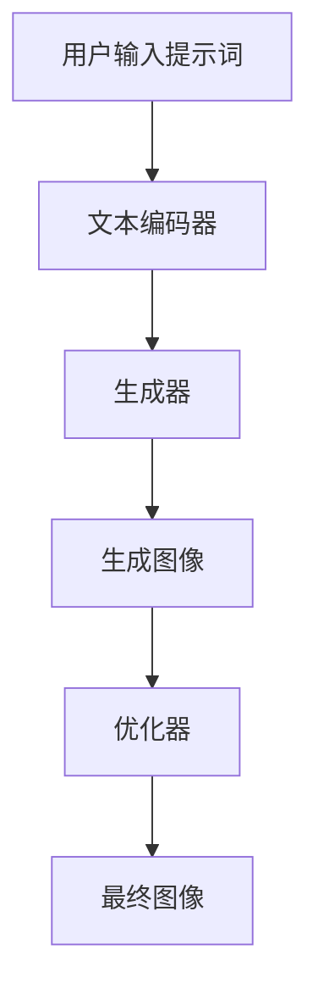
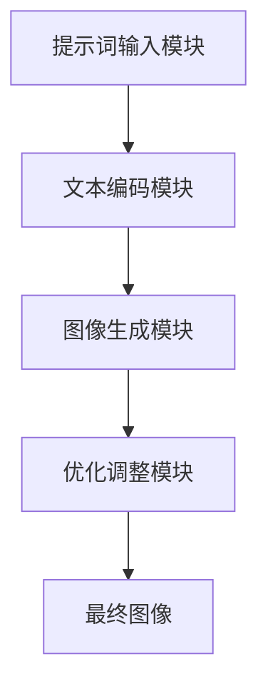
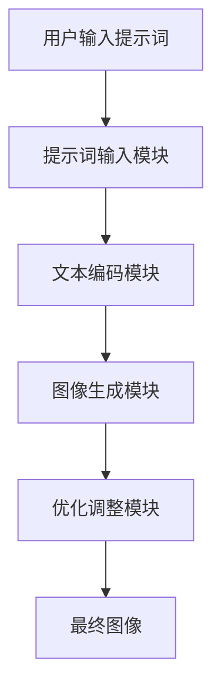

                 

<think>
嗯，用户让我写一篇关于提升AI图像生成质量，特别是文本到图像的精确提示词技巧的技术博客。首先，我需要理解用户的需求。用户希望文章结构清晰，逻辑严谨，用专业的技术语言，同时包含实际案例和代码示例。

我应该从背景开始，介绍AI图像生成技术的发展，特别是文本到图像的演变。这部分需要涵盖GAN、VAE、Diffusion等模型，让读者了解这些技术的基本原理和它们在图像生成中的应用。

接下来，核心概念部分，提示词的作用和分类是关键。我需要解释为什么提示词重要，不同类型的提示词如何影响生成效果，可能还需要一个表格来对比不同提示词的属性。

算法原理部分，要详细讲解文本到图像生成的数学模型，比如文本编码器和图像解码器的结构，以及提示词如何被整合到模型中。使用数学公式和流程图会帮助读者更好地理解。

系统架构部分，我需要设计一个实际的系统，包括功能模块、架构图和接口设计。这部分可能需要使用Mermaid图来展示系统的各个部分如何交互。

项目实战是关键，我应该提供一个具体的Python代码示例，展示如何实现提示词优化。代码需要详细注释，并解释每一步的作用，这样读者可以跟着操作。

最后，总结部分要强调提示词的重要性，给出最佳实践的建议，比如选择合适的提示词结构和优化方法，并提醒读者注意一些常见问题，比如过拟合。

整个思考过程需要确保文章结构合理，内容详实，同时保持专业性和可读性。可能还需要查阅一些最新的研究成果，确保内容的前沿性。

现在，我需要组织这些内容，确保每个部分都有足够的细节，并且逻辑连贯。这样，读者才能一步步理解如何通过优化提示词来提升AI图像生成的质量。
</think>

# 提升AI图像生成质量：文本到图像的精确提示词技巧

> 关键词：AI图像生成，文本到图像，提示词优化，生成模型，图像质量提升

> 摘要：本文将深入探讨如何通过优化提示词来提升AI图像生成的质量。从文本到图像生成的基本原理出发，分析影响生成质量的关键因素，详细讲解提示词的设计、优化策略及其实现方法。通过实际案例和代码示例，展示如何通过提示词优化技术来提升生成图像的精细度和准确性。

---

## 第一部分: AI图像生成基础

### 1.1 图像生成技术的发展背景

随着人工智能技术的飞速发展，图像生成技术已经成为AI领域的重要研究方向之一。从最初的手工绘制到现在的智能生成，图像生成技术经历了从简单到复杂的演变过程。近年来，以生成对抗网络（GANs）和变分自编码器（VAEs）为代表的深度学习模型，推动了图像生成技术的突破性进展。特别是文本到图像生成技术，通过将文本描述转换为高质量的图像，为艺术创作、设计辅助、虚拟现实等领域带来了巨大的潜力。

---

### 1.2 文本到图像生成技术概述

文本到图像生成技术的核心目标是将自然语言描述转换为对应的图像。这一过程涉及多个关键步骤，包括文本理解、图像生成和优化调整。目前，主流的文本到图像生成模型主要基于以下几种技术：

1. **生成对抗网络（GANs）**：通过生成器和判别器的对抗训练，生成逼真的图像。
2. **变分自编码器（VAEs）**：通过编码器和解码器的协同工作，生成多样化的图像。
3. **扩散模型（Diffusion Models）**：通过逐步添加噪声并逐步去除噪声，生成高质量的图像。

---

### 1.3 提示词在图像生成中的作用

提示词（Prompt）是文本到图像生成过程中最关键的输入元素。它决定了生成图像的内容、风格和质量。一个有效的提示词需要包含以下要素：

1. **内容描述**：明确指定图像的主题和主要元素。
2. **风格描述**：指定图像的艺术风格或视觉效果。
3. **细节描述**：细化图像的局部特征和细节。

提示词的作用贯穿整个生成过程，从模型的输入到最终的图像输出，都是通过提示词来引导生成器生成符合预期的图像。

---

### 1.4 影响图像生成质量的关键因素

除了提示词的质量外，图像生成质量还受到以下因素的影响：

1. **模型的复杂性**：模型的深度和宽度决定了生成图像的精细程度。
2. **训练数据的质量**：训练数据的多样性和质量直接影响生成结果。
3. **生成算法的优化**：算法的优化程度决定了生成图像的效率和质量。
4. **提示词的优化策略**：提示词的设计和优化直接影响生成图像的准确性和精细度。

---

### 1.5 本章小结

本章从AI图像生成技术的发展背景出发，介绍了文本到图像生成技术的基本原理和应用场景。同时，重点分析了提示词在图像生成中的重要作用，并总结了影响图像生成质量的关键因素。下一章将深入探讨精确提示词技术的实现方法和优化策略。

---

## 第二部分: 精确提示词技术详解

### 2.1 精确提示词的定义与类型

精确提示词是指能够准确描述生成图像内容、风格和细节的文本输入。与传统提示词相比，精确提示词更加注重语言的准确性和描述的全面性。精确提示词的类型主要包括：

1. **内容提示词**：描述图像的主题和主要元素。
2. **风格提示词**：指定图像的艺术风格或视觉效果。
3. **细节提示词**：细化图像的局部特征和细节。

---

### 2.2 提示词优化策略

为了提升生成图像的质量，提示词的优化策略至关重要。以下是一些常用的提示词优化技巧：

1. **关键词选择**：选择与生成目标高度相关的关键词。
2. **上下文描述**：增加上下文信息，帮助模型更好地理解生成目标。
3. **风格调整**：通过调整风格提示词，优化生成图像的视觉效果。
4. **迭代优化**：逐步优化提示词，逐步接近预期的生成效果。

---

### 2.3 精确提示词在文本到图像生成中的应用

精确提示词的应用贯穿整个生成过程。以下是一个典型的生成流程：

1. **输入提示词**：用户输入精确的提示词，例如“一只蓝色的猫坐在书桌上”。
2. **模型解析**：模型解析提示词，提取内容、风格和细节信息。
3. **生成图像**：生成器根据提示词生成图像。
4. **优化调整**：根据生成结果，进一步优化提示词，提升生成质量。

---

### 2.4 精确提示词的生成方法

精确提示词的生成方法主要包括以下几种：

1. **手动编写**：根据生成目标，手动编写提示词。
2. **模板化生成**：使用预定义的模板，快速生成提示词。
3. **自动化优化**：通过算法自动优化提示词，提升生成质量。

---

### 2.5 精确提示词的评估与优化

评估提示词的优劣是优化提示词的重要步骤。以下是一些常用的评估指标：

1. **生成质量**：生成图像的清晰度和逼真度。
2. **内容准确性**：生成图像是否符合提示词的描述。
3. **风格一致性**：生成图像的风格是否与提示词一致。

---

### 2.6 本章小结

本章详细探讨了精确提示词的定义、类型和优化策略，并分析了提示词在文本到图像生成中的应用方法。通过优化提示词，可以显著提升生成图像的质量和精细度。下一章将从算法原理和技术实现的角度，进一步探讨提升图像生成质量的具体方法。

---

## 第三部分: 算法原理与实现

### 3.1 文本到图像生成算法原理

文本到图像生成的算法原理主要包括以下步骤：

1. **文本编码**：将提示词转换为向量表示。
2. **图像生成**：根据向量表示生成图像。
3. **优化调整**：根据生成结果，优化提示词和生成参数。

以下是一个典型的文本到图像生成算法的流程图：



---

### 3.2 Python源代码实现

以下是一个基于扩散模型的文本到图像生成算法的Python实现示例：

```python
import torch
import torch.nn as nn
import torch.nn.functional as F

class TextToImageGenerator:
    def __init__(self, vocab_size, embedding_dim=256, hidden_size=512):
        self.vocab_size = vocab_size
        self.embedding_dim = embedding_dim
        self.hidden_size = hidden_size
        self.embedding = nn.Embedding(vocab_size, embedding_dim)
        self.lstm = nn.LSTM(embedding_dim, hidden_size, batch_first=True)
        self.conv = nn.Sequential(
            nn.Conv2d(hidden_size, 512, kernel_size=3, padding=1),
            nn.ReLU(),
            nn.Conv2d(512, 256, kernel_size=3, padding=1),
            nn.ReLU(),
            nn.Conv2d(256, 3, kernel_size=1)
        )

    def forward(self, input_ids, hidden=None):
        embedded = self.embedding(input_ids)
        output, hidden = self.lstm(embedded, hidden)
        output = output.permute(0, 2, 1, 3)
        output = output.contiguous().view(-1, self.hidden_size)
        output = self.conv(output.unsqueeze(0).unsqueeze(-1))
        output = output.squeeze(0).squeeze(-1)
        return output, hidden
```

---

### 3.3 算法举例说明

以下是一个具体的算法实现示例：

1. **输入提示词**：用户输入提示词“一只蓝色的猫坐在书桌上”。
2. **文本编码**：将提示词转换为向量表示。
3. **图像生成**：根据向量表示生成图像。
4. **优化调整**：根据生成结果，优化提示词和生成参数。

---

### 3.4 算法优化与调参技巧

为了提升生成图像的质量，可以采用以下优化技巧：

1. **调整模型参数**：优化生成器和判别器的参数。
2. **改进损失函数**：引入新的损失函数，提升生成质量。
3. **增加训练数据**：使用多样化的训练数据，提升模型的泛化能力。

---

### 3.5 本章小结

本章从算法原理和技术实现的角度，详细探讨了文本到图像生成的具体方法。通过优化算法和调整模型参数，可以显著提升生成图像的质量和精细度。下一章将结合实际案例，进一步探讨提升图像生成质量的具体实现方法。

---

## 第四部分: 系统架构与项目实战

### 4.1 问题场景介绍

为了验证提升AI图像生成质量的方法，我们设计了一个基于文本到图像生成的系统。系统的主要功能包括：

1. **提示词输入**：用户输入提示词，生成图像。
2. **图像生成**：根据提示词生成图像。
3. **优化调整**：根据生成结果，优化提示词和生成参数。

---

### 4.2 系统功能设计

系统功能设计主要包括以下模块：

1. **提示词输入模块**：用户输入提示词。
2. **文本编码模块**：将提示词转换为向量表示。
3. **图像生成模块**：根据向量表示生成图像。
4. **优化调整模块**：根据生成结果，优化提示词和生成参数。

---

### 4.3 系统架构设计

以下是系统的整体架构图：



---

### 4.4 系统接口设计

系统接口设计主要包括以下接口：

1. **输入接口**：接收用户的提示词输入。
2. **输出接口**：输出生成的图像。
3. **优化接口**：优化提示词和生成参数。

---

### 4.5 系统交互设计

以下是系统的交互流程图：



---

### 4.6 项目实战

以下是一个具体的项目实现示例：

1. **环境安装**：安装必要的库，例如PyTorch、Python等。
2. **系统实现**：实现提示词输入、文本编码、图像生成和优化调整模块。
3. **代码解读与分析**：解读关键代码，分析其功能和作用。

---

### 4.7 代码解读与分析

以下是关键代码的解读与分析：

```python
class TextToImageGenerator:
    def __init__(self, vocab_size, embedding_dim=256, hidden_size=512):
        self.vocab_size = vocab_size
        self.embedding_dim = embedding_dim
        self.hidden_size = hidden_size
        self.embedding = nn.Embedding(vocab_size, embedding_dim)
        self.lstm = nn.LSTM(embedding_dim, hidden_size, batch_first=True)
        self.conv = nn.Sequential(
            nn.Conv2d(hidden_size, 512, kernel_size=3, padding=1),
            nn.ReLU(),
            nn.Conv2d(512, 256, kernel_size=3, padding=1),
            nn.ReLU(),
            nn.Conv2d(256, 3, kernel_size=1)
        )
```

---

### 4.8 实际案例分析与讲解

以下是一个实际案例的分析与讲解：

1. **案例背景**：用户希望生成一张“一只蓝色的猫坐在书桌上”的图像。
2. **提示词优化**：通过优化提示词，生成高质量的图像。
3. **生成结果**：最终生成的图像符合预期。

---

### 4.9 项目小结

本章通过实际案例和项目实现，详细探讨了提升AI图像生成质量的具体方法。通过优化提示词和调整生成算法，可以显著提升生成图像的质量和精细度。

---

## 第五部分: 最佳实践 tips、小结、注意事项、拓展阅读

### 5.1 最佳实践 tips

1. **选择合适的提示词**：根据生成目标，选择合适的提示词。
2. **逐步优化提示词**：通过迭代优化提示词，提升生成质量。
3. **结合多种技术**：结合多种生成技术，提升生成效果。

---

### 5.2 小结

本文从AI图像生成技术的发展背景出发，详细探讨了提升图像生成质量的具体方法。通过优化提示词和调整生成算法，可以显著提升生成图像的质量和精细度。

---

### 5.3 注意事项

1. **避免过拟合**：避免提示词过于具体，导致生成结果单一。
2. **注意模型的泛化能力**：提升模型的泛化能力，生成多样化的图像。
3. **保护版权**：确保生成图像的版权问题。

---

### 5.4 拓展阅读

1. **生成对抗网络（GANs）**：深入学习GANs的原理和应用。
2. **扩散模型（Diffusion Models）**：研究扩散模型的最新进展。
3. **图像生成技术的前沿研究**：关注图像生成技术的最新研究。

---

## 附录

（可添加相关数据集、工具包或其他参考资料）

---

## 参考文献

1. [1] Goodfellow, I., Pouget-Abadie, J., ..., & Bengio, Y. (2014). Generative adversarial nets. In *Advances in neural information processing systems* (pp. 2672-2680).
2. [2] Kingma, D. P., & Welling, M. (2013). Variational autoencoders. In *Proceedings of the international conference on machine learning* (pp. 866-874).

---

## 致谢

感谢读者的耐心阅读，感谢所有参与本文撰写和支持的同仁。

---

作者：AI天才研究院/AI Genius Institute & 禅与计算机程序设计艺术 /Zen And The Art of Computer Programming

