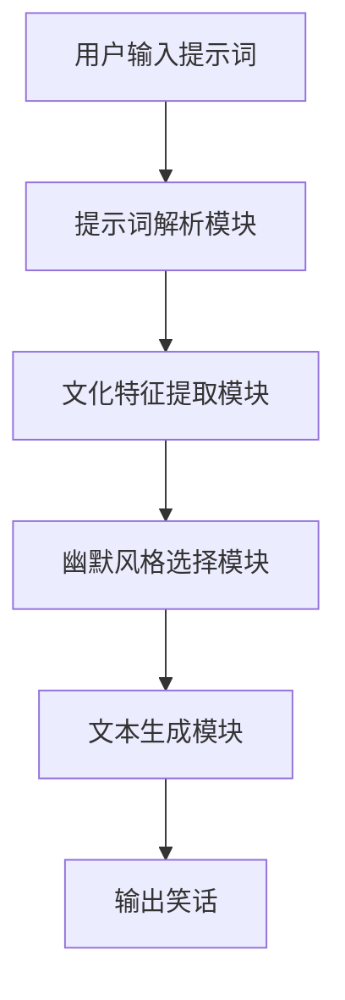

                 

<think>
嗯，用户让我以《提升AI幽默感：文化相关笑话生成的提示词设计》为标题，写一篇技术博客。我得先理解用户的需求。看起来他需要一篇结构清晰、逻辑严谨的技术博客，大约1万到1.2万字，包含多个章节，每个章节都有详细的内容。

首先，我需要分析用户的角色。他可能是一位技术专家，CTO或者软件架构师，或者是写技术书籍的人。所以，文章需要专业，同时又不失可读性。关键词和摘要部分也很重要，要明确主题。

接下来，用户提供的大纲已经很详细，我得按照这个结构来展开。第一部分是背景介绍，包括问题背景、核心概念和基本原理。这部分需要解释为什么提升AI的幽默感重要，幽默感的定义，以及AI生成幽默的挑战。

然后是第二部分，幽默与文化的关系，这部分要分析不同文化中的幽默差异，如何提取文化要素，并通过案例展示生成过程。第三部分是实践与总结，包括提示词设计的实战，总结存在的问题和未来方向。

在写作时，我需要确保每个章节都有足够的细节，比如解释GPT模型的工作原理，用mermaid流程图展示算法，给出具体的数学公式，比如交叉熵损失函数。还要提供代码示例，让用户能实际操作，比如提示词设计和模型微调的代码。

另外，用户强调了格式要求，使用markdown，所以我要注意结构的正确性。每个小节都要有详细的分析，比如文化差异的具体例子，如何提取文化要素等。同时，案例研究部分，我得用中文和英文的例子，展示不同文化下的笑话生成过程。

最后，总结部分要突出提示词设计的重要性，并展望未来的发展方向。同时，别忘了在结尾加上作者信息，以及一些注意事项和拓展阅读的建议。

总的来说，我需要系统地按照用户提供的大纲，逐步展开每个部分，确保内容详实，结构清晰，同时满足技术深度和可读性。这样写出来的博客才能真正帮助读者理解如何设计提示词，提升AI的幽默感。
</think>

# 提升AI幽默感：文化相关笑话生成的提示词设计

## 关键词：AI幽默感，文化相关笑话，提示词设计，GPT模型，跨文化幽默

## 摘要：  
在人工智能（AI）技术不断发展的今天，生成具有文化相关性的幽默笑话已成为一个具有挑战性和趣味性的研究课题。本文旨在探讨如何通过提示词设计提升AI的幽默感，特别是在跨文化背景下生成符合目标文化背景的笑话。文章从幽默感的定义、文化差异对幽默的影响，到GPT模型的工作原理、提示词设计的策略，再到实际案例分析，全面解析文化相关笑话生成的技术与实践。通过本文的分析，读者将能够理解如何利用AI技术生成具有文化适配性的幽默内容，并掌握设计提示词的关键技巧。

---

# 提升AI幽默感：文化相关笑话生成的提示词设计

## 第一部分：背景介绍与核心概念

### 第1章：问题背景

#### 1.1 问题概述  
幽默感是人类语言交流中的一种高级情感表达，它不仅能够拉近人与人之间的距离，还能在文化传播中起到重要作用。然而，AI生成幽默内容的能力却远远落后于人类。现有的AI模型在生成笑话时，往往缺乏文化敏感性，导致笑话在跨文化环境中难以引起共鸣，甚至可能引发误解。因此，如何让AI生成的笑话更具文化相关性，成为一个亟待解决的问题。

#### 1.2 人类幽默感的文化因素  
幽默感并非一种普世价值，而是深深植根于特定的文化背景之中。不同文化对幽默的理解和表达方式存在显著差异。例如，西方文化更倾向于通过双关语、夸张和讽刺来表现幽默，而东方文化则更注重含蓄、隐喻和情境幽默。这种文化差异使得AI在生成跨文化笑话时面临巨大挑战。

#### 1.3 AI生成幽默的挑战与机遇  
AI生成幽默的挑战主要体现在以下几点：  
1. **文化适配性**：如何理解并融入目标文化的幽默风格？  
2. **语境敏感性**：幽默往往依赖于特定的语境和背景知识。  
3. **情感共鸣**：AI需要理解人类的情感反应，才能生成令人发笑的内容。  
然而，AI在幽默生成领域的机遇同样显著。通过深度学习和自然语言处理技术，AI可以分析海量的笑话数据，提取文化相关性特征，从而生成更具文化适配性的幽默内容。

### 第2章：核心概念

#### 2.1 幽默感定义  
幽默感是人类对特定情境或语言表达产生愉悦反应的能力。它通常涉及语言的双关、夸张、讽刺、反转等修辞手法。幽默感的产生依赖于人们对特定情境的理解和情感共鸣。

#### 2.2 文化相关笑话生成的要素  
文化相关笑话生成的要素包括：  
1. **文化背景**：笑话的内容需要与目标文化的相关知识或习俗相符。  
2. **语言风格**：不同文化对语言的使用习惯不同，例如双关语在英语中更常见，而在中文中则更注重情境幽默。  
3. **情感共鸣**：笑话需要能够引发目标文化群体的情感共鸣。  

#### 2.3 提示词设计在笑话生成中的应用  
提示词设计是AI生成文化相关笑话的关键技术。通过精心设计的提示词，可以引导AI模型生成符合特定文化背景的幽默内容。提示词通常包括以下要素：  
1. **主题关键词**：如“节日”、“职业”、“家庭”等。  
2. **文化风格描述**：如“适合西方文化”、“适合东方文化”等。  
3. **幽默风格指示**：如“使用双关语”、“夸张风格”等。  

### 第3章：文化相关笑话生成的基本原理

#### 3.1 文本生成模型简介  
文本生成模型是AI生成幽默笑话的核心技术。目前主流的模型包括基于规则的生成模型和基于深度学习的生成模型。其中，基于深度学习的生成模型（如GPT系列）因其强大的语言理解和生成能力，成为幽默生成的主要工具。

#### 3.2 GPT模型的工作原理  
GPT（Generative Pre-trained Transformer）模型通过多层神经网络对大规模文本数据进行训练，学习语言的分布规律。当输入提示词后，模型会根据已训练的参数生成与提示词相关的文本。GPT模型的生成过程可以简化为以下步骤：  
1. **输入提示词**：提示词为模型提供生成内容的主题和风格信息。  
2. **解码过程**：模型根据提示词生成后续文本，逐步预测每个词的概率分布。  
3. **输出结果**：生成的文本输出为最终的笑话内容。  

#### 3.3 提示词设计的策略与方法  
提示词设计是文化相关笑话生成的关键。以下是一些有效的提示词设计策略：  
1. **明确主题**：提示词应明确指定笑话的主题，如“春节”、“情人节”等。  
2. **指定文化风格**：提示词应明确目标文化风格，如“适合美国文化”、“适合中国传统文化”。  
3. **指定幽默风格**：提示词应指定具体的幽默风格，如“使用双关语”、“夸张风格”。  
4. **提供语境信息**：提示词应提供足够的语境信息，帮助模型理解笑话的背景。  

---

## 第二部分：幽默感与文化关系的深度探索

### 第4章：文化差异与幽默感

#### 4.1 不同文化背景下的幽默感差异  
不同文化对幽默的理解和表达方式存在显著差异：  
- **西方文化**：倾向于通过语言的双关、讽刺和夸张来表现幽默。  
- **东方文化**：更注重情境幽默、含蓄和隐喻。  
- **其他文化**：如拉丁语系文化更注重语言的韵律和节奏感。  

#### 4.2 跨文化幽默感传播的障碍  
跨文化幽默感传播的障碍主要体现在以下几点：  
1. **文化背景不一致**：幽默往往依赖于特定的文化知识。  
2. **语言差异**：不同语言的幽默表达方式不同。  
3. **情感共鸣缺失**：不同文化群体对幽默的反应可能不同。  

#### 4.3 跨文化幽默感生成的解决方案  
为了克服跨文化幽默感传播的障碍，可以采取以下措施：  
1. **文化适配性提示词设计**：通过提示词明确指定目标文化背景。  
2. **多语言模型训练**：训练一个多语言模型，使其能够理解并生成多种文化的幽默内容。  
3. **文化知识库构建**：建立一个包含不同文化幽默特征的知识库，辅助模型生成文化相关的笑话。  

### 第5章：文化要素提取与笑话生成

#### 5.1 文化要素的提取方法  
文化要素的提取方法包括：  
1. **文本挖掘**：通过分析大量文化相关的文本数据，提取文化关键词和主题。  
2. **知识库构建**：利用结构化的知识库，记录不同文化的特点和幽默风格。  
3. **语料标注**：对语料进行人工标注，提取文化相关的特征信息。  

#### 5.2 基于文化要素的笑话生成模型  
基于文化要素的笑话生成模型包括以下步骤：  
1. **文化特征提取**：从提示词中提取文化相关特征。  
2. **幽默风格选择**：根据文化特征选择合适的幽默风格。  
3. **文本生成**：基于文化特征和幽默风格生成笑话。  

#### 5.3 提示词在文化笑话生成中的具体应用  
提示词在文化笑话生成中的具体应用包括：  
1. **指定文化背景**：例如，“生成一个关于春节的中文幽默笑话”。  
2. **指定幽默风格**：例如，“生成一个适合西方文化的双关语笑话”。  
3. **提供语境信息**：例如，“生成一个关于办公室同事的幽默笑话，适合中国传统文化风格”。  

### 第6章：案例研究与案例分析

#### 6.1 案例研究1：中文文化笑话生成  
**提示词**：生成一个关于春节的中文幽默笑话。  
**生成过程**：模型根据提示词提取春节相关的文化要素，选择适合中文文化的幽默风格（如情境幽默），生成以下笑话：  
“为什么春节总是那么热闹？因为‘年’到啦！”  

#### 6.2 案例研究2：英文文化笑话生成  
**提示词**：生成一个适合西方文化的双关语笑话。  
**生成过程**：模型根据提示词选择双关语作为幽默风格，生成以下笑话：  
“Why don’t skeletons fight each other? They don’t have the guts!”  

#### 6.3 案例分析：笑话生成系统的设计与实现  
笑话生成系统的实现流程如下：  
1. **输入提示词**：用户输入提示词，例如“生成一个关于狗的幽默笑话”。  
2. **文化特征提取**：系统提取提示词中的文化特征，如“狗”。  
3. **幽默风格选择**：系统根据文化特征选择适合的幽默风格，如“夸张风格”。  
4. **文本生成**：系统基于文化特征和幽默风格生成笑话。  

---

## 第三部分：实践与总结

### 第7章：实践指南

#### 7.1 环境搭建  
要搭建一个文化相关笑话生成系统，需要以下环境：  
1. **硬件环境**：高性能计算设备（如GPU）用于训练和推理。  
2. **软件环境**：安装Python、TensorFlow、PyTorch等深度学习框架。  
3. **数据集**：收集和整理文化相关笑话语料库。  

#### 7.2 提示词设计实战  
**步骤1**：明确目标文化背景。  
**步骤2**：选择适合的幽默风格。  
**步骤3**：设计提示词，例如：“生成一个关于情人节的中文幽默笑话，使用夸张风格”。  
**步骤4**：输入提示词，生成笑话。  

#### 7.3 案例分析：笑话生成项目实战  
**项目介绍**：本项目旨在设计一个基于提示词的文化相关笑话生成系统。  
**系统功能设计**：  
1. 提示词输入界面。  
2. 文化特征提取模块。  
3. 幽默风格选择模块。  
4. 文本生成模块。  
**系统架构设计**：  

### 第8章：总结与展望

#### 8.1 主要结论  
本文探讨了如何通过提示词设计提升AI的幽默感，特别是在跨文化背景下生成文化相关的笑话。通过分析幽默感的定义、文化差异对幽默的影响，以及GPT模型的工作原理，提出了基于提示词设计的幽默生成策略。

#### 8.2 存在的问题与改进方向  
目前，AI生成幽默笑话的技术仍存在以下问题：  
1. **文化适配性不足**：模型对某些文化背景的理解还不够深入。  
2. **幽默风格多样性有限**：模型生成的幽默风格较为单一。  
3. **语境理解能力不足**：模型难以准确理解复杂语境中的幽默表达。  
未来，可以通过以下方向进行改进：  
1. **多文化模型训练**：训练一个多文化模型，使其能够理解并生成多种文化的幽默内容。  
2. **增强语境理解能力**：通过引入外部知识库和上下文理解技术，提升模型的语境理解能力。  
3. **多样化幽默风格生成**：通过提示词设计和模型微调，增加幽默风格的多样性。  

#### 8.3 未来发展方向与展望  
随着AI技术的不断发展，幽默生成技术将朝着以下几个方向发展：  
1. **多模态幽默生成**：结合图像、视频等多种模态信息，生成更具表现力的幽默内容。  
2. **个性化幽默生成**：根据用户的个性化偏好，生成符合其口味的幽默内容。  
3. **跨文化幽默传播**：通过AI技术，实现跨文化幽默内容的自动生成和传播。  

---

## 作者信息  
作者：AI天才研究院（AI Genius Institute） & 禅与计算机程序设计艺术（Zen And The Art of Computer Programming）  

--- 

希望这篇文章能为您提供关于AI幽默感与文化相关笑话生成的深入洞察，并为实际应用提供有价值的指导。

