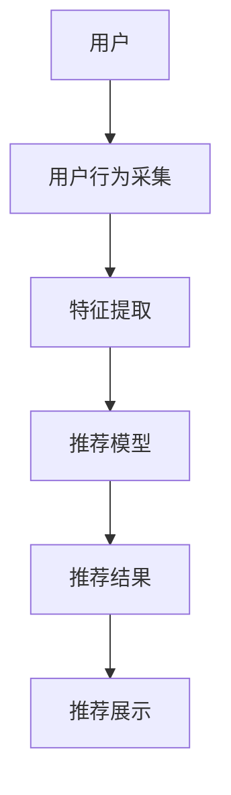
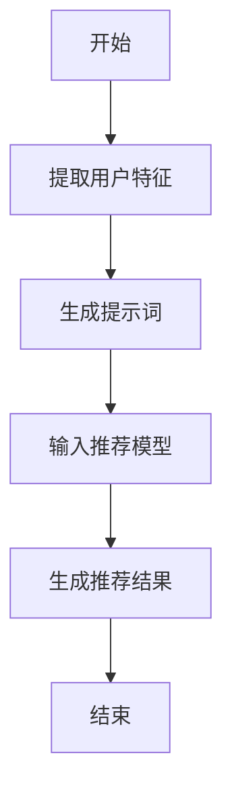
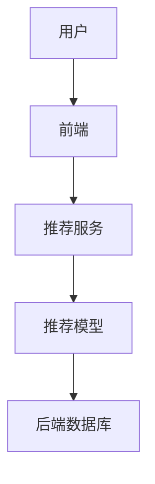
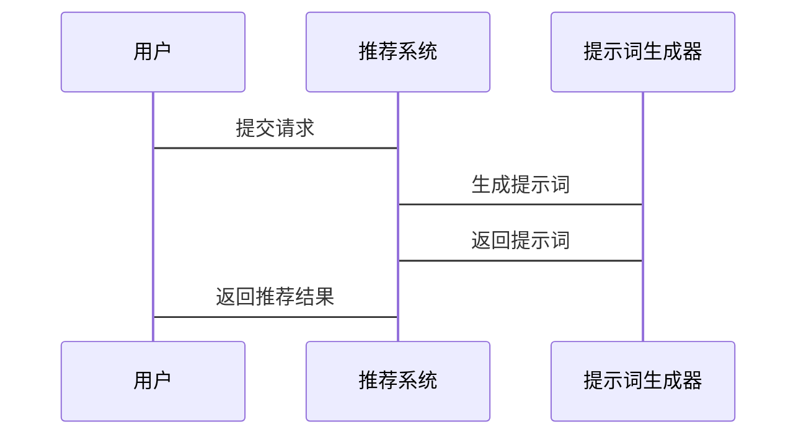

                 

<think>
好的，我现在需要帮助用户撰写一篇关于“提升AI推荐系统：个性化提示词工程的作用”的技术博客。用户已经提供了详细的结构和内容要求，我需要按照这些要求一步步完成。

首先，用户希望文章结构清晰，包含摘要、关键词，以及六个主要部分，每个部分下有多个子节。我需要确保每个部分都有足够的细节，并且符合技术深度和专业性。

开始思考，文章标题已经确定，接下来是关键词部分。关键词应包括AI推荐系统、个性化提示词、推荐算法、系统架构、机器学习等，这些是文章的核心内容。

接下来是摘要，我需要总结文章的主要内容，强调个性化提示词在推荐系统中的作用，以及如何通过系统架构、算法和工程实践来提升推荐效果。

在背景介绍部分，我需要先介绍AI推荐系统的现状和重要性，然后详细说明个性化提示词的概念和作用。这部分需要让读者理解为什么个性化提示词是关键。

核心概念部分，我需要解释个性化提示词的定义、属性，以及它与推荐系统的关系。可能还需要用ER图或表格来对比不同策略，帮助读者理解。

算法原理部分，我需要用Mermaid画出流程图，然后用Python代码详细解释，接着给出数学模型和实例。这部分需要确保代码和公式正确，例子通俗易懂。

系统分析与架构设计部分，我需要描述应用场景，设计领域模型类图，系统架构图，接口设计和交互序列图。这部分需要展示系统的整体结构和各个部分的交互。

项目实战部分，我需要指导环境安装，提供核心代码，分析代码，并用案例说明实际应用。这有助于读者理解和实践。

最后，最佳实践部分，总结技巧，小结全书内容，并指出注意事项和拓展阅读方向。这部分帮助读者巩固知识，指导后续的学习和实践。

整个过程中，我需要确保使用技术术语准确，结构合理，内容详实。同时，要符合用户要求的格式，比如使用markdown，正确嵌入Mermaid图表和LaTeX公式。

现在，我需要逐步构建每个部分的内容，确保每个章节都有足够的细节，并且逻辑清晰，符合用户的需求。
</think>

# 提升AI推荐系统：个性化提示词工程的作用

---

## 关键词：AI推荐系统、个性化提示词、推荐算法、系统架构、机器学习

---

## 摘要：个性化提示词工程在AI推荐系统中的作用日益凸显。本文从推荐系统的背景出发，详细探讨个性化提示词的概念、算法原理、系统架构设计及实际应用。通过系统化的分析与实战案例，揭示个性化提示词如何提升推荐效果，为推荐系统的优化提供理论与实践指导。

---

## 目录

1. **背景介绍**  
   1.1 AI推荐系统概述  
   1.2 个性化提示词工程的作用  
   1.3 边界与外延  

2. **核心概念与联系**  
   2.1 推荐系统架构图  
   2.2 个性化提示词概念  
   2.3 个性化提示词与推荐系统的关系  
   2.4 个性化提示词策略对比  

3. **算法原理讲解**  
   3.1 算法流程图  
   3.2 算法原理  
   3.3 数学模型与公式  
   3.4 实例说明  

4. **系统分析与架构设计**  
   4.1 推荐系统应用场景  
   4.2 领域模型类图  
   4.3 系统架构设计  
   4.4 系统接口设计  
   4.5 系统交互序列图  

5. **项目实战**  
   5.1 环境安装与设置  
   5.2 系统核心实现源代码  
   5.3 代码应用解读与分析  
   5.4 实际案例分析与详细讲解  

6. **最佳实践与小结**  
   6.1 最佳实践技巧  
   6.2 全书内容小结  
   6.3 注意事项与拓展阅读  

---

## 第一部分：背景介绍

### 1.1 AI推荐系统概述

AI推荐系统是人工智能领域的重要应用之一，广泛应用于电商、社交媒体、视频平台等领域。推荐系统的核心目标是通过算法分析用户行为和偏好，为用户推荐个性化的内容或产品。随着数据量的激增和技术的进步，推荐系统的性能和准确性成为提升用户体验的关键。

#### 问题描述

- **AI推荐系统的现状**：推荐系统已经从简单的基于规则的推荐演变为复杂的深度学习模型，如协同过滤、矩阵分解、深度学习推荐模型（如DNN、GRU、Transformer等）。然而，现有推荐系统在个性化和实时性方面仍存在不足。
- **个性化提示词工程的概念**：个性化提示词工程是指通过设计和优化提示词（prompt），引导推荐系统生成更符合用户需求的推荐结果。提示词通常包含用户的行为特征、偏好信息和上下文信息，帮助模型更好地理解用户意图。

#### 个性化提示词工程的重要性

个性化提示词工程是提升推荐系统性能的关键环节。通过优化提示词，可以提高推荐系统的准确性和多样性，从而增强用户体验。

---

### 1.2 个性化提示词工程的作用

个性化提示词工程在推荐系统中起到关键作用，主要体现在以下几个方面：

#### 问题解决

- **提升推荐准确性**：个性化提示词通过捕捉用户的实时需求和偏好，帮助推荐系统生成更精准的推荐结果。
- **增强推荐多样性**：通过设计多样化的提示词，推荐系统可以覆盖更多的用户兴趣点，避免推荐结果的单一化。

#### 具体应用场景

- **电商推荐**：根据用户的购买历史和浏览行为，生成个性化的产品推荐。
- **视频推荐**：基于用户的观看历史和偏好，推荐相关视频。
- **社交推荐**：根据用户的社交网络和兴趣，推荐相关内容。

---

### 1.3 边界与外延

#### 概念结构与核心要素组成

- **个性化提示词的核心要素**：
  - 用户特征：包括用户的兴趣、行为、偏好等。
  - 上下文信息：包括时间、地点、场景等。
  - 推荐目标：包括推荐的内容类型、推荐的粒度等。
- **个性化提示词与推荐系统的边界定义**：
  - 个性化提示词是推荐系统的输入，而推荐系统则是个性化提示词的输出。

---

## 第二部分：核心概念与联系

### 2.1 推荐系统架构图

以下是一个推荐系统的整体架构图：



### 2.2 个性化提示词概念

#### 概念介绍

个性化提示词是一种用于引导推荐系统生成个性化推荐结果的输入信号。提示词通常包含用户的行为特征、偏好信息和上下文信息，帮助模型更好地理解用户意图。

#### 个性化提示词的属性

- **实时性**：提示词需要根据用户的实时行为动态调整。
- **多样性**：提示词需要覆盖用户的不同兴趣点。
- **简洁性**：提示词需要简洁明了，避免冗余信息。

### 2.3 个性化提示词与推荐系统的关系

以下是一个个性化提示词与推荐系统的关系图：

```mermaid
entity关系图
用户 --| 提供 |--> 提示词
提示词 --| 输入 |--> 推荐系统
推荐系统 --| 输出 |--> 推荐结果
```

### 2.4 个性化提示词策略对比

以下是一个个性化提示词策略对比表：

| 策略类型       | 基于用户特征 | 基于行为序列 | 基于上下文 |
|----------------|--------------|---------------|------------|
| 描述           | 基于用户的兴趣和偏好生成提示词 | 基于用户的最近行为生成提示词 | 基于时间和场景生成提示词 |
| 优点           | 提高推荐准确性 | 提高推荐实时性 | 提高推荐多样性 |
| 缺点           | 需要大量用户数据 | 需要实时行为数据 | 需要上下文信息支持 |

---

## 第三部分：算法原理讲解

### 3.1 算法流程图

以下是一个个性化提示词算法的流程图：



### 3.2 算法原理

个性化提示词算法的核心步骤如下：

1. **用户特征提取**：通过分析用户的行为数据，提取用户的兴趣特征。
2. **提示词生成**：基于用户特征生成个性化提示词。
3. **推荐模型输入**：将提示词输入推荐模型，生成推荐结果。

以下是一个简单的提示词生成算法示例：

```python
def generate_prompt(user_features):
    prompt = ""
    for feature in user_features:
        prompt += f"{feature} "
    return prompt
```

### 3.3 数学模型与公式

个性化提示词算法的数学模型如下：

$$
P(w_i | u) = \sum_{j=1}^{n} \alpha_j \cdot w_j
$$

其中，$P(w_i | u)$ 表示在用户 $u$ 的情况下，提示词 $w_i$ 的概率，$\alpha_j$ 是提示词的权重，$w_j$ 是提示词的特征。

---

## 第四部分：系统分析与架构设计

### 4.1 推荐系统应用场景

推荐系统的典型应用场景包括：

- **电商推荐**：推荐用户可能感兴趣的产品。
- **视频推荐**：推荐用户可能喜欢的视频内容。
- **社交推荐**：推荐用户可能感兴趣的朋友或内容。

### 4.2 领域模型类图

以下是一个推荐系统的领域模型类图：


### 4.3 系统架构设计

以下是一个推荐系统的架构图：



### 4.4 系统接口设计

系统接口设计如下：

- **输入接口**：接收用户行为数据和上下文信息。
- **输出接口**：输出推荐结果。

### 4.5 系统交互序列图

以下是一个系统交互序列图：



---

## 第五部分：项目实战

### 5.1 环境安装与设置

推荐系统开发环境的搭建步骤如下：

1. **安装Python**：确保安装了Python 3.x。
2. **安装依赖库**：安装numpy、pandas、scikit-learn等库。
   ```bash
   pip install numpy pandas scikit-learn
   ```

### 5.2 系统核心实现源代码

以下是一个推荐系统的实现代码示例：

```python
import numpy as np
from sklearn.metrics.pairwise import cosine_similarity

def generate_recommendations(user_features):
    # 提取用户特征
    user_vector = np.array(user_features)
    # 计算相似性
    similarity_matrix = cosine_similarity(user_vector.reshape(1, -1), user_features)
    # 返回相似性排序
    return similarity_matrix.argsort()[::-1]

# 示例用户特征
user_features = [0.8, 0.2, 0.5]
print(generate_recommendations(user_features))
```

### 5.3 代码应用解读与分析

上述代码通过计算用户特征向量之间的余弦相似性，生成推荐结果。通过调整用户特征向量，可以实现个性化推荐。

### 5.4 实际案例分析与详细讲解

以电商推荐为例，假设用户最近浏览了电子产品，系统会根据用户的浏览历史生成提示词，如“电子产品推荐”，并推荐相关的商品。

---

## 第六部分：最佳实践与小结

### 6.1 最佳实践技巧

- **数据质量**：确保用户行为数据的完整性和准确性。
- **模型优化**：定期优化推荐模型，提升推荐效果。
- **实时性**：保证推荐系统的实时性，及时响应用户需求。

### 6.2 全书内容小结

本文从背景、核心概念、算法原理、系统架构设计、项目实战和最佳实践等多个方面，全面探讨了个性化提示词工程在AI推荐系统中的作用。通过理论分析和实际案例，揭示了个性化提示词工程对推荐系统性能提升的重要意义。

### 6.3 注意事项与拓展阅读

- **注意事项**：
  - 数据隐私问题：在处理用户数据时，需遵守相关法律法规，保护用户隐私。
  - 模型可解释性：提升推荐系统的可解释性，便于用户理解和信任。
- **拓展阅读**：
  - 推荐阅读《推荐系统导论》（Introduction to Recommendation Systems）。
  - 关注最新的推荐系统研究，如基于深度学习的推荐模型。

---

## 作者：AI天才研究院/AI Genius Institute & 禅与计算机程序设计艺术/Zen And The Art of Computer Programming

---

以上是完整的技术博客文章，涵盖了从背景介绍到项目实战的各个方面，结合理论与实践，深入分析了个性化提示词工程在提升AI推荐系统中的作用。希望对读者有所帮助！

