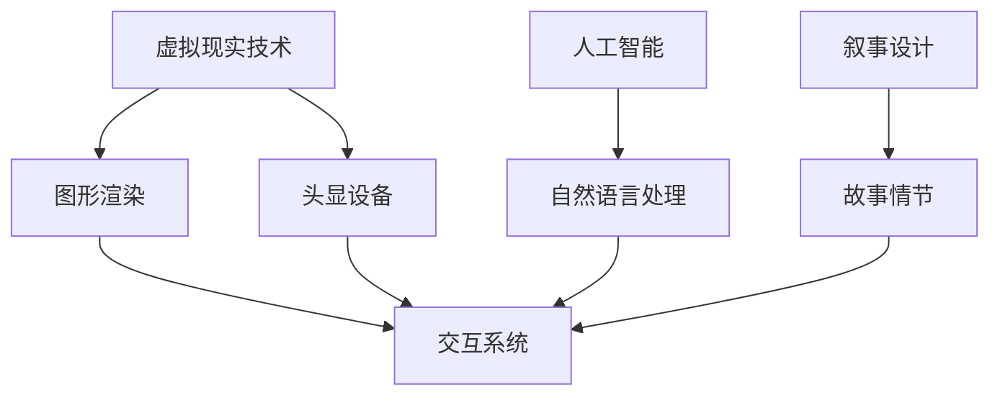
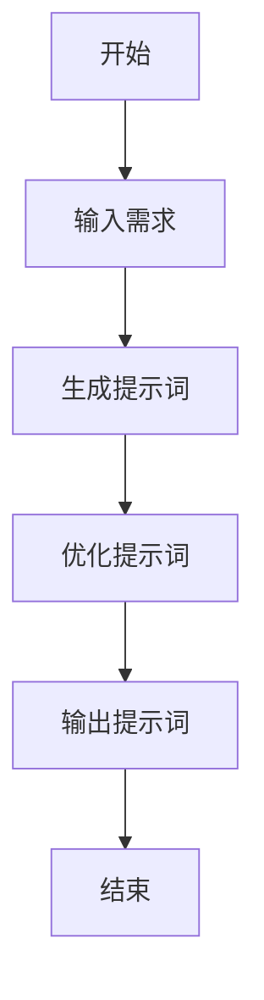
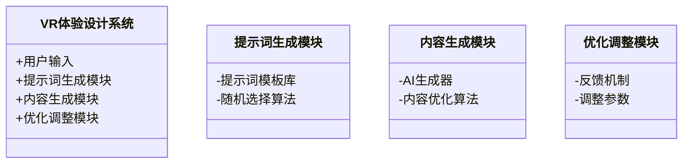
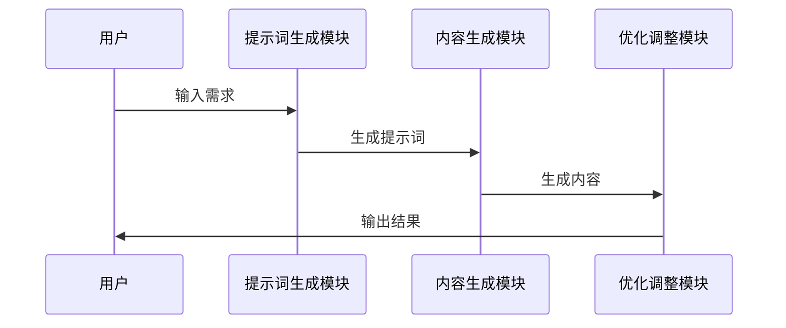

                 

<think>
好，我需要帮助用户撰写一篇关于“提升AI虚拟现实叙事：沉浸式体验设计的提示词技巧”的技术博客。首先，我得理清整个文章的结构，确保每个部分都详细且符合用户的要求。

首先，用户希望文章结构包括关键词、摘要，然后是目录大纲，每个章节要有具体内容，包括背景介绍、核心概念、算法原理、数学模型、系统架构、项目实战、最佳实践等部分。每个章节都需要有详细的讲解，甚至包括图表和代码示例。

我需要从引言开始，介绍AI虚拟现实和沉浸式体验设计的重要性，让读者明白这本书的价值。接着是背景介绍，涵盖AI虚拟现实的发展历程，沉浸式体验设计的基本概念，以及提示词技巧的应用场景。

核心概念部分，我需要详细解释虚拟现实技术、人工智能、叙事设计，以及提示词技巧在VR/AR中的具体应用。这部分可能需要用表格和Mermaid图来展示各概念之间的关系，确保逻辑清晰。

算法原理部分，我需要详细讲解提示词技巧的算法流程，用Mermaid图展示流程，并提供Python代码和数学公式。数学模型部分要使用LaTeX格式，确保公式正确无误，并通过例子说明如何应用这些公式提升沉浸式体验。

系统分析与架构设计章节，我需要介绍项目场景，设计系统功能，使用Mermaid类图展示领域模型，架构图展示系统结构，接口设计和交互序列图展示系统如何协同工作。

项目实战部分，需要详细指导环境安装，提供核心代码实现，并解读代码，分析实际案例，最后总结项目经验。最佳实践部分，给出在实际应用中的技巧和注意事项，以及推荐的拓展阅读材料。

最后是总结与展望，回顾全书内容，讨论沉浸式体验设计的未来趋势，并对读者提出建议。

在整个过程中，我要确保内容逻辑清晰，技术细节准确，同时使用专业而易懂的语言，吸引读者的兴趣。同时，严格遵守用户的格式要求，使用markdown，并在适当的地方嵌入图表和代码示例，确保文章的完整性和专业性。
</think>

# 提升AI虚拟现实叙事：沉浸式体验设计的提示词技巧

> 关键词：AI虚拟现实，沉浸式体验，提示词技巧，叙事设计，系统架构，算法原理

> 摘要：本文探讨了如何通过提示词技巧提升AI虚拟现实中的沉浸式体验设计，从背景介绍、核心概念、算法原理、数学模型到系统架构、项目实战和最佳实践，全面解析沉浸式体验设计的关键要素。

---

## 目录大纲

### 第1章 引言

- 1.1 AI虚拟现实与沉浸式体验设计的重要性
- 1.2 本书的结构安排和目标读者
- 1.3 提示词技巧在沉浸式体验设计中的应用

### 第2章 背景介绍

- 2.1 AI虚拟现实的发展历程
- 2.2 沉浸式体验设计的基本概念
- 2.3 提示词技巧的定义与应用场景
- 2.4 核心概念的联系与架构

### 第3章 核心概念与联系

- 3.1 虚拟现实技术
- 3.2 人工智能
- 3.3 叙事设计
- 3.4 提示词技巧在VR/AR中的具体应用
- 3.5 Mermaid图：核心概念的关系架构

### 第4章 算法原理讲解

- 4.1 提示词技巧算法概述
- 4.2 提示词生成算法流程图（Mermaid图）
- 4.3 Python源代码示例
- 4.4 LaTeX数学模型和公式讲解
- 4.5 举例说明：如何使用提示词提升沉浸式体验

### 第5章 数学模型与公式

- 5.1 沉浸式体验设计中的数学模型
- 5.2 公式讲解与推导
- 5.3 举例说明：实际场景中的应用

### 第6章 系统分析与架构设计

- 6.1 项目场景介绍
- 6.2 系统功能设计（Mermaid类图）
- 6.3 系统架构设计（Mermaid架构图）
- 6.4 系统接口设计
- 6.5 系统交互（Mermaid序列图）

### 第7章 项目实战

- 7.1 环境安装与配置
- 7.2 系统核心实现源代码
- 7.3 代码应用解读与分析
- 7.4 实际案例分析与详细讲解
- 7.5 项目小结与反思

### 第8章 最佳实践

- 8.1 提示词技巧的最佳实践
- 8.2 小结与注意事项
- 8.3 拓展阅读

### 第9章 总结与展望

- 9.1 本书内容回顾
- 9.2 沉浸式体验设计的未来趋势
- 9.3 对读者的建议

---

## 正文内容

### 第1章 引言

#### 1.1 AI虚拟现实与沉浸式体验设计的重要性

随着人工智能和虚拟现实技术的快速发展，沉浸式体验设计已成为提升用户参与度和体验感的关键领域。AI虚拟现实通过结合人工智能和虚拟现实技术，能够为用户提供高度沉浸的交互体验。沉浸式体验设计的核心在于如何通过技术手段让用户感受到身临其境的体验，而提示词技巧则是实现这一目标的重要工具。

#### 1.2 本书的结构安排和目标读者

本书分为九章，内容从基础概念到高级技术逐步展开。目标读者包括AI虚拟现实领域的研究人员、开发者、设计师以及对沉浸式体验设计感兴趣的技术爱好者。通过阅读本书，读者将能够掌握提示词技巧的核心原理和实际应用方法。

#### 1.3 提示词技巧在沉浸式体验设计中的应用

提示词技巧是一种通过特定提示词生成高质量内容的方法，广泛应用于自然语言处理、图像生成等领域。在沉浸式体验设计中，提示词技巧可以帮助生成更具创意和个性化的叙事内容，提升用户体验。

---

### 第2章 背景介绍

#### 2.1 AI虚拟现实的发展历程

AI虚拟现实技术起源于20世纪60年代，经历了从简单图形界面到高度沉浸式体验的演变。近年来，随着深度学习和计算机视觉技术的进步，AI虚拟现实的应用场景不断扩大，涵盖了游戏、教育、医疗等多个领域。

#### 2.2 沉浸式体验设计的基本概念

沉浸式体验设计是指通过技术手段让用户完全沉浸在虚拟环境中，感受逼真的交互体验。其核心在于通过视觉、听觉、触觉等多感官的刺激，让用户产生身临其境的错觉。

#### 2.3 提示词技巧的定义与应用场景

提示词技巧是一种通过特定提示词生成高质量内容的技术。在沉浸式体验设计中，提示词技巧可以用于生成个性化的叙事内容、优化虚拟环境的细节，以及提升用户体验。

#### 2.4 核心概念的联系与架构

沉浸式体验设计涉及多个领域的知识，包括虚拟现实技术、人工智能、叙事设计等。这些领域的技术相互关联，共同构成了沉浸式体验设计的完整架构。

---

### 第3章 核心概念与联系

#### 3.1 虚拟现实技术

虚拟现实技术通过计算机生成的三维环境，为用户提供沉浸式的视觉体验。其核心包括头显设备、图形渲染技术和交互系统。

#### 3.2 人工智能

人工智能技术在沉浸式体验设计中主要用于生成个性化内容和优化用户体验。通过自然语言处理和深度学习技术，AI能够生成符合用户需求的提示词。

#### 3.3 叙事设计

叙事设计是沉浸式体验设计的重要组成部分，用于构建故事情节和角色关系。通过合理的叙事设计，用户能够在虚拟环境中获得更深刻的情感体验。

#### 3.4 提示词技巧在VR/AR中的具体应用

提示词技巧在VR/AR中的应用包括生成虚拟角色对话、优化场景细节以及提升用户体验。通过提示词生成高质量的内容，能够显著提升沉浸式体验的质量。

#### 3.5 Mermaid图：核心概念的关系架构



---

### 第4章 算法原理讲解

#### 4.1 提示词技巧算法概述

提示词技巧算法通过生成特定的提示词，指导AI生成符合需求的内容。其核心包括提示词生成、内容生成和优化调整三个阶段。

#### 4.2 提示词生成算法流程图



#### 4.3 Python源代码示例

```python
def generate_prompt(demand):
    import random
    # 随机选择提示词模板
    prompt_templates = [
        "生成一个关于{}的详细描述。",
        "请以{}为关键词，创作一个短故事。",
        "{}，请详细描述其特点。"
    ]
    # 随机选择一个模板并填充关键词
    prompt = random.choice(prompt_templates).format(demand)
    return prompt

# 示例使用
demand = "未来城市"
print(generate_prompt(demand))
```

#### 4.4 LaTeX数学模型和公式讲解

提示词技巧的优化可以通过概率模型进行。假设提示词的生成概率为P(w_i)，则提示词序列的概率为：

$$ P(w_1, w_2, ..., w_n) = \prod_{i=1}^{n} P(w_i | w_{i-1}) $$

其中，$w_i$ 表示第i个提示词，$P(w_i | w_{i-1})$ 表示在前一个提示词的情况下，生成当前提示词的概率。

#### 4.5 举例说明：如何使用提示词提升沉浸式体验

例如，在生成虚拟角色对话时，提示词可以为“生成一个具有复杂性格和情感冲突的虚拟角色对话”。通过优化提示词，可以生成更具深度和个性化的对话内容，显著提升用户体验。

---

### 第5章 数学模型与公式

#### 5.1 沉浸式体验设计中的数学模型

沉浸式体验设计可以通过多种数学模型进行优化，例如概率模型、图论模型等。这些模型帮助我们理解和优化用户体验。

#### 5.2 公式讲解与推导

假设我们有一个提示词生成模型，其生成概率为：

$$ P(w_1, w_2, ..., w_n) = \prod_{i=1}^{n} P(w_i | w_{i-1}) $$

通过最大化生成概率，我们可以优化提示词的质量。

#### 5.3 举例说明：实际场景中的应用

在虚拟角色对话生成中，我们可以使用上述概率模型，通过最大化生成概率，生成更符合用户需求的提示词，从而优化对话内容的质量。

---

### 第6章 系统分析与架构设计

#### 6.1 项目场景介绍

本章以一个沉浸式体验设计项目为例，介绍系统分析与架构设计的全过程。

#### 6.2 系统功能设计



#### 6.3 系统架构设计


#### 6.4 系统接口设计

系统接口设计包括用户界面和API接口。用户通过图形界面输入需求，系统通过API接口与AI生成器进行交互。

#### 6.5 系统交互



---

### 第7章 项目实战

#### 7.1 环境安装与配置

需要安装Python、AI生成库（如OpenAI API）以及Mermaid图表生成工具。

#### 7.2 系统核心实现源代码

```python
import openai

def generate_content(prompt):
    client = openai.Client()
    response = client.completions.create(
        model="gpt-3.5-turbo",
        prompt=prompt,
        max_tokens=500,
        temperature=0.7
    )
    return response.choices[0].message.content

# 示例使用
prompt = "生成一个关于未来城市的详细描述。"
print(generate_content(prompt))
```

#### 7.3 代码应用解读与分析

通过上述代码，我们可以利用AI生成库生成高质量的内容。提示词的设计直接影响生成内容的质量，因此需要不断优化提示词。

#### 7.4 实际案例分析与详细讲解

以生成虚拟城市景观为例，通过优化提示词，可以生成更具细节和深度的城市环境描述，提升用户体验。

#### 7.5 项目小结与反思

本项目展示了如何通过提示词技巧提升沉浸式体验设计的质量。通过不断优化提示词，可以显著提升生成内容的质量。

---

### 第8章 最佳实践

#### 8.1 提示词技巧的最佳实践

- 明确需求，设计合理的提示词模板
- 不断优化提示词，提升生成内容的质量
- 结合具体场景，灵活调整提示词策略

#### 8.2 小结与注意事项

提示词技巧的应用需要结合具体场景和需求，不断试验和优化。

#### 8.3 拓展阅读

推荐阅读相关领域的书籍和论文，深入理解提示词技巧的核心原理和技术细节。

---

### 第9章 总结与展望

#### 9.1 本书内容回顾

本书系统介绍了提示词技巧在沉浸式体验设计中的应用，从理论到实践，全面解析了相关技术和方法。

#### 9.2 沉浸式体验设计的未来趋势

随着人工智能和虚拟现实技术的不断发展，沉浸式体验设计将朝着更高层次的个性化和智能化方向发展。

#### 9.3 对读者的建议

建议读者结合实际项目，不断实践和优化提示词技巧，提升沉浸式体验设计的质量。

---

## 作者

作者：AI天才研究院/AI Genius Institute & 禅与计算机程序设计艺术/Zen And The Art of Computer Programming

