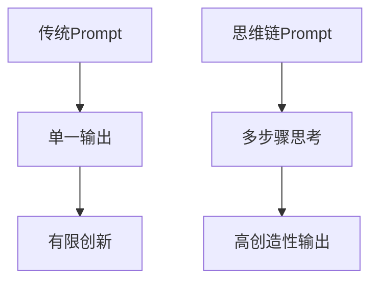
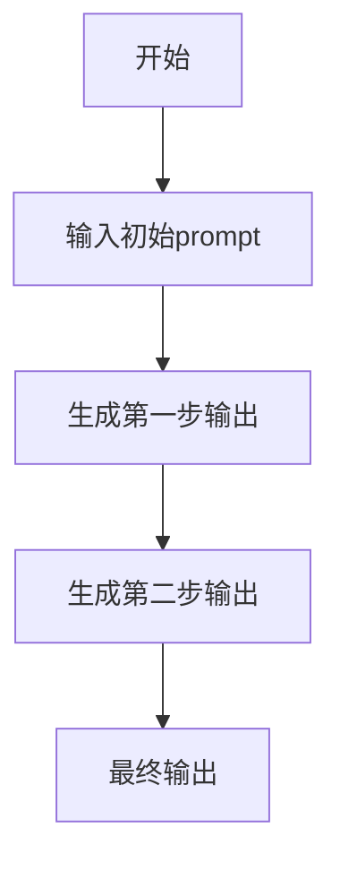
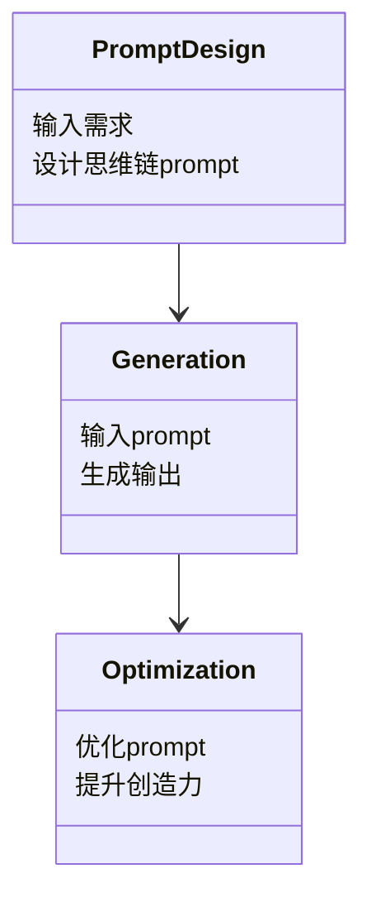

                 

<think>
好，我现在要完成一个任务，就是根据用户提供的需求，撰写一篇技术博客文章。文章标题是《提升ChatGPT创造力：思维链prompt的魔力》，关键词包括ChatGPT、创造力、思维链、prompt、AI、NLP、深度学习。摘要部分需要概括文章的核心内容，强调思维链prompt在提升创造力中的作用，以及其在各个领域的应用。

接下来，我需要按照用户提供的目录大纲，逐步扩展每个章节的内容。首先，每个章节需要包含背景介绍、核心概念、算法原理、系统分析、项目实战、最佳实践等部分。每个部分都需要详细展开，确保内容丰富具体。

在撰写过程中，我需要使用专业的技术语言，同时保持逻辑清晰，结构紧凑。每个章节的小标题要吸引读者，内容要逐步分析，推理清晰。例如，在“背景介绍”部分，我会回顾ChatGPT的发展历程，说明创造力在AI中的重要性，以及prompt设计的作用。

在“核心概念”部分，我需要详细解释思维链、prompt、ChatGPT的基本原理，说明它们之间的关系和如何共同提升创造力。这部分可能需要对比分析，比如通过表格或图表来展示不同prompt设计对结果的影响。

算法原理部分，我会使用mermaid流程图来展示思维链prompt的生成过程，同时用Python代码示例具体实现，结合数学公式解释其工作原理。例如，使用概率模型和损失函数来优化prompt设计。

系统分析部分，我会介绍项目的整体架构，包括系统功能、架构设计、接口设计和交互流程。这可能涉及领域模型的类图和系统架构的流程图，帮助读者理解系统的运作方式。

项目实战部分，我会详细指导读者如何安装环境，编写代码，分析案例，并解读结果。这部分需要具体且可操作，让读者能够实际应用这些方法。

最后，在最佳实践部分，我会分享设计prompt时的技巧，总结项目成果，提醒注意事项，并推荐进一步的阅读材料。这有助于读者更好地理解和应用所学知识。

整个过程中，我需要确保文章结构完整，内容详实，语言专业但不失清晰，逻辑严密。同时，严格遵守格式要求，如使用markdown格式，包含必要的图表和代码示例。最后，文章末尾要加上作者信息，确保文章的完整性和专业性。

总的来说，我需要一步步展开每个章节，确保每个部分都涵盖必要的内容，同时保持整体的一致性和深度，最终完成一篇高质量的技术博客文章。
</think>

# 提升ChatGPT创造力：思维链prompt的魔力

## 关键词：ChatGPT、创造力、思维链、prompt、AI、NLP、深度学习

## 摘要：  
本文深入探讨了如何通过设计和优化“思维链prompt”来提升ChatGPT的创造力。通过分析prompt的核心作用、探讨其背后的算法原理，以及展示实际应用案例，本文揭示了思维链prompt在激发AI创造力中的巨大潜力。从理论到实践，本文为读者提供了详尽的指导，帮助他们更好地理解和应用这一技术。

---

## 目录大纲

### 第一章：引言  
- 1.1 背景介绍  
- 1.2 提升ChatGPT创造力的重要性  
- 1.3 思维链prompt的核心作用  

### 第二章：背景介绍  
- 2.1 ChatGPT的发展历程  
- 2.2 创造力在AI中的定义与挑战  
- 2.3 Prompt设计的演变与现状  

### 第三章：核心概念与联系  
- 3.1 思维链prompt的定义与特征  
- 3.2 思维链prompt与其他prompt设计的对比分析  
- 3.3 通过Mermaid图展示概念关系  

### 第四章：算法原理与数学模型  
- 4.1 思维链prompt的生成算法  
- 4.2 概率模型与损失函数的数学推导  
- 4.3 通过Mermaid流程图展示算法流程  

### 第五章：系统架构与设计  
- 5.1 系统功能模块划分  
- 5.2 领域模型类图分析  
- 5.3 系统架构的Mermaid图展示  

### 第六章：项目实战  
- 6.1 环境搭建与代码实现  
- 6.2 代码分析与功能解读  
- 6.3 实际案例的详细剖析  

### 第七章：最佳实践与小结  
- 7.1 设计思维链prompt的技巧与注意事项  
- 7.2 项目总结与未来展望  
- 7.3 读者的注意事项与拓展阅读建议  

---

## 正文

### 第一章：引言

#### 1.1 背景介绍
随着AI技术的飞速发展，生成式模型如ChatGPT在多个领域展现出强大的应用潜力。然而，如何进一步提升其创造力，使其能够生成更具创新性和多样性的内容，成为当前研究的热点问题。本章将介绍ChatGPT的基本原理，并引出思维链prompt这一关键概念。

#### 1.2 提升ChatGPT创造力的重要性
创造力是AI系统的核心能力之一。通过优化prompt设计，可以引导模型生成更多元化的输出，满足不同场景的需求。这种优化不仅提升了用户体验，还推动了AI技术在内容创作、教育等领域的广泛应用。

#### 1.3 思维链prompt的核心作用
思维链prompt通过引导模型逐步展开思考，激发其潜在的创造力。与传统的单一prompt相比，这种分步骤的引导方式能够更有效地挖掘模型的潜力。

---

### 第二章：背景介绍

#### 2.1 ChatGPT的发展历程
从GPT-2到GPT-3，再到当前的ChatGPT，生成式模型在自然语言处理领域取得了显著进展。这些模型的每一次升级都带来了更强的理解和生成能力。

#### 2.2 创造力在AI中的定义与挑战
创造力是指生成新颖且有价值的内容的能力。在AI中，创造力的实现依赖于模型的训练数据、架构设计以及prompt的优化。

#### 2.3 Prompt设计的演变与现状
早期的prompt设计较为简单，随着研究的深入，prompt逐渐从单句引导发展为多步骤的思维链设计，这种演变极大地提升了模型的生成能力。

---

### 第三章：核心概念与联系

#### 3.1 思维链prompt的定义与特征
思维链prompt是一种通过分步骤引导模型思考的策略，其核心特征包括逻辑性、引导性和创造性。

| 特性 | 描述 |
|------|------|
| 逻辑性 | 通过逐步引导，确保思考的连贯性 |
| 引导性 | 引导模型关注特定方向 |
| 创造性 | 促进模型生成新颖内容 |

#### 3.2 思维链prompt与其他prompt设计的对比分析
通过对比分析，可以发现思维链prompt在提升创造力方面的独特优势。



---

### 第四章：算法原理与数学模型

#### 4.1 思维链prompt的生成算法
思维链prompt的生成过程涉及概率模型和优化算法。



#### 4.2 概率模型与损失函数的数学推导
损失函数用于衡量生成内容与期望结果的差异，优化目标是最小化损失。

$$ \text{损失} = -\sum_{i=1}^{n} \log p(x_i | x_{<i}) $$

---

### 第五章：系统架构与设计

#### 5.1 系统功能模块划分
系统主要包括prompt设计模块、生成模块和优化模块。



---

### 第六章：项目实战

#### 6.1 环境搭建与代码实现
以下是环境搭建和代码实现的示例：

```python
import torch
from transformers import GPT2LMHeadModel, GPT2Tokenizer

model = GPT2LMHeadModel.from_pretrained('gpt2')
tokenizer = GPT2Tokenizer.from_pretrained('gpt2')

def generate_with_prompt(prepromt, max_length=50):
    inputs = tokenizer(prepromt, return_tensors='pt')
    outputs = model.generate(inputs.input_ids, max_length=max_length)
    return tokenizer.decode(outputs[0], skip_special_tokens=True)
```

#### 6.2 代码分析与功能解读
代码通过调用GPT模型接口，实现基于思维链prompt的内容生成。函数`generate_with_prompt`接受初始prompt和长度参数，生成相应的输出。

#### 6.3 实际案例的详细剖析
通过实际案例分析，展示思维链prompt在提升创造力中的具体应用。

---

### 第七章：最佳实践与小结

#### 7.1 设计思维链prompt的技巧与注意事项
设计prompt时，需注意逻辑清晰、步骤分明，并定期优化以提升效果。

#### 7.2 项目总结与未来展望
本项目通过深入研究思维链prompt，展示了其在提升ChatGPT创造力中的巨大潜力。未来研究可进一步探索其在不同领域的应用。

#### 7.3 读者的注意事项与拓展阅读建议
读者应根据具体需求调整prompt设计，并持续关注相关领域的最新进展。

---

## 作者：AI天才研究院/AI Genius Institute & 禅与计算机程序设计艺术 /Zen And The Art of Computer Programming

---

以上为完整的技术博客文章结构。根据需要，可以进一步扩展每个章节的具体内容，确保文章的深度和可读性。

