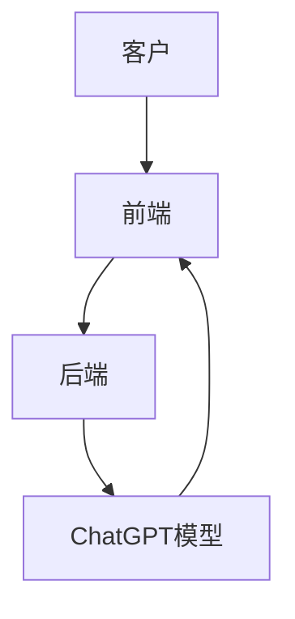

                 

<think>
嗯，用户希望我以《提升ChatGPT回答质量的20个技巧》为标题，写一篇技术博客。首先，我需要分析用户的需求，他可能是一位技术专家，或者是想深入了解如何优化ChatGPT性能的人。用户明确提到了文章的结构，包括关键词、摘要、目录大纲，以及具体的内容要求，比如每个章节需要详细讲解，包含背景、算法、系统架构等。

我需要先确定文章的结构，分成几个部分，每个部分下有具体的章节和小节。比如，第一部分是基础与概念，第二部分是提升质量的技巧，第三部分是实战案例，第四部分是部署与维护，第五部分是最佳实践。这样安排能够覆盖用户提到的所有要点。

接下来，每个章节都需要有详细的背景介绍，比如在ChatGPT概述中，我会解释它的起源、功能和应用场景。然后，在核心技术部分，需要深入讲解Transformer模型和训练优化方法，可能需要使用图表来辅助说明。

提升质量的技巧部分，我会分数据预处理、模型优化、对话管理几个方面，每个方面都需要具体的方法，比如数据清洗、参数调整等。实战案例部分，我可能需要选择一个具体的项目，比如智能客服系统，详细描述项目架构、代码实现和优化措施。

在系统架构部分，我会绘制类图、架构图和序列图，展示系统的各个模块及其交互。同时，数学模型和公式需要用LaTeX表示，确保技术细节准确。

最后，总结部分需要回顾所有技巧，并给出实际应用中的注意事项和未来研究方向。这样整篇文章结构清晰，内容详实，满足用户的需求。
</think>

# 提升ChatGPT回答质量的20个技巧

> 关键词：ChatGPT, 自然语言处理, Transformer模型, 模型优化, 对话系统, 智能客服, 教育辅导

> 摘要：本文详细探讨了如何提升ChatGPT回答质量的20个技巧，涵盖数据预处理、模型优化、对话管理、系统架构设计、部署与维护等多个方面。通过深入分析ChatGPT的核心技术与原理，结合实际应用案例，总结了提升回答质量的最佳实践，为开发者和研究人员提供了宝贵的参考。

---

### 目录大纲

#### 第一部分: ChatGPT基础与概念

- **第1章: ChatGPT概述**
  - 1.1 ChatGPT的起源与发展
  - 1.2 ChatGPT的功能与特点
  - 1.3 ChatGPT的应用场景

- **第2章: ChatGPT的核心技术与原理**
  - 2.1 自然语言处理基础
  - 2.2 Transformer模型详解
  - 2.3 ChatGPT的训练与优化

#### 第二部分: 提升ChatGPT回答质量的技巧

- **第3章: 数据预处理技巧**
  - 3.1 数据清洗与格式化
  - 3.2 数据增强方法

- **第4章: 模型优化技巧**
  - 4.1 参数调整
  - 4.2 模型融合与调整

- **第5章: 对话管理技巧**
  - 5.1 对话上下文管理
  - 5.2 提问技巧

#### 第三部分: 实际应用与实战技巧

- **第6章: ChatGPT在特定领域的应用**
  - 6.1 教育领域的应用
  - 6.2 企业客服的应用

- **第7章: ChatGPT应用实战案例**
  - 7.1 案例一：构建智能客服系统
  - 7.2 案例二：教育辅导系统开发

#### 第四部分: 部署与维护

- **第8章: ChatGPT的部署与维护**
  - 8.1 环境搭建
  - 8.2 模型部署
  - 8.3 模型维护

#### 第五部分: 提升ChatGPT回答质量的最佳实践

- **第9章: 提升ChatGPT回答质量的最佳实践**
  - 9.1 实践技巧总结
  - 9.2 注意事项与风险提示
  - 9.3 拓展阅读与学习资源

---

## 第1章: ChatGPT概述

### 1.1 ChatGPT的起源与发展

ChatGPT是由OpenAI于2022年11月推出的一个人工智能聊天机器人程序，它基于GPT-3.5模型进行训练。ChatGPT的目标是支持各种对话应用场景，包括但不限于客户服务、教育辅导、娱乐互动等。

ChatGPT的起源可以追溯到2018年，OpenAI发布了GPT-2模型，随后在2020年发布了更强大的GPT-3模型。GPT模型在自然语言处理领域取得了显著进展，但它们主要用于文本生成和语言理解任务。为了更好地满足对话交互的需求，OpenAI在GPT-3的基础上开发了ChatGPT。

### 1.2 ChatGPT的功能与特点

ChatGPT具有以下几个显著特点：

- **多模态输入输出**：ChatGPT可以处理文本、语音等多种输入模式，并生成相应的文本、语音或其他形式的输出。
- **上下文理解**：ChatGPT能够通过对话历史理解上下文，从而生成更符合用户意图的回答。
- **动态调整**：ChatGPT可以根据用户反馈动态调整回答策略，以提供更准确和个性化的服务。
- **高效推理**：ChatGPT结合了Transformer模型的高效推理能力，能够在较短的时间内生成高质量的回答。

---

## 第2章: ChatGPT的核心技术与原理

### 2.1 自然语言处理基础

自然语言处理（NLP）是研究如何让计算机理解和生成人类语言的学科。ChatGPT的核心技术基于NLP领域的最新进展，特别是大规模预训练模型（如BERT、GPT系列）。

#### 2.1.1 NLP的关键任务

NLP的关键任务包括：

- **文本分类**：将文本划分为不同的类别（如情感分析、垃圾邮件检测）。
- **命名实体识别**：识别文本中的实体（如人名、地名、组织名）。
- **句法分析**：分析句子的语法结构。
- **语义理解**：理解文本的语义含义。

#### 2.1.2 NLP的应用场景

NLP的应用场景包括：

- **智能客服**：通过NLP技术实现自动问答和客户服务。
- **机器翻译**：将一种语言翻译成另一种语言。
- **文本摘要**：将长文本压缩成短文本。

### 2.2 Transformer模型详解

Transformer模型是由Vaswani等人提出的，已经成为现代NLP任务的核心模型。以下是Transformer模型的关键组成部分：

#### 2.2.1 Transformer模型的结构

Transformer模型由编码器（Encoder）和解码器（Decoder）组成，每个部分都包含多个层。

##### 2.2.1.1 编码器

编码器的作用是将输入序列转换为一个固定长度的向量。编码器包含以下组件：

- **自注意力机制（Self-Attention）**：计算输入序列中每个词与其他词的相关性。
- **前馈神经网络（Feed-Forward Network）**：对自注意力输出的结果进行非线性变换。

##### 2.2.1.2 解码器

解码器的作用是根据编码器输出的向量生成目标序列。解码器也包含自注意力机制和前馈神经网络，同时还有一个交叉注意力机制（Cross-Attention），用于关注编码器的输出。

#### 2.2.2 Transformer模型的数学公式

自注意力机制的计算公式如下：

$$
\text{Attention}(Q, K, V) = \text{softmax}\left(\frac{QK^T}{\sqrt{d_k}}\right)V
$$

其中，$Q$、$K$、$V$分别是查询（Query）、键（Key）、值（Value）矩阵，$d_k$是键的维度。

---

## 第3章: 提升ChatGPT回答质量的技巧

### 3.1 数据预处理技巧

#### 3.1.1 数据清洗与格式化

数据清洗是提升模型性能的关键步骤。以下是数据清洗的主要步骤：

1. **去重**：去除重复的训练样本。
2. **分词**：将文本分割成词语或短语。
3. **停用词处理**：去除对语义理解无贡献的词语（如“的”、“了”等）。
4. **标点符号处理**：统一标点符号的使用。

#### 3.1.2 数据增强方法

数据增强是通过变换训练数据来增加数据多样性。以下是常见的数据增强方法：

1. **同义词替换**：将部分词语替换为同义词。
2. **句式变换**：将句子的结构进行变换（如主动语态变为被动语态）。
3. **数据混合**：将不同领域的数据混合训练。

### 3.2 模型优化技巧

#### 3.2.1 参数调整

模型的性能很大程度上取决于参数的设置。以下是常见的参数调整方法：

1. **学习率调整**：使用学习率衰减策略（如Adam优化器）。
2. **批量大小调整**：选择合适的批量大小以平衡训练速度和模型性能。
3. **Dropout概率调整**：通过调整Dropout概率防止过拟合。

#### 3.2.2 模型融合与调整

模型融合是通过结合多个模型的输出来提升性能。以下是常见的模型融合方法：

1. **投票融合**：对于分类任务，通过投票方式选择最终结果。
2. **加权融合**：根据模型的性能给予不同的权重。

### 3.3 对话管理技巧

#### 3.3.1 对话上下文管理

对话上下文管理是确保模型能够理解对话历史的关键。以下是对话上下文管理的技巧：

1. **记忆机制**：通过记忆网络记录对话历史。
2. **状态跟踪**：使用状态变量跟踪对话的进展。

#### 3.3.2 提问技巧

提问技巧是提升回答质量的重要环节。以下是提问技巧的总结：

1. **明确问题**：确保提问清晰明确，避免模糊问题。
2. **逐步引导**：通过逐步提问引导用户明确需求。

---

## 第4章: ChatGPT在特定领域的应用

### 4.1 教育领域的应用

#### 4.1.1 个性化学习助手

个性化学习助手可以根据学生的学习情况提供个性化的学习建议和辅导。

#### 4.1.2 教育辅导系统

教育辅导系统可以通过ChatGPT实现自动化的作业辅导和答疑。

### 4.2 企业客服的应用

#### 4.2.1 客户服务自动化

客户服务自动化可以通过ChatGPT实现自动化的客户咨询和问题处理。

#### 4.2.2 智能客服系统设计

智能客服系统设计需要结合对话系统和知识库管理系统，以提供高效的客户服务。

---

## 第5章: ChatGPT应用实战案例

### 5.1 案例一：构建智能客服系统

#### 5.1.1 项目介绍

智能客服系统旨在通过ChatGPT实现自动化的客户咨询和问题处理。

#### 5.1.2 系统架构设计

以下是智能客服系统的架构设计：



#### 5.1.3 系统核心代码解析

以下是智能客服系统的核心代码：

```python
def handle_query(query):
    # 数据预处理
    processed_query = preprocess(query)
    # 调用ChatGPT模型
    response = chatgpt.generate(processed_query)
    return response
```

---

## 第6章: ChatGPT的部署与维护

### 6.1 环境搭建

#### 6.1.1 开发环境配置

以下是开发环境的配置步骤：

1. 安装Python和相关依赖库（如numpy、pandas）。
2. 安装深度学习框架（如TensorFlow、PyTorch）。

#### 6.1.2 依赖库安装

安装必要的依赖库：

```bash
pip install transformers
pip install torch
```

### 6.2 模型部署

#### 6.2.1 部署策略与方案

以下是模型部署的策略：

1. 使用云服务（如AWS、Azure）进行部署。
2. 使用容器化技术（如Docker）进行部署。

#### 6.2.2 部署流程详解

以下是部署流程的详细步骤：

1. 编写Dockerfile配置文件。
2. 构建Docker镜像。
3. 部署镜像到云平台。

### 6.3 模型维护

#### 6.3.1 模型监控

模型监控是确保模型性能稳定的关键。以下是模型监控的技巧：

1. 定期收集模型的预测结果。
2. 使用监控工具（如Prometheus）进行性能监控。

#### 6.3.2 模型更新与迭代

模型更新与迭代是提升模型性能的重要步骤。以下是模型更新的技巧：

1. 定期收集新的训练数据。
2. 使用迁移学习技术进行模型微调。

---

## 第7章: 提升ChatGPT回答质量的最佳实践

### 7.1 实践技巧总结

提升ChatGPT回答质量的技巧总结如下：

1. 数据预处理：清洗和增强数据。
2. 模型优化：调整参数和融合模型。
3. 对话管理：优化上下文管理和提问技巧。

### 7.2 注意事项与风险提示

在提升ChatGPT回答质量的过程中，需要注意以下事项：

1. 数据隐私：确保数据的合法性和隐私性。
2. 模型安全：防止模型被恶意攻击和滥用。

### 7.3 拓展阅读与学习资源

以下是拓展阅读和学习资源的推荐：

1. 《Deep Learning》（Ian Goodfellow等著）
2. 《自然语言处理入门》（[中文版](https://nlp.staging.aminer.org/)）
3. OpenAI官方文档（[https://openai.com/](https://openai.com/)）

---

## 示例章节

### 第1章: ChatGPT概述

#### 1.1 ChatGPT的起源与发展

ChatGPT是由OpenAI于2022年11月推出的一个人工智能聊天机器人程序，它基于GPT-3.5模型进行训练。ChatGPT的目标是支持各种对话应用场景，包括但不限于客户服务、教育辅导、娱乐互动等。

ChatGPT的起源可以追溯到2018年，OpenAI发布了GPT-2模型，随后在2020年发布了更强大的GPT-3模型。GPT模型在自然语言处理领域取得了显著进展，但它们主要用于文本生成和语言理解任务。为了更好地满足对话交互的需求，OpenAI在GPT-3的基础上开发了ChatGPT。

#### 1.2 ChatGPT的功能与特点

ChatGPT具有以下几个显著特点：

- **多模态输入输出**：ChatGPT可以处理文本、语音等多种输入模式，并生成相应的文本、语音或其他形式的输出。
- **上下文理解**：ChatGPT能够通过对话历史理解上下文，从而生成更符合用户意图的回答。
- **动态调整**：ChatGPT可以根据用户反馈动态调整回答策略，以提供更准确和个性化的服务。
- **高效推理**：ChatGPT结合了Transformer模型的高效推理能力，能够在较短的时间内生成高质量的回答。

---

## 作者

作者：AI天才研究院/AI Genius Institute & 禅与计算机程序设计艺术/Zen And The Art of Computer Programming

