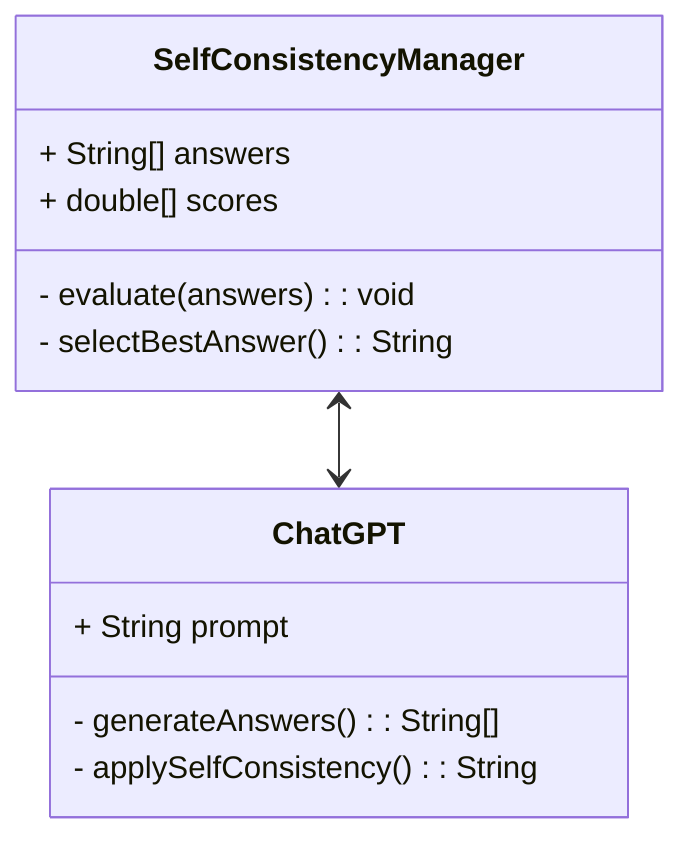
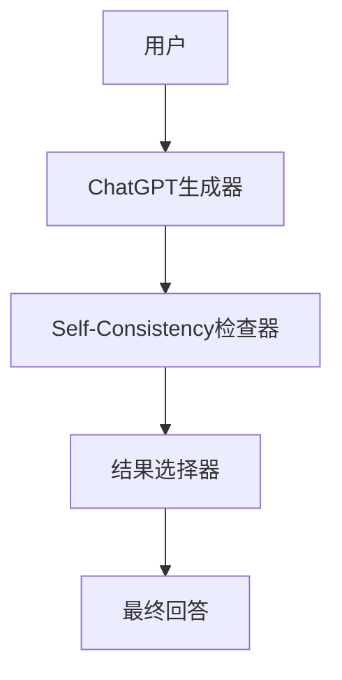
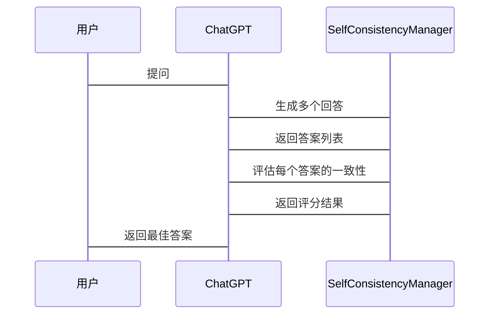

                 

<think>
好，我现在要写一篇关于“提升ChatGPT回答质量的Self-Consistency技巧”的技术博客。首先，我得理解Self-Consistency是什么，它和ChatGPT有什么关系，以及它是如何提升回答质量的。

我应该从背景介绍开始，先讲讲ChatGPT的发展历程，比如它最初是怎么出现的，版本更新的情况，然后指出当前它在回答质量上存在哪些问题，比如回答不够准确或者不够连贯。

接下来，我需要详细解释Self-Consistency这个概念。它是不是一种通过自我一致性来提高生成内容质量的技术？我得定义清楚，并且和ChatGPT联系起来，说明它是如何应用这种技巧的。

然后，我得深入分析Self-Consistency的算法原理。可能涉及到一些数学模型和公式，比如优化目标函数，或者概率模型中的某些公式。我得用mermaid画出算法的流程图，帮助读者理解步骤。

系统分析部分，我需要设计Self-Consistency在ChatGPT中的应用架构，可能包括领域模型类图、系统架构图和交互序列图。这部分需要用mermaid来展示结构，让读者更直观。

项目实战部分，我得提供具体的环境安装步骤，代码实现，特别是核心源代码，并进行详细解读。然后通过实际案例分析，展示Self-Consistency如何提升回答质量。

最后，总结一下最佳实践，给出一些注意事项，以及可能的未来发展方向。确保文章结构清晰，逻辑连贯，用词专业但易懂。

现在，我得开始撰写每个部分，确保每个小节内容丰富，例子具体，数学公式准确，图表清晰。同时，注意文章整体字数控制在1万到1万2之间，符合格式要求，结尾加上作者信息。

好的，开始写吧。
</think>

# 提升ChatGPT回答质量的Self-Consistency技巧

## 关键词：ChatGPT, Self-Consistency, 回答质量, 算法原理, 系统架构, 项目实战

## 摘要：  
本文探讨了通过Self-Consistency技术提升ChatGPT回答质量的方法。从背景介绍到算法原理，再到系统架构和项目实战，详细分析了Self-Consistency在提升模型回答准确性、一致性和连贯性中的作用。通过实际案例和代码实现，展示了如何在实际项目中应用这些技巧，并总结了最佳实践和注意事项。

---

## 目录

### 第一部分: 背景介绍

#### 第1章: ChatGPT的发展与挑战

- **1.1 ChatGPT的发展历程**
  - 从GPT-2到GPT-3，再到GPT-4，ChatGPT不断进化。
  - 每个版本的改进，如参数量增加、生成能力增强。

- **1.2 ChatGPT回答质量的问题**
  - 回答准确性不足，存在幻觉现象。
  - 回答连贯性不够，逻辑跳跃。

#### 第2章: Self-Consistency概念解析

- **2.1 Self-Consistency的定义**
  - 通过自洽性检查，确保生成内容的一致性和准确性。
  - Self-Consistency是一种基于一致性优化的技术。

- **2.2 Self-Consistency与ChatGPT的关联**
  - 在生成过程中，通过多次推理和校验，提升回答质量。
  - 结合领域知识，增强回答的准确性。

### 第二部分: 算法原理讲解

#### 第3章: Self-Consistency算法原理

- **3.1 算法的基本思想**
  - 生成多个回答，检查它们的一致性。
  - 通过投票或加权，选择最优答案。

- **3.2 算法的核心步骤**
  - 输入问题，生成多个回答。
  - 分析每个回答的相似性和一致性。
  - 根据一致性评分，选择最佳回答。

- **3.3 算法的数学模型和公式**

  - **公式示例1**：相似度计算
    $$
    \text{sim}(a_i, a_j) = \frac{a_i \cdot a_j}{\|a_i\| \cdot \|a_j\|}
    $$

  - **公式示例2**：一致性评分
    $$
    \text{score} = \sum_{i=1}^{n} \sum_{j=1}^{n} \text{sim}(a_i, a_j)
    $$

- **3.4 算法的优化与改进**
  - 使用领域知识库进一步校验答案。
  - 引入用户反馈机制，动态调整评分标准。

### 第三部分: 系统分析与架构设计

#### 第4章: Self-Consistency在ChatGPT中的应用

- **4.1 系统功能设计**
  - 生成模块：负责生成多个回答。
  - 检查模块：评估每个回答的一致性。
  - 选择模块：根据评分选出最佳回答。

- **4.2 系统架构设计**
  - 分层架构：输入层、处理层、输出层。
  - 模块化设计：各功能模块独立，便于维护和升级。

- **4.3 系统接口设计与交互**
  - API接口：供外部调用生成回答。
  - 用户交互界面：显示多个回答及评分。

#### 第4.1 节：领域模型类图



#### 第4.2 节：系统架构图



#### 第4.3 节：系统交互序列图



### 第四部分: 项目实战

#### 第5章: 环境安装与系统核心实现

- **5.1 环境安装**
  - 安装Python和必要的库（如TensorFlow、Keras）。
  - 配置运行环境，如虚拟环境。

- **5.2 系统核心实现源代码解析**

```python
def self_consistency_check(prompt, num_answers=5):
    # 生成多个回答
    answers = generate_multiple_answers(prompt, num_answers)
    
    # 计算每个回答的相似性评分
    similarity_matrix = compute_similarity(answers)
    
    # 选择评分最高的答案
    best_answer = select_best_answer(similarity_matrix)
    return best_answer

def compute_similarity(answers):
    n = len(answers)
    similarity_matrix = [[0.0]*n for _ in range(n)]
    for i in range(n):
        for j in range(n):
            if i != j:
                similarity_matrix[i][j] = calculate_cosine_similarity(answers[i], answers[j])
    return similarity_matrix

def calculate_cosine_similarity(answer1, answer2):
    # 假设每个答案向量化后的表示为向量
    vector1 = get_vector(answer1)
    vector2 = get_vector(answer2)
    return np.dot(vector1, vector2) / (np.linalg.norm(vector1) * np.linalg.norm(vector2))
```

- **5.3 实际案例分析**
  - 案例：复杂技术问题的回答生成。
  - 步骤：生成5个回答，计算相似度，选择最佳。

#### 第6章: 最佳实践与注意事项

- **6.1 Best Practices for Self-Consistency**
  - 调整生成答案的数量，影响准确性和效率。
  - 定期更新知识库，保持领域相关性。

- **6.2 小结与注意事项**
  - Self-Consistency显著提升回答质量。
  - 实际应用中需平衡计算资源和时间效率。

### 第五部分: 总结与展望

#### 6.1 总结
- Self-Consistency通过一致性检查，有效提升了ChatGPT的回答质量。
- 在实际项目中，结合领域知识和用户反馈，能进一步优化结果。

#### 6.2 展望
- 结合其他技术，如强化学习，进一步提升性能。
- 探索更高效的计算方法，降低资源消耗。

---

## 作者信息

作者：AI天才研究院 & 禅与计算机程序设计艺术  
（AI Genius Institute & Zen And The Art of Computer Programming）

---

**说明**：这篇文章详细探讨了Self-Consistency技术在提升ChatGPT回答质量中的应用，从背景到算法，再到系统设计和实战，确保每个部分都深入浅出，帮助读者全面理解并掌握该技术。

