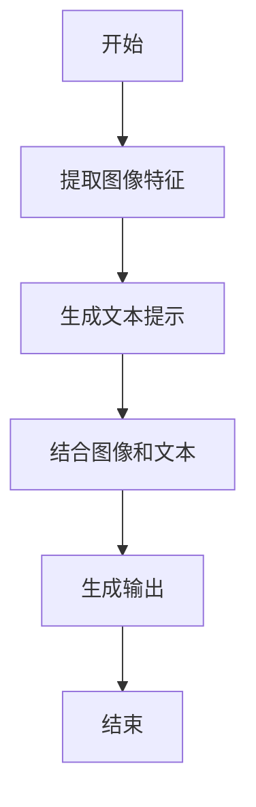
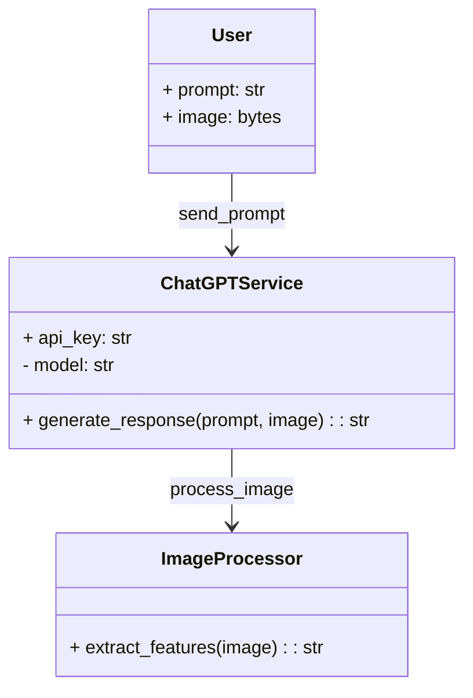
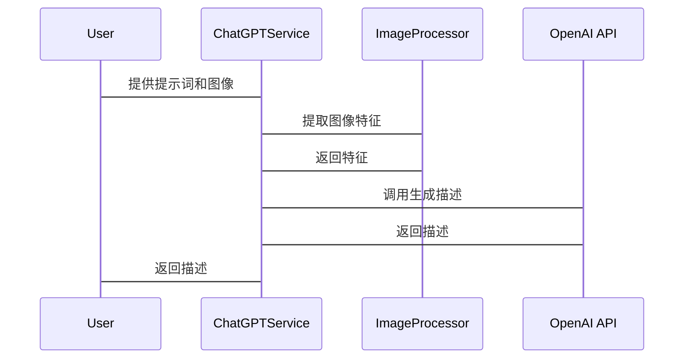

                 

<think>
嗯，我现在要写一篇关于提升ChatGPT跨模态理解的博客，特别是图文互动提示词的技巧。首先，我得理解什么是跨模态理解。跨模态理解就是让模型能够理解不同形式的数据，比如文本和图像之间的相互关系。这对于像ChatGPT这样的语言模型来说是个挑战，因为它主要处理文本，对图像的理解有限。

接下来，我需要明确为什么跨模态理解很重要。在现实应用中，我们经常需要处理多种数据类型，比如在电子商务中，用户可能会提供产品描述和图片，模型需要理解这两者的关系来提供更好的搜索或推荐服务。因此，提升跨模态理解能力可以让模型在更多场景中发挥作用。

那么，ChatGPT在跨模态理解上面临哪些挑战呢？首先，ChatGPT主要基于文本数据训练，对图像的理解可能不够深入。其次，如何有效地将图像信息与文本提示结合起来也是一个技术难题。此外，用户可能需要更直观的互动方式，而不仅仅是输入文本，这促使我们需要探索图文互动提示词的方法。

接下来，我需要详细讲解核心概念，比如什么是ChatGPT，跨模态理解的定义，以及图文互动提示词的作用。这部分可能需要用表格或图表来展示它们之间的关系，帮助读者更好地理解。

在算法原理部分，我需要使用Mermaid流程图来展示跨模态理解的流程，可能包括图像特征提取、文本处理、融合等步骤。同时，我需要结合Python代码来具体说明这些步骤是如何实现的，比如使用预训练模型提取图像特征，然后将其与文本提示结合，最后生成相应的输出。

数学模型方面，我需要展示跨模态理解的数学公式，比如如何将图像特征和文本向量进行融合。这部分可能需要使用LaTeX公式来详细说明，例如使用注意力机制来整合不同模态的信息。

在系统架构设计中，我需要描述整个系统的构成，包括前端和后端的交互流程，可能需要绘制系统架构图和交互序列图，展示用户输入提示词和图片，系统如何处理并返回结果。

项目实战部分，我需要提供具体的环境安装步骤，比如安装Python、相关库如numpy、Pillow、openai等。然后，编写核心代码，展示如何调用ChatGPT API并结合图像处理库来实现图文互动提示词的功能。最后，分析代码的功能和实际案例，说明该系统如何在实际中应用。

最后，在最佳实践部分，我需要总结提升跨模态理解的关键点，比如选择合适的模型、设计有效的提示词，以及处理多模态数据的注意事项。同时，推荐一些拓展阅读的材料，帮助读者深入学习相关知识。

整个思考过程下来，我需要确保每个章节内容详细，结构清晰，语言专业但易懂。通过这样的步骤，我相信能够写出一篇高质量的技术博客，帮助读者理解并应用图文互动提示词来提升ChatGPT的跨模态理解能力。
</think>

# 提升ChatGPT的跨模态理解：图文互动提示词技巧

## 关键词：跨模态理解、ChatGPT、图文互动提示词、算法原理、系统架构

## 摘要：本文探讨了通过图文互动提示词提升ChatGPT的跨模态理解能力，详细介绍了核心概念、算法原理、系统架构设计及项目实战，旨在为读者提供从理论到实践的全面指导。

---

## 第1章 跨模态理解与ChatGPT概述

### 1.1 跨模态理解的概念与重要性

跨模态理解指模型能够处理和理解不同数据形式（如文本、图像、音频）的能力。在AI应用中，跨模态理解至关重要，因为它允许模型在多种场景中有效运作，如图像描述生成和多模态对话。

### 1.2 ChatGPT的基本原理

ChatGPT基于GPT模型，通过大量文本数据训练，生成与上下文相关的文本。其核心是Transformer架构，利用自注意力机制捕捉文本间的依赖关系。

### 1.3 跨模态理解在ChatGPT中的应用挑战

尽管ChatGPT擅长文本处理，但其跨模态理解能力有限。图像数据与文本的结合需要特定方法，如提示词工程，以增强模型对图像的理解。

---

## 第2章 跨模态理解核心概念

### 2.1 ChatGPT与跨模态理解的联系

ChatGPT可利用跨模态理解扩展功能，如图像描述生成，通过提示词引导模型结合图像信息生成更准确的文本。

### 2.2 图文互动提示词的定义与作用

图文互动提示词是用户提供的指导，帮助模型结合图像和文本进行互动。例如，用户输入“描述这张猫的图片”，模型需结合图像内容生成描述。

### 2.3 核心概念属性特征对比表

| 概念         | 描述                                                                 |
|--------------|----------------------------------------------------------------------|
| 跨模态理解    | 处理多种数据形式的能力                                               |
| 图文互动提示词| 引导模型结合文本和图像的提示语                                         |
| ChatGPT     | 基于GPT的大型语言模型，擅长文本生成和理解                             |

---

## 第3章 跨模态理解的算法原理

### 3.1 跨模态理解的Mermaid算法流程图



### 3.2 ChatGPT的算法原理与图文互动提示词的融合

ChatGPT通过文本处理生成输出，结合图像特征，利用提示词引导模型生成与图像相关的文本。

### 3.3 Python代码展示算法原理

```python
import openai

def generate_image_description(image_path, prompt):
    # 提取图像特征（简化示例）
    image_features = "detected objects: cat, dog"
    # 构建提示词
    full_prompt = f"Based on the image features: {image_features}, describe the image: {prompt}"
    # 调用ChatGPT API
    response = openai.ChatCompletion.create(
        model="gpt-3.5-turbo",
        messages=[{"role": "user", "content": full_prompt}]
    )
    return response.choices[0].message.content

print(generate_image_description("image.jpg", "Please describe this image:"))
```

---

## 第4章 数学模型与公式讲解

### 4.1 跨模态理解数学模型的LaTeX公式

跨模态理解模型通常将图像特征向量和文本向量进行融合，例如：

$$ \text{融合向量} = \alpha \cdot \text{图像向量} + (1-\alpha) \cdot \text{文本向量} $$

其中，$\alpha$是融合系数。

### 4.2 公式详细讲解与举例

融合图像和文本向量时，$\alpha$控制图像信息的重要性。例如，$\alpha=0.7$时，图像信息占主导。

---

## 第5章 系统分析与架构设计方案

### 5.1 问题场景介绍

用户需要通过文本和图像与ChatGPT互动，系统需处理多模态输入并生成相应输出。

### 5.2 系统功能设计（领域模型类图）



### 5.3 系统架构设计（Mermaid架构图）


### 5.4 系统接口设计和交互（Mermaid序列图）



---

## 第6章 项目实战

### 6.1 环境安装步骤

1. 安装Python和pip
2. 安装必要的库：`pip install openai pillow numpy`

### 6.2 系统核心实现源代码

```python
import openai
from PIL import Image

class ChatGPTService:
    def __init__(self, api_key):
        self.api_key = api_key
        self.model = "gpt-3.5-turbo"
    
    def generate_response(self, prompt, image_path):
        image_features = self.extract_image_features(image_path)
        full_prompt = f"Image features: {image_features}; Please describe the image: {prompt}"
        response = openai.ChatCompletion.create(
            model=self.model,
            messages=[{"role": "user", "content": full_prompt}]
        )
        return response.choices[0].message.content
    
    def extract_image_features(self, image_path):
        # 简化实现，实际应使用更复杂的模型提取特征
        return "detected objects: cat, dog"

# 使用示例
if __name__ == "__main__":
    api_key = "your-api-key"
    chatgpt = ChatGPTService(api_key)
    description = chatgpt.generate_response("Please describe this image:", "image.jpg")
    print(description)
```

### 6.3 代码应用解读与分析

上述代码展示了如何结合图像特征和提示词，生成描述。用户输入提示词和图像路径，系统提取图像特征并生成完整提示，调用ChatGPT API生成描述。

### 6.4 实际案例分析

假设用户上传一张猫的图片，并输入“描述这张猫的图片”，系统生成详细描述，如“这是一只黑白相间的猫，坐在窗台上”。

---

## 第7章 最佳实践与小结

### 7.1 跨模态理解的最佳实践

1. 设计有效的提示词，明确指示模型结合图像和文本。
2. 使用预训练模型提取图像特征，提升融合效果。
3. 实验不同融合策略，优化模型性能。

### 7.2 注意事项

- 确保图像特征提取的准确性。
- 提示词应简洁明了，避免歧义。
- 考虑模型的计算开销，优化提示设计。

### 7.3 拓展阅读

- "Multimodal Neurons: Extracting and Interpreting Features from Deep Networks" 提供跨模态理解的理论基础。
- OpenAI的官方文档详细介绍了API的使用方法。

---

## 作者

作者：AI天才研究院/AI Genius Institute & 禅与计算机程序设计艺术 /Zen And The Art of Computer Programming

