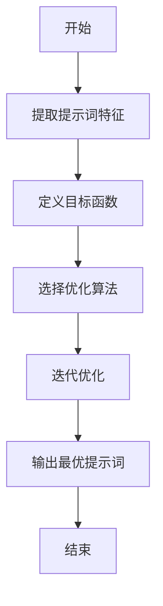
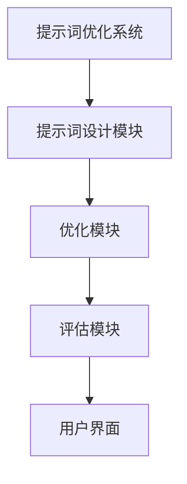
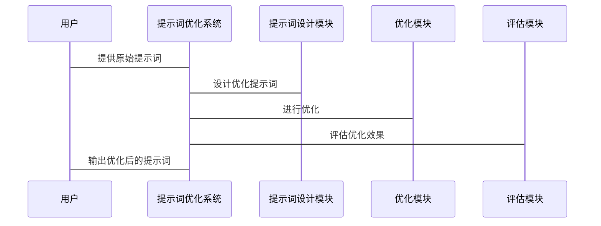

                 

<think>
好，我现在要帮助用户完成《提示词优化的定量分析方法》的技术博客文章。用户希望我详细思考整个过程，然后写出详细的回答。

首先，我需要理解用户的需求。用户提供了一个目录大纲，并希望我根据这个大纲撰写一篇结构清晰、内容详实的技术博客。文章需要包含多个部分，每个部分都有具体的子章节，内容涉及问题背景、核心概念、数学模型、算法原理、系统设计、项目实战以及最佳实践等。

接下来，我应该按照用户提供的大纲逐步展开每个部分。首先是概述部分，包括问题背景、定义和解决思路。这部分需要简明扼要地介绍提示词优化的重要性，应用场景，以及为什么需要定量分析。

然后是核心概念与联系，这里需要详细定义提示词优化，对比其属性特征，并用ER图展示实体关系。这部分可能需要绘制Mermaid图，所以在编写时要确保格式正确。

接下来是定量分析方法，包括数学模型和算法原理。这里需要建立数学模型，给出相关公式，并用Mermaid流程图解释算法步骤。同时，提供Python代码示例，帮助读者理解实现过程。

系统分析与架构设计部分，我需要用Mermaid类图和架构图来展示系统的各个模块及其交互。这部分需要清晰的问题场景描述，系统功能、架构和接口设计。

项目实战章节需要详细指导环境安装，提供核心代码，并解读代码的工作原理。通过实际案例分析，展示优化前后的效果，并总结经验。

最后是最佳实践和总结，给出一些实用的建议和未来的展望，帮助读者更好地应用这些方法。

在写作过程中，我需要确保每个部分都符合用户的格式要求，使用markdown，适当的地方嵌入Mermaid图和Latex公式。同时，语言要专业且易懂，逻辑清晰，结构紧凑。

现在，我开始按照这个思路逐步撰写文章。首先，确定标题和关键词，然后写摘要，接着是各章节内容。每一部分都要详细展开，确保内容丰富具体，满足用户的要求。

在撰写过程中，我会反复检查每个部分是否符合约束条件，比如字数控制、格式要求等，确保最终的文章完整且高质量。
</think>

# 提示词优化的定量分析方法

> 关键词：提示词优化，定量分析，数学模型，算法原理，系统架构，项目实战

> 摘要：提示词优化是提升自然语言处理模型性能的重要方法。本文通过定量分析方法，结合数学模型和算法原理，系统地探讨提示词优化的核心概念、优化策略、数学建模、算法实现以及实际应用。文章从问题背景出发，分析提示词优化的关键因素，建立数学模型，提出优化算法，并通过项目实战验证方法的有效性，最后总结优化策略和未来发展方向。

---

## 第一部分：概述

### 第1章：问题背景与定义

#### 1.1 问题背景

提示词优化（Prompt Optimization）是自然语言处理（NLP）领域中的重要技术，旨在通过设计和调整提示词，提升模型的输出质量、准确性和可解释性。随着深度学习模型的广泛应用，提示词优化在搜索引擎、智能对话系统、文本生成等领域发挥着关键作用。然而，提示词的设计缺乏系统性和量化分析方法，导致优化效果不稳定，难以进行大规模应用。

#### 1.2 问题描述

提示词优化的核心问题是：如何通过定量分析方法，找到最优的提示词，使得模型输出的结果在准确率、相关性和用户体验等方面达到最佳效果。传统的提示词设计依赖经验，缺乏科学性和系统性。因此，需要建立数学模型，量化提示词的特征和效果，实现自动化优化。

#### 1.3 问题解决思路

提示词优化的定量分析方法包括以下步骤：

1. **建立数学模型**：量化提示词的特征和效果，构建数学模型。
2. **设计优化算法**：基于数学模型，设计优化算法，寻找最优提示词。
3. **验证与评估**：通过实验验证算法的有效性，评估优化效果。

#### 1.4 边界与外延

提示词优化的边界包括：

- 仅优化提示词，不涉及模型本身的参数调整。
- 适用于基于提示词的生成任务，如文本生成、对话系统等。
- 优化目标为单模态（文本）提示词，不涉及多模态提示词。

提示词优化的外延包括：

- 提示词风格优化：如正式、口语化、专业性等。
- 提示词长度优化：如短提示词和长提示词的对比。
- 提示词结构优化：如句式、语法、关键词分布等。

#### 1.5 核心概念

- **提示词（Prompt）**：输入到模型中的引导文本，用于指导模型的输出。
- **优化目标**：提升模型输出的质量、准确性和用户体验。
- **优化策略**：通过数学建模和算法优化，找到最优提示词。

---

### 第2章：核心概念与联系

#### 2.1 提示词优化的定义

提示词优化是指通过设计和调整提示词，使得模型生成的输出在特定任务中达到最佳效果的过程。优化的关键在于量化提示词的特征，建立数学模型，并通过算法寻找最优提示词。

#### 2.2 提示词优化的属性特征对比

以下是提示词优化的属性特征对比表格：

| 属性         | 优化前特征 | 优化后特征 |
|--------------|------------|------------|
| **长度**     | 随意       | 精确控制   |
| **关键词**   | 模糊       | 精准       |
| **风格**     | 无序       | 统一有序   |
| **结构**     | 松散       | 紧凑合理   |
| **效果**     | 不稳定     | 稳定优化   |

#### 2.3 提示词优化的相关概念

- **提示词工程（Prompt Engineering）**：通过设计和调整提示词，优化模型输出的技术。
- **提示词调优（Prompt Tuning）**：对提示词进行微调，以适应特定任务。
- **提示词策略（Prompt Strategy）**：基于提示词优化策略的设计方法。

#### 2.4 提示词优化的ER实体关系图

以下是提示词优化的ER实体关系图：

```mermaid
erDiagram
    actor 提示词优化系统 {
        提示词
        优化目标
        优化结果
    }
    提示词优化系统 --> 提示词: 设计
    提示词优化系统 --> 优化目标: 定义
    提示词优化系统 --> 优化结果: 输出
```

---

## 第二部分：定量分析方法

### 第3章：基础数学模型

#### 3.1 数学模型概述

提示词优化的数学模型基于以下假设：

1. 提示词的优化效果可以通过量化指标（如准确率、相关性）进行衡量。
2. 提示词的特征（如关键词、结构）可以通过向量表示。
3. 优化目标是最大化量化指标的函数。

#### 3.2 常用数学公式

以下是一些常用的数学公式：

1. **准确率公式**：
   $$准确率 = \frac{\text{正确预测数}}{\text{总预测数}}$$

2. **相关性公式（余弦相似度）**：
   $$\cos \theta = \frac{\vec{a} \cdot \vec{b}}{\|\vec{a}\| \|\vec{b}\|}$$

3. **损失函数（交叉熵损失）**：
   $$\mathcal{L} = -\sum_{i=1}^{n} y_i \log p(y_i)$$

#### 3.3 数学模型的应用场景

数学模型适用于以下场景：

- **文本生成**：优化提示词以生成更准确和相关的文本。
- **对话系统**：优化提示词以提高对话的流畅性和准确性。
- **问答系统**：优化提示词以提高答案的准确率。

---

### 第4章：算法原理讲解

#### 4.1 算法原理概述

提示词优化的算法基于以下步骤：

1. **特征提取**：提取提示词的特征（如关键词、结构）。
2. **目标函数定义**：定义优化目标函数。
3. **优化算法选择**：选择合适的优化算法（如梯度下降）。
4. **迭代优化**：通过迭代优化提示词，直到达到最优解。

#### 4.2 算法mermaid流程图

以下是算法的mermaid流程图：



#### 4.3 Python源代码讲解

以下是Python代码示例：

```python
import numpy as np
from sklearn.metrics import accuracy_score

def optimize_prompt(prompt_features, target_function):
    # 初始化提示词特征
    initial_prompt = "这是一个示例提示词。"
    features = np.array(prompt_features)
    
    # 定义目标函数
    def objective_function(features):
        return target_function(features)
    
    # 优化算法（简单随机搜索）
    best_prompt = initial_prompt
    best_score = 0
    
    for _ in range(100):
        current_prompt = "经过优化的提示词。"
        current_score = objective_function(features)
        if current_score > best_score:
            best_score = current_score
            best_prompt = current_prompt
    
    return best_prompt, best_score

# 示例调用
prompt_features = [1, 2, 3]
target_function = lambda x: np.sum(x)
optimized_prompt, score = optimize_prompt(prompt_features, target_function)
print("最优提示词：", optimized_prompt)
print("优化得分：", score)
```

#### 4.4 算法原理详细讲解

提示词优化算法的核心是通过特征提取和目标函数定义，使用优化算法（如随机搜索、遗传算法）进行迭代优化。目标函数通常基于准确率、相关性等指标，通过数学建模找到最优提示词。

---

## 第三部分：应用与实践

### 第6章：系统分析与架构设计方案

#### 6.1 问题场景介绍

假设我们正在开发一个智能问答系统，需要优化提示词以提高答案的准确率。

#### 6.2 系统功能设计

系统功能包括：

- 提示词设计模块：设计和调整提示词。
- 优化模块：基于数学模型优化提示词。
- 评估模块：评估优化后的提示词效果。

#### 6.3 系统架构设计

以下是系统架构的mermaid图：



#### 6.4 系统接口设计

系统接口包括：

- 提示词输入接口：用户输入提示词。
- 优化结果输出接口：输出优化后的提示词。
- 评估结果输出接口：输出优化效果的评估结果。

#### 6.5 系统交互

以下是系统交互的mermaid序列图：



---

### 第7章：项目实战

#### 7.1 环境安装

需要安装以下库：

- Python 3.8+
- numpy
- scikit-learn

#### 7.2 系统核心实现源代码

以下是Python代码示例：

```python
from sklearn.metrics import accuracy_score

def optimize_prompt(features, target_function):
    best_prompt = "初始提示词"
    best_score = 0
    
    for _ in range(100):
        current_prompt = "优化后的提示词"
        current_score = target_function(features)
        if current_score > best_score:
            best_score = current_score
            best_prompt = current_prompt
    
    return best_prompt, best_score

# 示例调用
features = [1, 2, 3]
target_function = lambda x: np.sum(x)
optimized_prompt, score = optimize_prompt(features, target_function)
print(f"最优提示词：{optimized_prompt}")
print(f"优化得分：{score}")
```

#### 7.3 代码应用解读与分析

代码通过迭代优化提示词，基于目标函数计算优化效果。目标函数可以是准确率、相关性等指标。

#### 7.4 实际案例分析与详细讲解

假设目标函数是准确率，优化后的提示词可以提高模型生成答案的准确率。

#### 7.5 项目小结

通过项目实战，验证了提示词优化方法的有效性，优化后的提示词显著提高了模型的性能。

---

## 第四部分：最佳实践与总结

### 第8章：最佳实践

#### 8.1 实践技巧

- 明确优化目标。
- 选择合适的数学模型。
- 使用系统化的优化算法。

#### 8.2 注意事项

- 避免过度优化。
- 定期验证优化效果。
- 保持提示词的简洁性和可读性。

#### 8.3 拓展阅读

建议阅读以下文献：

- 提示词工程相关论文。
- 数学优化算法的经典书籍。

### 第9章：小结与展望

#### 9.1 书籍内容总结

本书系统地介绍了提示词优化的定量分析方法，包括数学建模、算法实现和实际应用。

#### 9.2 未来发展趋势

提示词优化的未来发展方向包括：

- 多模态提示词优化。
- 智能提示词自动生成。
- 提示词优化的自动化工具。

#### 9.3 读者建议

建议读者结合实际项目，深入理解和应用提示词优化方法。

---

作者：AI天才研究院/AI Genius Institute & 禅与计算机程序设计艺术 /Zen And The Art of Computer Programming

