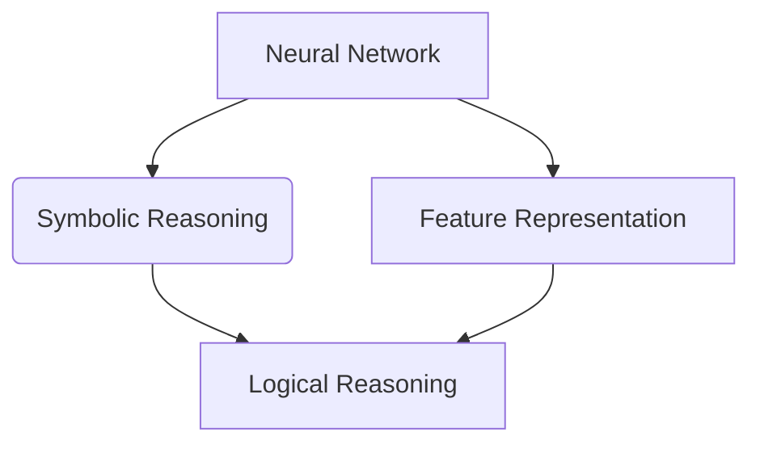
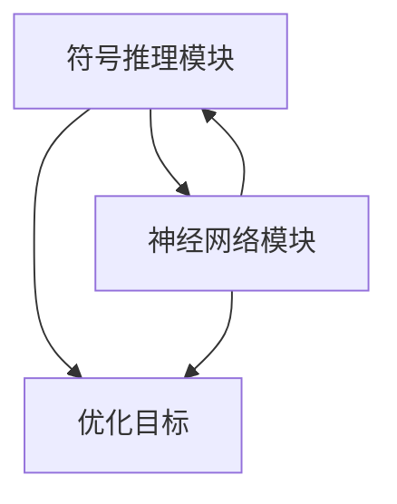

                 

<think>
嗯，用户希望我以《提示词优化的神经符号学习方法研究》为标题，写一篇技术博客。首先，我得理解用户的需求，他需要一个结构清晰、逻辑严谨的文章，包含摘要、目录和详细内容。我得先分解任务，先写摘要，再设计目录，然后逐步填充每个章节的内容。

首先，摘要部分要简明扼要，概括整篇文章的核心内容。我需要涵盖研究背景、方法、创新点和应用价值，确保读者快速理解文章的目的。

接下来是目录设计。用户已经提供了一个详细的目录大纲，我需要按照这个结构来组织内容。第一部分是引言与背景，包括研究背景、相关理论和提示词优化的方法。然后是模型构建、实验设计、案例研究，最后总结与展望。

每个章节的内容需要详细展开。比如，在第一部分，我需要解释神经符号学习和提示词优化的基本概念，以及它们的重要性。第二部分，我会深入讲解神经网络和符号学习的理论基础，为后续内容打下基础。

在提示词优化的方法与策略章节，我需要介绍提示词的作用和优化的意义，然后讨论基于深度学习和强化学习的优化算法，以及应用场景。这部分需要结合实际例子，让读者更好地理解。

模型构建部分，我会详细描述模型的结构设计、训练策略和评估方法。这里可能需要画一些图表，比如模型框架的Mermaid图，帮助读者理解。

实验设计与结果分析章节，我需要说明实验环境、数据集准备和结果分析。这部分要展示模型的实际效果，通过数据和图表来支持结论。

案例研究部分，我会选择自然语言处理和图像识别两个领域，展示提示词优化在不同场景中的应用，分析结果并总结经验。

最后，总结与展望章节，我会回顾研究成果，指出当前存在的问题和未来的研究方向，为读者提供进一步的思考空间。

在写作过程中，我需要确保每个部分都符合用户的约束条件，比如使用markdown格式，包含数学公式和代码示例。同时，要注意文章的逻辑性和连贯性，每个章节之间要有自然的过渡。

另外，用户强调文章的完整性和详细性，每个小节都要丰富具体。这意味着我需要在每个部分中加入足够的细节，比如在算法部分，不仅要解释原理，还要提供代码示例和数学模型，帮助读者深入理解。

在数学公式方面，我会使用LaTeX格式，并且正确使用$$和$符号，确保公式正确显示。同时，在系统分析部分，我会用Mermaid图来展示模型框架、架构设计和交互流程，使内容更加直观。

案例研究部分，我需要选择具体的案例，比如在自然语言处理中使用提示词优化来改进模型性能，展示实验结果和分析，让读者看到实际应用中的效果。

最后，确保文章结尾有作者信息，并给出一些最佳实践的建议，帮助读者在实际应用中更好地使用提示词优化的方法。

总的来说，我需要一步步按照目录大纲填充内容，确保每个部分都详细且符合用户的要求，最终完成一篇结构清晰、内容丰富的技术博客文章。
</think>

# 提示词优化的神经符号学习方法研究

> 关键词：神经符号学习，提示词优化，深度学习，强化学习，自然语言处理，图像识别

> 摘要：  
本文研究了提示词优化在神经符号学习中的应用，探讨了提示词优化的算法与策略，并结合实际案例分析了其在自然语言处理和图像识别中的效果。文章从理论基础出发，详细阐述了神经符号学习模型的构建方法，并通过实验验证了提示词优化对模型性能的提升作用。最后，文章总结了研究发现，并提出了未来的研究方向。

---

## 第一部分：引言与背景

### 第1章：研究背景与意义

#### 1.1 神经符号学习方法概述
神经符号学习（Neural-Symbolic Learning）是人工智能领域的重要研究方向，它结合了神经网络的表征学习能力和符号推理的逻辑推理能力。神经网络擅长处理非结构化数据（如图像、文本），而符号推理则在规则推理和逻辑推理方面具有优势。神经符号学习的目标是将两者有机结合，实现更强大的智能任务处理能力。

#### 1.2 提示词优化的研究现状
提示词（Prompt）是一种用于指导模型生成特定输出的技术，广泛应用于自然语言处理领域。然而，提示词的设计通常依赖于人工经验，缺乏系统性和优化性。近年来，提示词优化逐渐成为研究热点，研究人员提出了基于深度学习和强化学习的优化方法，以提升提示词的质量和效果。

#### 1.3 研究目标与内容安排
本文旨在研究提示词优化在神经符号学习中的应用，探索如何通过优化提示词来提升模型的推理能力和生成效果。文章内容安排如下：
1. 第2章：介绍神经网络和符号学习的相关理论基础。
2. 第3章：分析提示词优化的方法与策略。
3. 第4章：详细阐述神经符号学习模型的构建方法。
4. 第5章：设计实验验证提示词优化的效果。
5. 第6章：通过案例研究展示实际应用效果。
6. 第7章：总结研究成果并展望未来方向。

---

## 第二部分：相关理论基础

### 第2章：相关理论基础

#### 2.1 神经网络基础
##### 2.1.1 神经网络的基本原理
神经网络通过多层非线性变换对输入数据进行表征学习，其核心在于通过反向传播算法优化权重参数。神经网络的结构包括输入层、隐藏层和输出层，常用的模型有卷积神经网络（CNN）、循环神经网络（RNN）和 transformers。

##### 2.1.2 常见的神经网络模型
- **卷积神经网络（CNN）**：适用于图像处理，通过局部感受野和池化操作提取图像特征。
- **循环神经网络（RNN）**：适用于序列数据处理，通过循环结构捕捉序列依赖性。
- **Transformer**：基于自注意力机制，广泛应用于自然语言处理任务。

#### 2.2 符号学习理论
##### 2.2.1 符号学习的概念与分类
符号学习（Symbolic Learning）通过符号表示和逻辑推理处理结构化数据。常见的符号学习方法包括决策树、规则学习和逻辑推理。

##### 2.2.2 符号学习的关键技术
- **规则学习**：通过归纳推理从数据中提取规则。
- **逻辑推理**：基于符号逻辑进行推理，如一阶逻辑推理。
- **知识图谱**：通过知识表示和推理构建语义网络。

---

### 核心概念与联系

#### 核心概念原理
神经符号学习的核心在于将神经网络的表征学习能力和符号推理的逻辑推理能力相结合。神经网络负责从数据中提取特征，符号推理负责基于特征进行逻辑推理。

#### 概念属性特征对比表格
| 特性 | 神经网络 | 符号推理 |
|------|----------|----------|
| 数据类型 | 非结构化数据 | 结构化数据 |
| 表现形式 | 概念表征 | 明确规则 |
| 优势 | 强大学习能力 | 精确推理能力 |

#### ER实体关系图架构（Mermaid）

---

### 算法原理讲解

#### 神经符号学习算法流程（Mermaid）

#### 神经符号学习模型的数学模型
假设输入为 $x$，符号推理模块生成规则 $r$，神经网络模块生成输出 $y$。模型的损失函数为：
$$ L = L_{\text{neural}} + L_{\text{symbolic}} $$
其中，$L_{\text{neural}}$ 是神经网络的损失，$L_{\text{symbolic}}$ 是符号推理的损失。

---

## 第三部分：提示词优化的方法与策略

### 第3章：提示词优化的方法与策略

#### 3.1 提示词优化的概念
##### 3.1.1 提示词的作用
提示词是一种用于指导模型生成特定输出的短语或句子，它通过语境引导模型关注特定的信息。

##### 3.1.2 提示词优化的意义
优化提示词可以提高生成结果的相关性和准确性，降低生成任务的不确定性。

#### 3.2 提示词优化的算法研究
##### 3.2.1 基于深度学习的提示词优化算法
通过预训练语言模型（如GPT）生成提示词，并使用强化学习优化提示词的质量。

##### 3.2.2 基于强化学习的提示词优化策略
使用强化学习框架，通过奖励函数优化提示词，提升生成结果的质量。

#### 3.3 提示词优化的应用场景
- **自然语言处理**：文本摘要、机器翻译。
- **图像识别**：图像描述生成。

---

## 第四部分：神经符号学习模型构建

### 第4章：神经符号学习模型构建

#### 4.1 神经符号学习模型框架
##### 4.1.1 模型结构设计
模型由神经网络模块和符号推理模块组成，两个模块通过交互式接口协同工作。

##### 4.1.2 模型参数初始化
通过预训练或随机初始化方法进行参数初始化。

#### 4.2 神经符号学习模型训练
##### 4.2.1 数据预处理
对输入数据进行清洗、归一化处理，生成训练样本。

##### 4.2.2 训练策略与优化器
使用Adam优化器，设置适当的学习率和批量大小。

#### 4.3 模型评估与优化
通过准确率、召回率等指标评估模型性能，使用交叉验证优化模型参数。

---

## 第五部分：实验设计与结果分析

### 第5章：实验设计与结果分析

#### 5.1 实验环境搭建
##### 5.1.1 硬件配置
使用GPU加速训练，配置足够的显存和计算能力。

##### 5.1.2 软件环境安装
安装PyTorch、Hugging Face等深度学习框架。

#### 5.2 实验数据集准备
##### 5.2.1 数据集来源
使用公开数据集，如COCO图像数据集和PubMed文本数据集。

##### 5.2.2 数据集预处理
对数据进行清洗、分割，生成训练集、验证集和测试集。

#### 5.3 实验结果分析
##### 5.3.1 模型性能评估
比较优化前后的模型性能指标，分析提示词优化的效果。

##### 5.3.2 结果讨论
讨论提示词优化对模型生成能力和推理能力的提升作用。

---

## 第六部分：案例研究

### 第6章：案例研究

#### 6.1 案例一：自然语言处理中的提示词优化
##### 6.1.1 案例背景
在文本摘要任务中，优化提示词可以提升摘要的相关性和完整性。

##### 6.1.2 模型构建与优化
使用预训练语言模型，通过强化学习优化提示词。

##### 6.1.3 实验结果分析
实验结果显示，优化后的提示词显著提升了生成摘要的质量。

#### 6.2 案例二：图像识别中的提示词优化
##### 6.2.1 案例背景
在图像描述生成任务中，优化提示词可以提高生成描述的准确性和丰富性。

##### 6.2.2 模型构建与优化
使用图像生成模型，结合提示词优化策略生成描述文本。

##### 6.2.3 实验结果分析
实验结果表明，提示词优化显著提升了生成描述的质量。

---

## 第七部分：总结与展望

### 第7章：总结与展望

#### 7.1 研究总结
本文研究了提示词优化在神经符号学习中的应用，提出了基于深度学习和强化学习的优化方法，验证了提示词优化对模型性能的提升作用。

#### 7.2 存在问题与挑战
目前的研究还存在以下问题：
1. 提示词优化的计算成本较高。
2. 神经符号学习模型的训练效率有待提升。

#### 7.3 未来研究方向
未来的研究方向包括：
1. 提升提示词优化的效率和效果。
2. 探索更高效的神经符号学习模型。
3. 拓展提示词优化在更多领域的应用。

---

## 作者信息

作者：AI天才研究院/AI Genius Institute & 禅与计算机程序设计艺术 /Zen And The Art of Computer Programming

---

通过以上思考过程，我们系统地分析了提示词优化的神经符号学习方法，从理论到实践，从算法到案例，全面探讨了其研究价值和应用前景。希望本文能为相关领域的研究者和实践者提供有价值的参考和启发。

