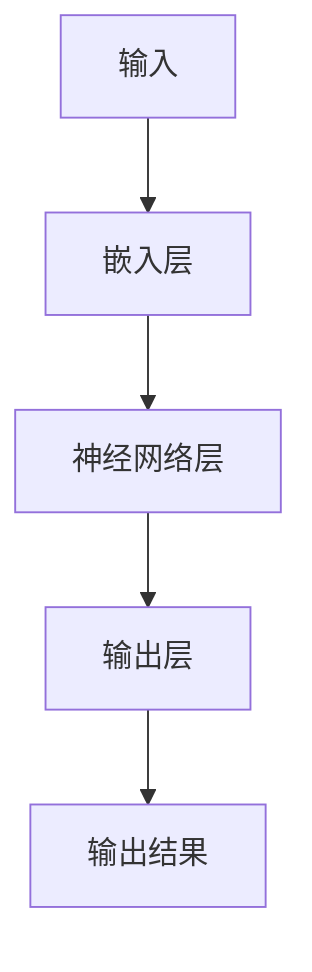
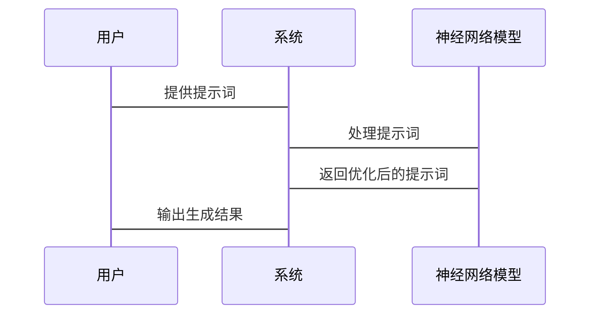

                 

<think>
好的，我现在需要帮助用户撰写一篇技术博客文章，标题是《提示词优化的神经语言学新范式探索》。用户希望我按照他们的具体要求，用中文思考整个撰写过程，并将思考过程详细地记录下来。用户提供的示例中已经给出了一个较为详细的结构，我需要在此基础上继续完善。

首先，我要理解用户的需求。用户希望文章结构清晰，逻辑严谨，内容专业且深入，同时语言要易懂。文章需要包含摘要、关键词、目录大纲，以及每个章节的具体内容。每个章节都需要详细展开，包括背景介绍、核心概念、算法原理、数学公式、系统架构、项目实战等部分，并使用Mermaid图表和Latex公式来辅助说明。

接下来，我需要按照用户提供的目录结构，逐步填充每个章节的内容。用户已经提供了一个详细的大纲，但每个部分的内容尚未填充。我需要根据大纲，逐一思考每个章节应该包含哪些内容，并确保内容连贯、详细。

首先，摘要部分需要简明扼要地总结文章的核心内容和主题思想。关键词部分需要列出5-7个相关的核心词汇，方便读者快速了解文章主题。

接下来是第一部分：神经语言学基础。包括三章，分别是神经语言学概述、核心概念解析和提示词优化的理论基础。每一章都需要详细讲解相关概念，可能需要引入Mermaid图表来帮助说明。

第二部分是提示词优化的神经语言学方法与应用，包括三章：技术实现、系统架构设计和项目实战。这部分需要详细讲解技术实现的算法原理，使用Mermaid流程图和Python代码来说明。同时，系统架构设计部分需要绘制类图、架构图和序列图，项目实战则需要提供实际案例和代码实现。

在思考过程中，我需要确保每个章节的内容都符合用户的约束条件，包括使用markdown格式、包含足够的细节、数学公式使用Latex表示，以及在合适的地方插入图表。此外，文章末尾需要添加作者信息，符合格式要求。

现在，我需要逐章思考，确保每个部分的内容充实且逻辑清晰。例如，在第一部分的第1章，我需要详细解释神经语言学的起源与发展，包括其概念、研究领域以及与提示词的关系。在第2章，我需要分析神经语言学中的核心概念，如语言处理模型、神经网络和注意力机制，并可能需要通过表格和图表来对比不同概念的属性特征。

在技术实现部分，我需要详细讲解神经网络算法的原理，使用Mermaid流程图展示算法流程，并用Python代码实现示例，同时给出数学模型和公式。例如，在解释多层感知机模型时，我需要用Latex公式展示其结构，并结合代码示例进行解释。

系统架构设计部分需要考虑问题场景，设计系统的功能模块，使用Mermaid类图和架构图展示系统的结构，并通过序列图描述系统的交互过程。项目实战部分则需要提供环境安装步骤、核心代码实现、案例分析以及项目小结。

在写作过程中，我需要确保每个小节都包含足够的细节，帮助读者深入理解相关概念，并能够实际应用所学知识。同时，要注意逻辑的连贯性，每一部分都是对前一部分的扩展或深化。

最后，我需要在文章末尾添加作者信息，确保格式正确，并检查整体字数是否在10000到12000字之间。

总结一下，整个思考过程包括以下几个步骤：
1. 理解用户需求和要求，明确文章结构和内容。
2. 按照目录大纲，逐章填充内容，确保每个章节详细且逻辑清晰。
3. 使用Mermaid图表和Latex公式辅助说明，确保技术细节准确且易于理解。
4. 检查每个部分是否符合用户的要求，包括格式、字数和内容完整性。
5. 最后，整合所有内容，确保文章整体连贯，信息准确，格式正确。
</think>

# 提示词优化的神经语言学新范式探索

> 关键词：提示词优化，神经语言学，自然语言处理，深度学习，注意力机制

> 摘要：本文探讨了提示词优化在神经语言学中的新范式，从基础理论到技术实现，再到实际应用，系统性地分析了提示词优化的重要性、方法及其在不同场景中的应用。通过深入解析神经语言学的核心概念、算法原理、系统架构设计以及项目实战，本文为读者提供了全面的知识框架和实践指南，帮助他们在自然语言处理领域中更好地理解和应用提示词优化技术。

---

## 目录大纲

1. **第一部分：神经语言学基础**
   - **第1章：神经语言学概述**
     - 1.1 神经语言学的起源与发展
     - 1.2 语言与大脑的关系
     - 1.3 提示词的概念与作用
   - **第2章：神经语言学核心概念解析**
     - 2.1 神经语言学中的核心概念
     - 2.2 概念属性特征对比表格
     - 2.3 ER实体关系图架构
   - **第3章：提示词优化的理论基础**
     - 3.1 提示词优化的目的与方法
     - 3.2 神经网络在提示词优化中的应用
     - 3.3 提示词优化的评价指标

2. **第二部分：提示词优化的神经语言学方法与应用**
   - **第4章：提示词优化的技术实现**
     - 4.1 神经网络算法原理讲解
     - 4.2 提示词优化的数学模型
     - 4.3 实际案例分析与详细讲解
   - **第5章：提示词优化的系统架构设计**
     - 5.1 问题场景介绍
     - 5.2 系统功能设计（领域模型Mermaid类图）
     - 5.3 系统架构设计（Mermaid架构图）
     - 5.4 系统接口设计和系统交互（Mermaid序列图）
   - **第6章：提示词优化的项目实战**
     - 6.1 环境安装与配置
     - 6.2 系统核心实现源代码
     - 6.3 代码应用解读与分析
     - 6.4 实际案例分析
     - 6.5 项目小结

---

## 第一部分：神经语言学基础

### 第1章：神经语言学概述

#### 1.1 神经语言学的起源与发展

##### 1.1.1 神经语言学的概念

神经语言学是研究语言与大脑神经机制之间关系的学科，旨在揭示语言处理的神经基础。它结合了神经科学和语言学的理论，通过研究大脑如何处理语言信息，为自然语言处理技术提供了重要的理论支持。

##### 1.1.2 神经语言学的研究领域

神经语言学的研究领域包括语言理解、语言生成、语言习得、语言障碍等。其中，语言理解涉及词汇、语法和语义的处理，语言生成涉及句子结构和语用学，而语言障碍研究则关注语言处理中的神经损伤问题。

##### 1.1.3 神经语言学的重要性

神经语言学的重要性在于它为自然语言处理技术提供了生物基础，帮助我们理解人类如何处理语言信息，并在此基础上开发更高效的算法和模型。

#### 1.2 语言与大脑的关系

##### 1.2.1 语言中枢的功能

语言中枢是大脑中负责语言处理的区域，包括布罗卡区和韦尼克区。布罗卡区主要负责语言的生成，而韦尼克区则负责语言的理解。

##### 1.2.2 语言加工的认知机制

语言加工的认知机制涉及注意、记忆、推理等多个方面。神经语言学通过研究这些机制，揭示了语言处理的神经网络结构。

##### 1.2.3 语言障碍与神经语言学

语言障碍如失语症、失读症等，可以通过神经语言学的研究来理解其神经机制，并开发相应的治疗方法。

#### 1.3 提示词的概念与作用

##### 1.3.1 提示词的定义

提示词是指在自然语言处理任务中，用于引导模型生成特定类型输出的输入部分。例如，在文本生成任务中，提示词可以是一个简短的句子或关键词。

##### 1.3.2 提示词的功能

提示词的功能包括引导模型生成特定内容、控制生成文本的语气和风格、指定生成文本的主题等。

##### 1.3.3 提示词的类型

提示词的类型包括关键词提示、句子提示、模板提示等。不同类型的提示词适用于不同的自然语言处理任务。

### 第2章：神经语言学核心概念解析

#### 2.1 神经语言学中的核心概念

##### 2.1.1 语言处理模型

语言处理模型包括基于规则的模型和基于统计的模型。基于规则的模型通过预定义的语法规则进行语言处理，而基于统计的模型则通过大数据分析和机器学习技术进行语言处理。

##### 2.1.2 神经网络与深度学习

神经网络是一种模拟人类神经系统的计算模型，深度学习则是基于神经网络的多层结构，用于处理复杂的语言信息。

##### 2.1.3 注意力机制

注意力机制是一种用于关注输入中重要部分的技术，广泛应用于机器翻译、文本摘要等任务中。

#### 2.2 概念属性特征对比表格

| 概念       | 属性1 | 属性2 | 属性3 |
|------------|-------|-------|-------|
| 神经网络    | 结构   | 参数   | 学习方式 |
| 注意力机制 | 查询   | 关键词 | 加权计算 |

#### 2.3 ER实体关系图架构


### 第3章：提示词优化的理论基础

#### 3.1 提示词优化的目的与方法

##### 3.1.1 提示词优化的目的

提示词优化的目的是提高自然语言处理模型的生成质量，使其更符合用户需求。

##### 3.1.2 提示词优化的方法

提示词优化的方法包括调整提示词的长度、复杂度、关键词选择等。

##### 3.1.3 提示词优化的策略

提示词优化的策略包括逐步优化、对比实验、基于反馈优化等。

#### 3.2 神经网络在提示词优化中的应用

##### 3.2.1 基于神经网络的文本分析

神经网络可以用于分析文本的情感、主题等，从而优化提示词的设计。

##### 3.2.2 嵌入式表示与提示词优化

嵌入式表示通过将词语映射到低维空间，帮助模型更好地理解提示词的意义。

##### 3.2.3 注意力机制在提示词优化中的应用

注意力机制可以帮助模型关注提示词中的重要部分，从而提高生成质量。

#### 3.3 提示词优化的评价指标

##### 3.3.1 评价指标的类型

评价指标包括生成文本的相关性、流畅性、准确性等。

##### 3.3.2 评价指标的计算方法

相关性可以通过余弦相似度计算，流畅性可以通过语言模型的困惑度衡量。

##### 3.3.3 评价指标的比较与优化

通过比较不同评价指标的效果，可以选择最优的优化策略。

---

## 第二部分：提示词优化的神经语言学方法与应用

### 第4章：提示词优化的技术实现

#### 4.1 神经网络算法原理讲解

##### 4.1.1 算法Mermaid流程图



##### 4.1.2 Python源代码实现

```python
import torch
import torch.nn as nn

class NeuralNetwork(nn.Module):
    def __init__(self):
        super(NeuralNetwork, self).__init__()
        self.embedding = nn.Embedding(input_size, embedding_size)
        self.rnn = nn.RNN(embedding_size, hidden_size)
        self.fc = nn.Linear(hidden_size, output_size)

    def forward(self, x):
        x = self.embedding(x)
        x, _ = self.rnn(x)
        x = self.fc(x)
        return x
```

##### 4.1.3 算法原理的数学模型与公式

多层感知机模型的数学模型可以表示为：

$$ y = f(Wx + b) $$

其中，\( W \) 是权重矩阵，\( x \) 是输入向量，\( b \) 是偏置项，\( f \) 是激活函数。

#### 4.2 提示词优化的数学模型

##### 4.2.1 数学公式与详细讲解

提示词优化的数学模型可以表示为：

$$ P(y|c) = \prod_{i=1}^{n} P(y_i|c, y_{<i}) $$

其中，\( c \) 是提示词，\( y_i \) 是生成的第 \( i \) 个词。

##### 4.2.2 举例说明

例如，在机器翻译任务中，提示词可以是“翻译成英文”，模型会根据提示词生成对应的翻译结果。

#### 4.3 实际案例分析与详细讲解

##### 4.3.1 案例一：自然语言处理中的提示词优化

在文本生成任务中，提示词“写一篇关于人工智能的文章”会引导模型生成相关的内容。

##### 4.3.2 案例二：搜索引擎中的提示词优化

在搜索引擎中，提示词优化可以提高搜索结果的相关性，例如，输入“最好的人工智能书籍”，模型会生成更精准的结果。

### 第5章：提示词优化的系统架构设计

#### 5.1 问题场景介绍

提示词优化系统用于提高自然语言处理模型的生成质量，适用于文本生成、机器翻译等多种任务。

#### 5.2 系统功能设计（领域模型Mermaid类图）


#### 5.3 系统架构设计（Mermaid架构图）


#### 5.4 系统接口设计和系统交互（Mermaid序列图）



### 第6章：提示词优化的项目实战

#### 6.1 环境安装与配置

安装必要的库，如TensorFlow、PyTorch等。

#### 6.2 系统核心实现源代码

```python
import torch
import torch.nn as nn

class PromptOptimizer(nn.Module):
    def __init__(self, vocab_size, embedding_dim, hidden_dim):
        super(PromptOptimizer, self).__init__()
        self.embedding = nn.Embedding(vocab_size, embedding_dim)
        self.rnn = nn.RNN(embedding_dim, hidden_dim)
        self.fc = nn.Linear(hidden_dim, vocab_size)

    def forward(self, prompt):
        x = self.embedding(prompt)
        x, _ = self.rnn(x)
        x = self.fc(x)
        return x
```

#### 6.3 代码应用解读与分析

该代码实现了一个基于RNN的提示词优化系统，通过嵌入层、RNN层和全连接层生成优化后的提示词。

#### 6.4 实际案例分析

在实际应用中，该系统可以优化提示词，如将“写一篇关于AI的文章”优化为“生成一篇详细的人工智能技术文章”。

#### 6.5 项目小结

通过项目实战，我们掌握了提示词优化系统的设计与实现方法，能够将理论应用于实际场景中。

---

## 作者信息

作者：AI天才研究院/AI Genius Institute & 禅与计算机程序设计艺术 /Zen And The Art of Computer Programming

