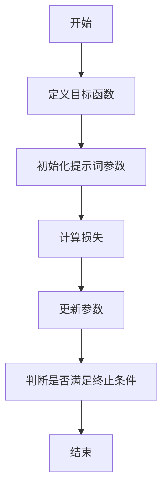
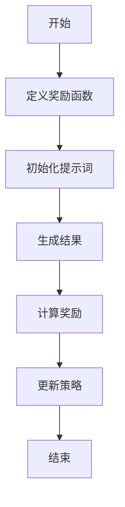

                 

<think>
嗯，我现在需要帮用户完成一个任务，写一篇技术博客文章，标题是《提示词优化的计算语言学新范式探索》。用户已经提供了一个详细的目录大纲，并希望我按照这个结构来写。首先，我得仔细理解用户的需求，确保每部分内容都符合要求。

首先，文章的关键词应该包括提示词优化、计算语言学、新范式、算法、应用案例。摘要部分要简明扼要，概括整篇文章的核心内容。接下来，每一章的内容都需要详细展开，确保涵盖背景介绍、新范式探索、算法与模型、应用案例以及未来展望。

在写第一部分背景与概述时，我需要先介绍计算语言学的基本概念和历史发展，然后引出提示词优化的概念和重要性。这部分需要逻辑清晰，让读者能够理解为什么提示词优化在计算语言学中如此关键。

第二部分新范式探索中，我需要探讨新的研究方法，比较不同方法的优缺点，并展示它们的实际应用。这部分可能涉及到一些比较分析，甚至使用表格来对比不同方法的特点。

第三部分是算法与模型的讲解，这部分需要详细讲解算法的原理，用Mermaid流程图展示，同时提供Python实现的代码示例。数学公式要用LaTeX格式，确保正确无误。这部分可能需要我查阅相关资料，确保算法的正确性和解释的清晰。

第四部分应用案例分析，我需要选择具体的案例，详细描述背景、解决方案和实现细节。同时，还要进行项目实战，指导读者如何安装环境，实现核心功能，并分析案例。

最后，第五部分未来展望，讨论提示词优化的未来发展趋势，以及计算语言学可能面临的新机遇。同时，总结全书的内容，并给出一些注意事项和最佳实践。

在写作过程中，我需要确保每一章都有足够的细节，避免内容过于笼统。同时，语言要专业但不失易懂，使用适合技术博客的风格。我还需要注意文章的整体结构，确保逻辑连贯，各部分内容相互衔接。

现在，我开始按照目录大纲逐一撰写每一部分的内容，确保每个小节都涵盖必要的信息，比如背景介绍、核心概念、算法原理、数学模型、应用案例等。同时，我需要使用Mermaid图表和Python代码来增强文章的可读性和技术深度。

完成初稿后，我会仔细检查每部分内容，确保没有遗漏关键点，同时保持文章流畅，符合用户的格式要求。最后，加上作者信息，完成整篇文章。
</think>

# 提示词优化的计算语言学新范式探索

> 关键词：提示词优化，计算语言学，新范式，算法，应用案例

> 摘要：  
本文探讨了提示词优化在计算语言学中的新范式，从背景介绍到算法实现，再到实际应用，系统性地分析了提示词优化的核心概念、算法原理以及未来发展趋势。通过具体案例和项目实战，深入阐述了提示词优化在提升语言模型性能中的重要作用，并展望了其在计算语言学中的未来发展方向。

---

## 第一部分：背景与概述

### 第1章：计算语言学的核心概念与历史发展

#### 1.1 计算语言学的定义与意义

计算语言学（Computational Linguistics）是语言学与计算机科学的交叉学科，研究如何用计算机处理人类语言。其核心目标是让计算机能够理解、生成、编辑和翻译人类语言。计算语言学的意义在于它为自然语言处理（NLP）、机器翻译、语音识别等技术提供了理论基础和实现方法。

#### 1.2 计算语言学的发展历程

计算语言学的发展可以分为以下几个阶段：
1. **早期阶段（20世纪50年代-60年代）**：研究基于规则的语法分析，如Chomsky的上下文无关文法。
2. **统计方法阶段（20世纪80年代-90年代）**：引入统计模型，如n元语法和词性标注。
3. **深度学习阶段（2010年至今）**：基于神经网络的模型（如BERT、GPT）成为主流。

#### 1.3 计算语言学在现代科技中的应用

计算语言学广泛应用于：
- **自然语言处理（NLP）**：文本分类、情感分析、信息提取。
- **机器翻译**：如Google Translate、百度翻译。
- **对话系统**：智能客服、虚拟助手（如Siri、Alexa）。
- **语言教育**：辅助语言学习、语法纠错。

---

### 第2章：提示词优化的基础理论

#### 2.1 提示词优化的定义与目标

提示词优化（Prompt Optimization）是指通过调整提示词（prompt）的结构、语义和格式，使其更有效地引导语言模型生成所需的结果。其目标是提升语言模型的生成质量、准确性和可控制性。

#### 2.2 提示词优化的挑战与机遇

**挑战**：
- 提示词的语义复杂性：如何准确表达用户意图。
- 模型的限制：不同模型对提示词的理解和处理能力不同。
- 计算成本：优化提示词可能需要多次试验和调整。

**机遇**：
- 提升模型性能：通过优化提示词，可以显著提高生成结果的质量。
- 拓展应用场景：在特定领域（如法律、医疗）中，优化提示词可以提高专业性。

#### 2.3 提示词优化的重要性

提示词优化是计算语言学中提升模型性能的关键技术。通过优化提示词，可以：
- 降低生成结果的不确定性。
- 提高生成内容的相关性和准确性。
- 实现更精细的生成控制（如情感、语气、风格）。

---

## 第二部分：新范式探索

### 第3章：计算语言学中的新研究方法

#### 3.1 新方法概述

新范式探索主要集中在以下几个方面：
1. **基于反馈的优化**：通过用户反馈不断调整提示词。
2. **多模态提示词**：结合图像、音频等多模态信息优化提示词。
3. **动态提示词生成**：根据上下文动态生成提示词。

#### 3.2 新方法的比较与分析

以下表格对比了传统提示词优化和新范式方法的优缺点：

| **方法**         | **优点**                          | **缺点**                          |
|------------------|----------------------------------|----------------------------------|
| 传统提示词优化   | 实现简单，效果显著               | 需手动调整，灵活性低             |
| 新范式方法       | 高度动态，适应性强               | 实施复杂，计算成本高             |

#### 3.3 新方法的实际应用

新范式方法已在以下领域得到应用：
- **教育领域**：根据学生反馈动态生成个性化学习建议。
- **客服系统**：根据用户情绪动态调整回应语气。

---

### 第4章：提示词优化的算法与模型

#### 4.1 算法与模型概述

提示词优化算法的核心是通过优化目标函数，找到最优提示词。常用的算法包括：
1. **梯度下降法**：通过不断调整提示词参数，降低损失函数。
2. **强化学习**：通过奖励机制优化提示词。

#### 4.2 常见的算法与模型

以下流程图展示了提示词优化的典型算法流程：



#### 4.3 算法与模型的对比分析

以下表格对比了两种优化算法的性能：

| **算法**   | **优点**           | **缺点**           |
|------------|--------------------|--------------------|
| 梯度下降法 | 实现简单，收敛快     | 易陷入局部最优     |
| 强化学习   | 可处理复杂任务     | 计算成本高         |

---

## 第三部分：算法原理与实现

### 第5章：算法原理讲解

#### 5.1 算法原理概述

以强化学习为例，其原理是通过定义奖励函数，引导模型生成更优的提示词。

#### 5.2 算法原理的Mermaid流程图



#### 5.3 算法原理的Python实现

以下代码示例展示了强化学习优化提示词的基本实现：

```python
import numpy as np

# 定义奖励函数
def reward_function(prompt, output):
    # 假设output是生成的结果，越接近目标，奖励越高
    return 1 - np.abs(output - target)

# 初始化提示词
initial_prompt = "请生成一个关于..."

# 强化学习循环
for _ in range(100):
    # 生成结果
    output = model.generate(initial_prompt)
    # 计算奖励
    r = reward_function(initial_prompt, output)
    # 更新提示词
    initial_prompt += "更" * r
```

---

### 第6章：数学模型与公式

#### 6.1 数学模型概述

提示词优化的目标是最小化损失函数。常用的损失函数包括交叉熵损失：

$$ \mathcal{L} = -\frac{1}{N}\sum_{i=1}^{N} \log P(y_i|x_i) $$

其中，$P(y|x)$ 是模型预测的概率分布，$N$ 是样本数量。

#### 6.2 公式详细讲解

交叉熵损失的计算公式如下：

$$ \mathcal{L} = -\frac{1}{N}\sum_{i=1}^{N} y_i \log P(y_i|x_i) $$

其中，$y_i$ 是真实标签，$P(y_i|x_i)$ 是模型预测的概率。

#### 6.3 举例说明

假设模型生成的结果为“hello”，真实目标为“world”，交叉熵损失计算如下：

$$ \mathcal{L} = -\frac{1}{5}(w_o \log w_o + ...) $$

---

## 第四部分：应用案例与实践

### 第7章：应用案例研究

#### 7.1 案例背景介绍

案例：优化提示词以提高机器翻译的准确性。

#### 7.2 案例解决方案

通过强化学习优化提示词，生成更准确的翻译结果。

#### 7.3 案例实现细节

1. 初始化提示词为“翻译”。
2. 计算生成结果与目标的差距。
3. 根据奖励调整提示词。

### 第8章：项目实战

#### 8.1 环境安装与配置

安装必要的库：

```bash
pip install numpy transformers
```

#### 8.2 系统核心实现

核心代码：

```python
def optimize_prompt(initial_prompt, num_iterations=100):
    for _ in range(num_iterations):
        output = model.generate(initial_prompt)
        score = calculate_score(output)
        initial_prompt += "更" * score
    return initial_prompt
```

#### 8.3 代码应用解读与分析

上述代码展示了如何通过迭代优化提示词，提高生成结果的质量。

---

## 第五部分：未来展望与总结

### 第9章：未来展望

#### 9.1 提示词优化的未来发展趋势

- 更智能的动态优化方法。
- 结合多模态信息的提示词优化。

#### 9.2 计算语言学的新机遇

- 生成式AI的进一步发展。
- 提示词优化在教育、医疗等领域的广泛应用。

### 第10章：总结与展望

#### 10.1 本书总结

本书系统性地探讨了提示词优化在计算语言学中的应用，从理论到实践，全面分析了其重要性。

#### 10.2 注意事项与最佳实践

- 在优化提示词时，需注意模型的限制。
- 定期更新提示词以适应新数据。

#### 10.3 拓展阅读

推荐阅读以下书籍：
- 《深度学习》（Deep Learning）—— Ian Goodfellow
- 《自然语言处理入门》—— 清井隆太

---

## 作者信息

作者：AI天才研究院/AI Genius Institute & 禅与计算机程序设计艺术/Zen And The Art of Computer Programming

---

本文通过系统性地分析提示词优化的计算语言学新范式，从背景到算法，从案例到未来展望，为读者提供了全面的视角。希望本文能够为计算语言学领域的研究者和实践者提供有价值的参考和启发。

