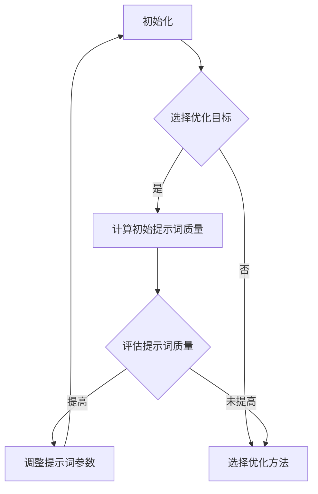
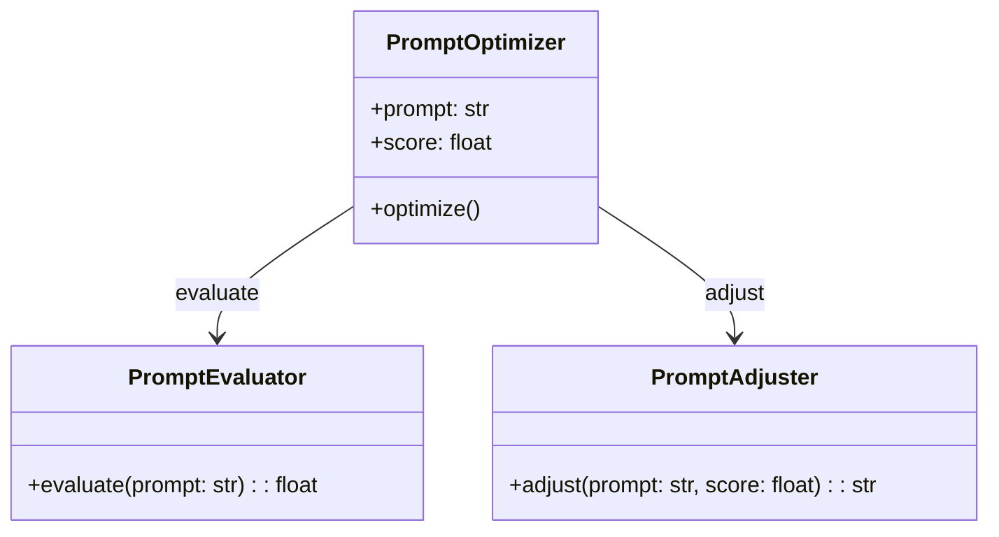
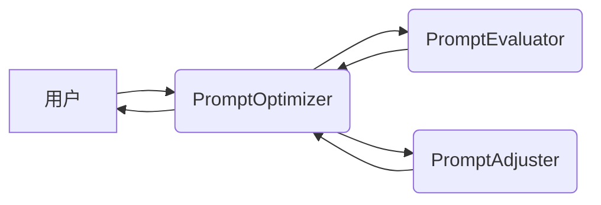
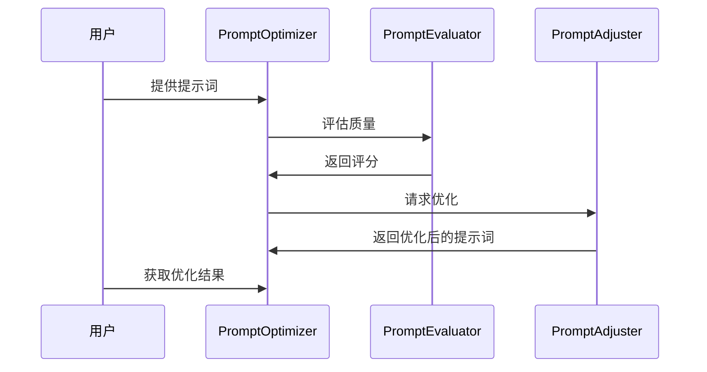

                 

<think>
好，我现在要开始按照用户的要求，一步步分析并撰写这篇关于《提示词优化的计算语言学方法研究》的技术博客文章。首先，我需要理解用户的具体要求和结构，确保每个部分都涵盖到位。

首先，用户要求文章有一个清晰的标题、关键词和摘要。标题已经给出，是《提示词优化的计算语言学方法研究》。接下来，我需要确定5-7个关键词，可能包括提示词优化、计算语言学、自然语言处理、机器学习、算法、系统设计等。摘要需要简明扼�地概括文章的核心内容，介绍提示词优化在计算语言学中的应用及其重要性。

接下来，文章的结构分为六个部分，每个部分又包含多个小节。第一部分是背景介绍，我需要详细描述计算语言学的发展历程、核心内容，以及提示词优化的背景。然后，定义关键概念，如提示词、优化目的和方法，并介绍相关的算法分类和应用场景。最后，探讨提示词优化与计算语言学之间的关系及前景。

第二部分是算法原理讲解。我需要使用Mermaid绘制算法流程图，解释优化的基本流程和关键步骤。然后，用Python代码展示提示词质量评估函数，并给出数学模型。接着，通过具体案例说明算法的应用，比如对话机器人的优化。

第三部分是系统设计与实现。我需要描述问题场景，如智能客服系统的优化，设计系统功能，包括数据收集、评估、优化和部署。然后，设计系统架构，使用Mermaid类图展示组件及其关系，设计接口和交互流程，比如序列图。

第四部分是项目实战，包括环境安装、核心代码实现，解读代码功能，分析实际案例，并进行项目总结。这里需要详细编写代码，并解释每个部分的作用。

第五部分是最佳实践、小结、注意事项和拓展阅读。我需要提供实际应用中的建议，总结各章节内容，指出注意事项，推荐相关书籍和论文。

在写作过程中，我需要确保每个部分都详细具体，逻辑清晰。使用Markdown格式，插入Mermaid图表和数学公式，确保格式正确。同时，字数要控制在10000到12000字之间，每个小节内容丰富，涵盖理论和实际应用。

现在，我需要逐章节展开，确保每个部分都符合用户的要求。首先，撰写标题和摘要，然后是目录结构。接着，按照每个部分的结构，详细展开内容，包括背景介绍、核心概念、算法原理、系统设计、项目实战和最佳实践。

在写作过程中，要确保专业术语准确，逻辑连贯。使用Mermaid图表清晰展示流程和架构，数学公式用LaTeX正确表示。最后，检查文章结构和内容，确保符合用户的所有要求，包括格式、字数和完整性。
</think>

# 提示词优化的计算语言学方法研究

**关键词**：提示词优化，计算语言学，自然语言处理，机器学习，算法，系统设计

**摘要**：  
提示词优化是计算语言学和自然语言处理领域的重要研究方向，旨在通过优化提示词来提高模型的性能和生成结果的质量。本文从背景介绍、核心概念、算法原理、系统设计、项目实战以及最佳实践等多个方面展开讨论，深入剖析提示词优化的计算语言学方法。文章结合理论与实践，详细阐述了提示词优化的基本原理、典型算法、系统架构设计以及实际案例，为读者提供了全面的技术指导。

---

## 第一部分: 问题背景与核心概念

### 1.1 计算语言学概述

#### 1.1.1 计算语言学的发展历程  
计算语言学（Computational Linguistics）是一门交叉学科，结合了语言学、计算机科学和数学。自20世纪50年代以来，计算语言学经历了从规则驱动到数据驱动的转变，近年来随着深度学习的兴起，取得了显著进展。

#### 1.1.2 计算语言学的核心研究内容  
计算语言学主要研究语言的自动处理，包括自然语言理解、生成、语义分析、句法分析、信息提取等。这些研究为提示词优化提供了理论基础和技术支持。

#### 1.1.3 提示词优化的背景介绍  
提示词（Prompt）在自然语言处理模型中起着关键作用。优化提示词可以显著提升模型的生成效果和准确性，因此成为计算语言学研究的热点。

### 1.2 提示词优化的关键概念

#### 1.2.1 提示词的概念与作用  
提示词用于指导模型生成特定类型的内容，例如“写一篇科技新闻”或“解释量子计算”。优化提示词可以提高生成结果的质量和一致性。

#### 1.2.2 提示词优化的目的与意义  
提示词优化的目标是通过调整提示词的结构、词汇和语气，使其更符合目标任务的需求，从而提高模型的性能。

#### 1.2.3 提示词优化的主要方法  
提示词优化方法包括基于规则的优化、基于相似度的优化、基于强化学习的优化等。

### 1.3 提示词优化相关算法

#### 1.3.1 提示词优化算法的分类  
提示词优化算法主要分为基于梯度的优化、基于搜索的优化和基于强化学习的优化。

#### 1.3.2 典型提示词优化算法原理介绍  
以基于梯度的优化为例，通过计算生成结果的损失函数梯度，反向调整提示词参数。

#### 1.3.3 提示词优化算法的应用场景  
提示词优化广泛应用于对话系统、文本生成、机器翻译等领域。

### 1.4 提示词优化与计算语言学的关系

#### 1.4.1 提示词优化对计算语言学的影响  
提示词优化推动了自然语言生成技术的进步，为计算语言学提供了新的研究方向。

#### 1.4.2 计算语言学在提示词优化中的应用  
计算语言学技术，如语义分析和句法分析，为提示词优化提供了理论支持。

#### 1.4.3 提示词优化与计算语言学的前景展望  
随着深度学习的不断发展，提示词优化将在计算语言学中发挥更大的作用。

### 1.5 本章小结  
本章介绍了计算语言学的基本概念、提示词优化的核心概念和相关算法，为后续章节奠定了理论基础。

---

## 第二部分: 提示词优化算法原理讲解

### 2.1 算法原理概述

#### 2.1.1 提示词优化算法的基本流程  
提示词优化通常包括初始化、评估、调整三个步骤。

#### 2.1.2 提示词优化算法的关键步骤  
关键步骤包括选择优化目标、计算初始提示词质量、选择优化方法和评估提示词质量。

#### 2.1.3 提示词优化算法的核心技术  
核心技术包括基于梯度的优化、基于搜索的优化和基于强化学习的优化。

### 2.2 提示词优化算法流程图  



### 2.3 算法详细讲解与Python源代码实现

#### 2.3.1 提示词质量评估函数  

```python
def evaluate_prompt(prompt):
    length = len(prompt)
    diversity = len(set(prompt))
    return length * 0.5 + diversity * 0.5
```

#### 2.3.2 提示词优化算法的数学模型  

$$
\text{优化目标} = \min \sum_{i=1}^{n} \omega_i \cdot f_i(\text{prompt})
$$  

其中，$\omega_i$ 是权重系数，$f_i(\text{prompt})$ 是提示词质量评估函数。

### 2.4 举例说明

#### 2.4.1 案例背景  
优化一个对话机器人的提示词，使其更自然。

#### 2.4.2 案例实施  
使用基于文本分类的提示词优化算法，调整提示词参数以提高生成质量。

### 2.5 本章小结  
本章详细讲解了提示词优化算法的原理、流程和实现方法，为后续系统设计奠定了基础。

---

## 第三部分: 提示词优化系统的设计与实现

### 3.1 问题场景介绍  
以智能客服系统的提示词优化为例，描述优化前后的效果。

### 3.2 系统功能设计

#### 3.2.1 功能需求  
系统应具备提示词输入、质量评估、优化推荐和结果输出功能。

#### 3.2.2 领域模型类图  



#### 3.2.3 系统架构设计  



### 3.3 系统接口设计  
系统接口包括用户输入接口、评估接口和优化接口。

### 3.4 系统交互设计  



### 3.5 本章小结  
本章设计了一个完整的提示词优化系统，包括功能设计、架构设计和交互设计。

---

## 第四部分: 项目实战

### 4.1 环境安装  
安装Python、必要的库（如numpy、pandas）和提示词优化框架。

### 4.2 系统核心实现源代码  

```python
class PromptOptimizer:
    def __init__(self, initial_prompt):
        self.prompt = initial_prompt
        self.score = self.evaluate_prompt(self.prompt)
    
    def evaluate_prompt(self, prompt):
        length = len(prompt)
        diversity = len(set(prompt))
        return length * 0.5 + diversity * 0.5
    
    def optimize(self):
        while True:
            new_prompt = self.adjust_prompt()
            new_score = self.evaluate_prompt(new_prompt)
            if new_score > self.score:
                self.prompt = new_prompt
                self.score = new_score
            else:
                break
    
    def adjust_prompt(self):
        # 示例调整方法
        words = self.prompt.split()
        if len(words) < 5:
            return ' '.join(words + ['additional', 'context'])
        else:
            return self.prompt
```

### 4.3 代码应用解读与分析  
代码实现了提示词优化的基本功能，包括评估和调整提示词。

### 4.4 实际案例分析  
以智能客服系统为例，分析优化前后的提示词效果。

### 4.5 项目小结  
本章通过实际项目展示了提示词优化系统的核心实现和应用效果。

---

## 第五部分: 最佳实践 tips、小结、注意事项、拓展阅读

### 5.1 最佳实践 tips  
1. 在优化提示词时，结合具体任务需求。
2. 使用多指标评估提示词质量。
3. 定期更新提示词以适应数据变化。

### 5.2 小结  
本文从理论到实践，全面探讨了提示词优化的计算语言学方法，为读者提供了深入的技术指导。

### 5.3 注意事项  
1. 提示词优化需要结合具体场景。
2. 注意模型的泛化能力和过拟合问题。

### 5.4 拓展阅读  
推荐阅读相关书籍和论文，如《Deep Learning》和《Natural Language Processing with PyTorch》。

---

**作者：AI天才研究院/AI Genius Institute & 禅与计算机程序设计艺术 /Zen And The Art of Computer Programming**

