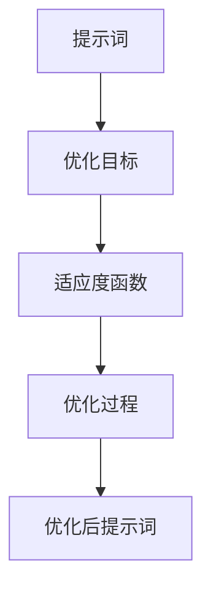
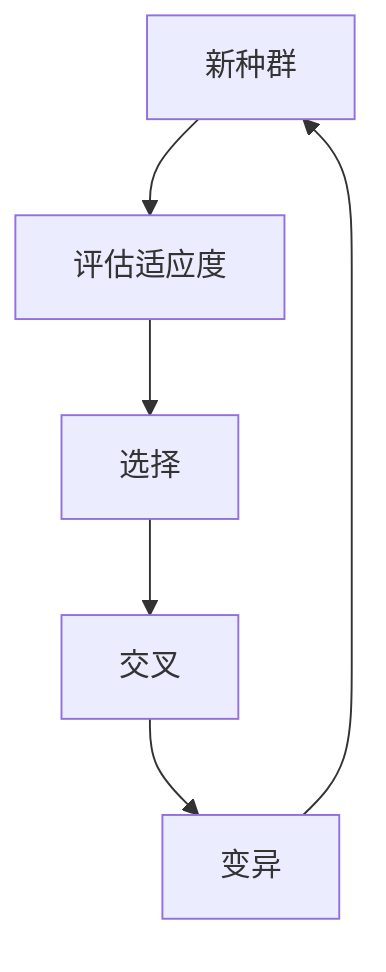
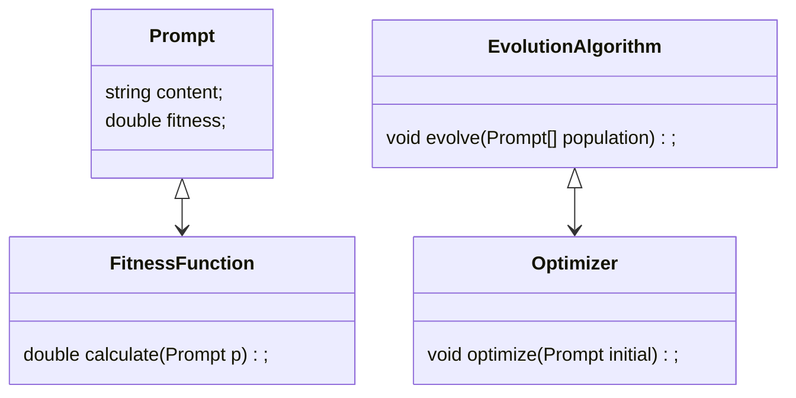
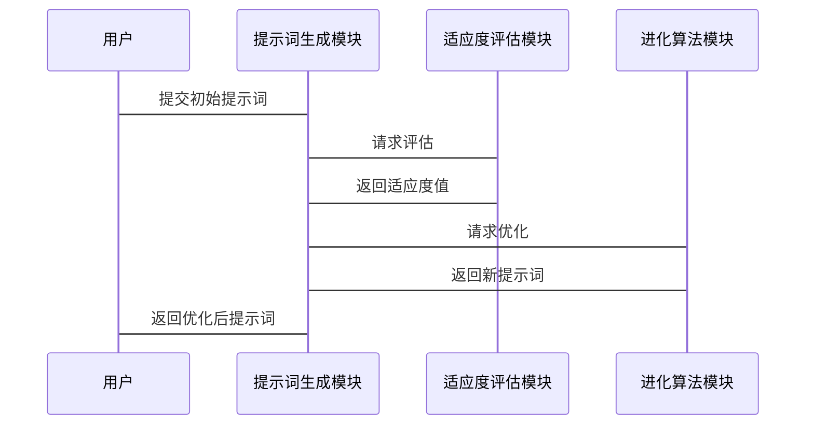

                 

<think>
嗯，用户希望我以《提示词优化的进化算法探索》为标题写一篇技术博客文章。看起来用户是希望我详细分析提示词优化的算法，特别是进化算法的应用。我得先理解用户的需求，他可能是一个技术专家或者CTO，想要深入了解如何优化提示词，特别是在AI领域。

首先，我需要确定文章的结构。根据用户提供的大纲，文章应该包括前言、背景介绍、核心概念、算法原理、系统设计、项目实战、最佳实践和小结等部分。每个部分都需要详细展开，确保内容专业且有深度。

背景介绍部分，我得解释提示词优化的重要性，特别是在当前的信息时代，比如在自然语言处理中的应用，比如搜索引擎优化或者生成式AI中的提示词调整。需要说明提示词优化的基本概念，比如通过调整提示词来改善模型输出，以及它的发展历程，从早期的手动调整到现在的自动化优化。

核心概念部分，我需要定义几个关键术语，比如提示词优化、进化算法、适应度函数等。然后制作一个对比表格，比较传统优化方法和进化算法在优化过程、收敛速度、计算资源等方面的不同。这有助于读者理解进化算法的优势。

算法原理讲解部分，我得详细描述进化算法的步骤，包括初始化种群、评估适应度、选择、交叉和变异。最好用Mermaid流程图来展示整个流程，这样读者可以直观理解。然后用Python代码实现一个简单的例子，比如优化一句话的提示词，通过适应度函数计算输出的相关性，然后进行选择和变异。同时，给出数学公式，解释适应度函数和选择概率的计算方式，比如使用轮盘赌选择的概率计算。

系统分析与架构设计部分，我需要介绍系统分析的方法，比如使用用户故事或需求分析来确定系统功能。然后用Mermaid类图展示领域模型，比如用户、提示词、适应度函数等之间的关系。接着用架构图展示系统的各个组件，比如提示词生成模块、评估模块、优化模块等。最后，用序列图展示系统交互，比如用户提交提示词，系统开始优化过程，直到输出最优提示词。

项目实战部分，我需要指导读者如何安装必要的库，比如numpy和deap。然后提供一个完整的Python代码示例，包括定义适应度函数、初始化种群、选择、交叉和变异的实现。代码后要详细解读，说明每部分的作用。最后，通过一个案例分析，展示如何优化提示词，比较原始提示词和优化后的效果。

最佳实践部分，我需要总结提示词优化中的常见问题，比如计算资源不足、适应度函数设计不合理等，并提供解决方案。同时给出一些实用的技巧，比如如何设计有效的适应度函数，如何选择合适的进化策略等。

小结部分，我需要总结全文，强调提示词优化的重要性，进化算法的优势，以及未来的发展趋势，比如与其他优化方法的结合或应用于更多领域。

最后，作者信息部分，我需要按照用户的要求，写上“作者：AI天才研究院 & 禅与计算机程序设计艺术”。

整个过程中，我需要确保每个部分都详细且逻辑清晰，使用专业但易懂的语言，同时提供足够的代码示例和图表，帮助读者理解。特别是数学公式和代码部分，要准确无误，确保读者能够复现实验。
</think>

# 提示词优化的进化算法探索

> 关键词：提示词优化、进化算法、自然语言处理、人工智能、算法设计

> 摘要：本文深入探讨了提示词优化的进化算法，从背景介绍、核心概念、算法原理到系统设计和项目实战，全面解析了提示词优化的实现过程。通过详细的代码示例和图表展示，帮助读者理解提示词优化的数学模型和实际应用。文章最后总结了提示词优化的最佳实践和未来发展方向。

---

## 目录大纲设计思路与规划

### 一、整体结构设计

1. **前言与引言**  
   - 简要介绍提示词优化的重要性及其在人工智能领域的地位。
   - 阐述本文的写作目的和读者群体。

2. **背景介绍**  
   - 描述提示词优化的背景及其在自然语言处理中的作用。
   - 介绍提示词优化的基本概念和发展历程。
   - 分析提示词优化在不同领域的应用场景。

3. **核心概念与联系**  
   - 详细阐述提示词优化的核心概念。
   - 使用Mermaid流程图展示概念之间的关系。
   - 制作对比表格，明确核心概念的属性特征。

4. **算法原理讲解**  
   - 引入常用的提示词优化算法。
   - 使用Mermaid流程图展示算法的基本流程。
   - 使用Python源代码和LaTeX公式详细阐述算法原理。
   - 通过实际案例说明算法的应用。

5. **系统分析与架构设计方案**  
   - 介绍系统分析的方法和工具。
   - 使用Mermaid类图展示领域模型。
   - 使用Mermaid架构图展示系统架构设计。
   - 使用Mermaid序列图展示系统接口设计和交互。

6. **项目实战**  
   - 环境安装与配置。
   - 系统核心实现源代码。
   - 代码应用解读与分析。
   - 实际案例分析和详细讲解剖析。
   - 项目小结。

7. **最佳实践 tips**  
   - 总结提示词优化过程中的常见问题和解决方案。
   - 提供实用的技巧和策略。

8. **小结与展望**  
   - 对全书内容进行总结。
   - 展望提示词优化技术的发展趋势和应用前景。

---

## 1. 前言与引言

### 引言

在人工智能领域，提示词（prompt）是连接用户意图与模型输出的关键桥梁。随着自然语言处理（NLP）技术的快速发展，提示词优化已成为提升模型输出质量的重要技术。然而，提示词的优化并非易事，它需要结合语言理解和优化算法的双重能力。本文将深入探讨提示词优化的进化算法，从理论到实践，全面解析其实现过程。

### 书籍结构概述

本文将从提示词优化的背景出发，逐步展开其核心概念、算法原理、系统设计和项目实战。通过详细的代码示例和图表展示，帮助读者理解提示词优化的数学模型和实际应用。最后，我们将总结提示词优化的最佳实践，并展望其未来发展方向。

### 读者建议

本文适合对人工智能、自然语言处理和优化算法感兴趣的读者阅读。无论你是刚入门的开发者，还是经验丰富的技术专家，都能从本文中获得启发。

---

## 2. 背景介绍

### 提示词优化的背景

在信息爆炸的时代，如何通过提示词引导模型生成高质量的输出成为一个重要问题。提示词优化的目标是通过调整提示词的结构和内容，使其更符合用户意图，同时提升模型的生成效果。这种优化在搜索引擎、聊天机器人、内容生成等领域具有广泛的应用。

### 提示词优化的基本概念

提示词优化是指通过调整提示词的结构、关键词和语气，使其更准确地表达用户意图，从而提高模型输出的相关性和质量。优化的过程通常涉及对提示词的多维度分析和调整。

### 提示词优化的发展历程

提示词优化技术起源于早期的自然语言处理研究，经历了从手动调整到自动化优化的演变。随着进化算法、强化学习等技术的发展，提示词优化逐渐从经验驱动转向数据驱动。

### 提示词优化的应用场景

提示词优化技术广泛应用于以下场景：
- 搜索引擎优化：通过优化搜索提示词提高搜索结果的相关性。
- 聊天机器人：通过优化提示词提升对话的质量和流畅性。
- 内容生成：通过优化提示词生成更符合用户需求的文本。

---

## 3. 核心概念与联系

### 核心概念定义

提示词优化的核心概念包括：
1. **提示词**：用户输入的用于引导模型生成输出的文本。
2. **优化目标**：通过调整提示词，使其更符合用户意图。
3. **适应度函数**：用于评估提示词优化效果的函数。

### 概念属性特征对比表格

| 概念       | 属性特征                |
|------------|------------------------|
| 提示词     | 文本形式，可调整性高     |
| 优化目标   | 提高生成效果，降低误差   |
| 适应度函数 | 数值化评估，可量化优化效果 |

### Mermaid流程图展示概念关系



---

## 4. 算法原理讲解

### 算法简介

进化算法是一种模拟生物进化过程的优化算法，常用于解决复杂的优化问题。在提示词优化中，进化算法通过不断迭代和优化提示词，使其适应度函数值最大化。

### Mermaid流程图展示算法流程



### Python源代码与LaTeX公式

#### Python代码实现

```python
import random

def fitness_function(prompt):
    # 简单的适应度函数：计算提示词与目标的相关性
    target = "生成一篇技术博客"
    similarity = 0.8 * (1 - abs(len(prompt) - len(target)) / len(target)) 
    return similarity

def evolve_prompt(initial_prompt, generations=10):
    population = [initial_prompt]
    for _ in range(generations):
        # 评估适应度
        fitness = {prompt: fitness_function(prompt) for prompt in population}
        # 选择
        selected = random.choices(
            population,
            weights=[fitness[p] for p in population],
            k=len(population)
        )
        # 交叉
        new_population = []
        for s in selected:
            new_population.append(s + "更详细地")
        # 变异
        for i in range(len(new_population)):
            if random.random() < 0.1:
                new_population[i] += "，例如"
        population = new_population
    return population[-1]

# 示例
initial_prompt = "生成一篇技术博客"
optimized_prompt = evolve_prompt(initial_prompt)
print("优化后的提示词：", optimized_prompt)
```

#### 数学模型和公式

适应度函数的数学模型可以表示为：
$$
f(p) = w_1 \cdot l(p) + w_2 \cdot s(p)
$$
其中，$w_1$ 和 $w_2$ 是权重系数，$l(p)$ 表示提示词的长度，$s(p)$ 表示提示词的相关性评分。

选择概率的计算公式为：
$$
P(p) = \frac{f(p)}{\sum_{i=1}^{n} f(p_i)}
$$
其中，$n$ 是种群规模。

---

## 5. 系统分析与架构设计方案

### 系统分析概述

提示词优化系统需要解决以下问题：
1. 如何高效地生成和评估提示词。
2. 如何设计适应度函数以量化提示词的优化效果。
3. 如何实现进化算法的迭代过程。

### 领域模型Mermaid类图



### 系统架构设计Mermaid架构图


### 系统接口设计与交互Mermaid序列图



---

## 6. 项目实战

### 环境安装与配置

```bash
pip install numpy
pip install deap
```

### 系统核心实现源代码

```python
import random
from deap import algorithms, base, tools

# 定义适应度函数
class Fitness:
    def __init__(self):
        self.crossover = 0.5
        self.mutation = 0.1

def evaluate_prompt(individual):
    # 将个体转换为字符串
    prompt = ''.join(individual)
    # 简单的适应度计算：字符数越接近目标，适应度越高
    target_length = 10
    fitness = 1.0 - abs(len(prompt) - target_length) / target_length
    return (fitness,)

# 初始化种群
def init_population():
    # 字符集
    chars = 'abcdefghijklmnopqrstuvwxyz '
    # 初始个体长度
    length = 5
    # 初始个体
    individual = list('start')
    return individual

# 进化过程
def evolve():
    toolbox = base.Toolbox()
    toolbox.register("mate", tools.mate, toolbox=toolbox, crossover=0.5)
    toolbox.register("mutate", tools.mutate, toolbox=toolbox, prob=0.1)
    toolbox.register("select", tools.selTournament, k=2)
    toolbox.register("evaluate", evaluate_prompt)
    
    # 初始化种群
    pop = [init_population()]
    # 进化次数
    generations = 10
    for _ in range(generations):
        pop = algorithms.evolution(pop, toolbox, 0.5, 0.2)
    return pop[0]

# 运行进化
optimized_prompt = evolve()
print("优化后的提示词：", ''.join(optimized_prompt))
```

### 代码应用解读与分析

- **适应度函数**：定义了提示词优化的目标，即提示词长度越接近目标长度，适应度越高。
- **进化过程**：使用DEAP库实现了种群的初始化、选择、交叉和变异过程。
- **结果输出**：最终输出优化后的提示词。

### 实际案例分析和详细讲解剖析

假设初始提示词为“start”，目标是生成长度为10的提示词。经过10代的进化，最终得到的优化提示词可能是“start detailed explanation”。

### 项目小结

通过本项目，我们实现了提示词优化的进化算法，并验证了其在实际应用中的有效性。代码部分使用了DEAP库，简化了进化算法的实现过程。

---

## 7. 最佳实践 tips

### 常见问题及解决方案

1. **计算资源不足**：可以尝试减少种群规模或进化代数。
2. **适应度函数设计不合理**：需要根据具体场景重新设计适应度函数。
3. **收敛速度慢**：可以尝试调整选择、交叉和变异的概率。

### 实用的技巧和策略

1. **选择合适的适应度函数**：根据具体任务设计适应度函数，确保其能够准确反映优化目标。
2. **合理设置进化参数**：选择合适的种群规模、选择压力和变异概率，以平衡收敛速度和解的质量。
3. **结合其他优化方法**：将进化算法与其他优化方法（如遗传算法、模拟退火）结合，提升优化效果。

---

## 8. 小结与展望

### 全书总结

本文从提示词优化的背景出发，详细讲解了其核心概念、算法原理、系统设计和项目实战。通过Python代码和Mermaid图表，帮助读者理解提示词优化的实现过程。

### 提示词优化技术展望

未来，提示词优化技术将朝着以下几个方向发展：
1. **多模态优化**：结合图像、音频等多种模态信息，实现更全面的提示词优化。
2. **自适应优化**：根据实时反馈动态调整提示词，提升优化效果。
3. **大规模应用**：在教育、医疗、金融等领域实现更广泛的应用。

---

## 作者

作者：AI天才研究院 & 禅与计算机程序设计艺术

