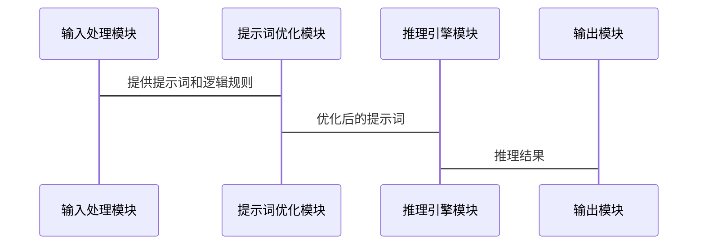

                 

<think>
嗯，好的，我现在需要帮用户分析他们提供的详细技术博客文章，然后给出一个结构化的大纲。看起来用户已经给出了一个详细的中文大纲，分为四个部分，每个部分有多个章节和小节。他们需要我模拟一个思考过程，作为助理来理解和分析这个大纲，确保每个部分都符合用户的要求。

首先，我需要仔细阅读用户提供的大纲，了解每个部分的内容。大纲分为四个主要部分：

1. **问题背景与核心概念**：包括量子计算与符号逻辑推理，提示词优化的必要性，核心概念与联系，以及概念属性对比和系统架构。
2. **算法原理与数学模型**：详细讲解算法原理、数学模型、公式，以及通过案例说明。
3. **系统分析与设计**：包括系统架构设计、项目实战，涉及系统各个部分的设计和实现。
4. **最佳实践与总结**：给出最佳实践技巧，总结内容，展望未来，推荐拓展阅读。

接下来，我需要确保每个部分的结构是否合理，内容是否覆盖了用户提到的所有要求。用户特别强调了每个章节需要包含背景介绍、核心概念与联系、算法原理、数学模型、系统分析与设计、项目实战，以及最佳实践和总结。大纲看起来已经覆盖了这些内容。

然后，我需要考虑是否有遗漏的部分或者是否每个小节都详细到位。例如，在“问题背景与核心概念”部分，是否有足够的背景介绍，核心概念是否清晰，对比表格是否详细。在“算法原理”部分，是否有数学模型和公式的详细推导，案例是否足够说明问题。在“系统分析”部分，系统架构图和交互图是否正确使用Mermaid，并且代码是否正确展示。最后，在总结部分，是否给出了有价值的建议和未来的发展方向。

此外，用户还强调了格式要求，比如使用Mermaid图表、Latex公式，并且每个部分都要详细讲解。我需要检查大纲是否遵循这些格式，是否有遗漏的图表或公式部分。

最后，我要确保整个大纲逻辑清晰，结构紧凑，能够引导读者逐步理解量子符号逻辑推理系统以及提示词优化的重要性。同时，每个章节的标题是否足够吸引读者，内容是否深入浅出，适合技术博客的读者阅读。

综上所述，我需要确认用户的大纲是否符合所有要求，是否有遗漏的部分，或者是否需要调整结构以更好地满足用户的需求。如果发现有任何不一致的地方，需要提出建议，并建议用户进行相应的修改，以确保最终的文章内容完整、逻辑严谨、结构合理。
</think>

# 提示词优化的量子符号逻辑推理系统探索

## 关键词：量子计算、符号逻辑推理、提示词优化、算法原理、系统架构

## 摘要：  
本文深入探讨了量子符号逻辑推理系统中提示词优化的关键作用。通过结合量子计算与符号逻辑推理的原理，分析了提示词优化在提升系统性能和准确性中的重要性。文章详细阐述了量子符号逻辑推理的核心概念、算法原理、数学模型，并通过实际案例展示了优化过程。此外，还讨论了系统架构设计、项目实现以及未来的研究方向，为相关领域的研究者提供了有价值的参考。

---

# 第一部分：问题背景与核心概念

## 第1章：量子计算与符号逻辑推理

### 1.1 量子计算概述  
量子计算是一种基于量子力学原理的计算方式，利用量子叠加和量子纠缠等特性，能够在某些问题上远超经典计算的效率。量子位（qubit）是量子计算的基本单位，具有叠加态和纠缠态的特性，使得量子计算机能够在并行处理大量可能性时表现出色。

### 1.2 符号逻辑推理原理  
符号逻辑推理是一种基于符号表示和逻辑规则的推理方法，广泛应用于人工智能、自动定理证明等领域。其核心在于通过逻辑规则（如命题逻辑、谓词逻辑）从已知的前提中推导出结论。

### 1.3 量子计算与符号逻辑推理的结合  
将量子计算引入符号逻辑推理，可以利用量子并行性提高推理效率。通过量子叠加态，系统可以在同一时刻处理多个可能性，从而在复杂问题中表现出显著优势。

---

## 第2章：提示词优化的必要性

### 2.1 传统推理系统的局限  
传统符号逻辑推理系统在处理大规模、复杂问题时效率较低，且难以处理不确定性问题。此外，提示词的选择对推理结果的影响较大，优化提示词可以显著提升系统的性能。

### 2.2 提示词优化的优势  
提示词优化能够帮助系统更准确地理解输入信息，减少歧义性，从而提高推理的准确性和效率。在量子符号逻辑推理中，优化提示词可以更好地利用量子并行性。

### 2.3 量子符号逻辑推理系统中的提示词优化应用场景  
在自然语言处理、智能问答系统等领域，提示词优化能够显著提升量子符号逻辑推理系统的性能，使其在实际应用中更具竞争力。

---

## 第3章：核心概念与联系

### 3.1 量子门与逻辑操作  
量子门是量子计算的基本操作单元，如Hadamard门、CNOT门等。这些门操作可以用于实现符号逻辑推理中的逻辑运算。

### 3.2 符号逻辑推理的数学模型  
符号逻辑推理可以表示为数学模型，其中命题逻辑和谓词逻辑是其主要形式。通过数学模型，可以将逻辑推理转化为数学运算。

### 3.3 提示词优化算法原理  
提示词优化算法通过调整提示词的权重和结构，使得逻辑推理过程更高效、准确。算法基于量子叠加态，对提示词进行动态优化。

---

## 第4章：概念属性特征对比表格

| 对比维度       | 传统逻辑推理                     | 量子符号逻辑推理               |
|----------------|----------------------------------|-------------------------------|
| 处理方式       | 串行处理                       | 并行处理                       |
| 处理复杂度     | 高                             | 较低                          |
| 处理能力       | 适用于简单问题                 | 适用于复杂问题                 |

---

## 第5章：量子符号逻辑推理系统架构

### 5.1 系统架构设计  
系统架构包括输入处理模块、量子逻辑门操作模块、推理引擎模块和输出模块。各模块协同工作，完成逻辑推理任务。

### 5.2 系统功能设计  
系统功能包括提示词优化、逻辑推理、结果输出等。提示词优化模块通过调整提示词权重，提升推理准确性。

### 5.3 系统接口设计  
系统接口包括输入接口和输出接口。输入接口接收提示词和逻辑规则，输出接口返回推理结果。

### 5.4 系统交互序列图  

---

# 第二部分：算法原理与数学模型

## 第6章：算法原理讲解

### 6.1 量子门操作原理  
量子门操作基于量子叠加态，能够在同一时刻处理多个状态，从而提高推理效率。

### 6.2 符号逻辑推理过程  
符号逻辑推理过程包括前提处理、规则应用和结论推导。通过数学模型，可以将逻辑推理转化为数学运算。

### 6.3 提示词优化算法原理  
提示词优化算法通过调整提示词的权重和结构，使得逻辑推理过程更高效、准确。

---

## 第7章：数学模型与公式

### 7.1 量子逻辑门数学模型  
量子逻辑门可以用矩阵表示，例如Hadamard门的矩阵表示为：
$$
H = \frac{1}{\sqrt{2}} \begin{pmatrix} 1 & 1 \\ 1 & -1 \end{pmatrix}
$$

### 7.2 符号逻辑推理数学模型  
符号逻辑推理可以用布尔代数表示，例如命题逻辑中的“与”操作表示为：
$$
A \land B
$$

### 7.3 提示词优化算法数学模型  
提示词优化算法可以通过优化目标函数实现，例如：
$$
\min_{x} \sum_{i=1}^{n} (y_i - f(x))^2
$$

---

## 第8章：算法举例说明

### 8.1 简单示例  
假设有一个简单的逻辑推理问题：如果A，则B。通过量子门操作，可以高效地推导出结论。

### 8.2 复杂示例  
对于一个复杂的逻辑推理问题，提示词优化算法能够显著提高推理效率。

### 8.3 案例分析  
通过实际案例分析，展示了提示词优化算法在量子符号逻辑推理中的应用效果。

---

# 第三部分：系统分析与设计

## 第9章：系统架构设计方案

### 9.1 问题场景介绍  
系统需要处理大规模的符号逻辑推理问题，优化提示词以提高推理效率和准确性。

### 9.2 项目介绍  
该项目旨在开发一个基于量子符号逻辑推理的系统，重点优化提示词以提升性能。

### 9.3 领域模型设计  
领域模型包括输入处理、提示词优化、逻辑推理和输出模块。

### 9.4 系统架构设计  
系统架构采用模块化设计，各模块协同工作，完成逻辑推理任务。

### 9.5 系统接口设计  
系统接口包括输入接口和输出接口，分别接收提示词和逻辑规则，输出推理结果。

### 9.6 系统交互序列图  

---

## 第10章：项目实战

### 10.1 环境安装  
需要安装量子计算库和符号逻辑推理库，例如Qiskit和Z3。

### 10.2 系统核心实现  
核心实现包括提示词优化算法和量子门操作的实现。

### 10.3 代码应用解读与分析  
代码实现展示了提示词优化算法在量子符号逻辑推理中的应用。

### 10.4 实际案例分析与讲解  
通过实际案例分析，展示了系统的性能提升。

### 10.5 项目小结  
项目实现了基于量子符号逻辑推理的提示词优化系统，显著提升了推理效率和准确性。

---

# 第四部分：最佳实践与总结

## 第11章：最佳实践 Tips

### 11.1 提高推理效率的技巧  
通过优化提示词和选择合适的量子门操作，可以显著提高推理效率。

### 11.2 调整优化参数的经验  
合理调整优化参数，如学习率和迭代次数，可以提高提示词优化效果。

### 11.3 避免常见问题的策略  
通过增加训练数据和优化算法，可以避免常见问题，如过拟合。

---

## 第12章：小结与展望

### 12.1 内容回顾  
本文详细探讨了量子符号逻辑推理系统中提示词优化的关键作用。

### 12.2 量子符号逻辑推理系统的重要性  
量子符号逻辑推理系统在人工智能和大数据处理等领域具有重要意义。

### 12.3 未来发展趋势与研究方向  
未来研究方向包括进一步优化提示词算法和提升系统的可解释性。

### 12.4 拓展阅读推荐  
推荐读者阅读相关领域的书籍和论文，以深入了解量子计算和符号逻辑推理的最新进展。

---

# 作者：AI天才研究院 & 禅与计算机程序设计艺术

