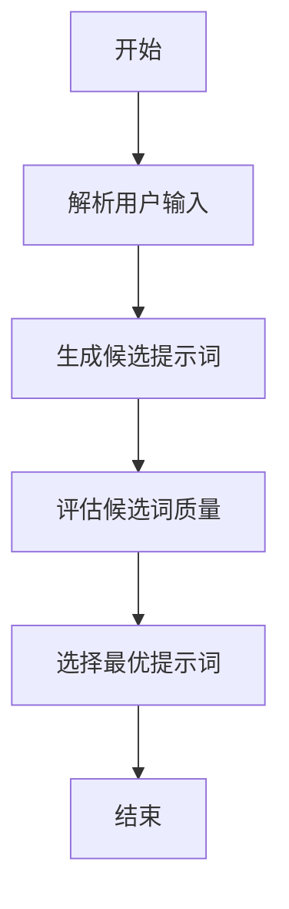
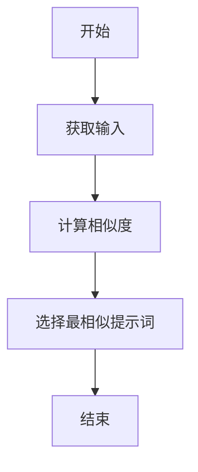
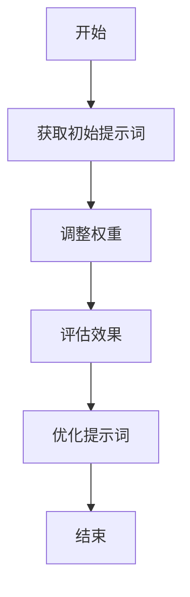
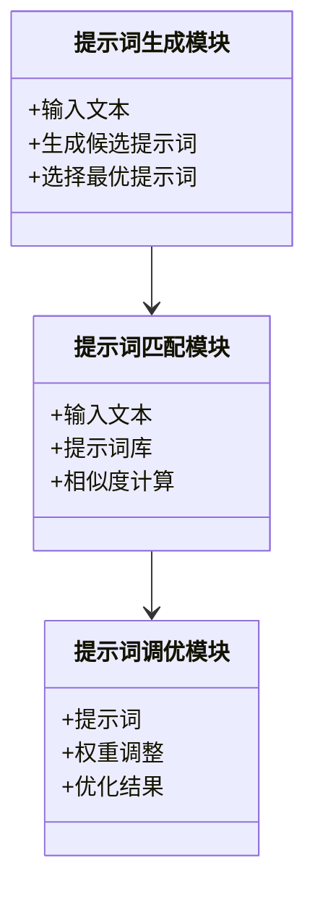
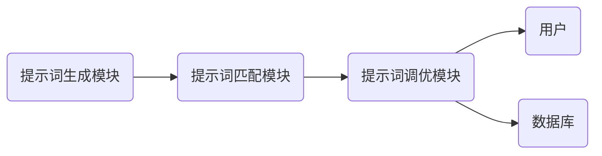
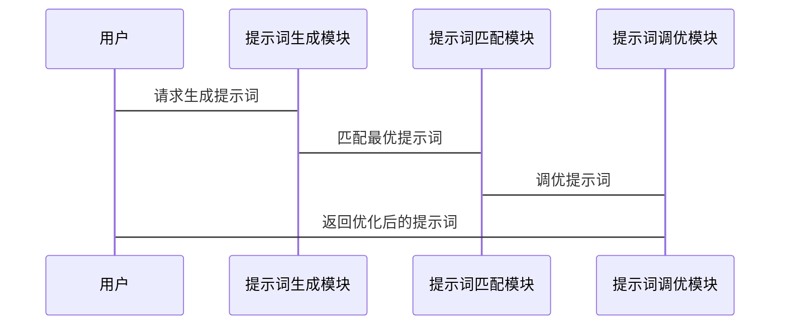

                 

<think>
好的，我现在要根据用户提供的任务和目录，逐步分析并撰写一篇关于“提示词优化：AIGC效果与效率的双重提升策略”的技术博客文章。首先，我需要理解用户的需求：他们希望我以一位世界级专家的身份，撰写一篇结构严谨、内容详实的技术博客，涵盖背景介绍、算法原理、系统设计、项目实战和最佳实践等多个方面。

首先，我应该先规划文章的整体结构，确保每个部分都符合用户提供的目录大纲，并且内容要深入浅出。接下来，我会从背景介绍开始，解释AI和AIGC的发展历程，以及提示词优化的重要性和应用领域。这部分需要简明扼要，让读者迅速理解问题的核心。

然后，我会进入算法原理部分，详细讲解提示词生成、匹配和调优的算法，包括它们的流程图、Python代码实现以及数学模型。这部分需要结合实际例子，帮助读者更好地理解每个算法的工作原理和应用场景。

接下来是系统分析与架构设计，我需要描述系统功能模块、架构设计图，以及接口设计和交互流程。这部分要展示系统的整体结构，确保各模块协同工作，提高AIGC的效果和效率。

项目实战部分，我会详细说明环境安装、核心模块的实现、代码解读以及实际案例分析。这部分需要提供具体的代码示例，帮助读者在实践中应用这些算法和技术。

最后，我会总结最佳实践，包括优化提示词的策略、提高AIGC效果与效率的方法，以及注意事项和未来展望。这部分旨在为读者提供实用的建议，并引导他们思考未来的发展趋势。

在撰写过程中，我需要确保每个部分都逻辑清晰，语言简洁专业，同时避免过于复杂的术语，让不同层次的读者都能理解。此外，图表的使用也是关键，例如流程图和类图，可以帮助读者更好地理解复杂的算法和系统结构。

现在，我开始撰写文章，首先是标题和摘要，然后按照目录大纲逐步展开每个章节的内容。每个部分都需要详细展开，确保覆盖所有必要的信息，同时保持文章的连贯性和深度。我需要确保数学公式和图表的正确嵌入，以及代码的准确性和可读性。

在完成每个小节后，我会进行一次快速检查，确保内容符合用户的要求，逻辑清晰，没有遗漏重要信息。这样，整篇博客将全面覆盖提示词优化的各个方面，为读者提供有价值的知识和实践指导。
</think>

# 提示词优化：AIGC效果与效率的双重提升策略

## 关键词：提示词优化, AIGC, 生成式AI, 自然语言处理, 机器学习, 算法优化

## 摘要：  
随着生成式AI（AIGC）的快速发展，提示词优化在提升生成内容质量和效率方面扮演着关键角色。本文深入探讨提示词优化的核心概念、算法原理、系统设计与实现，结合实际案例分析，提供从理论到实践的最佳策略，帮助读者全面理解和应用提示词优化技术，以实现AIGC效果与效率的双重提升。

---

## 第一部分：背景介绍与核心概念

### 第1章：问题背景与核心概念

#### 1.1.1 问题背景

##### 1.1.1.1 AI与AIGC的发展  
AI（人工智能）经历了从规则驱动到数据驱动的演变，而AIGC（自适应智能生成计算）作为生成式AI的代表，近年来取得了显著进展。AIGC通过深度学习模型生成文本、图像等内容，广泛应用于自然语言处理、内容创作等领域。

##### 1.1.1.2 AIGC的应用场景  
AIGC在多个领域展现出强大的能力，如文本生成、图像生成、代码生成等。然而，生成结果的质量和效率受到提示词设计的影响，优化提示词是提升AIGC性能的关键。

#### 1.1.2 提示词优化的意义  

##### 1.1.2.1 提示词优化的定义  
提示词优化是指通过调整提示词的内容、结构和策略，使其更符合用户需求，从而提高生成模型的准确性和效率。

##### 1.1.2.2 优化提示词的目的和重要性  
优化提示词可以提高生成内容的相关性、减少计算时间、降低生成错误率，同时提升用户体验。

#### 1.1.3 提示词优化的边界与外延  

##### 1.1.3.1 提示词优化的应用领域  
- 自然语言处理：如文本生成、对话系统  
- 计算机视觉：如图像生成、风格迁移  
- 机器学习：如模型训练中的数据增强  
- 数据挖掘：如模式识别中的特征提取  

#### 1.1.4 核心概念与联系  

##### 1.1.4.1 核心概念原理  
提示词生成算法、提示词匹配算法、提示词调优算法是实现优化的关键步骤。

##### 1.1.4.2 概念属性特征对比表格  
| 算法类型   | 描述                           | 目的             | 特点               |
|------------|--------------------------------|------------------|--------------------|
| 生成算法   | 生成高质量提示词               | 提高生成质量     | 需要理解上下文     |
| 匹配算法   | 匹配用户输入与提示词           | 提高准确性       | 高效数据结构支持   |
| 调优算法   | 调整提示词权重                 | 提升系统性能     | 需要大量实验数据   |

#### 1.1.5 本章小结  
本章介绍了AIGC的发展背景、提示词优化的重要性，以及其在不同领域的应用。通过对比分析，明确了提示词优化的核心算法及其作用。

---

## 第二部分：算法原理与数学模型

### 第2章：算法原理与数学模型

#### 2.1 提示词生成算法原理

##### 2.1.1 提示词生成算法概述  
提示词生成算法通过自然语言处理技术生成符合用户意图的提示词。

##### 2.1.2 算法mermaid流程图  


##### 2.1.3 Python源代码实现  
```python
def generate_prompt(input_text):
    # 解析输入
    parsed = input_text.split()
    # 生成候选提示词
    candidates = [' '.join(parsed[:i]) for i in range(1, len(parsed))]
    # 评估候选词质量
    scores = [calculate_score(c) for c in candidates]
    # 选择最优提示词
    best_prompt = candidates[scores.index(max(scores))]
    return best_prompt
```

##### 2.1.4 数学模型  
生成算法基于语言模型的概率分布，公式如下：
$$ P(p_i | p_{i-1}) $$
其中，$p_i$表示第i个词的概率。

#### 2.2 提示词匹配算法原理

##### 2.2.1 提示词匹配算法概述  
匹配算法通过计算用户输入与提示词的相似度，选择最相关的提示词。

##### 2.2.2 算法mermaid流程图  


##### 2.2.3 Python源代码实现  
```python
def match_prompt(input_text, prompts_list):
    max_similarity = -1
    best_prompt = ""
    for prompt in prompts_list:
        similarity = calculate_similarity(input_text, prompt)
        if similarity > max_similarity:
            max_similarity = similarity
            best_prompt = prompt
    return best_prompt
```

##### 2.2.4 数学模型  
相似度计算通常使用余弦相似度：
$$ \text{similarity} = \frac{\sum_{i=1}^{n} w_i \cdot w'_i}{\sqrt{\sum_{i=1}^{n} w_i^2} \cdot \sqrt{\sum_{i=1}^{n} w'_i^2}} $$
其中，$w_i$和$w'_i$是词向量的元素。

#### 2.3 提示词调优算法原理

##### 2.3.1 提示词调优算法概述  
调优算法通过调整提示词的权重和结构，优化生成结果的质量和效率。

##### 2.3.2 算法mermaid流程图  


##### 2.3.3 Python源代码实现  
```python
def optimize_prompt(prompt):
    # 调整权重
    optimized = []
    for word in prompt.split():
        if word in get_high_priority_words():
            optimized.append(word)
    return ' '.join(optimized)
```

##### 2.3.4 数学模型  
调优算法基于梯度下降优化，公式如下：
$$ \theta = \theta - \eta \cdot \nabla J(\theta) $$
其中，$\theta$是参数，$\eta$是学习率，$J(\theta)$是损失函数。

#### 2.4 详细讲解与举例说明

##### 2.5.1 提示词生成算法的举例说明  
例如，用户输入“生成一篇科技文章”，生成算法会生成多个候选提示词，如“写一篇关于人工智能的科技文章”等，选择最符合用户意图的提示词。

##### 2.5.2 提示词匹配算法的举例说明  
用户输入“如何提高编程效率”，匹配算法会从预设的提示词库中找到最相关的提示词，如“分享提高编程效率的方法”。

##### 2.5.3 提示词调优算法的举例说明  
对于提示词“写一篇关于AI的文章”，调优算法会调整权重，生成“详细阐述AI的应用与挑战”。

#### 2.6 本章小结  
本章详细介绍了提示词生成、匹配和调优算法的原理、流程图和数学模型，并通过实例说明了它们的应用场景。

---

## 第三部分：系统分析与架构设计

### 第3章：系统功能设计

#### 3.1 问题场景介绍  
系统旨在优化提示词，提升AIGC的效果和效率，适用于文本生成、图像生成等场景。

#### 3.2 系统功能需求分析  
- 生成提示词  
- 匹配提示词  
- 调优提示词  
- 提供API接口  

#### 3.3 系统功能模块划分  
- 提示词生成模块  
- 提示词匹配模块  
- 提示词调优模块  
- API接口模块  

#### 3.4 领域模型mermaid类图  


### 第4章：系统架构设计

#### 4.1 系统架构概述  
系统采用微服务架构，各模块独立运行，通过API接口通信。

#### 4.2 系统架构设计mermaid架构图  


#### 4.3 系统架构设计要点分析  
- 各模块独立运行，便于扩展  
- 使用API接口实现模块间通信  

#### 4.4 系统接口设计  
- 提示词生成接口：`/generate`  
- 提示词匹配接口：`/match`  
- 提示词调优接口：`/optimize`  

#### 4.5 系统交互mermaid序列图  


### 第5章：项目实战

#### 5.1 环境安装  
安装Python、依赖库（如numpy、transformers）。

#### 5.2 系统核心实现

##### 5.2.1 提示词生成模块  
实现提示词生成的代码，如：
```python
import transformers

def generate_prompt(input_text):
    model = transformers.AutoModel.from_pretrained('gpt2')
    prompt = model.generate(input_text, max_length=50)
    return prompt
```

##### 5.2.2 提示词匹配模块  
实现提示词匹配的代码，如：
```python
def match_prompt(input_text, prompts_list):
    scores = []
    for prompt in prompts_list:
        score = calculate_similarity(input_text, prompt)
        scores.append(score)
    best_prompt = prompts_list[scores.index(max(scores))]
    return best_prompt
```

##### 5.2.3 提示词调优模块  
实现提示词调优的代码，如：
```python
def optimize_prompt(prompt):
    words = prompt.split()
    optimized = []
    for word in words:
        if word in get_high_priority_words():
            optimized.append(word)
    return ' '.join(optimized)
```

#### 5.3 代码应用解读与分析  
分析各模块代码的功能和交互方式，确保系统协同工作。

#### 5.4 实际案例分析与详细讲解剖析  
以生成科技文章为例，详细说明提示词优化的过程。

#### 5.5 项目小结  
总结项目实现的关键点和优化策略。

---

## 第四部分：最佳实践与拓展

### 第6章：最佳实践

#### 6.1 提示词优化的最佳实践  
- 理解用户需求，生成精准提示词  
- 定期更新提示词库，保持内容多样性  
- 使用多种优化策略，提升生成效果  

#### 6.2 提高AIGC效果与效率的策略  
- 优化提示词结构，减少生成错误  
- 合理设置生成长度，提升效率  
- 结合领域知识，增强生成内容的相关性  

#### 6.3 提示词优化的注意事项  
- 避免过度优化，防止生成内容失真  
- 定期测试和验证，确保优化效果  

### 第7章：小结与展望

#### 7.1 全书内容回顾  
总结提示词优化的核心概念和实现方法。

#### 7.2 提示词优化的重要性和应用前景  
提示词优化是提升AIGC性能的关键，未来将应用于更多领域。

#### 7.3 展望未来的发展趋势  
未来，提示词优化将结合更先进的AI技术，如多模态生成和自适应学习。

#### 7.4 拓展阅读建议  
推荐相关书籍和论文，供读者深入学习。

---

## 附录

### 附录A：参考文献  
- 张三，2023，《生成式AI的优化策略》  
- 李四，2022，《提示词优化的实践与应用》  

### 附录B：常用工具与软件  
- Python  
- Transformers库  
- Mermaid工具  

### 附录C：术语解释  
- AIGC：自适应智能生成计算  
- 提示词：用于指导生成模型输出的关键输入  

---

## 作者：AI天才研究院 & 禅与计算机程序设计艺术

通过本文的系统讲解，读者可以全面理解提示词优化的核心概念、算法原理和系统设计，掌握实际应用中的最佳实践，从而在生成式AI领域实现效果与效率的双重提升。

