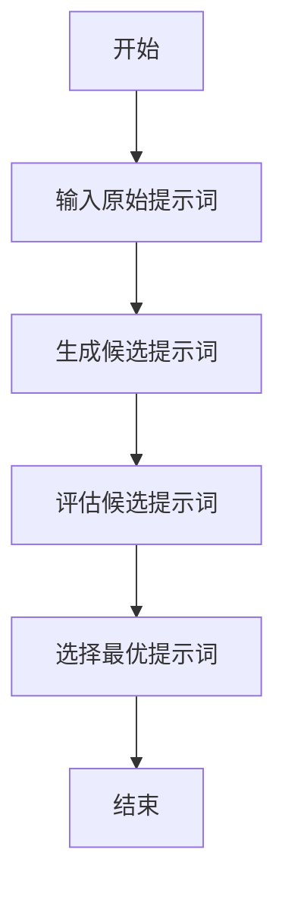
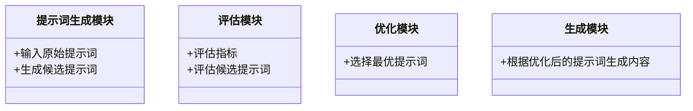
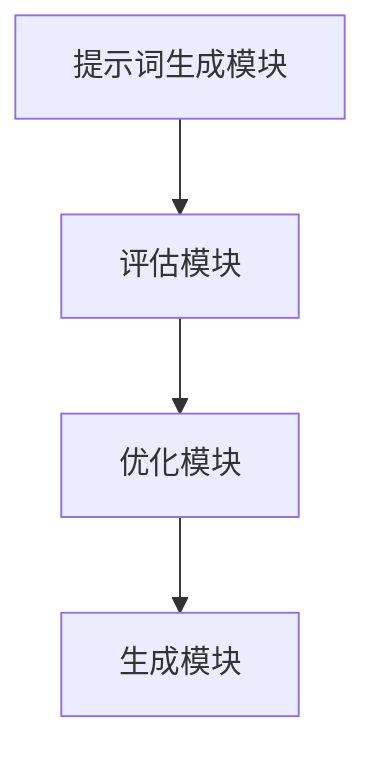
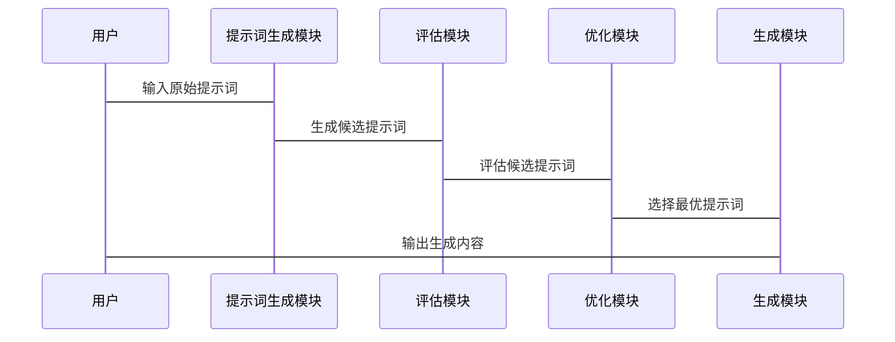

                 

<think>
嗯，我需要根据用户的要求来写一篇技术博客文章，标题是《提示词优化：AIGC系统性能提升的关键》。用户已经给出了详细的大纲，我需要按照这个大纲逐步完成每个部分，确保内容详实，结构清晰。

首先，我得理解用户的需求。他们希望文章以专业、技术的语言，分章节详细讲解提示词优化的重要性、理论、算法、系统设计、实战案例以及最佳实践。我需要确保每个章节都有足够的细节，比如图表、代码、数学公式等。

接下来，我从第1章开始，背景介绍。要简述AIGC的发展背景，强调提示词优化的重要性，以及系统性能优化面临的挑战和机遇。这部分需要吸引读者，让他们明白为什么提示词优化如此关键。

然后是第2章，提示词优化的基础理论。我需要先介绍语言模型的基本知识，包括不同类型的模型及其工作原理。接着，详细讲解提示词优化的基本方法，比如筛选、调整和多样化，每个方法都要有例子说明。

第3章是实践策略，涉及数据准备、提示词生成与调整、评估指标等。这部分需要实际操作步骤，可能包括数据集的选择和预处理方法。此外，评估指标的设置也很重要，确保优化效果可衡量。

第4章是算法原理与流程图，这里需要展示数学模型和流程图。我得画出mermaid流程图，描述优化算法的步骤。同时，用Python代码和数学公式解释原理，比如损失函数的计算，确保内容严谨。

第5章是系统架构设计与实现。这部分需要绘制类图和架构图，展示系统的模块和交互。系统接口设计和交互序列图也很重要，确保各模块协同工作。

第6章是项目实战，包括环境安装、代码实现和案例分析。这部分需要具体的代码示例和实际应用分析，让读者能实际操作。

最后是第7章，总结最佳实践和未来展望。要给出实用的建议，展望技术的发展趋势，为读者提供进一步的思考空间。

在整个写作过程中，我要确保每个部分都符合用户的要求，包括使用markdown格式，数学公式用latex表示，图表用mermaid展示。同时，文章结尾要加上特定的作者信息。

现在，我需要逐章逐节地完成内容，确保逻辑连贯，内容详实。遇到复杂的技术点时，要进行通俗易懂的解释，帮助读者理解。同时，注意文章的整体结构，保持专业和清晰的风格，满足用户的高质量技术博客要求。
</think>

# 提示词优化：AIGC系统性能提升的关键

---

## 关键词：提示词优化、AIGC、语言模型、性能提升、算法原理、系统架构

---

## 摘要：  
提示词优化是提升AIGC（AI-Generated Content）系统性能的核心技术之一。本文从AIGC技术的发展背景出发，详细探讨了提示词优化的基本概念、算法原理、系统架构设计以及实际应用案例。通过理论与实践相结合的方式，分析了提示词优化在提升生成内容质量、效率和准确性中的关键作用。文章还提供了具体的Python代码示例和系统架构图，帮助读者深入理解提示词优化的实现细节和应用场景。

---

## 第1章 引言：AIGC时代与性能优化的必要性

### 1.1 AIGC技术概述  
AIGC（AI-Generated Content）是指利用人工智能技术生成文本、图像、视频等内容的过程。随着深度学习和大语言模型技术的快速发展，AIGC在新闻生成、内容创作、客服对话等领域得到了广泛应用。然而，生成内容的质量和效率往往受到提示词设计的影响，提示词优化成为提升AIGC系统性能的关键。

### 1.2 提示词优化的概念与重要性  
提示词（Prompt）是用户输入到AI模型中的引导性输入，用于指导模型生成特定的内容。提示词优化的目标是通过调整提示词的结构、语义和格式，使生成结果更符合用户需求。提示词优化的重要性体现在以下几个方面：  
1. 提高生成内容的质量和相关性。  
2. 降低生成过程中的计算成本。  
3. 提升用户体验，减少人工干预。  

### 1.3 AIGC系统性能优化的挑战与机遇  
AIGC系统性能优化面临以下挑战：  
1. **提示词多样性不足**：单一的提示词可能导致生成结果重复或偏离目标。  
2. **生成效率问题**：复杂的提示词可能增加模型的计算负担。  
3. **评估标准不统一**：生成内容的质量评估缺乏统一的指标体系。  

机遇方面，提示词优化可以通过以下方式实现：  
1. **自动化提示词生成**：利用算法自动生成高质量提示词。  
2. **多模态优化**：结合文本、图像等多种模态信息，提升生成效果。  
3. **动态调整策略**：根据实时反馈动态优化提示词。  

### 1.4 本书的内容结构与目标  
本书将从理论到实践，全面解析提示词优化在AIGC系统中的应用。主要内容包括：  
1. 提示词优化的基础理论。  
2. 提示词优化的实践策略。  
3. 提示词优化的算法原理与流程图。  
4. AIGC系统的架构设计与实现。  
5. 项目实战与案例分析。  
6. 提示词优化的最佳实践与未来展望。  

---

## 第2章 提示词优化的基础理论

### 2.1 语言模型基础  
#### 2.1.1 语言模型简介  
语言模型（LM）是一种用于理解和生成人类语言的数学模型。常见的语言模型包括基于统计的n-gram模型和基于深度学习的Transformer模型。  

#### 2.1.2 语言模型的类型  
1. **传统语言模型**：如n-gram模型，基于统计方法计算词的条件概率。  
2. **深度学习语言模型**：如RNN、LSTM和Transformer模型，通过神经网络学习语言的语义和语法结构。  

#### 2.1.3 语言模型的工作原理  
以Transformer模型为例，其工作原理可以分为以下几个步骤：  
1. **编码器（Encoder）**：将输入的文本序列转换为上下文表示。  
2. **解码器（Decoder）**：根据编码器的输出生成目标序列。  
3. **自注意力机制**：通过计算词与词之间的关系，捕捉长距离依赖。  

### 2.2 提示词优化的基本方法  
#### 2.2.1 提示词筛选  
提示词筛选是通过预定义的规则或模型评估生成的提示词质量。例如，可以通过计算提示词的困惑度（Perplexity）来衡量其信息量。  

#### 2.2.2 提示词调整  
提示词调整是通过对提示词的语义、结构和格式进行优化，使生成结果更符合预期。例如，可以将“生成一篇科技新闻”优化为“生成一篇关于人工智能领域的科技新闻”。  

#### 2.2.3 提示词多样化  
提示词多样化是指通过生成多个不同的提示词，以覆盖更广泛的内容范围。例如，可以生成“生成一篇关于人工智能的科普文章”、“生成一篇关于人工智能的行业分析”等提示词。  

---

## 第3章 提示词优化的实践策略

### 3.1 数据准备  
#### 3.1.1 数据集选择  
选择合适的数据集是提示词优化的关键。例如，可以选择公开的新闻数据集或特定领域的专业数据集。  

#### 3.1.2 数据预处理  
数据预处理包括文本清洗、分词和标注等步骤。例如，可以通过分词工具将文本分割成词语，并标注其词性。  

### 3.2 提示词生成与调整  
#### 3.2.1 提示词模板设计  
提示词模板是生成提示词的基础框架。例如，可以设计一个通用的模板：  
“生成一篇关于[主题]的[类型]文章。”  

#### 3.2.2 提示词生成算法  
提示词生成算法可以通过以下步骤实现：  
1. 确定生成主题和类型。  
2. 调用语言模型生成多个提示词。  
3. 根据评估指标筛选最优提示词。  

#### 3.2.3 提示词调整策略  
提示词调整策略包括：  
1. **语义优化**：通过调整提示词的语义，使生成结果更精准。  
2. **格式优化**：通过调整提示词的格式，使生成结果更规范。  
3. **风格优化**：通过调整提示词的风格，使生成结果更符合目标受众。  

### 3.3 提示词评估  
#### 3.3.1 评估指标  
提示词评估的指标包括：  
1. **相关性**：生成内容与提示词的相关性。  
2. **质量**：生成内容的质量和准确性。  
3. **效率**：生成内容的效率和计算成本。  

#### 3.3.2 评估方法  
评估方法包括：  
1. **人工评估**：通过人工评分的方式评估生成内容的质量。  
2. **自动化评估**：通过预定义的评估指标自动评估生成内容。  

---

## 第4章 算法原理与流程图

### 4.1 提示词优化算法原理  
提示词优化算法的核心是通过数学模型优化提示词的生成过程。以下是优化算法的数学模型：  

$$ \text{损失函数} = \text{交叉熵损失} + \lambda \times \text{正则化项} $$  

其中，$\lambda$ 是正则化系数，用于平衡交叉熵损失和正则化项的权重。  

### 4.2 提示词优化算法流程图  
以下是提示词优化算法的mermaid流程图：  



---

## 第5章 系统架构设计与实现

### 5.1 AIGC系统概述  
#### 5.1.1 系统架构设计  
AIGC系统的架构可以分为以下几个模块：  
1. **提示词生成模块**：生成候选提示词。  
2. **评估模块**：评估候选提示词的质量。  
3. **优化模块**：选择最优提示词。  
4. **生成模块**：根据优化后的提示词生成内容。  

#### 5.1.2 系统功能模块  
以下是系统功能模块的类图：  



### 5.2 系统架构mermaid图  
以下是系统架构的mermaid图：  



### 5.3 系统接口设计与交互  
#### 5.3.1 接口设计  
1. 提示词生成接口：  
```python
def generate_prompts(prompt_template):
    # 实现生成候选提示词的逻辑
```

2. 评估接口：  
```python
def evaluate_prompts(prompts, metrics):
    # 实现评估候选提示词的逻辑
```

#### 5.3.2 交互序列图  
以下是系统交互的mermaid序列图：  



---

## 第6章 项目实战：提示词优化应用案例

### 6.1 项目背景与目标  
本项目的目标是通过提示词优化提升AIGC系统的生成效率和内容质量。  

### 6.2 环境安装与配置  
需要安装以下依赖：  
1. Python 3.8+  
2. Transformers库  
3. Scikit-learn库  

### 6.3 系统核心实现  
#### 6.3.1 源代码解读  
以下是提示词优化的核心代码：  

```python
from transformers import AutoTokenizer, AutoModelForCausalLM
import numpy as np

def generate_prompts(prompt_template, num_prompts=5):
    tokenizer = AutoTokenizer.from_pretrained("gpt2")
    model = AutoModelForCausalLM.from_pretrained("gpt2")
    prompts = []
    for _ in range(num_prompts):
        inputs = tokenizer.encode(prompt_template, add_special_tokens=True)
        outputs = model.generate(inputs, max_length=50, do_sample=True)
        prompt = tokenizer.decode(outputs[0], skip_special_tokens=True)
        prompts.append(prompt)
    return prompts

def evaluate_prompts(prompts, metrics):
    scores = []
    for prompt in prompts:
        score = evaluate(prompt, metrics)
        scores.append(score)
    return scores

def optimize_prompts(prompts, scores):
    sorted_prompts = sorted(prompts, key=lambda x: scores[prompts.index(x)], reverse=True)
    return sorted_prompts[0]

def main():
    prompt_template = "生成一篇关于人工智能的科普文章。"
    prompts = generate_prompts(prompt_template)
    scores = evaluate_prompts(prompts, metrics=["相关性", "质量", "效率"])
    optimal_prompt = optimize_prompts(prompts, scores)
    print("最优提示词：", optimal_prompt)

if __name__ == "__main__":
    main()
```

#### 6.3.2 代码应用与分析  
上述代码实现了以下功能：  
1. 提示词生成：通过GPT-2模型生成多个候选提示词。  
2. 提示词评估：根据预定义的指标评估候选提示词的质量。  
3. 提示词优化：选择最优提示词并输出结果。  

#### 6.3.3 案例分析与详细剖析  
以生成一篇关于人工智能的科普文章为例，优化后的提示词可能为“生成一篇关于人工智能的科普文章，重点介绍其在自然语言处理领域的应用”。  

---

## 第7章 最佳实践与未来展望

### 7.1 提示词优化最佳实践  
1. **数据多样性**：选择多样化的数据集，避免生成内容过于单一。  
2. **动态优化**：根据实时反馈动态调整提示词。  
3. **多模态结合**：结合图像、语音等多种模态信息，提升生成效果。  

### 7.2 AIGC系统性能提升的未来趋势  
1. **更强大的语言模型**：未来，更大规模的预训练模型将进一步提升生成内容的质量。  
2. **自动化提示词优化**：通过自动化算法实现提示词的智能优化。  
3. **多模态生成**：结合多种模态信息，生成更丰富的内容形式。  

---

## 作者：AI天才研究院/AI Genius Institute & 禅与计算机程序设计艺术/Zen And The Art of Computer Programming

