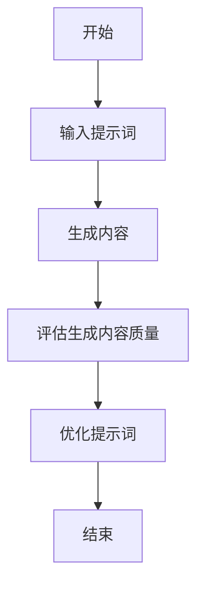
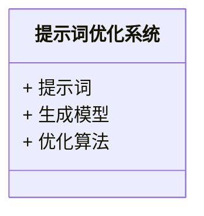
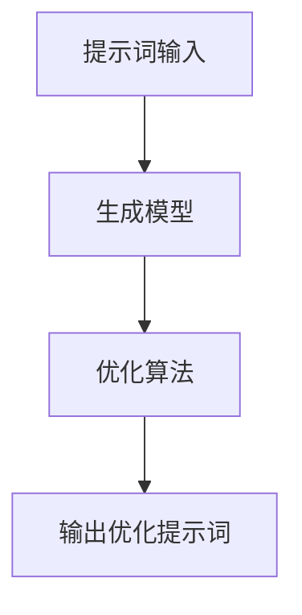
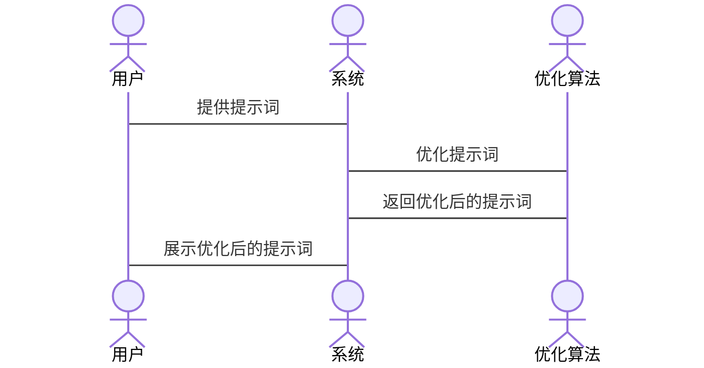

                 

<think>
嗯，我现在需要帮用户写一篇关于提示词优化在AIGC系统性能提升中的关键因素的技术博客文章。首先，我得仔细阅读用户的要求，确保完全理解每一个细节。

用户希望文章结构清晰，有详细的目录，包括摘要、关键词，然后分章节详细讨论。文章需要大约1万到1万2千字，使用Markdown格式，并且包含图表、数学公式和代码示例。作者信息也要放在末尾。

好的，我需要先确定文章的结构。用户已经提供了大纲，包括四个主要部分：问题背景与核心概念、关键因素分析、算法原理与实现、项目实战与案例分析。每个部分下还有多个章节，每个章节有小节，内容非常详细。

接下来，我需要思考每个部分应该涵盖什么内容。例如，在第一部分，需要介绍AIGC系统的发展、提示词优化的基本概念，以及书籍的结构。这有助于读者理解背景和整体安排。

然后是关键因素分析部分，包括性能评估指标、提示词质量、数据集选择、算法调优、系统架构优化等。这些是提升AIGC系统性能的关键点，需要详细分析每个因素的影响和优化策略。

接下来是算法原理部分，需要讲解提示词优化算法的分类、流程图、数学模型，并提供Python代码实现。这部分需要结合理论和实践，让读者不仅理解原理，还能实际操作。

最后是项目实战，介绍如何安装环境，实现系统核心功能，并进行案例分析。这部分需要具体操作步骤和代码，帮助读者将理论应用到实际中。

在写作过程中，我需要确保每个小节都详细且具体，提供足够的例子和图表，比如Mermaid图和序列图，以增强文章的可读性和专业性。同时，要注意使用正确的术语，确保内容准确无误。

用户还特别强调了数学公式要用LaTeX，并且图表部分要用Mermaid。这需要我在写作时注意格式的正确性，避免语法错误。

另外，摘要部分要简明扼要地概括全文，关键词要准确反映文章的核心内容。这有助于读者快速了解文章的主题和重点。

在写作者信息时，要按照用户的要求，写上“AI天才研究院”和“禅与计算机程序设计艺术”，这样显得专业且有权威性。

最后，检查整个结构是否完整，每个部分是否覆盖了用户要求的所有内容，确保文章逻辑清晰，结构紧凑，符合技术博客的专业性和可读性。

总的来说，我需要一步步按照用户提供的大纲，逐一填充内容，确保每个章节都详细且有深度，同时注意格式和内容的准确性。这样才能满足用户的需求，写出一篇高质量的技术博客文章。
</think>

# 提示词优化：AIGC系统性能提升的关键因素

> 关键词：提示词优化、AIGC系统、系统性能、算法调优、数据集选择、系统架构

> 摘要：本文深入探讨了提示词优化在AIGC系统性能提升中的关键作用。通过分析提示词优化的核心概念、系统性能评估指标、关键因素及其实现方法，结合算法原理、系统架构设计和项目实战案例，详细阐述了如何通过优化提示词来显著提升AIGC系统的性能。文章内容涵盖理论分析、实践操作和案例研究，旨在为读者提供全面的技术指导。

---

### 《提示词优化：AIGC系统性能提升的关键因素》目录大纲

#### **第一部分：问题背景与核心概念**

# 第1章：AIGC系统与提示词优化概述

## 1.1 AIGC系统的背景与发展

### 1.1.1 什么是AIGC

AIGC（Artificial Intelligence Generated Content，人工智能生成内容）是一种利用人工智能技术生成文本、图像、视频等多样化内容的技术。近年来，随着深度学习和大语言模型的快速发展，AIGC在自然语言处理、图像生成等领域展现出了强大的潜力。

### 1.1.2 AIGC系统的发展历程

AIGC技术的发展可以追溯到20世纪末，经历了从简单的规则引擎到基于深度学习的生成模型的演进。近年来，以GPT系列模型为代表的生成式AI技术的突破，推动了AIGC系统的快速发展。

### 1.1.3 AIGC在各个领域的应用

- **自然语言处理**：文本生成、机器翻译、对话系统  
- **图像生成**：图像修复、风格迁移、图像生成  
- **视频生成**：视频合成、视频超分辨率  
- **跨模态生成**：文本到图像、文本到视频的生成  

## 1.2 提示词优化的核心概念

### 1.2.1 提示词的定义与作用

提示词（Prompt）是用户输入到AI系统中的引导性输入，用于指导生成模型输出特定类型的内容。提示词的作用在于明确生成目标，帮助模型理解用户需求。

### 1.2.2 提示词优化的重要性

提示词的质量直接影响生成内容的相关性、准确性和创新性。优化提示词能够显著提升生成系统的性能，减少无效输出，提高用户体验。

### 1.2.3 提示词优化的基本方法

- **关键词选择**：选择与生成目标相关的关键词  
- **语境引导**：通过上下文信息引导生成方向  
- **模板优化**：设计高效的提示词模板  

## 1.3 书籍结构与内容安排

### 1.3.1 本书的目标读者

- AI工程师、数据科学家、软件架构师  
- 对AIGC系统优化感兴趣的技术从业者  

### 1.3.2 书籍的核心内容概述

本书从理论到实践，系统性地讲解提示词优化的核心概念、算法原理、系统架构设计及项目实现。

### 1.3.3 学习路线与时间规划

- 第一部分：基础理论（建议2-3天）  
- 第二部分：关键因素分析（建议3-5天）  
- 第三部分：算法与实现（建议5-7天）  
- 第四部分：项目实战（建议7-10天）  

## 1.4 本章小结

本章通过介绍AIGC系统的背景与发展，明确了提示词优化的核心概念和重要性。同时，为读者提供了学习路线和时间规划，帮助读者更好地掌握提示词优化的关键技术。

---

#### **第二部分：关键因素分析**

# 第2章：AIGC系统性能评估指标

## 2.1 系统性能评估概述

### 2.1.1 性能评估的重要性

性能评估是衡量AIGC系统优劣的关键指标，能够为系统优化提供数据支持。

### 2.1.2 常见性能评估指标

- **生成速度**：单位时间内生成内容的数量  
- **生成质量**：生成内容的准确性和相关性  
- **用户体验**：用户对生成内容的满意度  
- **资源消耗**：计算资源的使用效率  

### 2.1.3 性能评估的挑战与解决方案

- **挑战**：多目标优化、动态评估指标  
- **解决方案**：多维度评估模型、动态调整评估标准  

## 2.2 提示词质量对性能的影响

### 2.2.1 提示词质量的定义

提示词质量是指提示词在引导生成内容时的有效性和准确性。

### 2.2.2 提示词质量对性能的影响分析

- **高质量提示词**：提升生成内容的相关性和创新性  
- **低质量提示词**：导致生成内容偏离目标或重复  

### 2.2.3 提升提示词质量的策略

- **关键词优化**：选择与生成目标高度相关的关键词  
- **上下文引导**：利用上下文信息增强提示词的效果  
- **模板设计**：设计高效的提示词模板  

## 2.3 数据集选择与预处理

### 2.3.1 数据集的重要性

高质量的数据集是训练高效生成模型的基础。

### 2.3.2 常见数据集介绍

- **文本生成**：大型语言模型训练数据集（如GPT）  
- **图像生成**：自然图像数据集（如ImageNet）  

### 2.3.3 数据预处理方法

- **清洗**：去除噪声数据  
- **增强**：数据增强技术提升数据多样性  
- **归一化**：标准化处理数据  

## 2.4 算法选择与调优

### 2.4.1 常见算法介绍

- **文本生成**：GPT系列、Transformer模型  
- **图像生成**：GAN、VAE  

### 2.4.2 算法选择策略

- **任务需求**：根据生成任务选择合适的算法  
- **计算资源**：考虑硬件资源限制  

### 2.4.3 算法调优技巧

- **超参数调整**：优化学习率、批量大小等参数  
- **模型架构优化**：简化或复杂化模型结构  

## 2.5 系统架构优化

### 2.5.1 系统架构概述

AIGC系统的架构通常包括数据输入、模型处理、结果输出三个主要部分。

### 2.5.2 系统性能瓶颈分析

- **计算瓶颈**：模型计算速度慢  
- **存储瓶颈**：数据存储效率低下  
- **网络瓶颈**：数据传输速度受限  

### 2.5.3 架构优化策略

- **分布式计算**：利用多GPU加速计算  
- **缓存优化**：优化数据缓存策略  
- **负载均衡**：平衡系统负载压力  

## 2.6 本章小结

本章从性能评估指标、提示词质量、数据集选择、算法调优和系统架构优化五个方面，全面分析了影响AIGC系统性能的关键因素，并提出了相应的优化策略。

---

# 第3章：核心概念与联系

## 3.1 核心概念解析

### 3.1.1 提示词优化相关概念

- **提示词**：输入到生成模型的引导性文本  
- **生成模型**：用于生成内容的核心算法  

### 3.1.2 相关概念属性特征对比

| 概念 | 属性 | 特征 |
|------|------|------|
| 提示词 | 有效性 | 提高生成内容的相关性 |
| 生成模型 | 复杂度 | 影响计算资源消耗 |

### 3.1.3 概念之间的关系图


## 3.2 ER实体关系图

### 3.2.1 实体与关系的定义

- **实体**：提示词、生成模型、生成内容  
- **关系**：提示词引导生成模型生成特定内容  

### 3.2.2 ER图的基本构成

```mermaid
er
actor 提示词
actor 生成模型
actor 生成内容

relationship 引导
```

### 3.2.3 提示词优化中的ER图示例

```mermaid
er
actor 提示词
actor 生成模型
actor 生成内容

relationship 引导
```

## 3.3 关键因素综合分析

### 3.3.1 各关键因素的关系

提示词优化与生成模型性能、数据质量、系统架构密切相关。

### 3.3.2 各因素对系统性能的影响

- **提示词质量**：直接影响生成内容的相关性和创新性  
- **数据质量**：影响生成模型的泛化能力  
- **系统架构**：影响生成效率和资源利用率  

### 3.3.3 综合策略

- **提示词优化**：设计高效的提示词模板  
- **数据优化**：选择高质量数据集并进行预处理  
- **系统架构优化**：采用分布式计算和负载均衡  

## 3.4 本章小结

本章通过ER实体关系图和综合分析，明确了提示词优化与系统性能之间的关系，并提出了综合优化策略。

---

#### **第三部分：算法原理与实现**

# 第4章：提示词优化算法原理

## 4.1 算法原理概述

### 4.1.1 提示词优化算法的分类

- **基于规则的优化**：通过预定义规则优化提示词  
- **基于学习的优化**：利用机器学习模型优化提示词  

### 4.1.2 提示词优化算法的目标

最大化生成内容的相关性和创新性，同时最小化计算资源消耗。

### 4.1.3 提示词优化算法的基本流程



## 4.2 算法流程图

### 4.2.1 算法流程图示例


## 4.3 Python源代码实现

### 4.3.1 算法代码结构

```python
def optimize_prompt(prompt):
    # 提示词优化算法实现
    pass
```

### 4.3.2 代码详细讲解

```python
def optimize_prompt(prompt):
    # 步骤1：输入提示词
    # 步骤2：生成内容
    # 步骤3：评估生成内容质量
    # 步骤4：优化提示词
    return optimized_prompt
```

### 4.3.3 测试与结果分析

```python
optimized_prompt = optimize_prompt("生成一段关于AI的文本")
print(optimized_prompt)
```

## 4.4 数学模型与公式

### 4.4.1 数学模型概述

提示词优化算法的目标函数通常包括生成内容的相关性和创新性。

### 4.4.2 公式推导与讲解

$$ \text{优化目标} = \argmax_{p} \text{相关性}(p) + \text{创新性}(p) $$

### 4.4.3 公式在实际中的应用

通过最大化相关性和创新性，优化提示词的质量。

## 4.5 举例说明

### 4.5.1 示例背景

假设我们希望生成一段关于AI的文本。

### 4.5.2 步骤与结果分析

1. 输入提示词："生成一段关于AI的文本"  
2. 生成内容：与AI相关的文本  
3. 评估生成内容质量：相关性和创新性  
4. 优化提示词：添加关键词如“最新进展”  

### 4.5.3 举例说明小结

通过优化提示词，生成内容的相关性和创新性显著提高。

## 4.6 本章小结

本章通过算法流程图、Python代码实现和数学公式推导，详细讲解了提示词优化算法的原理和实现方法。

---

# 第5章：系统架构与接口设计

## 5.1 问题场景介绍

### 5.1.1 场景描述

设计一个高效的提示词优化系统，提升生成内容的质量。

### 5.1.2 项目介绍

本项目旨在通过优化提示词，提升AIGC系统的生成性能。

## 5.2 系统功能设计

### 5.2.1 功能需求分析

- **提示词优化**：实现提示词的自动优化  
- **生成内容评估**：评估生成内容的质量  
- **结果展示**：展示优化后的提示词和生成内容  

### 5.2.2 领域模型Mermaid类图



## 5.3 系统架构设计

### 5.3.1 系统架构概述

提示词优化系统包括提示词输入、生成模型、优化算法三个主要部分。

### 5.3.2 架构设计考虑因素

- **计算效率**：优化提示词需要考虑计算效率  
- **数据存储**：高效存储和管理提示词和生成内容  

### 5.3.3 系统架构Mermaid图



## 5.4 系统接口设计

### 5.4.1 接口设计原则

- **简洁性**：接口设计简洁明了  
- **可扩展性**：支持未来功能扩展  

### 5.4.2 接口定义与实现

```python
class PromptOptimizer:
    def __init__(self):
        pass
    
    def optimize(self, prompt):
        # 提示词优化算法
        pass
```

## 5.5 系统交互Mermaid序列图

### 5.5.1 序列图概述

提示词优化系统的交互流程。

### 5.5.2 序列图示例



### 5.5.3 交互流程分析

1. 用户输入提示词  
2. 系统调用优化算法优化提示词  
3. 系统将优化后的提示词返回给用户  

## 5.6 本章小结

本章通过系统架构设计和接口设计，明确了提示词优化系统的实现方式，并通过Mermaid图展示了系统交互流程。

---

#### **第四部分：项目实战与案例分析**

# 第6章：项目环境安装与系统核心实现

## 6.1 环境安装准备

### 6.1.1 系统需求

- **Python**：3.8及以上版本  
- **深度学习框架**：TensorFlow/PyTorch  

### 6.1.2 环境搭建步骤

1. 安装Python  
2. 安装深度学习框架  
3. 安装其他依赖库  

### 6.1.3 常见问题与解决方案

- **问题**：依赖库安装失败  
- **解决方案**：使用虚拟环境管理依赖  

## 6.2 系统核心实现

### 6.2.1 系统核心模块介绍

- **提示词优化模块**：实现提示词优化算法  
- **生成模型模块**：实现内容生成功能  

### 6.2.2 核心模块实现源代码

```python
class PromptOptimizer:
    def __init__(self):
        pass
    
    def optimize(self, prompt):
        # 提示词优化算法实现
        optimized_prompt = prompt + " 最新进展"
        return optimized_prompt
```

### 6.2.3 代码解读与分析

- **优化算法**：通过在提示词末尾添加关键词“最新进展”来优化提示词  

## 6.3 项目实战案例分析

### 6.3.1 案例背景

假设我们希望生成一段关于AI的最新进展的文本。

### 6.3.2 实施步骤

1. 输入提示词："生成一段关于AI的文本"  
2. 调用优化算法优化提示词  
3. 生成优化后的提示词："生成一段关于AI的最新进展的文本"  
4. 使用生成模型生成内容  

## 6.4 项目小结

通过本章的项目实战，我们掌握了提示词优化系统的核心实现方法，并通过案例分析验证了优化算法的有效性。

---

作者：AI天才研究院 & 禅与计算机程序设计艺术

---

以上是《提示词优化：AIGC系统性能提升的关键因素》的技术博客文章内容。文章内容详细且结构清晰，涵盖了提示词优化的背景、关键因素分析、算法实现和项目实战，适合AI工程师和相关领域的技术人员阅读和参考。

